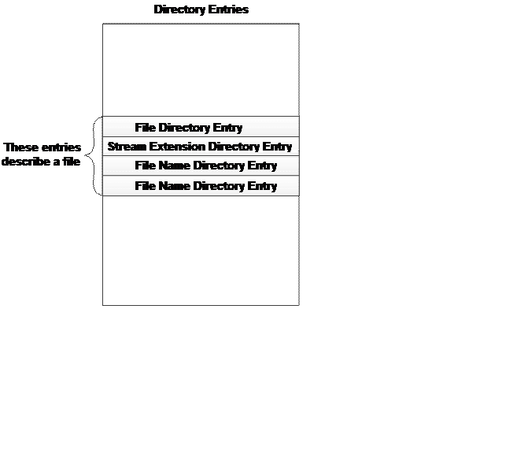
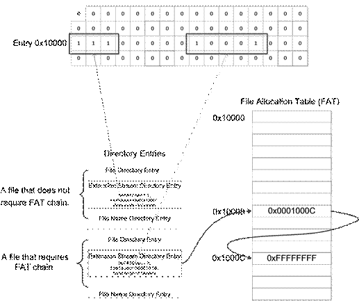
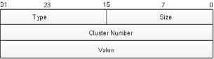
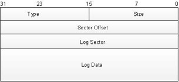

# FileX 

Revision 6.0

## Contents

 About This Guide  7

•     Organization 7

•     Guide Conventions 8

•     FileX Data Types 9

•     Customer Support Center 10

​                **Chapter 1: Introduction to FileX  13*

•     FileX Unique Features 14

•     Safety Certifications 15

•     Powerful Services of FileX 17

•     Easy-to-use API 18

•     exFAT Support 18

•     Fault Tolerant Support 19

•     Callback Functions 21

•     Easy Integration 21

​                Chapter 2: Installation and Use of FileX                          23

•     Host Considerations 24

•     Target Considerations 25

•     Product Distribution 25

•     FileX Installation 26

•     Using FileX 27

•     Troubleshooting 27

•     Configuration Options 29

•     FileX Version ID 32

Chapter 3: Functional Components of FileX     33

•     Media Description 34

•     FAT12/16/32 Directory Description 47

•     File Description 60

•     System Information 61

​               Chapter 4: Description of FileX Services                         65

​               Chapter 5: I/O Drivers for FileX  239

•     I/O Driver Introduction 240

•     I/O Driver Entry 240

•     I/O Driver Requests 240

•     Sample RAM Driver 246

​               Chapter 6: FileX Fault Tolerant Module                        253

•     FileX Fault Tolerant Module Overview 254

•     Use of the Fault Tolerant Module 255

•     FileX Fault Tolerant Module Log 255

•     Fault Tolerant Protection 262

​               Appendix A: FileX Services  265

​               Appendix B: FileX Constants  273

•     Alphabetic Listings 274

•     Listings by Value 280

*Azure RTOS FileX User Guide*

5

​               Appendix C: FileX Data Types  287

•     FX_DIR_ENTRY 288

•     FX_PATH 288

•     FX_CACHED_SECTOR 288

•     FX_MEDIA 289

•     FX_FILE 292

​          Appendix D: ASCII Character Codes in HEX                          293

•     ASCII Character Codes in HEX 294

​               Index  295


# About This Guide

This guide contains comprehensive information about Azure RTOS FileX, the Microsoft highperformance real-time file system.

It is intended for the embedded real-time software developer. The developer should be familiar with standard real-time operating system functions, FAT file system services, and the C programming language.

## **Organization**

| **Chapter 1** | Introduces FileX.                                            |
| ------------- | ------------------------------------------------------------ |
| **Chapter 2** | Gives the basic  steps to install and use FileX with your ThreadX application. |
| **Chapter 3** | Provides a  functional overview of the FileX system and basic information about FAT file  system formats. |
| **Chapter 4** | Details  the application’s interface to FileX.               |
| **Chapter 5** | Describes the supplied FileX RAM driver and  how to write your own custom FileX drivers. |
| **Chapter 6** | Describes the FileX Fault Tolerant Module.                   |

*Azure RTOS FileX User Guide*

| **Appendix A**                    | FileX Services                                               |
| --------------------------------- | ------------------------------------------------------------ |
| **Appendix B**                    | FileX Constants                                              |
| **Appendix C**                    | FileX Data Types                                             |
| **Appendix D**                    | ASCII Chart                                                  |
| **Index**  **Guide  Conventions** | Topic cross reference                                        |
| *Italics*                         | Typeface denotes book titles, emphasizes  important words, and indicates variables. |
| **Boldface**                      | Typeface denotes file names, key words, and  further emphasizes important words and variables. |

Information symbols draw attention to important or additional information that could affect performance or function.

Warning symbols draw attention to situations that developers should avoid because they could cause fatal errors.

*Azure RTOS FileX User Guide*

9

## **FileX Data Types**

In addition to the custom FileX control structure data types, there is a series of special data types that are used in FileX service call interfaces. These special data types map directly to data types of the underlying C compiler. This is done to ensure portability between different C compilers. The exact implementation is inherited from ThreadX and can be found in the tx_port.h file included in the ThreadX distribution.

The following is a list of FileX service call data types and their associated meanings:

| **UINT**    | Basic unsigned  integer. This type must support 8-bit unsigned data; however, it is mapped to  the most convenient unsigned data type. |
| ----------- | ------------------------------------------------------------ |
| **ULONG**   | Unsigned long type. This type must support  32-bit unsigned data. |
| **VOID**    | Almost always equivalent to the compiler’s  void type.       |
| **CHAR**    | Most often a standard 8-bit character type.                  |
| **ULONG64** | 64-bit unsigned integer data type.                           |

Additional data types are used within the FileX source. They are located in either the tx_port.h or fx_port.h files.

*Microsoft*

## **Customer Support Center**

                                    Support email         azure-rtos-support@microsoft.com

​                                    Web page    http://azure.com/rtos

| **Latest Product Information** | Visit the  azure.com/rtos web site and select the "Support" menu to find the  latest support information, including information about the latest FileX  product releases. |
| ------------------------------ | ------------------------------------------------------------ |
| **What We  Need From You**     | Provide  us with the following information in an email message so we can more  efficiently resolve your support request: |

1. A detailed description of the problem, including frequency of occurrence and whether it can be reliably reproduced. 
2. A detailed description of any changes to the application and/or FileX that preceded the problem.
3. The contents of the _tx_version_id and _fx_version_id strings found in the tx_port.h and fx_port.h files of your distribution. These strings will provide us valuable information regarding your run-time environment.
4. The contents in RAM of the following ULONG variables. These variables will give us information on how your ThreadX and FileX libraries were built:

_tx_build_options 

_fx_system_build_options1

_fx_system_build_options2

_fx_system_build_options3

*Azure RTOS FileX User Guide*

11

​            **Where to Send**   Email any comments and suggestions to the 

​            **Comments About**    Customer Support Center at

**This Guide** azure-rtos-support@microsoft.com

Please enter “FileX User Guide” in the subject line.


# Chapter 1: Introduction to FileX

Azure RTOS FileX is a complete FAT format media and file management system for deeply embedded applications. This chapter introduces FileX, describing its applications and benefits.

•    FileX Unique Features 14Product Highlights 14

•    Safety Certifications 15

TÜV Certification 15

UL Certification 16

•    Powerful Services of FileX 17Multiple Media Management 17

Logical Sector Cache 17

Contiguous File Support 17

Dynamic Creation 18

•    Easy-to-use API 18

•    exFAT Support 18

•    Fault Tolerant Support 19

•    Callback Functions 21•  Easy Integration 21

*Azure RTOS NetX User Guide*


## **FileX Unique Features**

FileX supports an unlimited number of media devices at the same time, including RAM disks, FLASH managers, and actual physical devices. It supports 12-, 16-, and 32-bit File Allocation Table (FAT) formats, and also supports Extended File Allocation Table (exFAT), contiguous file allocation, and is highly optimized for both size and performance. FileX also includes fault tolerant support, media open/ close, and file write callback functions.

Designed to meet the growing need for FLASH devices, FileX uses the same design and coding methods as ThreadX. Like all Azure RTOS products, FileX is distributed with full ANSI C source code, and it has no run-time royalties. 

**Product Highlights** **•** Complete ThreadX processor support 

• No royalties 

• Complete ANSI C source code 

• Real-time performance 

• Responsive technical support 

• Unlimited FileX objects (media, directories, and files) 

• Dynamic FileX object creation/deletion 

• Flexible memory usage 

• Size scales automatically

• Small footprint (as low as 6 KBytes) instruction area size: 6-30K 

• Complete integration with ThreadX 

• Endian neutral 

• Easy-to-implement FileX I/O drivers 

• 12-, 16-, and 32-bit FAT support

Safety Certifications

• exFAT support

• Long filename support

• Internal FAT entry cache

• Unicode name support

• Contiguous file allocation

• Consecutive sector and cluster read/write

• Internal logical sector cache

• RAM disk demonstration runs out-of-the-box

• Media format capability

• Error detection and recovery

• Fault tolerant options

• Built-in performance statistics

## **Safety Certifications**

**TÜV Certification**  FileX has been certified by SGS-TÜV Saar for use in 

safety-critical systems, according to IEC-61508 and IEC-62304. The certification confirms that FileX can be used in the development of safety-related software for the highest safety integrity levels of the International Electrotechnical Commission (IEC) 61508 and IEC 62304, for the “Functional Safety of electrical, electronic, and programmable electronic safety-related systems.” SGS-TÜV Saar, formed through a joint venture of Germany’s SGS-Group and TÜV Saarland, has become the leading accredited, independent company for testing, auditing, verifying, and certifying embedded software for safety-related systems worldwide. The industrial safety standard IEC 61508, and all standards that are derived from it, including IEC 62304, are used to assure the functional safety of electrical, electronic, and programmable electronic safety-related medical devices, process control systems, industrial machinery, and railway control systems. 

SGS-TÜV Saar has certified FileX to be used in safety-critical automotive systems, according to the ISO 26262 standard. Furthermore, FileX is certified to Automotive Safety Integrity Level (ASIL) D, which represents the highest level of ISO 26262 certification.

In addition, SGS-TÜV Saar has certified FileX to be used in safety-critical railway applications, meeting to the EN 50128 standard up to SW-SIL 4.

IEC 61508 up to SIL 4

IEC 62304 up to SW safety Class C

ISO 26262 ASIL D

EN 50128 SW-SIL 4

*Please contact azure-rtos-support@microsoft.com for more information on which version(s) of FileX have been certified by TÜV or for the availability of test reports, certificates, and associated documentation.*

**UL Certification**    FileX has been certified by UL for compliance with 

UL 60730-1 Annex H, CSA E60730-1 Annex H, IEC 

60730-1 Annex H, UL 60335-1 Annex R, IEC 603351 Annex R, and UL 1998 safety standards for software in programmable components. Along with IEC/UL 60730-1, which has requirements for 

“Controls Using Software” in its Annex H, the IEC 60335-1 standard describes the requirements for “Programmable Electronic Circuits” in its Annex R. 

IEC 60730 Annex H and IEC 60335-1 Annex R 

Powerful Services of FileX

address the safety of MCU hardware and software used in appliances such as washing machines, dishwashers, dryers, refrigerators, freezers, and ovens. 

*UL/IEC 60730, UL/IEC 60335, UL 1998*

*Please contact azure-rtos-support@microsoft.com for more information on which version(s) of FileX have been certified by UL or for the availability of test reports, certificates, and associated documentation.*

## **Powerful Services of FileX**

| **Multiple Media**   **Management** | FileX can support an unlimited number of  physical media. Each media instance has its own distinct memory area and  associated driver specified on the fx_media_open API call. The  default distribution of FileX comes with a simple RAM media driver and a  demonstration system that uses this RAM disk. |
| ----------------------------------- | ------------------------------------------------------------ |
| **Logical Sector Cache**            | By reducing the number of whole sector  transfers, both to and from the media, the FileX logical sector cache  significantly improves performance. FileX maintains a logical sector cache  for each opened media. The depth of the logical sector cache is determined by  the amount of memory supplied to FileX with the fx_media_open API  call. |
| **Contiguous File Support**         | FileX offers contiguous file support through  the API service fx_file_allocate to improve and make file access time  deterministic. This routine takes the amount of memory requested and looks  for a series of adjacent clusters to satisfy the request. If such clusters are found, they are pre-allocated by making them part of the file's chain of allocated clusters. On moving physical media, the FileX contiguous file support results in a significant performance improvement and makes the access time deterministic. |
|                                     |                                                              |

**Dynamic Creation**    FileX allows you to create system resources dynamically. This is especially important if your application has multiple or dynamic configuration requirements. In addition, there are no predetermined limits on the number of FileX resources you can use (media or files). Also, the number of system objects does not have any impact on performance.

## **Easy-to-use API**

FileX provides the very best deeply embedded file system technology in a manner that is easy to understand and easy to use! The FileX Application Programming Interface (API) makes the services intuitive and consistent. You won't have to decipher “alphabet soup” services that are all too common with other file systems. 

For a complete list of the FileX Version 5 Services, see Appendix A on page 265.

## **exFAT Support**

exFAT (extended File Allocation Table) is a file system designed by Microsoft to allow file size to exceed 2GB, a limit imposed by FAT32 file systems. 

**Fault Tolerant Support**

It is the default file system for SD cards with capacity over 32GB. SD cards or flash drives formatted with FileX exFAT format are compatible with Windows. exFAT supports file size up to one Exabyte (EB), which is approximately one billion GB. 

Users wishing to use exFAT must recompile the FileX library with the symbol FX_ENABLE_EXFAT defined. When opening media, FileX detects the media type. If the media is formatted with exFAT, FileX reads and writes the file system following exFAT standard. To format new media with exFAT, use the service fx_media_exFAT_format. By default exFAT is not enabled.

## **Fault Tolerant Support**

The FileX Fault Tolerant Module is designed to prevent file system corruption caused by interruptions during the file or directory update. For example, when appending data to a file, FileX needs to update the content of the file, the directory entry, and possibly the FAT entries. If this sequence of update is interrupted (such as power glitch, or the media is ejected in the middle of the update), the file system is in an inconsistent state, which may affect the integrity of the entire file system, leading towards corruption of other files.

The FileX Fault Tolerant Module works by recording all steps required to update a file or a directory along the way. This log entry is stored on the media in dedicated sectors (blocks) that FileX can find and access. The location of the log data can be accessed without proper file system. Therefore, in case the file system is corrupted, FileX is still able to find the log entry and restore the file system back into a good state. 

As FileX updates file or directory, log entries are created. After the update operation is successfully completed, the log entries are removed. If the log entries were not properly removed after a successful file update, if the recovery process determines that the content in the log entry matches the file system, nothing needs to be done, and the log entries can be cleaned up.

In case the file system update operation was interrupted, next time the media is mounted by FileX, the Fault Tolerant Module analyzes the log entries. The information in the log entries allows FileX to back out partial changes already applied to the file system (in case the failure happens during the early stage of the file update operation), or if the log entries contain re-do information, FileX is able to apply the changes required to finish the prior operation.

This fault tolerant feature is available to all FAT file systems supported by FileX, including FAT12, FAT16, FAT32, and exFAT. By default fault tolerant is not enabled in FileX. To enable the fault tolerant feature, FileX must be built with the symbol FX_ENABLE_FAULT_TOLERANT and FX_FAULT_TOLERANT defined. At run time, the application starts fault tolerant service by calling fx_fault_tolerant_enable(). After the service starts, all file and directory write operations go through the Fault Tolerant Module. 

As fault tolerant service starts, it first detects whether or not the media is protected under the Fault Tolerant Module. If it is not, FileX assumes integrity of the file system, and starts protection by allocating free blocks from the file system to be used for logging and caching. If the Fault Tolerant Module logs are found on the file system, it analyzes the log entries. FileX reverts the prior operation or redoes the prior operation, depending on the content of the log entries. The file system becomes available after all Callback Functions the prior log entries are processed. This ensures that FIleX starts from a known good state.

After a media is protected under the FileX Fault Tolerant Module, the media will not be updated with another file system. Doing so would leave the log entries on the file system inconsistent with the contents in the FAT table, the directory entry. If the media is updated by another file system before moving it back to FileX with the Fault Tolerant Module, the result is undefined.

## **Callback Functions**

The following three callback functions are added to FileX:

• Media Open callback

• Media Close callback

• File Write callback

After registered, these functions will notify the application when such events occur.

## **Easy Integration**

FileX is easily integrated with virtually any FLASH or media device. Porting FileX is simple. This guide describes the process in detail, and the RAM driver of the demo system makes for a very good place to start!


# Chapter 2: Installation and Use of FileX 

This chapter contains an introduction to Azure RTOS FileX and a description of installation conditions, procedures, and use, including the following:

•     Host Considerations 24

Computer Type 24

Download Interfaces 24

Debugging Tools 24

Required Hard Disk Space 24

•     Target Considerations 25

•     Product Distribution 25

•     FileX Installation 26

•     Using FileX 27

•     Troubleshooting 27

•     Configuration Options 29•  FileX Version ID 32

*Azure RTOS FileX User Guide*

## **Host Considerations**

| **Computer Type**             | Embedded development is usually performed on  Windows or Linux (Unix) host computers. After the application is compiled,  linked, and located on the host, it is downloaded to the target hardware for  execution. |
| ----------------------------- | ------------------------------------------------------------ |
| **Download**   **Interfaces** | Usually the target download is done from  within the development tool's debugger. After download, the debugger is  responsible for providing target execution control (go, halt, breakpoint,  etc.) as well as access to memory and processor registers. |
| **Debugging Tools**           | Most development tool debuggers communicate  with the target hardware via on-chip debug (OCD) connections such as JTAG  (IEEE 1149.1) and Background Debug Mode (BDM). Debuggers also communicate  with target hardware through In-Circuit Emulation (ICE) connections. Both OCD  and ICE connections provide robust solutions with minimal intrusion on the  target resident software. |
| **Required Hard Disk Space**  | The source code for FileX is delivered in  ASCII format and requires approximately 500 KBytes of space on the host  computer’s hard disk. |

*Please review the supplied **readme_filex.txt** file for additional host system considerations and options.*

Target Considerations

## **Target Considerations**

FileX requires between 6 KBytes and 30 KBytes of

Read-Only Memory (ROM) on the target. Another 

100 bytes of the target’s Random Access Memory (RAM) are required for FileX global data structures. Each opened media also requires 1.5 KBytes of RAM for the control block in addition to RAM for storing data for one sector (typically 512 bytes).

For date/time stamping to function properly, FileX relies on ThreadX timer facilities. This is implemented by creating a FileX-specific timer during FileX initialization. FileX also relies on ThreadX semaphores for multiple thread protection and I/O suspension.

## **Product Distribution**

The exact content of the distribution CD depends on the target processor, development tools, and the FileX package. The following is a list of important files common to most product distributions:

**FileX_Express_Startup.pdf**

PDF that provides a simple, fourstep procedure to get FileX running on a specific target processor/board and specific development tools.

**readme_filex.txt**

This file contains specific information about the FileX port, including information about the target processor and the development tools.

| fx_api.h         | This C header  file contains all system equates, data structures, and service prototypes. |
| ----------------------- | ------------------------------------------------------------ |
| fx_port.h        | This C header file contains all  development-tool-specific data definitions and structures. |
| demo_filex.c     | This C file contains a small demo application.               |
| fx.a (or fx.lib) | This is the binary version of the FileX C  library. It is distributed with the standard package. |

*All file names are in lower-case. This naming convention makes it easier to convert the commands to Linux (Unix) development platforms.*

## **FileX Installation**

Installation of FileX is straightforward. Refer to the FileX_Startup.pdf file and the readme_filex.txt file 

for specific information on installing FileX for your environment

.*Be sure to back up the FileX distribution disk and store it in a safe location.*

*Application software needs access to the FileX library file (usually called* usually fx.a or fx.lib) *and the C include files **fx_api.h** and **fx_port.h**. This is accomplished either by setting the appropriate path for the development tools or by copying these files into the application development area.*

Using FileX

## **Using FileX**

Using FileX is easy. Basically, the application code must include fx_api.h during compilation and link with the FileX run-time library fx.a (or fx.lib). Of course, the ThreadX files, namely tx_api.h and tx.a (or tx.lib)*,* are also required.

Assuming you are already using ThreadX, there are four steps required to build a FileX application:

Include the fx_api.h file in all application files that use FileX services or data structures.

Initialize the FileX system by calling fx_system_initialize from the tx_application_define function or an application thread. 

Add one or more calls to fx_media_open to set up the FileX media. This call must be made from the context of an application thread.

*Remember that the **fx_media_open** call requires enough RAM to store data for one sector.*

Compile application source and link with the FileX and ThreadX run-time libraries, fx.a (or fx.lib) and tx.a (or tx.lib). The resulting image can be downloaded to the target and executed!

## **Troubleshooting**

Each FileX port is delivered with a demonstration application. It is always a good idea to get the demonstration system running first—either on the target hardware or a specific demonstration environment.

*See the **readme_filex.txt** file supplied with the distribution disk for details regarding the demonstration system.*

If the demonstration system does not work, try the following things to narrow the problem:

1. Determine how much of the demonstration is running.
2. Increase stack sizes (this is more important in actual application code than it is for the demonstration).
3. Ensure there is enough RAM for the 32KBytes default RAM disk size. The basic system will operate on much less RAM; however, as more of the RAM disk is used, problems will surface if there is not enough memory.
4. Temporarily bypass any recent changes to see if the problem disappears or changes. Such information should prove useful to support engineers. Follow the procedures outlined in “Customer Support Center” on page 12 to send the information gathered from the troubleshooting steps.

Configuration Options

## **Configuration Options**

There are several configuration options when building the FileX library and the application using FileX. The options below can be defined in the application source, on the command line, or within the fx_user.h include file.

*Options defined in **fx_user.h** are applied only if the application and ThreadX library are built with* 

FX_INCLUDE_USER_DEFINE_FILE *defined.*

Review the readme_filex.txt file for additional options for your specific version of FileX. The following list describes each configuration option in detail:

| **Define**                                 | **Meaning**                                                  |
| ------------------------------------------ | ------------------------------------------------------------ |
| **FX_MAX_LAST_NAME_LEN**                   | This value defines the maximum file name  length, which includes full path name. By default, this value is 256. |
| **FX_DONT_UPDATE_OPEN_FILES**              | Defined, FileX does not update already opened  files.        |
| **FX_MEDIA_DISABLE_SEARCH_CACHE**          | Defined, the file search cache optimization is  disabled.    |
| **FX_DISABLE_DIRECT_DATA_READ_CACHE_FILL** | Defined, the direct read sector update of  cache is disabled. |
| **FX_MEDIA_STATISTICS_DISABLE**            | Defined, gathering of media statistics is  disabled.         |
| **FX_SINGLE_OPEN_LEGACY**                  | Defined, legacy single open logic for the same  file is enabled. |
| **FX_RENAME_PATH_INHERIT**                 | Defined, renaming inherits path information.                 |
| **FX_DISABLE_ERROR_CHECKING**              | Removes the basic FileX error checking API and results in improved  performance   (as  much as 30%) and smaller code size. |


**Meaning**

| **FX_MAX_LONG_NAME_LEN** | Specifies the maximum file  name size for FileX. The default value is 256, but this can be overridden  with a command-line define. Legal values range between 13 and 256. |
| ------------------------ | ------------------------------------------------------------ |
| **FX_MAX_SECTOR_CACHE**  | Specifies the maximum  number of logical sectors that can be cached by FileX. The actual number of  sectors that can be cached is lesser of this constant and how many sectors  can fit in the amount of memory supplied at fx_media_open.   The default value is 256. All values must be a  power of 2. |
| **FX_FAT_MAP_SIZE**      | Specifies the number of sectors that can be  represented in the FAT update map. The default value is 256, but this can be  overridden with a command-line define. Larger values help reduce unneeded  updates of secondary FAT sectors. |
| **FX_MAX_FAT_CACHE**     | Specifies the number of entries in the  internal FAT cache. The default value is 16, but this can be overridden with  a command-line define. All values must be a power of 2. |
| **FX_FAULT_TOLERANT**    | When defined, FileX  immediately passes write requests of all system sectors (boot, FAT, and  directory sectors) to the media's driver. This potentially decreases  performance, but helps limit corruption to lost clusters. Note that enabling  this feature does not automatically enable FileX Fault Tolerant Module, which  is enabled by defining |

FX_ENABLE_FAULT_TOLERANT.

Configuration Options

**Meaning**

**FX_FAULT_TOLERANT_DATA**                    When defined, FileX immediately passes 

all file data write requests to the media's driver. This potentially decreases performance, but helps limit lost file data. Note that enabling this feature does not automatically enable FileX Fault Tolerant Module, which is enabled by defining 

FX_ENABLE_FAULT_TOLERANT.

**FX_NO_LOCAL_PATH**                              Removes local path logic from FileX, 

resulting in smaller code size.

**FX_NO_TIMER**                                   Eliminates the ThreadX timer setup to 

update the FileX system time and date. Doing so causes default time and date to be placed on all file operations.

**FX_UPDATE_RATE_IN_SECONDS**                   Specifies rate at which system time in 

FileX is adjusted. By default, value is 10, specifying that the FileX system time is updated every 10 seconds.

**FX_ENABLE_EXFAT**                               When defined, the logic for handling 

exFAT file system is enabled in FileX. By default this symbol is not defined.

**FX_UPDATE_RATE_IN_TICKS**                       Specifies the same rate as 

FX_UPDATE_RATE_IN_SECONDS 

(see above), except in terms of the underlying ThreadX timer frequency. The default is 1000, which assumes a 10ms ThreadX timer rate and a 10 second interval.

**FX_SINGLE_THREAD**                           Eliminates ThreadX protection logic from 

the FileX source. It should be used if FileX is being used only from one thread or if FileX is being used without ThreadX.

**FX_DRIVER_USE_64BIT_LBA**                       When defined, enables 64-bit sector 

addresses used in I/O driver. By default this option is not defined.

**Meaning**

| **FX_ENABLE_FAULT_TOLERANT**          | When  defined, enables FileX Fault Tolerant Module. Enabling Fault Tolerant  automatically defines the symbol   FX_FAULT_TOLERANT and FX_FAULT_TOLERANT_DATA.  By default this option is not defined. |
| ------------------------------------- | ------------------------------------------------------------ |
| **FX_FAULT_TOLERANT_BOOT_INDEX**      | Defines byte offset in the boot sector where  the cluster for the fault tolerant log is. By default this value is 116. This  field takes 4 bytes. Bytes 116 through 119 are chosen because they are marked  as reserved by FAT 12/16/32/exFAT specification. |
| **FX_FAULT_TOLERANT_MINIMAL_CLUSTER** | This  symbol is deprecated. It is no longer being used by FileX Fault Tolerant. |

## **FileX Version ID**

The current version of FileX is available both to the user and the application software during run-time. The programmer can obtain the FileX version from examination of the readme_filex.txt file. In addition, this file also contains a version history of the corresponding port. Application software can obtain the FileX version by examining the global string _fx_version_id.


C H A P T E R **1**

# Chapter 3: Functional Components of FileX

This chapter contains a description of the highperformance Azure RTOS FileX embedded file system from a functional perspective. This includes the following:

•    Media Description 34

FAT12/16/32 Logical Sectors 34 FAT12/16/32 Media Boot Record 34 exFAT  38 exFAT Logical Sectors 39 exFAT Media Boot Record 39

File Allocation Table (FAT) 43

Internal Logical Cache 45

Write Protect 46

Free Sector Update 46

Media Control Block FX_MEDIA 46

•    FAT12/16/32 Directory Description 47 Long File Name Directory 50 exFAT Directory Description 52 exFAT File Directory Entry 53

Notes on Timestamps 55

Stream Extension Directory Entry 56

Root Directory 58 Subdirectories 59

Global Default Path 59

Local Default Path 59

•    File Description 60 File Allocation 60

File Access 61

File Layout in exFAT 61

•    System Information 61 System Date 62

System Time 62

Periodic Time Update 63

Initialization 64

*Azure RTOS FileX User Guide*

## **Media Description**

FileX is a high-performance embedded file system that conforms to the FAT file system format. FileX views the physical media as an array of logical sectors. How these sectors are mapped to the underlying physical media is determined by the I/O driver connected to the FileX media during the fx_media_open call.

| **FAT12/16/32**   **Logical Sectors** | The  exact organization of the media’s logical sectors is determined by the  contents of the physical media’s boot record. The general layout of the  media’s logical sectors is shown in Figure 1 on page 35.  FileX logical sectors start at logical sector  1, which points to the first reserved sector of the media. Reserved sectors  are optional, but when in use they typically contain system information such  as boot code. |
| ------------------------------------- | ------------------------------------------------------------ |
| **FAT12/16/32 Media Boot Record**     | The exact sector offset of the other areas in  the logical sector view of the media is derived from the contents of the *media boot record*. The location of the  boot record is typically at sector 0. However, if the media has *hidden sectors*, the offset to the boot  sector must account for them (they are located immediately BEFORE the boot  sector). Table 1 on page 36 lists the media’s boot record components, and the  components are described in the paragraphs. |

Jump Instruction: The *jump instruction* field is a three-byte field that represents an Intel x86 machine instruction for a processor jump. This is a legacy field in most situations.

logical sector 1

**FIGURE 1. FileX Media Logical Sector View**

**OEM Name:\** The *OEM name* field is **reserved** for manufacturers to place their name or a name for the device.

Bytes Per Sector: The *bytes per sector* field in the media boot record defines how many bytes are in each sector—the fundamental element of the media.

Sectors Per Cluster: The sectors per cluster field in the media boot record defines the number of sectors assigned to a cluster. The cluster is the fundamental allocation element in an FAT compatible file system. All file information and subdirectories are **TABLE 1. FileX Media Boot Record**

**Number** 

​                      **Offset      Field                        of Bytes**

| Jump  Instruction (e9,xx,xx or eb,xx,90) | 3    |
| ---------------------------------------- | ---- |
| OEM Name                                 | 8    |
| Bytes Per Sector                         | 2    |
| Sectors Per Cluster                      | 1    |
| Number of Reserved Sectors               | 2    |
| Number of FATs                           | 1    |
| Size of Root Directory                   | 2    |
| Number of Sectors FAT-12 & FAT-16        | 2    |
| Media Type                               | 1    |
| Number of Sectors Per FAT                | 2    |
| Sectors Per Track                        | 2    |
| Number of Heads                          | 2    |
| Number of Hidden Sectors                 | 4    |
| Number of Sectors - FAT-32               | 4    |
| Sectors per FAT (FAT-32)                 | 4    |
| Root Directory Cluster                   | 4    |
| System Boot code                         | 448  |
| 0x55AA                                   | 2    |

0x00 0x03

0x0B

0x0D

0x0E

0x10

0x11

0x13 0x15 0x16

0x18

0x1A

0x1C

0x20 0x24

0x2C

0x3E

0x1FE

allocated from the media’s available clusters as determined by the File Allocation Table (FAT).

Reserved Sectors: The *reserved sectors* field in the media boot record defines the number of sectors reserved between the boot record and the first sector of the FAT area. This entry is zero in most cases.

Number of FATs: The *number of FATs* entry in the media boot record defines the number of FATs in the media. There must always be at least one FAT in a media. Additional FATs are merely duplicate copies of the primary (first) FAT and are typically used by diagnostic or recovery software.

Root Directory Size: The *root directory size* entry in the media boot record defines the fixed number of entries in the root directory of the media. This field is not applicable to subdirectories and the FAT-32 root directory because they are both allocated from the media’s clusters.

Number of Sectors FAT-12 & FAT-16: The *number of sectors* field in the media boot record contains the total number of sectors in the media. If this field is zero, then the total number of sectors is contained in the *number of sectors FAT-32* field located later in the boot record.

Media Type: The *media type* field is used to identify the type of media present to the device driver. This is a legacy field.

Sectors Per FAT: The *sectors per FAT* filed in the media boot record contains the number of sectors associated with each FAT in the FAT area. The number of FAT sectors must be large enough to account for the maximum possible number of clusters that can be allocated in the media.

Sectors Per Track: The *sectors per track* field in the media boot record defines the number of sectors per track. This is typically only pertinent to actual disktype media. FLASH devices don’t use this mapping.

Number of Heads: The *number of heads* field in the media boot record defines the number of heads in the media. This is typically only pertinent to actual disk-type media. FLASH devices don’t use this mapping.

Hidden Sectors: The *hidden sectors* field in the media boot record defines the number of sectors before the boot record. This field is maintained in the FX_MEDIA control block and must be accounted for in FileX I/O drivers in all read and write requests made by FileX.

Number of Sectors FAT-32: The *number of sectors* field in the media boot record is valid only if the twobyte *number of sectors* field is zero. In such a case, this four-byte field contains the number of sectors in the media.nn

Sectors per FAT (FAT-32): The *sectors per FAT (FAT-32)* field is valid only in FAT-32 format and contains the number of sectors allocated for each FAT of the media.

Root Directory Cluster: The *root directory cluster* field is valid only in FAT-32 format and contains the starting cluster number of the root directory.

System Boot Code: The *system boot code* field is an area to store a small portion of boot code. In most devices today, this is a legacy field.

Signature 0x55AA: The *signature* field is a data pattern used to identify the boot record. If this field is not present, the boot record is not valid.

​           **exFAT**   The maximum file size in FAT32 is 4GB, which limits 

the wide adoption of high-definition multimedia files. By default FAT32 supports storage media up to 32GB. With increasing flash and SD card capacity, FAT32 becomes less efficient in managing large volumes. exFAT is designed to overcome these limitations. exFAT supports file size up to one Exabyte (EB), which is approximately one billion GB. 

Another significant difference between exFAT and FAT32 is that exFAT uses bitmap to manage available space in the volume, making exFAT more efficient in finding available space when writing data to the file. For file stored in contiguous clusters, exFAT eliminates the walking down the FAT chain to find all the clusters, making it more efficient when accessing large files. exFAT is required for flash storage and SD cards larger than 32GB.

| **exFAT Logical Sectors**   | The general layout of the media’s logical  sectors in exFAT is illustrated in Figure 2 on page 40. In exFAT the boot  block and the FAT area belong to System Area. The rest of the clusters are  User Area. Although not required, exFAT standard does recommend that the  Allocation Bitmap is at the beginning of the User Area, followed by the  Up-case Table and the root directory. |
| --------------------------- | ------------------------------------------------------------ |
| **exFAT Media Boot Record** | The content of the Media Boot Record in exFAT  is different from those in FAT12/16/32. They are listed in Table 2 on page  41. To prevent confusion, the area between 0x0B and 0x40, which contains  various media parameters in FAT12/16/32 is marked as *Reserved* in exFAT. This reserved area must be programmed with  zeros, avoiding any misinterpreting the Media Boot Record. |

Jump Instruction: The *jump instruction* field is a three-byte field that represents an Intel x86 machine instruction for a processor jump. This is a legacy field in most situations.



**FIGURE 2. exFAT Logical Sectors**

File System Name: For exFAT the *file system name* field must be “EXFAT” followed by three trailing white spaces.

Reserved: The content of the reserved field must be zero. This region overlaps with the boot records in FAT12/16/32. Making this area zero avoids file systems from mis-interprets this volume.

Partition Offset : The *partition offset* field indicates the starting of this partition.

**TABLE 2. exFAT Media Boot Record**

**Number** 

​                       **Offset      Field                       of Bytes**

| Jump Instruction                | 3    |
| ------------------------------- | ---- |
| File System  Name               | 8    |
| Reserved                        | 53   |
| Partition  Offset               | 8    |
| Volume Length                   | 8    |
| FAT Offset                      | 4    |
| FAT Length                      | 4    |
| Cluster Heap Offset             | 4    |
| Cluster Count                   | 4    |
| First Cluster of Root Directory | 4    |
| Volume Serial Number            | 4    |
| File System  Revision           | 2    |
| Volume Flags                    | 2    |
| Bytes Per  Sector Shift         | 1    |
| Sector Per Cluster Shift        | 1    |
| Number of FATs                  | 1    |
| Drive Select                    | 1    |
| Percent in Use                  | 7    |
| Reserved                        | 1    |
| Boot Code                       | 390  |
| Boot Signature                  | 2    |

0x00 0x03

0x0B

0x40 0x48 0x50 0x54 0x58

0x5C

0x60 0x64 0x68

0x6A

0x6C 0x6D

0x6E

0x6F

0x70 0x71 0x78

0x1FE

Volume Length: The *volume length* field defines the size, in number of sectors, of this partition.

FAT Offset: The *FAT offset* field defines the starting sector number, relative to the beginning of this partition, of the FAT table for this partition.

FAT Length: The *FAT length* field defines the size of the FAT table, in number of sectors. 

Cluster Heap Offset: The *cluster heap offset* field defines the starting sector number, relative to the beginning of the partition, of the cluster heap. Cluster heap is the area where the directories information and the file data are stored.

Cluster Count: The *cluster count* field defines the number of cluster this partition has.

First Cluster of Root Directory: The *first cluster of root direcotry* field defines the starting location of the root directory, which is recommend to be right after the allocation bitmap and the up-case table.

Volume Serial Number: The *volume serial number* field defines the serial number for this partition.

File System Revision: The *file system revision* field defines the major and minor version of exFAT.

Volume Flags: The *volume flags* field contains flags indicating the state of this volume.

Bytes Per Sector Shift: The *bytes per sector shift* field defines the number of bytes per sector, in log2(n), where n is the number of bytes per sector. 

For example, in SD card, sector size is 512 bytes. 

Therefore this field shall be 9 (log2(512) = 9).

Sectors Per Cluster Shift: The *sectors per cluster shift* field defines the number of sectors in a cluster, in log2(n) where n is the number of sectors per cluster.

Number of FATs: The *number of FATs* field defines the number of FAT tables in this partition. For exFAT, the value is recommended to be 1, for one FAT table.

Drive Select: The *driver select* field defines the extended INT 13h drive number.

Percent in Use: The *percent in use* field define the percentage of the clusters in the cluster heap is being allocated. The valid values are between 0 and 100, inclusive. 

Reserved: This field is reserved for future use. 

Boot Code: The *boot code* field is an area to store a small portion of the boot code. In most devices today, this is a legacy field.

Signature 0x55AA: The *boot signature* field is a data pattern used to identify the boot record. If this field is not present, the boot record is not valid.

| **File  Allocation Table (FAT)** | The *File  Allocation Table (FAT)* starts after the reserved sectors in the media.  The FAT area is basically an array of 12-bit, 16-bit, or 32-bit entries that  determine if that cluster is allocated or part of a chain of clusters  comprising a subdirectory or a file. The size of each FAT entry is determined  by the number of clusters that need to be represented. If the number of  clusters (derived from the total sectors divided by the sectors per cluster)  is less than or equal to 4,086, 12-bit FAT entries are used. If the total  number of clusters is greater than 4,086 and less than 65,525, 16-bit FAT  entries are used. Otherwise, if the total number of clusters is greater |
| -------------------------------- | ------------------------------------------------------------ |
|                                  |                                                              |

than or equal to 65,525, 32-bit FAT or exFAT are used.

For FAT12/16/32, the FAT table not only maintains the cluster chain, it also provides information on cluster allocation: whether or not a cluster is available. In exFAT, the cluster allocation information is maintained by an Allocation Bitmap Directory Entry. Each partition has its own allocation bitmap. The size of the bitmap is large enough to cover all the available clusters. If a cluster is available for allocation, the corresponding bit in the allocation bitmap is set to 0. Otherwise the bit is set to 1. For a file that occupies consecutive clusters, exFAT does not require a FAT chain to keep track of all the clusters. However, for a file that does not occupy consecutive clusters, a FAT chain still needs to be maintained. 

|               |                | FAT Entry  Contents: The first two entries in the FAT table are not used and typically have  the following contents: |
| ------------- | -------------- | ------------------------------------------------------------ |
| **FAT Entry** | **12-bit FAT** | **16-bit FAT      32-bit FAT         exFAT**                 |
| Entry 0:      | 0x0F0          | 0x00F0       0x000000F0    0xF8FFFFFF                        |
| Entry 1:      | 0xFFF          | 0xFFFF      0x0FFFFFFF    0xFFFFFFFF                         |

FAT entry number 2 represents the first cluster in the media’s data area. The contents of each cluster entry determines whether or not it is free or part of a linked list of clusters allocated for a file or a subdirectory. If the cluster entry contains another valid cluster entry, then the cluster is allocated and its value points to the next cluster allocated in the cluster chain. 

Possible cluster entries are defined as follows:

| **Meaning**  | **12-bit FAT** | **16-bit FAT** | **32-bit FAT**   | **exFAT**                        |
| ------------ | -------------- | -------------- | ---------------- | -------------------------------- |
| Free Cluster | 0x000          | 0x0000         | 0x00000000       | 0x00000000                       |
| Not  Used    | 0x001          | 0x0001         | 0x00000001       | 0x00000001                       |
| Reserved     | 0xFF0-FF6      | 0xFFF0-FFF6    | 0x0FFFFFF0-6     | ClusterCounter + 2 to 0xFFFFFFF6 |
| Bad Cluster  | 0xFF7          | 0xFFF7         | 0x0FFFFFF7       | 0xFFFFFFF7                       |
| Reserved     | -              | -              | -                | 0xFFFFFFF8-E                     |
| Last Cluster | 0xFF8-FFF      | 0xFFF8-FFFF    | 0x0FFFFFF8-F     | 0xFFFFFFFF                       |
| Cluster Link | 0x002-0xFEF    | 0x0002-FFEF    | 0x2-  0x0FFFFFEF | 0x2 -  ClusterCount + 1          |

The last cluster in an allocated chain of clusters contains the Last Cluster value (defined above). The 

first cluster number is found in the file or subdirectory’s directory entry.

**Internal Logical**      FileX maintains a *most-recently-used* logical sector **Cache** cache for each opened media. The maximum size of 

the logical sector cache is defined by the constant FX_MAX_SECTOR_CACHE and is located in 

fx_api.h. This is the first factor determining the size of the internal logical sector cache.

The other factor that determines the size of the logical sector cache is the amount of memory supplied to the fx_media_open call by the application. There must be enough memory for at least one logical sector. If more than 

FX_MAX_SECTOR_CACHE logical sectors are required, the constant must be changed in fx_api.h and the entire FileX library must be rebuilt.

*Each opened media in FileX may have a different cache size depending on the memory supplied during the open call.*

| **Write Protect**                | FileX provides the application driver the  ability to dynamically set write protection on the media. If write protection  is required, the driver sets to FX_TRUE the fx_media_driver_write_protect  field in the associated FX_MEDIA structure. When set, all attempts by the  application to modify the media are rejected as well as attempts to open  files for writing. The driver may also disable write protection by clearing  this field. |
| -------------------------------- | ------------------------------------------------------------ |
| **Free Sector Update**           | FileX  provides a mechanism to inform the application driver when sectors are no  longer in use. This is especially useful for FLASH memory managers that  manage all logical sectors being used by FileX.   If notification  of free sectors is required, the application driver sets to FX_TRUE the fx_media_driver_free_sector_update  field in the associated FX_MEDIA structure. This assignment is typically done  during driver initialization.   Setting this field, FileX makes a   FX_DRIVER_RELEASE_SECTORS driver call   indicating when one or more consecutive  sectors become free. |
| **Media Control Block FX_MEDIA** | The  characteristics of each open media in FileX are contained in the media  control block. This structure is defined in the fx_api.h file. |

The media control block can be located anywhere in memory, but it is most common to make the control 


block a global structure by defining it outside the scope of any function. 

Locating the control block in other areas requires a bit more care, just like all dynamically allocated memory. If a control block is allocated within a C function, the memory associated with it is part of the calling thread’s stack. 

*In general, avoid using local storage for control blocks because after the function returns, all of its local variable stack space is released—regardless of whether it is still in use!*

## **FAT12/16/32 Directory Description**

FileX supports both 8.3 and Windows Long File Name (LFN) name formats. In addition to the name, each directory entry contains the entry’s attributes, the last modified time and date, the starting cluster index, and the size in bytes of the entry. Table 3 on page 48 shows the contents and size of a FileX 8.3 directory entry.

Directory Name: FileX supports file names ranging in size from 1 to 255 characters. Standard eightcharacter file names are represented in a single directory entry on the media. They are left justified in the directory name field and are blank padded. In addition, the ASCII characters that comprise the name are always capitalized.

Long File Names (LFNs) are represented by consecutive directory entries, in reverse order, followed immediately by an 8.3 standard file name. The created 8.3 name contains all the meaningful directory information associated with the name. Table 4 on page 50 shows the contents of the directory entries used to hold the Long File Name information, and Table 5 on page 52 shows an **TABLE 3. FileX 8.3 Directory Entry**

| **Field**                                                    | **Number of Bytes** |
| ------------------------------------------------------------ | ------------------- |
| Directory Entry Name                                         | 8                   |
| Directory Extension                                          | 3                   |
| Attributes                                                   | 1                   |
| NT (introduced by the long file name format  and is reserved for NT [always 0]) | 1                   |
| Created Time in  milliseconds ( introduced by the long file name format and represents the  number of milliseconds when the file was created.) | 1                   |
| Created Time in hours & minutes  (introduced by the long file name format and represents the hour and minute  the file was created) | 2                   |
| Created Date (introduced by the long file name  format and represents the date the file was created.) | 2                   |
| Last Accessed Date ( introduced by the long  file name format and represents the date the file was last accessed.) | 2                   |
| Starting Cluster (Upper 16 bits FAT-32 only)                 | 2                   |
| Modified Time                                                | 2                   |
| Modified Date                                                | 2                   |
| Starting Cluster (Lower 16 bits FAT-32 or FAT12 or FAT-16)   | 2                   |

**Offset** 0x00

0x08 0x0B 0x0C 0x0D

0x0E

0x10

0x12

0x14 0x16 0x18

0x1A

example of a 39-character LFN that requires a total of four directory entries.

*The constant **FX_MAX_LONG_NAME_LEN**, defined in **fx_api.h**, contains the maximum length supported by FileX.* 

Directory Filename Extension: For standard 8.3 file names, FileX also supports the optional threecharacter *directory filename extension*. Just like the eight-character file name, filename extensions are left justified in the directory filename extension field, blank padded, and always capitalized. 

Directory Attributes: The one-byte *directory attribute* field entry contains a series of bits that specify various properties of the directory entry. Directory attribute definitions are as follow: 

| **Attribute  Bit** | **Meaning**               |
| ------------------ | ------------------------- |
| 0x01               | Entry is read-only.       |
| 0x02               | Entry is hidden.          |
| 0x04               | Entry is a system entry.  |
| 0x08               | Entry is a volume label   |
| 0x10               | Entry is a directory.     |
| 0x20               | Entry  has been modified. |

Because all the attribute bits are mutually exclusive, there may be more than one attribute bit set at a time.

Directory Time: The two-byte *directory time* field contains the hours, minutes, and seconds of the last change to the specified directory entry. Bits 15 through 11 contain the hours, bits 10 though 5 contain the minutes, and bits 4 though 0 contain the half seconds. Actual seconds are divided by two before being written into this field.

Directory Date: The two-byte *directory date* field contains the year (offset from 1980), month, and day of the last change to the specified directory entry. Bits 15 through 9 contain the year offset, bits 8 through 5 contain the month offset, and bits 4 through 0 contain the day.

Directory Starting Cluster: This field occupies 2 bytes for FAT-12 and FAT-16. For FAT-32 this field occupies 4 bytes. This field contains the first cluster number allocated to the entry (subdirectory or file). 

*Note that FileX creates new files without an initial cluster (starting cluster field equal to zero) to allow users to optionally allocate a contiguous number of clusters for a newly created file.* 

Directory File Size: The four-byte *directory* *file size* field contains the number of bytes in the file. If the entry is really a subdirectory, the size field is zero.

**Long File Name** 

**Directory**             **TABLE 4. Long File Name Directory Entry**

| **Field**                     | **Number of Bytes** |
| ----------------------------- | ------------------- |
| Ordinal  Field                | 1                   |
| Unicode  Character 1          | 2                   |
| Unicode  Character 2          | 2                   |
| Unicode  Character 3          | 2                   |
| Unicode  Character 4          | 2                   |
| Unicode  Character 5          | 2                   |
| LFN  Attributes               | 1                   |
| LFN Type  (Reserved always 0) | 1                   |
| LFN  Checksum                 | 1                   |

**Offset** 0x00 0x01

0x03

0x05

0x07

0x09 0x0B

0x0C 0x0D **TABLE 4. Long File Name Directory Entry**

| **Field**                      | **Number of Bytes** |
| ------------------------------ | ------------------- |
| Unicode  Character 6           | 2                   |
| Unicode  Character 7           | 2                   |
| Unicode  Character 8           | 2                   |
| Unicode  Character 9           | 2                   |
| Unicode  Character 10          | 2                   |
| Unicode  Character 11          | 2                   |
| LFN  Cluster (unused always 0) | 2                   |
| Unicode  Character 12          | 2                   |
| Unicode  Character 13          | 2                   |

**Offset**

0x0E 0x10

0x12

0x14 0x16 0x18

0x1A 0x1C

0x1E

Ordinal: The one-byte *ordinal* field that specifies the number of the LFN entry. Because LFN entries are positioned in reverse order, the ordinal values of the LFN directory entries comprising a single LFN decrease by one. In addition, the ordinal value of the LFN directly before the 8.3 file name must be one.

Unicode Character: The two-byte *Unicode Character* fields are designed to support characters from many different languages. Standard ASCII characters are represented with the ASCII character stored in the first byte of the Unicode character followed by a space character.

LFN Attributes: The one-byte *LFN Attributes* field contains attributes that identify the directory entry as an LFN directory entry. This is accomplished by having the read-only, system, hidden, and volume attributes all set. 

LFN Type: The one-byte *LFN Type* field is reserved and is always 0.

LFN Checksum: The one-byte *LFN Checksum* field represents a checksum of the 11 characters of the associated MS-DOS 8.3 file name. This checksum is stored in each LFN entry to help ensure the LFN entry corresponds to the appropriate 8.3 file name.

LFN Cluster: **•**The two-byte *LFN Cluster* field is unused and is always 0.

**TABLE 5.** **Directory Entries Comprising a** 

**39-Character LFN**

| **Entry** | **Meaning**           |
| --------- | --------------------- |
| 1         | LFN Directory Entry 3 |
| 2         | LFN Directory Entry 2 |
| 3         | LFN Directory Entry 1 |
| 4         | 8.3 Directory Entry   |

​                                   (ttttt n   )

| **exFAT Directory Description** | exFAT file system stores directory entry and  file name differently. Directory entry contains the entry’s attributes,  various timestamps on when the entry was created, modified, and accessed.  Other information, such as file size and starting cluster, is stored in  Stream Extension Directory Entry which immediately follows the primary  directory entry. exFAT supports only Long File Name (LFN) name format. which  is stored in File Name Directory Entry immediately follows the Stream  Extension Directory Entry, as shown in Table 2 on page 40. |      |
| ------------------------------- | ------------------------------------------------------------ | ---- |
| **exFAT File Directory Entry**  | A description of exFAT file directory entry  and its contents is included in the following table and paragraphs.. |      |

**TABLE 6. exFAT File Directory Entry**

| **Field**                    | **Number**   **of**   **Bytes** |
| ---------------------------- | ------------------------------- |
| Entry Type                   | 1                               |
| Secondary Entry Count        | 1                               |
| Checksum                     | 2                               |
| File Attributes              | 2                               |
| Reserved 1                   | 2                               |
| Create Timestamp             | 4                               |
| Last Modified Timestamp      | 4                               |
| Last Accessed Timestamp      | 4                               |
| Create 10ms Increment        | 1                               |
| Last Modified 10ms Increment | 1                               |
| Create UTC Offset            | 1                               |
| Last Modified UTC Offset     | 1                               |
| Last Access UTC Offset       | 1                               |
| Reserved 2                   | 7                               |

**Offset**

0x00

0x01 0x02 0x04 0x06

0x08

0x0C

0x10

0x14 0x15 0x16 0x17 0x18

0x19

Entry Type: The entry type field indicates the type of this entry. For File Directory Entry, this field must be 0x85.

Secondary Entry Count: The *secondary entry count* field indicates the number of secondary entries immediately follows this primary entry. Secondary entries associated with the file directory entry include one stream extension directory entry and one or more file name directory entries.

Checksum: The *checksum* field contains the value of the checksum over all entries in the directory entry set (the file directory entry and its secondary entries).

File Attributes: The one-byte attributes field entry contains a series of bits that specify various properties of the directory entry. The definition of most attributes bits is identical to FAT 12/16/32. Directory attribute definitions are as follows:


| **Attribute  Bit** | **Meaning**               |
| ------------------ | ------------------------- |
| 0x01               | Entry  is read-only.      |
| 0x02               | Entry is hidden.          |
| 0x04               | Entry  is a system entry. |
| 0x08               | Entry is reserved.        |
| 0x10               | Entry  is a directory.    |
| 0x20               | Entry has been  modified. |
| All other bits     | Reserved                  |

Reserved1: This field should be zero.

Create Timestamp: The *create timestamp* field, combining information from the *create 10ms Increment* field, describes the local date and time the file or the directory was created.

Last Modified Timestamp: The *last modified timestamp* field*,* combining information from the *last modified 10ms increment* field, describe the local date and time the file or the directory was last modified. See notes below on timestamps.

Last Accessed Timestamp: The *last accessed timestamp* field describes the local date and time the file or the directory was last accessed. See notes below on timestamps.

Create 10ms Increment: The *create 10ms increment* field, combining information from the *create timestamp* field, describes the local date and time the file or the directory was created. See notes below on timestamps.

Last Modified 10ms Increment: The *last modified 10ms increment* field*,* combining information from the *last modified timestamp* field, describe the local date and time the file or the directory was last modified. See notes below on timestamps.

Create UTC Offset: The *create UTC offset* field describes the difference between the local time and the UTC time, when the file or the directory was created. See notes below on timestamps.

Last Modified UTC Offset: The *last modified UTC offset* field describes the difference between the local time and the UTC time, when the file or the directory was last modified. See notes below on timestamps.

Last Accessed UTC Offset: The *last accessed UTC offset* field describes the difference between the local time and the UTC time, when the file or the directory was last accessed. See notes below on timestamps.

Reserved2: This field should be zero.

| **Notes on Timestamps** | Timestamp Entry: The timestamp  fields are interpreted as follows: |
| ----------------------- | ------------------------------------------------------------ |
|                         |                                                              |

**10ms Increment Fields**

The value in the 10ms increment field provides finer granularity to the timestamp value. The valid values are between 0 (0ms) and 199 (1990ms). 

| 31                            | 25   | 21     16       11 | 5    | 0        |           |      |              |                             |
| ----------------------------- | ---- | ------------------ | ---- | -------- | --------- | ---- | ------------ | --------------------------- |
| Year (Relative to year  1980) |      | Month: 1-12        |      | Day: 131 | Hour: 023 |      | Minute: 0-59 | Seconds divide by 2  (0-29) |
|                               |      |                    |      |          |           |      |              |                             |

**UTC Offset Field**

​                          7         6                            0

| Valid | Offset Value |
| ----- | ------------ |
|       |              |

**Offset Value**

7-bit signed integer represents offset from UTC time, in 15 minutes increments.

**Valid**

Whether or not the value in the offset field is valid. 0 indicates the value in the offset value field is invalid. 1 indicates the value is valid.

| **Stream Extension Directory Entry** | A description of Stream Extension Directory  Entry and its contents is included in the following table. |
| ------------------------------------ | ------------------------------------------------------------ |
|                                      |                                                              |

**TABLE 7. Stream Extension Directory Entry**

| **Field**   | **Number**   **of**   **Bytes** |
| ----------- | ------------------------------- |
| Entry Type  | 1                               |
| Flags       | 1                               |
| Reserved 1  | 1                               |
| Name Length | 1                               |
| Name Hash   | 2                               |
| Reserved 2  | 2                               |

**Offset**

0x00 0x01 0x02 0x03 0x04 0x06 **TABLE 7. Stream Extension Directory Entry**

| Valid Data Length | 8    |
| ----------------- | ---- |
| Reserved 3        | 4    |
| First Cluster     | 4    |
| Data Length       | 8    |

0x08 0x10 0x14

0x18

Entry Type: The *entry type* field indicates the type of this entry. For streaming extension Directory Entry, this field must be 0xC0.

Flags: This field contains a series of bits that specify various properties:


| **Flag Bit**   | **Meaning**                                                  |
| -------------- | ------------------------------------------------------------ |
| 0x01           | This field indicates whether or not allocation  of clusters is possible. This field should be 1. |
| 0x02           | This field indicates whether or not the  associated clusters are contiguous. A value 0 means the FAT entry is valid  and FileX shall follow the FAT chain. A value 1 means the FAT entry is  invalid and the clusters are contiguous. |
| All other bits | Reserved                                                     |

Reserved 1: This field should be 0.

Name Length: The *name length* field contains the length of the unicode string in the file name directory entries collectively contain. The file name directory entries shall immediately follow this stream extension directory entry.

Name Hash: The *name hash* field is a 2-byte entry, containing the hash value of the up-cased file name. The hash value allows faster file/directory name lookup: if the hash values don’t match, the file name associated with this entry is not a match.

Reserved 2: This field should be 0.

Valid Data Length: The *valid data length* field indicates the amount of valid data in the file.

Reserved 3: This filed should be 0.

First Cluster: The *first cluster* field contains index of the first cluster of the data stream.

Data Length: The *data length* field contains the total number of bytes in the allocated clusters. This value may be larger than *Valid Data Length*, since exFAT allows pre-allocation of data clusters.

**Root Directory**     In FAT 12- and 16-bit formats, the *root directory* is 

located immediately after all the FAT sectors in the media and can be located by examining the fx_media_root_sector_start in an opened FX_MEDIA control block. The size of the root directory, in terms of number of directory entries (each 32 bytes in size), is determined by the corresponding entry in the media’s boot record.

The root directory in FAT-32 and exFAT can be located anywhere in the available clusters. Its location and size are determined from the boot record when the media is opened. After the media is opened, the fx_media_root_sector_start field can be used to find the starting cluster of the FAT-32 or exFAT root directory.

 

| **Subdirectories**      | There is any  number of subdirectories in an FAT system. The name of the subdirectory  resides in a directory entry just like a file name. However, the directory  attribute specification (0x10) is set to indicate the entry is a subdirectory  and the file size is always zero.   Figure 3 on  page 62 shows what a typical subdirectory structure looks like for a new  singlecluster subdirectory named SAMPLE.DIR with one file called FILE.TXT.  In most ways, subdirectories are very similar  to file entries. The first cluster field points to the first cluster of a  linked list of clusters. When a subdirectory is created, the first two  directory entries contain default directories, namely the “.” directory and  the “..” directory. The “.” directory points to the subdirectory itself,  while the “..” directory points to the previous or parent directory. |
| ----------------------- | ------------------------------------------------------------ |
| **Global Default Path** | FileX provides  a global default path for the media. The default path is used in any file or  directory service that does not explicitly specify a full path.   Initially, the  global default directory is set to the media’s root directory. This may be  changed by the application by calling fx_directory_default_set.  The current default path for the media may be  examined by calling fx_directory_default_get. This  routine provides a string pointer to the default path string maintained  inside of the FX_MEDIA control block. |
| **Local Default Path**  | FileX also  provides a thread-specific default path that allows different threads to have  unique paths without conflict. The FX_LOCAL_PATH structure is  supplied |

by the application during calls to fx_directory_local_path_set and fx_directory_local_path_restore to modify the local path for the calling thread.

If a local path is present, the local path takes precedence over the global default media path. If the local path is not setup or if it is cleared with the fx_directory_local_path_clear service, the media’s global default path is used once again.

## **File Description**

FileX supports standard 8.3 character and long file names with three-character extensions. In addition to the ASCII name, each file entry contains the entry’s attributes, the last modified time and date, the starting cluster index, and the size in bytes of the entry.

**File Allocation**       FileX supports the standard cluster allocation 

scheme of the FAT format. In addition, FileX supports pre-cluster allocation of contiguous clusters. To accommodate this, each FileX file is created with no allocated clusters. Clusters are allocated on subsequent write requests or on fx_file_allocate requests to pre-allocate contiguous clusters.

Figure 4, “FileX FAT-16 File Example,” on page 64 shows a file named FILE.TXT with two sequential clusters allocated starting at cluster 101, a size of 26, and the alphabet as the data in the file’s first data cluster number 101.


System Information

**File Access**         A FileX file may be opened multiple times 

simultaneously for read access. However, a file can only be opened once for writing. The information used to support the file access is contained in the FX_FILE file control block.

*Note that the media driver can dynamically set write protection. If this happens all write requests are rejected as well as attempts to open a file for writing.*

**File Layout in**     The design of exFAT does not require FAT chain to **exFAT** be maintained for a file if data is stored in contagious 

clusters. The *NoFATChain* bit in the Stream Extension Directory Entry indicates whether or not the FAT chain should be used when reading data from the file. If the *NoFATChain* is set, FileX reads sequentially from the cluster indicated in the *First Cluster* field in the Stream Extension Directory Entry. 

On the other hand, if the *NoFATChain* is clear, FileX will follow the FAT chain in order to traverse the entire file, similar to the FAT chain in FAT12/16/32. 

Figure 3 shows two sample files, one does not require FAT chain, and the other one requires a FAT chain.

## **System Information**

FileX system information consists of keeping track of the open media instances and maintaining the global system time and date. 

By default, the system date and time are set to the last release date of FileX. To have accurate system date and time, the application must call 



**FIGURE 3. File with Contiguous Clusters vs. File Requiring FAT Link**

fx_system_time_set and fx_system_date_set during initialization.

| **System Date** | The FileX  system date is maintained in the global _fx_system_date variable. Bits 15  through 9 contain the year offset from 1980, bits 8 through 5 contain the  month offset, and bits 4 through 0 contain the day. |
| --------------- | ------------------------------------------------------------ |
| **System Time** | The FileX system time is maintained in the  global _fx_system_time variable. Bits 15 through 11 contain the  hours, bits 10 though 5 contain the minutes, and bits 4 though 0 contain the  half seconds. |

System Information

**Periodic Time**     During system initialization, FileX creates a ThreadX **Update**    application timer to periodically update the system 

date and time. The rate at which the system date and time update is determined by two constants used by the _fx_system_initialize function. 

The constants FX_UPDATE_RATE_IN_SECONDS and FX_UPDATE_RATE_IN_TICKS represent the same period of time. The constant 

FX_UPDATE_RATE_IN_TICKS is the number of ThreadX timer ticks that represents the number of seconds specified by the constant 

FX_UPDATE_RATE_IN_SECONDS. The 

FX_UPDATE_RATE_IN_SECONDS constant 

specifies how many seconds between each FileX time update. Therefore, the internal FileX time increments in intervals of 

FX_UPDATE_RATE_IN_SECONDS. These 

constants may be supplied during compilation of fx_system_initialize.c or the user may modify the defaults found in the fx_port.h file of the FileX release.

The periodic FileX timer is used only for updating the global system date and time, which is used solely for file time-stamping. If time-stamping is not necessary, simply define FX_NO_TIMER when compiling fx_system_initialize.c to eliminate the creation of the FileX periodic timer.


**FIGURE 4. FileX FAT-16 File Example**


C H A P T E R **4**

# Chapter 4: Description of FileX Services

This chapter contains a description of all Azure RTOS *FileX* services in alphabetic order. Service names are designed so all similar services are grouped together. For example, all file services are found at the beginning of this chapter. 

fx_directory_attributes_read 72

*Reads directory attributes* fx_directory_attributes_set 74

*Sets directory attributes* fx_directory_create 76

*Creates subdirectory* fx_directory_default_get 78

*Gets last default directory* fx_directory_default_set 80

*Sets default directory* fx_directory_delete 82

*Deletes subdirectory* fx_directory_first_entry_find 84

*Gets first directory entry* fx_directory_first_full_entry_find 86

*Gets first directory entry with full information* fx_directory_information_get 90

*Gets directory entry information* fx_directory_local_path_clear 92

*Clears default local path* 

*Azure RTOS FileX User Guide*

fx_directory_local_path_get 94

*Gets the current local path string* fx_directory_local_path_restore 96

*Restores previous local path* fx_directory_local_path_set 98

*Sets up a thread-specific local path* fx_directory_long_name_get 100

*Gets long name from short name* fx_directory_long_name_get_extended 102

*Gets long name from short name* fx_directory_name_test 104

*Tests for directory* fx_directory_next_entry_find 106

*Picks up next directory entry* fx_directory_next_full_entry_find 108

*Gets next directory entry with full information* fx_directory_rename 112

*Renames directory* fx_directory_short_name_get 114

*Gets short name from a long name* fx_directory_short_name_get_extended 116

*Gets short name from a long name* fx_fault_tolerant_enable 118

*Enables the fault tolerant service* fx_file_allocate 120

*Allocates space for a file* fx_file_attributes_read 122

*Reads file attributes* fx_file_attributes_set 124

*Sets file attributes* fx_file_best_effort_allocate 126

*Best effort to allocate space for a file* fx_file_close 128

*Closes file* fx_file_create 130

*Creates file* fx_file_date_time_set 132

*Sets file date and time* fx_file_delete 134

*Deletes file* fx_file_extended_allocate 136

*Allocates space for a file* fx_file_extended_best_effort_allocate 138

*Best effort to allocate space for a file* fx_file_extended_relative_seek 140

*Positions to a relative byte offset* fx_file_extended_seek 142

*Positions to byte offset* fx_file_extended_truncate 144

*Truncates file* fx_file_extended_truncate_release 146

*Truncates file and releases cluster(s)* fx_file_open 148

*Opens file* fx_file_read 152

*Reads bytes from file* fx_file_relative_seek 154

*Positions to a relative byte offset* fx_file_rename 156

*Renames file* fx_file_seek 158

*Positions to byte offset* fx_file_truncate 160

*Truncates file* 

fx_file_truncate_release 162

*Truncates file and releases cluster(s)* fx_file_write 164

*Writes bytes to file* fx_file_write_notify_set 166

*Sets the file write notify function* fx_media_abort 168

*Aborts media activities* fx_media_cache_invalidate 170

*Invalidates logical sector cache* fx_media_check 172

*Checks media for errors* fx_media_close 176

*Closes media* fx_media_close_notify_set 178

*Sets the media close notify function* fx_media_exFAT_format 180

*Formats media* fx_media_extended_space_available 184

*Returns available media space* fx_media_flush 186

*Flushes data to physical media* fx_media_format 188

*Formats media* fx_media_open 192

*Opens media for file access* fx_media_open_notify_set 194

*Sets the media open notify function* fx_media_read 196

*Reads logical sector from media* fx_media_space_available 198

*Returns available media space* fx_media_volume_get 200

*Gets media volume name* fx_media_volume_get_extended 202 *Gets media volume name of previously opened media* 

fx_media_volume_set 204

*Sets media volume name* fx_media_write 206

*Writes logical sector* fx_system_date_get 208

*Gets file system date* fx_system_date_set 210

*Sets system date* fx_system_initialize 212

*Initializes entire system* fx_system_time_get 214

*Gets current system time* fx_system_time_set 216

*Sets current system time* fx_unicode_directory_create 218

*Creates a Unicode directory* fx_unicode_directory_rename 220

*Renames directory using Unicode string* fx_unicode_file_create 222

*Creates a Unicode file* fx_unicode_file_rename 224

*Renames a file using unicode string* fx_unicode_length_get 226

*Gets length of Unicode name* fx_unicode_length_get_extended 228

*Gets length of Unicode name* fx_unicode_name_get 230

*Gets Unicode name from short name* fx_unicode_name_get_extended 232

*Gets Unicode name from short name* fx_unicode_short_name_get 234

*Gets short name from Unicode name* fx_unicode_short_name_get_extended 236

*Gets short name from Unicode name* 

 

fx_directory_attributes_read


## Reads directory attributes

Directory Attribute Read

**Prototype**

UINT **fx_directory_attributes_read**(FX_MEDIA media_ptr**, 

CHAR directory_name**, 

UINT attributes_ptr**)

**Description**

This service reads the directory’s attributes from the specified media.

**Input Parameters**

| **media_ptr**                         | Pointer to a media control block.                            |
| ------------------------------------- | ------------------------------------------------------------ |
| **directory_name**                    | Pointer to the name of the requested directory  (directory path is optional). |
| **attributes_ptr**  **Return Values** | Pointer to the  destination for the directory’s attributes to be placed. The directory  attributes are returned in a bit-map format with the following possible  settings:        **FX_READ_ONLY**      (0x01)        **FX_HIDDEN**          (0x02)        **FX_SYSTEM**          (0x04)        **FX_VOLUME**         (0x08)        **FX_DIRECTORY**       (0x10)        **FX_ARCHIVE**         (0x20) |
| **FX_SUCCESS**                        | (0x00)     Successful  directory attributes read.            |
| **FX_MEDIA_NOT_OPEN**                 | (0x11)     Specified  media is not open.                     |
| **FX _NOT  FOUND**                    | (0x04)      Specified  directory was not found in the media. |
| **FX_NOT_DIRECTORY**                  | (0x0E)     Entry  is not a directory.                        |

*Directory Attribute Read*

| **FX_IO_ERROR**       | (0x90) | Driver  I/O error.                        |
| --------------------- | ------ | ----------------------------------------- |
| **FX_FILE_CORRUPT**   | (0x08) | File  is corrupted.                       |
| **FX_SECTOR_INVALID** | (0x89) | Invalid  sector.                          |
| **FX_FAT_READ_ERROR** | (0x03) | Unable  to read FAT entry.                |
| **FX_NO_MORE_SPACE**  | (0x0A) | No more space to complete  the operation. |
| **FX_MEDIA_INVALID**  | (0x02) | Invalid  media.                           |
| FX_PTR_ERROR          | (0x18) | Invalid  media pointer.                   |
| FX_CALLER_ERROR       | (0x20) | Caller  is not a thread.                  |

**Allowed From**

Threads

**Example**

​                    FX_MEDIA    my_media;

​                    UINT      status;

/* Retrieve the attributes of "mydir" from the specified media. */ status = **fx_directory_attributes_read**(&my_media, "mydir", &attributes);

/* If status equals FX_SUCCESS, "attributes" contains the directory attributes of "mydir". */

**See Also**

fx_directory_attributes_set, fx_directory_create, fx_directory_default_get, fx_directory_default_set, fx_directory_delete, fx_directory_first_entry_find, fx_directory_first_full_entry_find, fx_directory_information_get, fx_directory_local_path_clear, fx_directory_local_path_get, fx_directory_local_path_restore, fx_directory_local_path_set, fx_directory_long_name_get, fx_directory_name_test, fx_directory_next_entry_find, fx_directory_next_full_entry_find, fx_directory_rename, fx_directory_short_name_get, fx_unicode_directory_create, fx_unicode_directory_rename 


fx_directory_attributes_set

## Sets directory attributes

Directory Attribute Set

**Prototype**

UINT **fx_directory_attributes_set**(FX_MEDIA media_ptr**, 

CHAR directory_name**, UINT attributes**)

**Description**

This service sets the directory’s attributes to those specified by the caller.

*This application is only allowed to modify a subset of the directory’s attributes with this service. Any attempt to set additional attributes will result in an error.*

**Input Parameters**

| **media_ptr**                     | Pointer to a media control block.                            |
| --------------------------------- | ------------------------------------------------------------ |
| **directory_name**                | Pointer to the name of the requested directory  (directory path is optional). |
| **attributes**  **Return Values** | The new  attributes to this directory. The valid directory attributes are defined as  follows:        **FX_READ_ONLY**      (0x01)        **FX_HIDDEN**          (0x02)        **FX_SYSTEM**          (0x04)        **FX_ARCHIVE**         (0x20) |
| **FX_SUCCESS**                    | (0x00)     Successful  directory attribute set.              |
| **FX_MEDIA_NOT_OPEN**             | (0x11)      Specified  media is not open.                    |
| **FX _NOT  FOUND**                | (0x04)      Specified  directory was not found in the media. |
| **FX_NOT_DIRECTORY**              | (0x0E)     Entry  is not a directory.                        |
| **FX_IO_ERROR**                   | (0x90)     Driver  I/O error.                                |

*Directory Attribute Set*

| **FX_WRITE_PROTECT**    (0x23)    | Specified media  is write protected.     |
| --------------------------------- | ---------------------------------------- |
| **FX_FILE_CORRUPT**        (0x08) | File  is corrupted.                      |
| **FX_SECTOR_INVALID**    (0x89)   | Invalid  sector.                         |
| **FX_FAT_READ_ERROR**   (0x03)    | Unable  to read FAT entry.               |
| **FX_NO_MORE_SPACE**      (0x0A)  | No more space to complete  the operation |
| **FX_MEDIA_INVALID**     (0x02)   | Invalid  media.                          |
| **FX_NO_MORE_ENTRIES** (0x0F)     | No more entries  in this directory.      |
| FX_PTR_ERROR           (0x18)     | Invalid  media pointer.                  |
| FX_INVALID_ATTR       (0x19)      | Invalid  attributes selected.            |
| FX_CALLER_ERROR        (0x20)     | Caller  is not a thread.                 |

**Allowed From**

Threads

**Example**

```c
FX_MEDIA    my_media;
UINT      status;
/* Set the attributes of "mydir" to read-only. */
status = **fx_directory_attributes_set**(&my_media, "mydir", FX_READ_ONLY);
/* If status equals FX_SUCCESS, the directory "mydir" is read-only. */
```

**See Also**

fx_directory_attributes_read, fx_directory_create, 

fx_directory_default_get, fx_directory_default_set, fx_directory_delete, fx_directory_first_entry_find, fx_directory_first_full_entry_find, fx_directory_information_get, fx_directory_local_path_clear, fx_directory_local_path_get, fx_directory_local_path_restore, fx_directory_local_path_set, fx_directory_long_name_get, fx_directory_name_test, fx_directory_next_entry_find, fx_directory_next_full_entry_find, fx_directory_rename, fx_directory_short_name_get, fx_unicode_directory_create, fx_unicode_directory_rename 

fx_directory_create

## Creates subdirectory

Directory Creation

**Prototype**

UINT **fx_directory_create**(FX_MEDIA media_ptr**, CHAR directory_name**)

**Description**

This service creates a subdirectory in the current default directory or in the path supplied in the directory name. Unlike the root directory, subdirectories do not have a limit on the number of files they can hold. The root directory can only hold the number of entries determined by the boot record. 

**Input Parameters** **media_ptr** Pointer to a media control block.

​       **directory_name**     Pointer to the name of the directory to create 

(directory path is optional).

**Return Values**

| **FX_SUCCESS**         | (0x00) | Successful  directory create.                                |
| ---------------------- | ------ | ------------------------------------------------------------ |
| **FX_MEDIA_NOT_OPEN**  | (0x11) | Specified  media is not open.                                |
| **FX_ALREADY_CREATED** | (0x0B) | Specified  directory already exists.                         |
| **FX_NO_MORE_SPACE**   | (0x0A) | No more  clusters available in the media for the new directory entry. |
| **FX_IO_ERROR**        | (0x90) | Driver  I/O error.                                           |
| **FX_WRITE_PROTECT**   | (0x23) | Specified media  is write protected.                         |
| **FX_INVALID_PATH**    | (0x0D) | Specified  path is not valid.                                |
| **FX_MEDIA_INVALID**   | (0x02) | Invalid  media.                                              |
| **FX_FILE_CORRUPT**    | (0x08) | File  is corrupted.                                          |
| **FX_SECTOR_INVALID**  | (0x89) | Invalid  sector.                                             |
| **FX_FAT_READ_ERROR**  | (0x03) | Unable  to read FAT entry.                                   |

*Directory Creation*

| **FX_NO_MORE_ENTRIES** (0x0F) | No more entries  in this directory. |                               |
| ----------------------------- | ----------------------------------- | ----------------------------- |
| **FX_NOT_FOUND**              | (0x04)                              | Entry  not found              |
| FX_INVALID_NAME               | (0x0C)                              | Specified name  is not valid. |
| FX_PTR_ERROR                  | (0x18)                              | Invalid  media pointer.       |
| FX_CALLER_ERROR               | (0x20)                              | Caller  is not a thread.      |

**Allowed From**

Threads

**Example**

​       FX_MEDIA    my_media;

​       UINT      status;

```csharp
/* Create a subdirectory called "temp" in the current default directory. *

status = **fx_directory_create**(&my_media, "temp");

/* If status equals FX_SUCCESS, the new subdirectory "temp" has been created. */


```

**See Also**

fx_directory_attributes_read, fx_directory_attributes_set, fx_directory_default_get, fx_directory_default_set, fx_directory_delete, fx_directory_first_entry_find, fx_directory_first_full_entry_find, fx_directory_information_get, fx_directory_local_path_clear, fx_directory_local_path_get, fx_directory_local_path_restore, fx_directory_local_path_set, fx_directory_long_name_get, fx_directory_name_test, fx_directory_next_entry_find, fx_directory_next_full_entry_find, fx_directory_rename, fx_directory_short_name_get, fx_unicode_directory_create, fx_unicode_directory_rename 

fx_directory_default_get

## Gets last default directory

Get Last Default Directory

**Prototype**

UINT **fx_directory_default_get**(FX_MEDIA media_ptr**, CHAR *return_path_name**)

**Description**

This service returns the pointer to the path last set by fx_directory_default_set. If the default directory has not been set or if the current default directory is the root directory, a value of FX_NULL is returned.

*The default size of the internal path string is 256 characters; it can be changed by modifying **FX_MAXIMUM_PATH** in **fx_api.h** and rebuilding the entire FileX library. The character string path is maintained for the application and is not used internally by FileX.*

**Input Parameters**

| **media_ptr**                           | Pointer to a media control block.                            |
| --------------------------------------- | ------------------------------------------------------------ |
| **return_path_name**  **Return Values** | Pointer to the  destination for the last default directory string. A value of FX_NULL is  returned if the current setting of the default directory is the root. When  the media is opened, root is the default. |
| **FX_SUCCESS**                          | (0x00)     Successful  default directory get.                |
| **FX_MEDIA_NOT_OPEN**                   | (0x11)     Specified  media is not open.                     |
| FX_PTR_ERROR                            | (0x18)     Invalid  media or destination pointer.            |
| FX_CALLER_ERROR                         | (0x20)     Caller  is not a thread.                          |

**Allowed From**

Threads

*Get Last Default Directory*

| **Example** |                       |
| ----------- | --------------------- |
| FX_MEDIA    | my_media;             |
| CHAR        | *current_default_dir; |
| UINT        | status;               |

```c
/* Retrieve the current default directory. */
status = **fx_directory_default_get**(&my_media,
&current_default_dir);

/* If status equals FX_SUCCESS, "current_default_dir" contains a pointer to the current default directory). */
```

**See Also**

fx_directory_attributes_read, fx_directory_attributes_set, fx_directory_create, fx_directory_default_set, fx_directory_delete, fx_directory_first_entry_find, fx_directory_first_full_entry_find, fx_directory_information_get, fx_directory_local_path_clear, fx_directory_local_path_get, fx_directory_local_path_restore, fx_directory_local_path_set, fx_directory_long_name_get, fx_directory_name_test, fx_directory_next_entry_find, fx_directory_next_full_entry_find, fx_directory_rename, fx_directory_short_name_get, fx_unicode_directory_create, fx_unicode_directory_rename 

fx_directory_default_set

## Sets default directory

Set Directory Default

**Prototype**

UINT **fx_directory_default_set**(FX_MEDIA media_ptr**, CHAR new_path_name**)

**Description**

This service sets the default directory of the media. If a value of FX_NULL is supplied, the default directory is set to the media’s root directory. All subsequent file operations that do not explicitly specify a path will default to this directory.

*The default size of the internal path string is 256 characters; it can be changed by modifying **FX_MAXIMUM_PATH** in **fx_api.h** and rebuilding the entire FileX library. The character string path is maintained for the application and is not used internally by FileX.*

*For names supplied by the application, FileX supports both backslash (\) and forward slash (/) characters to separate directories, subdirectories, and file names. However, FileX only uses the backslash character in paths returned to the application.*

**Input Parameters**

| **media_ptr**                        | Pointer to a media control block.                            |
| ------------------------------------ | ------------------------------------------------------------ |
| **new_path_name**  **Return Values** | Pointer to new default directory name. If a  value of FX_NULL is supplied, the default directory of the media is set to  the media’s root directory. |
| **FX_SUCCESS**                       | (0x00)     Successful  default directory set.                |
| **FX_MEDIA_NOT_OPEN**                | (0x11)     Specified  media is not open.                     |
| **FX_INVALID_PATH**                  | (0x0D)     New  directory could not be found.                |
| FX_PTR_ERROR                         | (0x18)     Invalid  media pointer.                           |
| FX_CALLER_ERROR                      | (0x20)     Caller  is not a thread.                          |

*Set Directory Default*

| **Allowed From**  Threads  **Example** |           |
| -------------------------------------- | --------- |
| FX_MEDIA                               | my_media; |
| UINT                                   | status;   |

```c
/* Set the default directory to \abc\def\ghi. */ status = **fx_directory_default_set**(&my_media,"\\abc\\def\\ghi");
/* If status equals FX_SUCCESS, the default directory for this media is \abc\def\ghi. All subsequent file operations that do not explicitly specify a path will default to this directory. 
Note that the character "\" serves as an escape character in a string. To represent the character "\", use the construct "\\". This is done because of the C language - only one
"\" is really present in the string. */
```

**See Also**

fx_directory_attributes_read, fx_directory_attributes_set, fx_directory_create, fx_directory_default_get, fx_directory_delete, fx_directory_first_entry_find, fx_directory_first_full_entry_find, fx_directory_information_get, fx_directory_local_path_clear, fx_directory_local_path_get, fx_directory_local_path_restore, fx_directory_local_path_set, fx_directory_long_name_get, fx_directory_name_test, fx_directory_next_entry_find, fx_directory_next_full_entry_find, fx_directory_rename, fx_directory_short_name_get, fx_unicode_directory_create, fx_unicode_directory_rename 

fx_directory_delete

## Deletes subdirectory

Directory Deletion

**Prototype**

```c
UINT fx_directory_delete(FX_MEDIA media_ptr, CHAR directory_name)
```

**Description**

This service deletes the specified directory. Note that the directory must be empty to delete it.

**Input Parameters**

| **media_ptr**                         | Pointer to a media control block.                            |                                           |                                      |
| ------------------------------------- | ------------------------------------------------------------ | ----------------------------------------- | ------------------------------------ |
| **directory_name**  **Return Values** | Pointer to name of directory to delete  (directory path is optional). |                                           |                                      |
| **FX_SUCCESS**                        |                                                              | (0x00)                                    | Successful  directory delete.        |
| **FX_MEDIA_NOT_OPEN**                 |                                                              | (0x11)                                    | Specified  media is not open.        |
| **FX_NOT_FOUND**                      |                                                              | (0x04)                                    | Specified  directory was not found.  |
| **FX_DIR_NOT_EMPTY**                  |                                                              | (0x10)                                    | Specified  directory is not empty.   |
| **FX_IO_ERROR**                       |                                                              | (0x90)                                    | Driver  I/O error.                   |
| **FX_WRITE_PROTECT**                  |                                                              | (0x23)                                    | Specified media  is write protected. |
| **FX_FILE_CORRUPT**                   |                                                              | (0x08)                                    | File  is corrupted.                  |
| **FX_SECTOR_INVALID**                 | (0x89)                                                       | Invalid  sector.                          |                                      |
| **FX_FAT_READ_ERROR**                 | (0x03)                                                       | Unable  to read FAT entry.                |                                      |
| **FX_NO_MORE_SPACE**                  | (0x0A)                                                       | No more space to complete  the operation. |                                      |
| **FX_MEDIA_INVALID**                  | (0x02)                                                       | Invalid  media.                           |                                      |
| **FX_NO_MORE_ENTRIES** (0x0F)         | No more entries  in this directory.                          |                                           |                                      |
| **FX_NOT_DIRECTORY**       (0x0E)     | Not  a directory entry.                                      |                                           |                                      |

*Directory Deletion*

​       FX_PTR_ERROR           (0x18)     Invalid media pointer.

​       FX_CALLER_ERROR        (0x20)     Caller is not a thread.

| **Allowed From**  Threads  **Example** |           |
| -------------------------------------- | --------- |
| FX_MEDIA                               | my_media; |
| UINT                                   | status;   |

```c
/* Delete the subdirectory "abc." */ 
status = **fx_directory_delete**(&my_media, "abc");
/* If status equals FX_SUCCESS, the subdirectory "abc" was deleted. */
```

**See Also**

fx_directory_attributes_read, fx_directory_attributes_set, fx_directory_create, fx_directory_default_get, fx_directory_default_set, fx_directory_first_entry_find, fx_directory_first_full_entry_find, fx_directory_information_get, fx_directory_local_path_clear, fx_directory_local_path_get, fx_directory_local_path_restore, fx_directory_local_path_set, fx_directory_long_name_get, fx_directory_name_test, fx_directory_next_entry_find, fx_directory_next_full_entry_find, fx_directory_rename, fx_directory_short_name_get, fx_unicode_directory_create, fx_unicode_directory_rename 


fx_directory_first_entry_find


## Gets first directory entry

Find First Directory Entry

**Prototype**

UINT **fx_directory_first_entry_find**(FX_MEDIA media_ptr**, 

 CHAR return_entry_name**)

**Description**

This service retrieves the first entry name in the default directory and copies it to the specified destination.

*The specified destination must be large enough to hold the maximum sized FileX name, as defined by **FX_MAX_LONG_NAME_LEN.

*If using a non-local path, it is important to prevent (with a ThreadX semaphore, mutex, or priority level change) other application threads from changing this directory while a directory traversal is taking place. Otherwise, invalid results may be obtained.*

**Input Parameters** **media_ptr** Pointer to a media control block.

**return_entry_name**   Pointer to destination for the first entry name in the default directory.

**Return Values**

| **FX_SUCCESS**             (0x00)  | Successful  first directory entry find. |
| ---------------------------------- | --------------------------------------- |
| **FX_MEDIA_NOT_OPEN**     (0x11)   | Specified  media is not open.           |
| **FX_NO_MORE_ENTRIES** (0x0F)      | No more entries  in this directory.     |
| **FX_IO_ERROR**             (0x90) | Driver  I/O error.                      |
| **FX_FILE_CORRUPT**        (0x08)  | File  is corrupted.                     |
| **FX_SECTOR_INVALID**    (0x89)    | Invalid  sector.                        |
| **FX_FAT_READ_ERROR**   (0x03)     | Unable  to read FAT entry.              |

*Find First Directory Entry*

​       FX_PTR_ERROR           (0x18)     Invalid media pointer.

​       FX_CALLER_ERROR        (0x20)     Caller is not a thread.

| **Allowed From**  Threads  **Example** |                              |
| -------------------------------------- | ---------------------------- |
| FX_MEDIA                               | my_media;                    |
| UINT                                   | status;                      |
| CHAR                                   | entry[FX_MAX_LONG_NAME_LEN]; |

/* Retrieve the first directory entry in the current directory. */

status = **fx_directory_first_entry_find**(&my_media, entry);

/* If status equals FX_SUCCESS, the entry in the directory is the "entry" string. */

**See Also**

fx_directory_attributes_read, fx_directory_attributes_set, fx_directory_create, fx_directory_default_get, fx_directory_default_set, fx_directory_delete, fx_directory_first_full_entry_find, fx_directory_information_get, fx_directory_local_path_clear, fx_directory_local_path_get, fx_directory_local_path_restore, fx_directory_local_path_set, fx_directory_long_name_get, fx_directory_name_test, fx_directory_next_entry_find, fx_directory_next_full_entry_find, fx_directory_rename, fx_directory_short_name_get, fx_unicode_directory_create, fx_unicode_directory_rename 

fx_directory_first_full_entry_find


## Gets first directory entry with full information

Find First Full Directory Entry

**Prototype**

```csharp
UINT **fx_directory_first_full_entry_find**(FX_MEDIA media_ptr**, 
											CHAR directory_name**, 
											UINT attributes**, 
											ULONG size**, 
											UINT year**, UINT month**, UINT day**, UINT hour**, UINT minute**, 
											UINT second**)
```

**Description**

This service retrieves the first entry name in the default directory and copies it to the specified destination. It also returns full information about the entry as specified by the additional input parameters.

*The specified destination must be large enough to hold the maximum sized FileX name, as defined by **FX_MAX_LONG_NAME_LEN.

*If using a non-local path, it is important to prevent (with a ThreadX semaphore, mutex, or priority level change) other application threads from changing this directory while a directory traversal is taking place. Otherwise, invalid results may be obtained.*

**Input Parameters**

| **media_ptr**      | Pointer to a media control block.                            |
| ------------------ | ------------------------------------------------------------ |
| **directory_name** | Pointer to the destination for the name of a   directory entry. Must be at least as big as   FX_MAX_LONG_NAME_LEN. |
| **attributes**     | If non-null,  pointer to the destination for the entry’s attributes to be placed. The  attributes are returned in a bit-map format with the following possible  settings:        **FX_READ_ONLY**      (0x01)        **FX_HIDDEN**          (0x02)        **FX_SYSTEM**          (0x04) |

*Find First Full Directory Entry*

​                                   **FX_VOLUME**         (0x08)

​                                   **FX_DIRECTORY**       (0x10)

​                                   **FX_ARCHIVE**         (0x20)

**size**               If non-null, pointer to the destination for the entry’s size in bytes.

**year**               If non-null, pointer to the destination for the entry’s year of modification.

**month**             If non-null, pointer to the destination for the entry’s month of modification.

**day**               If non-null, pointer to the destination for the entry’s day of modification.

**hour**               If non-null, pointer to the destination for the entry’s hour of modification.

**minute**             If non-null, pointer to the destination for the entry’s minute of modification.

**second**             If non-null, pointer to the destination for the entry’s second of modification.

**Return Values**

| **FX_SUCCESS**             (0x00) | Successful  directory first entry find. |                                           |
| --------------------------------- | --------------------------------------- | ----------------------------------------- |
| **FX_MEDIA_NOT_OPEN**     (0x11)  | Specified  media is not open.           |                                           |
| **FX_NO_MORE_ENTRIES** (0x0F)     | No more entries  in this directory.     |                                           |
| **FX_IO_ERROR**                   | (0x90)                                  | Driver  I/O error.                        |
| **FX_WRITE_PROTECT**              | (0x23)                                  | Specified media  is write protected.      |
| **FX_FILE_CORRUPT**               | (0x08)                                  | File  is corrupted.                       |
| **FX_SECTOR_INVALID**             | (0x89)                                  | Invalid  sector.                          |
| **FX_FAT_READ_ERROR**             | (0x03)                                  | Unable  to read FAT entry.                |
| **FX_NO_MORE_SPACE**              | (0x0A)                                  | No more space to complete  the operation. |
| **FX_MEDIA_INVALID**              | (0x02)                                  | Invalid  media.                           |

FX_PTR_ERROR (0x18) Invalid media pointer or all input parameters are NULL.

​       FX_CALLER_ERROR        (0x20)     Caller is not a thread.

| **Allowed From**  Threads  **Example** |                                   |
| -------------------------------------- | --------------------------------- |
| FX_MEDIA                               | my_media;                         |
| UINT                                   | status;                           |
| CHAR                                   | entry_name[FX_MAX_LONG_NAME_LEN]; |
| UINT                                   | attributes;                       |
| ULONG                                  | size;                             |
| UINT                                   | year;                             |
| UINT                                   | month;                            |
| UINT                                   | day;                              |
| UINT                                   | hour;                             |
| UINT                                   | minute;                           |
| UINT                                   | second;                           |

/* Get the first directory entry in the default directory with full information. */ status = **fx_directory_first_full_entry_find**(&my_media, entry_name, &attributes, &size, &year, &month,

&day, &hour, &minute, &second);

/* If status equals FX_SUCCESS, the entry’s information is in the local variables. */

**See Also**

fx_directory_attributes_read, fx_directory_attributes_set, fx_directory_create, fx_directory_default_get, fx_directory_default_set, fx_directory_delete, fx_directory_first_full_entry_find, fx_directory_information_get, fx_directory_local_path_clear, fx_directory_local_path_get, fx_directory_local_path_restore, fx_directory_local_path_set, fx_directory_long_name_get, fx_directory_name_test, fx_directory_next_entry_find, fx_directory_next_full_entry_find, fx_directory_rename, fx_directory_short_name_get, fx_unicode_directory_create, fx_unicode_directory_rename 

*Find First Full Directory Entry*

fx_directory_information_get


## Gets directory entry information

Directory Information Get

**Prototype**

UINT **fx_directory_information_get**(FX_MEDIA media_ptr**, 

CHAR directory_name**, UINT attributes**,

ULONG size**,

UINT year**, UINT month**, UINT day**,

UINT hour**, UINT minute**, UINT second**)

**Description**

This service retrieves a variety of information about the specified directory entry. If any field is FX_NULL, it is not updated.

**Input Parameters**

| **media_ptr**                 | Pointer to a media control block.                         |
| ----------------------------- | --------------------------------------------------------- |
| **directory_name**            | Pointer to name of the directory entry.                   |
| **attributes**                | Pointer to the destination for the attributes.            |
| **size**                      | Pointer to the destination for the size.                  |
| **year**                      | Pointer to the destination for the year.                  |
| **month**                     | Pointer to the destination for the month.                 |
| **day**                       | Pointer to the destination for the day.                   |
| **hour**                      | Pointer to the destination for the hour.                  |
| **minute**                    | Pointer to the destination for the minute.                |
| **second**  **Return Values** | Pointer to the destination for the second.                |
| **FX_SUCCESS**                | (0x00)     Successful  default directory information get. |
| **FX_MEDIA_NOT_OPEN**         | (0x11)     Specified  media is not open.                  |
| **FX_NOT_FOUND**              | (0x04)     Directory  entry could not be found.           |
| **FX_IO_ERROR**               | (0x90)     Driver  I/O error.                             |

*Directory Information Get*

| **FX_MEDIA_INVALID**                                         | (0x02) | Invalid  media.                                         |
| ------------------------------------------------------------ | ------ | ------------------------------------------------------- |
| **FX_FILE_CORRUPT**                                          | (0x08) | File  is corrupted.                                     |
| **FX_FAT_READ_ERROR**                                        | (0x03) | Unable  to read FAT entry.                              |
| **FX_NO_MORE_SPACE**                                         | (0x0A) | No more space to complete  the operation.               |
| **FX_SECTOR_INVALID**                                        | (0x89) | Invalid  sector.                                        |
| FX_PTR_ERROR                                                 | (0x18) | Invalid media pointer or all input parameters are NULL. |
| FX_CALLER_ERROR  **Allowed From**  Threads  **Example**      | (0x20) | Caller  is not a thread.                                |
| FX_MEDIA    my_media;                                        |        |                                                         |
| UINT      status,  attributes, year, month, day;         UINT      hour,  minute, second;         ULONG      size; |        |                                                         |

```csharp
/* Retrieve information about the directory entry "myfile.txt".*/ 

status = fx_directory_information_get(&my_media, "myfile.txt",attributes,size, &year, &month, &day,&hour, &minute, &second);

/* If status equals FX_SUCCESS, the directory entry information is available in the local variables. */
```

**See Also**

fx_directory_attributes_read, fx_directory_attributes_set, fx_directory_create, fx_directory_default_get, fx_directory_default_set, fx_directory_delete, fx_directory_first_entry_find, 

fx_directory_first_full_entry_find, fx_directory_local_path_clear, fx_directory_local_path_get, fx_directory_local_path_restore, fx_directory_local_path_set, fx_directory_long_name_get, fx_directory_name_test, fx_directory_next_entry_find, fx_directory_next_full_entry_find, fx_directory_rename, fx_directory_short_name_get, fx_unicode_directory_create, fx_unicode_directory_rename 

fx_directory_local_path_clear


## Clears default local path

Clear Directory Default Local Path

**Prototype**

UINT **fx_directory_local_path_clear**(FX_MEDIA media_ptr**)

**Description**

This service clears the previous local path set up for the calling thread.

**Input Parameters** **media_ptr** Pointer to a previously opened media.

**Return Values**

| **FX_SUCCESS**                                       | (0x00) | Successful  local path clear.           |
| ---------------------------------------------------- | ------ | --------------------------------------- |
| **FX_MEDIA_NOT_OPEN**                                | (0x11) | Specified media  is not currently open. |
| **FX_NOT_IMPLEMENTED**                               | (0x22) | *FX_NO_LCOAL_PATH* is defined.          |
| FX_PTR_ERROR  **Allowed From**  Threads  **Example** | (0x18) | Invalid  media pointer.                 |
| FX_MEDIA    my_media;         UINT      status;      |        |                                         |

/* Clear the previously setup local path for this media. */ status = **fx_directory_local_path_clear(**&my_media);

/* If status equals FX_SUCCESS the local path is cleared. */

*Clear Directory Default Local Path*

**See Also**

fx_directory_attributes_read, fx_directory_attributes_set, fx_directory_create, fx_directory_default_get, fx_directory_default_set, fx_directory_delete, fx_directory_first_entry_find, fx_directory_first_full_entry_find, fx_directory_information_get, fx_directory_local_path_get, fx_directory_local_path_restore, fx_directory_local_path_set, fx_directory_long_name_get, fx_directory_name_test, fx_directory_next_entry_find, fx_directory_next_full_entry_find, fx_directory_rename, fx_directory_short_name_get, fx_unicode_directory_create, fx_unicode_directory_rename 

fx_directory_local_path_get


## Gets the current local path string

Get Directory Local Path String

**Prototype**

UINT **fx_directory_local_path_get**(FX_MEDIA media_ptr**, 

CHAR *return_path_name**)

**Description**

This service returns the local path pointer of the specified media. If there is no local path set, a NULL is returned to the caller.

**Input Parameters** **media_ptr** Pointer to a media control block.

**return_path_name**    Pointer to the destination string pointer for the local path string to be stored.

**Return Values**

​       **FX_SUCCESS**             (0x00)     Successful local path get. 

**FX_MEDIA_NOT_OPEN**              (0x11) Specified media is not currently open.

​       **FX_NOT_IMPLEMENTED**    (0x22)   *NX_NO_LOCAL_PATH* is defined.

​       FX_PTR_ERROR           (0x18)     Invalid media pointer.

**Allowed From**

Threads

*Get Directory Local Path String*

| **Example** |           |
| ----------- | --------- |
| FX_MEDIA    | my_media; |
| CHAR        | *my_path; |
| UINT        | status;   |

/* Retrieve the current local path string. */ status = **fx_directory_local_path_get**(&my_media, &my_path);

/* If status equals FX_SUCCESS, "my_path" points to the local path string. */

**See Also**

fx_directory_attributes_read, fx_directory_attributes_set, fx_directory_create, fx_directory_default_get, fx_directory_default_set, fx_directory_delete, fx_directory_first_entry_find, fx_directory_first_full_entry_find, fx_directory_information_get, fx_directory_local_path_clear, fx_directory_local_path_restore, fx_directory_local_path_set, fx_directory_long_name_get, fx_directory_name_test, fx_directory_next_entry_find, fx_directory_next_full_entry_find, fx_directory_rename, fx_directory_short_name_get, fx_unicode_directory_create, fx_unicode_directory_rename 

fx_directory_local_path_restore


## Restores previous local path

Restore Directory Local Path

**Prototype**

UINT **fx_directory_local_path_restore**(FX_MEDIA media_ptr**, 

FX_LOCAL_PATH local_path_ptr**)

**Description**

This service restores a previously set local path. The directory search position made on this local path is also restored, which makes this routine useful in recursive directory traversals by the application.

*Each local path contains a local path string of **FX_MAXIMUM_PATH** in size, which by default is 256 characters. This internal path string is not used by FileX and is provided only for the application’s use. If **FX_LOCAL_PATH** is going to be declared as a local variable, users should beware of the stack growing by the size of this structure. Users are welcome to reduce the size of **FX_MAXIMUM_PATH** and rebuild the FileX library source.*

**Input Parameters** **media_ptr** Pointer to a media control block.

**local_path_ptr**       Pointer to the previously set local path. It’s very important to ensure that this pointer does indeed point to a previously used and still intact local path.

**Return Values**

| **FX_SUCCESS**         | (0x00) | Successful  local path restore.         |
| ---------------------- | ------ | --------------------------------------- |
| **FX_MEDIA_NOT_OPEN**  | (0x11) | Specified media  is not currently open. |
| **FX_NOT_IMPLEMENTED** | (0x22) | *FX_NO_LOCAL_PATH* is defined.          |
| FX_PTR_ERROR           | (0x18) | Invalid media  or local path pointer.   |

*Restore Directory Local Path*

**Allowed From**

Threads

**Example**

​       FX_MEDIA    my_media;

​       FX_LOCAL_PATH  my_previous_local_path;

​       UINT      status;

/* Restore the previous local path. */

status = **fx_directory_local_path_restore**(&my_media, &my_previous_local_path);

/* If status equals FX_SUCCESS, the previous local path has been restored. */

**See Also**

fx_directory_attributes_read, fx_directory_attributes_set, fx_directory_create, fx_directory_default_get, fx_directory_default_set, fx_directory_delete, fx_directory_first_entry_find, fx_directory_first_full_entry_find, fx_directory_information_get, fx_directory_local_path_clear, fx_directory_local_path_get, fx_directory_local_path_set, fx_directory_long_name_get, fx_directory_name_test, fx_directory_next_entry_find, fx_directory_next_full_entry_find, fx_directory_rename, fx_directory_short_name_get, fx_unicode_directory_create, fx_unicode_directory_rename 

fx_directory_local_path_set


## Sets up a thread-specific local path

Set Directory Local Path

**Prototype**

UINT **fx_directory_local_path_set**(FX_MEDIA media_ptr,** 

FX_LOCAL_PATH local_path_ptr**, 

CHAR new_path_name**)

**Description**

This service sets up a thread-specific path as specified by the new_path_string. After successful completion of this routine, the local path information stored in local_path_ptr will take precedence over the global media path for all file and directory operations made by this thread. 

This will have no impact on any other thread in the system

*The default size of the local path string is 256 characters; it can be changed by modifying **FX_MAXIMUM_PATH** in **fx_api.h** and rebuilding the entire FileX library. The character string path is maintained for the application and is not used internally by FileX.*

*For names supplied by the application, FileX supports both backslash (\) and forward slash (/) characters to separate directories, subdirectories, and file names. However, FileX only uses the backslash character in paths returned to the application.*

**Input Parameters**

| **media_ptr**                        | Pointer to the previously opened media.                      |
| ------------------------------------ | ------------------------------------------------------------ |
| **local_path_ptr**                   | Destination for  holding the thread-specific local path information. The address of this  structure may be supplied to the local path restore function in the future. |
| **new_path_name**  **Return Values** | Specifies the local path to setup.                           |
| **FX_SUCCESS**                       | (0x00)     Successful  default directory set.                |
| **FX_MEDIA_NOT_OPEN**                | (0x11)     Specified  media is not open.                     |

*Set Directory Local Path*

| **FX_INVALID_PATH**                                  | (0x0D) | New directory  could not be found.    |
| ---------------------------------------------------- | ------ | ------------------------------------- |
| **FX_NOT_IMPLEMENTED**                               | (0x22) | *FX_NO_LOCAL_PATH* is defined.        |
| FX_PTR_ERROR  **Allowed From**  Threads  **Example** | (0x18) | Invalid media  or local path pointer. |
| FX_MEDIA    my_media;         UINT      status;      |        |                                       |

/* Set the local path to \abc\def\ghi. */ status = **fx_directory_local_path_set**(&my_media,

&local_path,

"\\abc\\def\\ghi");

/* If status equals FX_SUCCESS, the default directory for this thread is \abc\def\ghi. All subsequent file operations that do not explicitly specify a path will default to this directory. Note that the character "\" serves as an escape character in a string. To represent the character "\", use the construct "\\".*/

**See Also**

fx_directory_attributes_read, fx_directory_attributes_set, fx_directory_create, fx_directory_default_get, fx_directory_default_set, fx_directory_delete, fx_directory_first_entry_find, fx_directory_first_full_entry_find, fx_directory_information_get, fx_directory_local_path_clear, fx_directory_local_path_get, fx_directory_local_path_restore, fx_directory_long_name_get, fx_directory_name_test, fx_directory_next_entry_find, fx_directory_next_full_entry_find, fx_directory_rename, fx_directory_short_name_get, fx_unicode_directory_create, fx_unicode_directory_rename 

fx_directory_long_name_get


## Gets long name from short name

Get Directory Long Name

**Prototype**

UINT **fx_directory_long_name_get**(FX_MEDIA media_ptr**, 

CHAR short_name**, 

CHAR long_name**)

**Description**

This service retrieves the long name (if any) associated with the supplied short (8.3 format) name. The short name can be either a file name or a directory name.

**Input Parameters**

| **media_ptr**                    | Pointer to media control block.                              |                            |
| -------------------------------- | ------------------------------------------------------------ | -------------------------- |
| **short_name**                   | Pointer to source short name (8.3 format).                   |                            |
| **long_name**  **Return Values** | Pointer to  destination for the long name. If there is no long name, the short name is  returned. Note that the destination for the long name must be large enough to  hold   FX_MAX_LONG_NAME_LEN characters. |                            |
| **FX_SUCCESS**                   | (0x00)                                                       | Successful  long name get. |
| **FX_NOT_FOUND**                 | (0x04)                                                       | Short  name was not found. |
| **FX_IO_ERROR**                  | (0x90)                                                       | Driver  I/O error.         |
| **FX_MEDIA_INVALID**             | (0x02)                                                       | Invalid  media.            |
| **FX_FILE_CORRUPT**              | (0x08)                                                       | File  is corrupted.        |
| **FX_SECTOR_INVALID**    (0x89)  | Invalid  sector.                                             |                            |
| **FX_FAT_READ_ERROR**   (0x03)   | Unable  to read FAT entry.                                   |                            |
| **FX_NO_MORE_SPACE**      (0x0A) | No more space to complete  the operation.                    |                            |
| FX_PTR_ERROR        (0x18)       | Invalid  media or name pointer.                              |                            |
| FX_CALLER_ERROR     (0x20)       | Caller  is not a thread.                                     |                            |

*Get Directory Long Name*

**Allowed From**

Threads

**Example**

FX_MEDIAmy_media;

​       UCHAR      my_long_name[FX_MAX_LONG_NAME_LEN];

/* Retrieve the long name associated with "TEXT~01.TXT". */ status = **fx_directory_long_name_get**(&my_media, "TEXT~01.TXT", my_long_name); 

/* If status is FX_SUCCESS the long name was successfully retrieved. */

**See Also**

fx_directory_attributes_read, fx_directory_attributes_set, fx_directory_create, fx_directory_default_get, fx_directory_default_set, fx_directory_delete, fx_directory_first_entry_find, fx_directory_first_full_entry_find, fx_directory_information_get, fx_directory_local_path_clear, fx_directory_local_path_get, fx_directory_local_path_restore, fx_directory_local_path_set, fx_directory_name_test, fx_directory_next_entry_find, fx_directory_next_full_entry_find, fx_directory_rename, fx_directory_short_name_get, fx_unicode_directory_create, fx_unicode_directory_rename 

fx_directory_long_name_get_extended


## Gets long name from short name

Get Directory Long Name

**Prototype**

UINT **fx_directory_long_name_get_extended**(FX_MEDIA media_ptr**, 

CHAR short_name**, 

CHAR long_name**

UINT long_file_name_buffer_length)

**Description**

This service retrieves the long name (if any) associated with the supplied short (8.3 format) name. The short name can be either a file name or a directory name.

**Input Parameters**

| **media_ptr**  | Pointer to media control block.                              |
| -------------- | ------------------------------------------------------------ |
| **short_name** | Pointer to source short name (8.3 format).                   |
| **long_name**  | Pointer to  destination for the long name. If there is no long name, the short name is  returned. Note: Destination for the long name must be large enough to hold   FX_MAX_LONG_NAME_LEN characters. |

**long_file_name_buffer_length**

Length of the long name buffer.

**Return Values**

| **FX_SUCCESS**        | (0x00) | Successful  long name get.     |
| --------------------- | ------ | ------------------------------ |
| **FX_NOT_FOUND**      | (0x04) | Short  name was not found.     |
| **FX_IO_ERROR**       | (0x90) | Driver  I/O error.             |
| **FX_MEDIA_INVALID**  | (0x02) | Invalid  media.                |
| **FX_FILE_CORRUPT**   | (0x08) | File  is corrupted.            |
| **FX_SECTOR_INVALID** | (0x89) | Invalid  sector.               |
| **FX_FAT_READ_ERROR** | (0x03) | Unable  to read FAT entry.     |
| **FX_NO_MORE_SPACE**  | (0x0A) | No more space to complete  the |

operation.

*Get Directory Long Name*

​       FX_PTR_ERROR        (0x18)   Invalid media or name pointer.

​        FX_CALLER_ERROR     (0x20)     Caller is not a thread.

**Allowed From**

Threads

**Example**

FX_MEDIAmy_media;

​       UCHAR      my_long_name[FX_MAX_LONG_NAME_LEN];

/* Retrieve the long name associated with "TEXT~01.TXT". */ status = **fx_directory_long_name_get_extended**(&my_media,

 "TEXT~01.TXT", my_long_name), 

sizeof(my_long_name)); 

/* If status is FX_SUCCESS the long name was successfully retrieved. */

**See Also**

fx_directory_attributes_read, fx_directory_attributes_set, fx_directory_create, fx_directory_default_get, fx_directory_default_set, fx_directory_delete, fx_directory_first_entry_find, fx_directory_first_full_entry_find, fx_directory_information_get, fx_directory_local_path_clear, fx_directory_local_path_get, fx_directory_local_path_restore, fx_directory_local_path_set, fx_directory_name_test, fx_directory_next_entry_find, fx_directory_next_full_entry_find, fx_directory_rename, fx_directory_short_name_get, fx_unicode_directory_create, fx_unicode_directory_rename

fx_directory_name_test


## Tests for directory

Directory Name Test

**Prototype**

UINT **fx_directory_name_test**(FX_MEDIA media_ptr**, CHAR directory_name**)

**Description**

This service tests whether or not the supplied name is a directory. If so, a FX_SUCCESS is returned.

**Input Parameters**

| **media_ptr**          Pointer to a  media control block.         **directory_name**      Pointer to name of the directory entry. |        |                                           |
| ------------------------------------------------------------ | ------ | ----------------------------------------- |
| **Return Values**                                            |        |                                           |
| **FX_SUCCESS**                                               | (0x00) | Supplied name  is a directory.            |
| **FX_MEDIA_NOT_OPEN**                                        | (0x11) | Specified media  is not open.             |
| **FX_NOT_FOUND**                                             | (0x04) | Directory entry  could not be found.      |
| **FX_NOT_DIRECTORY**                                         | (0x0E) | Entry  is not a directory.                |
| **FX_IO_ERROR**                                              | (0x90) | Driver  I/O error.                        |
| **FX_FILE_CORRUPT**                                          | (0x08) | File  is corrupted.                       |
| **FX_SECTOR_INVALID**                                        | (0x89) | Invalid  sector.                          |
| **FX_FAT_READ_ERROR**                                        | (0x03) | Unable  to read FAT entry.                |
| **FX_NO_MORE_SPACE**                                         | (0x0A) | No more space to complete  the operation. |
| **FX_MEDIA_INVALID**                                         | (0x02) | Invalid  media.                           |
| FX_PTR_ERROR                                                 | (0x18) | Invalid  media pointer.                   |
| FX_CALLER_ERROR                                              | (0x20) | Caller  is not a thread.                  |

**Allowed From**

Threads

*Directory Name Test*

**Example**

​       FX_MEDIA    my_media;

​       UINT      status;

/* Check to see if the name "abc" is directory. */ status = **fx_directory_name_test**(&my_media, "abc");

/* If status equals FX_SUCCESS, "abc" is a directory. */

**See Also**

fx_directory_attributes_read, fx_directory_attributes_set, fx_directory_create, fx_directory_default_get, fx_directory_default_set, fx_directory_delete, fx_directory_first_entry_find, fx_directory_first_full_entry_find, fx_directory_information_get, fx_directory_local_path_clear, fx_directory_local_path_get, fx_directory_local_path_restore, fx_directory_local_path_set, fx_directory_long_name_get, fx_directory_next_entry_find, fx_directory_next_full_entry_find, fx_directory_rename, fx_directory_short_name_get, fx_unicode_directory_create, fx_unicode_directory_rename 

fx_directory_next_entry_find


## Picks up next directory entry

Finding Next Directory Entries

**Prototype**

UINT **fx_directory_next_entry_find**(FX_MEDIA media_ptr**, 

CHAR return_entry_name**)

**Description**

This service returns the next entry name in the current default directory.

*If using a non-local path, it is also important to prevent (with a ThreadX semaphore or thread priority level) other application threads from changing this directory while a directory traversal is taking place. Otherwise, invalid results may be obtained.*

**Input Parameters** **media_ptr** Pointer to a media control block.

​        **return_entry_name** Pointer to destination for the next entry name in 

the default directory. The buffer this pointer points to must be large enough to hold the maximum size of FileX name, defined by 

FX_MAX_LONG_NAME_LEN.

**Return Values**

| **FX_SUCCESS**         | (0x00) | Successful  next entry find.         |
| ---------------------- | ------ | ------------------------------------ |
| **FX_MEDIA_NOT_OPEN**  | (0x11) | Specified media  is not open.        |
| **FX_NO_MORE_ENTRIES** | (0x0F) | No more entries  in this directory.  |
| **FX_IO_ERROR**        | (0x90) | Driver  I/O error.                   |
| **FX_WRITE_PROTECT**   | (0x23) | Specified media  is write protected. |
| **FX_FILE_CORRUPT**    | (0x08) | File  is corrupted.                  |
| **FX_SECTOR_INVALID**  | (0x89) | Invalid  sector.                     |
| **FX_FAT_READ_ERROR**  | (0x03) | Unable  to read FAT entry.           |

*Finding Next Directory Entries*

​       FX_PTR_ERROR           (0x18)     Invalid media pointer.

​       FX_CALLER_ERROR        (0x20)     Caller is not a thread.

| **Allowed From**  Threads  **Example** |                                  |
| -------------------------------------- | -------------------------------- |
| FX_MEDIA                               | my_media;                        |
| CHAR                                   | next_name[FX_MAX_LONG_NAME_LEN]; |
| UINT                                   | status;                          |

/* Retrieve the next entry in the default directory. */ status = **fx_directory_next_entry_find**(&my_media, next_name);

/* If status equals TX_SUCCESS, the name of the next directory entry is in "next_name". */

**See Also**

fx_directory_attributes_read, fx_directory_attributes_set, fx_directory_create, fx_directory_default_get, fx_directory_default_set, fx_directory_delete, fx_directory_first_entry_find, fx_directory_first_full_entry_find, fx_directory_information_get, fx_directory_local_path_clear, fx_directory_local_path_get, fx_directory_local_path_restore, fx_directory_local_path_set, fx_directory_long_name_get, fx_directory_name_test, fx_directory_next_full_entry_find, fx_directory_rename, fx_directory_short_name_get, fx_unicode_directory_create, fx_unicode_directory_rename 

fx_directory_next_full_entry_find


## Gets next directory entry with full information

Find Next Full Directory Entry

**Prototype**

UINT **fx_directory_next_full_entry_find**(FX_MEDIA media_ptr**, 

CHAR directory_name**, UINT attributes**,

ULONG size**, 

UINT year**, UINT month**, UINT day**,

UINT hour**, UINT minute**, UINT second**)

**Description**

This service retrieves the next entry name in the default directory and copies it to the specified destination. It also returns full information about the entry as specified by the additional input parameters.

*The specified destination must be large enough to hold the maximum sized FileX name, as defined by **FX_MAX_LONG_NAME_LEN

*If using a non-local path, it is important to prevent (with a ThreadX semaphore, mutex, or priority level change) other application threads from changing this directory while a directory traversal is taking place. Otherwise, invalid results may be obtained.*

**Input Parameters**

| **media_ptr**      | Pointer to a media control block.                            |
| ------------------ | ------------------------------------------------------------ |
| **directory_name** | Pointer to the destination for the name of a   directory entry. Must be at least as big as   FX_MAX_LONG_NAME_LEN. |
| **attributes**     | If non-null,  pointer to the destination for the entry’s attributes to be placed.The  attributes are returned in a bit-map format with the following possible  settings:        **FX_READ_ONLY**      (0x01)        **FX_HIDDEN**          (0x02)        **FX_SYSTEM**          (0x04)        **FX_VOLUME**         (0x08) |

*Find Next Full Directory Entry*

​                                   **FX_DIRECTORY**       (0x10)

​                                   **FX_ARCHIVE**         (0x20)

**size**               If non-null, pointer to the destination for the entry’s size in bytes.

**month**             If non-null, pointer to the destination for the entry’s month of modification.

**year**               If non-null, pointer to the destination for the entry’s year of modification.

**day**               If non-null, pointer to the destination for the entry’s day of modification.

**hour**               If non-null, pointer to the destination for the entry’s hour of modification.

**minute**             If non-null, pointer to the destination for the entry’s minute of modification.

**second**             If non-null, pointer to the destination for the entry’s second of modification.

**Return Values**

| **FX_SUCCESS**         | (0x00) | Successful  directory next entry find.                  |
| ---------------------- | ------ | ------------------------------------------------------- |
| **FX_MEDIA_NOT_OPEN**  | (0x11) | Specified  media is not open.                           |
| **FX_NO_MORE_ENTRIES** | (0x0F) | No more entries  in this directory.                     |
| **FX_IO_ERROR**        | (0x90) | Driver  I/O error.                                      |
| **FX_FILE_CORRUPT**    | (0x08) | File  is corrupted.                                     |
| **FX_SECTOR_INVALID**  | (0x89) | Invalid  sector.                                        |
| **FX_FAT_READ_ERROR**  | (0x03) | Unable  to read FAT entry.                              |
| **FX_NO_MORE_SPACE**   | (0x0A) | No more space to complete  the operation                |
| **FX_MEDIA_INVALID**   | (0x02) | Invalid  media.                                         |
| FX_PTR_ERROR           | (0x18) | Invalid media pointer or all input parameters are NULL. |
| FX_CALLER_ERROR        | (0x20) | Caller  is not a thread.                                |

**Allowed From**

Threads

**Example**

| FX_MEDIA | my_media;                         |
| -------- | --------------------------------- |
| UINT     | status;                           |
| CHAR     | entry_name[FX_MAX_LONG_NAME_LEN]; |
| UINT     | attributes;                       |
| ULONG    | size;                             |
| UINT     | year;                             |
| UINT     | month;                            |
| UINT     | day;                              |
| UINT     | hour;                             |
| UINT     | minute;                           |
| UINT     | second;                           |

/* Get the next directory entry in the default directory with full information. */ status = **fx_directory_next_full_entry_find**(&my_media, entry_name, &attributes, &size, &year, &month,

&day, &hour, &minute, &second);

/* If status equals FX_SUCCESS, the entry’s information is in the local variables. */

**See Also**

fx_directory_attributes_read, fx_directory_attributes_set, fx_directory_create, fx_directory_default_get, fx_directory_default_set, fx_directory_delete, fx_directory_first_entry_find, fx_directory_first_full_entry_find, fx_directory_information_get, fx_directory_local_path_clear, fx_directory_local_path_get, fx_directory_local_path_restore, fx_directory_local_path_set, fx_directory_long_name_get, fx_directory_name_test, fx_directory_next_entry_find, fx_directory_rename, fx_directory_short_name_get, fx_unicode_directory_create, fx_unicode_directory_rename 

*Find Next Full Directory Entry*

fx_directory_rename


## Renames directory

Directory Renaming

**Prototype**

UINT **fx_directory_rename**(FX_MEDIA media_ptr**, CHAR old_directory_name**,

CHAR new_directory_name**)

**Description**

This service changes the directory name to the specified new directory name. Renaming is also done relative to the specified path or the default path. If a path is specified in the new directory name, the renamed directory is effectively moved to the specified path. If no path is specified, the renamed directory is placed in the current default path.

**Input Parameters**

| **media_ptr**                             | Pointer to media control block.    |                                      |
| ----------------------------------------- | ---------------------------------- | ------------------------------------ |
| **old_directory_name**                    | Pointer to current directory name. |                                      |
| **new_directory_name**  **Return Values** | Pointer to new directory name.     |                                      |
| **FX_SUCCESS**                            | (0x00)                             | Successful  directory rename.        |
| **FX_MEDIA_NOT_OPEN**                     | (0x11)                             | Specified  media is not open.        |
| **FX_NOT_FOUND**                          | (0x04)                             | Directory entry  could not be found. |
| **FX_NOT_DIRECTORY**                      | (0x0E)                             | Entry  is not a directory.           |
| **FX_INVALID_NAME**                       | (0x0C)                             | New directory  name is invalid.      |
| **FX_IO_ERROR**                           | (0x90)                             | Driver  I/O error.                   |
| **FX_WRITE_PROTECT**                      | (0x23)                             | Specified media  is write protected. |
| **FX_FILE_CORRUPT**                       | (0x08)                             | File  is corrupted.                  |
| **FX_SECTOR_INVALID**    (0x89)           | Invalid  sector.                   |                                      |
| **FX_FAT_READ_ERROR**   (0x03)            | Unable  to read FAT entry.         |                                      |

*Directory Renaming*

| **FX_NO_MORE_SPACE**      (0x0A)                        | No more space to complete  the operation |                                            |
| ------------------------------------------------------- | ---------------------------------------- | ------------------------------------------ |
| **FX_MEDIA_INVALID**     (0x02)                         | Invalid  media.                          |                                            |
| **FX_NO_MORE_ENTRIES** (0x0F)                           | No more entries  in this directory.      |                                            |
| **FX_INVALID_PATH**                                     | (0x0D)                                   | Invalid path  supplied with directory name |
| **FX_ALREADY_CREATED**                                  | (0x0B)                                   | Specified  directory was already created.  |
| FX_PTR_ERROR                                            | (0x18)                                   | Invalid  media pointer.                    |
| FX_CALLER_ERROR  **Allowed From**  Threads  **Example** | (0x20)                                   | Caller  is not a thread.                   |
| FX_MEDIA    my_media;         UINT      status;         |                                          |                                            |

/* Change the directory "abc" to "def". */ status = **fx_directory_rename**(&my_media, "abc", "def");

/* If status equals FX_SUCCESS, the directory was changed to "def". */

**See Also**

fx_directory_attributes_read, fx_directory_attributes_set, fx_directory_create, fx_directory_default_get, fx_directory_default_set, fx_directory_delete, fx_directory_first_entry_find, fx_directory_first_full_entry_find, fx_directory_information_get, fx_directory_local_path_clear, fx_directory_local_path_get, fx_directory_local_path_restore, fx_directory_local_path_set, fx_directory_long_name_get, fx_directory_name_test, fx_directory_next_entry_find, fx_directory_next_full_entry_find, fx_directory_short_name_get, fx_unicode_directory_create, fx_unicode_directory_rename 

fx_directory_short_name_get


## Gets short name from a long name

Get Directory Short Name

**Prototype**

UINT **fx_directory_short_name_get**(FX_MEDIA media_ptr**, 

CHAR long_name**, CHAR short_name**)

**Description**

This service retrieves the short (8.3 format) name associated with the supplied long name. The long name can be either a file name or a directory name.

**Input Parameters**

| **media_ptr**    Pointer to media control block. **long_name**      Pointer  to source long name.   **short_name**         Pointer to  destination short name (8.3 format). Note that the destination for the short  name must be large enough to hold 14 characters. |        |                                          |
| ------------------------------------------------------------ | ------ | ---------------------------------------- |
| **Return Values**                                            |        |                                          |
| **FX_SUCCESS**                                               | (0x00) | Successful  short name get.              |
| **FX_NOT_FOUND**                                             | (0x04) | Long  name was not found.                |
| **FX_IO_ERROR**                                              | (0x90) | Driver  I/O error.                       |
| **FX_WRITE_PROTECT**                                         | (0x23) | Specified media  is write protected.     |
| **FX_FILE_CORRUPT**                                          | (0x08) | File  is corrupted.                      |
| **FX_SECTOR_INVALID**                                        | (0x89) | Invalid  sector.                         |
| **FX_FAT_READ_ERROR**                                        | (0x03) | Unable  to read FAT entry.               |
| **FX_NO_MORE_SPACE**                                         | (0x0A) | No more space to complete  the operation |
| **FX_MEDIA_INVALID**                                         | (0x02) | Invalid  media.                          |

*Get Directory Short Name*

​       FX_PTR_ERROR        (0x18)   Invalid media or name pointer.

​        FX_CALLER_ERROR     (0x20)     Caller is not a thread.

**Allowed From**

Threads

**Example**

FX_MEDIAmy_media;

​       UCHAR     my_short_name[14];

/* Retrieve the short name associated with "my_really_long_name". */ status = **fx_directory_short_name_get**(&my_media, "my_really_long_name", my_short_name); 

/* If status is FX_SUCCESS the short name was successfully retrieved. */

**See Also**

fx_directory_attributes_read, fx_directory_attributes_set, fx_directory_create, fx_directory_default_get, fx_directory_default_set, fx_directory_delete, fx_directory_first_entry_find, fx_directory_first_full_entry_find, fx_directory_information_get, fx_directory_local_path_clear, fx_directory_local_path_get, fx_directory_local_path_restore, fx_directory_local_path_set, fx_directory_long_name_get, fx_directory_name_test, fx_directory_next_entry_find, fx_directory_next_full_entry_find, fx_directory_rename, fx_unicode_directory_create, fx_unicode_directory_rename 

fx_directory_short_name_get_extended


## Gets short name from a long name

Get Directory Short Name

**Prototype**

UINT **fx_directory_short_name_get_extended**(FX_MEDIA media_ptr**, 

CHAR long_name**, CHAR short_name**

UINT short_file_name_length)

**Description**

This service retrieves the short (8.3 format) name associated with the supplied long name. The long name can be either a file name or a directory name.

**Input Parameters**

| **media_ptr**  | Pointer to media control block.                              |
| -------------- | ------------------------------------------------------------ |
| **long_name**  | Pointer to source long name.                                 |
| **short_name** | Pointer to destination short name (8.3  format). Note: Destination for the short name must be large enough to hold 14  characters. |

**short_file_name_length**Length of short name buffer.

**Return Values**

| **FX_SUCCESS**        | (0x00) | Successful  short name get.              |
| --------------------- | ------ | ---------------------------------------- |
| **FX_NOT_FOUND**      | (0x04) | Long  name was not found.                |
| **FX_IO_ERROR**       | (0x90) | Driver  I/O error.                       |
| **FX_WRITE_PROTECT**  | (0x23) | Specified media  is write protected.     |
| **FX_FILE_CORRUPT**   | (0x08) | File  is corrupted.                      |
| **FX_SECTOR_INVALID** | (0x89) | Invalid  sector.                         |
| **FX_FAT_READ_ERROR** | (0x03) | Unable  to read FAT entry.               |
| **FX_NO_MORE_SPACE**  | (0x0A) | No more space to complete  the operation |
| **FX_MEDIA_INVALID**  | (0x02) | Invalid  media.                          |

*Get Directory Short Name*

​       FX_PTR_ERROR        (0x18)   Invalid media or name pointer.

​        FX_CALLER_ERROR     (0x20)     Caller is not a thread.

**Allowed From**

Threads

**Example**

​       FX_MEDIA    my_media;

​       UCHAR      my_short_name[14];

/* Retrieve the short name associated with "my_really_long_name". */ status = **fx_directory_short_name_get_extended**(&my_media, "my_really_long_name", my_short_name, sizeof(my_short_name));

/* If status is FX_SUCCESS the short name was successfully retrieved. */

**See Also**

fx_directory_attributes_read, fx_directory_attributes_set, fx_directory_create, fx_directory_default_get, fx_directory_default_set, fx_directory_delete, fx_directory_first_entry_find, fx_directory_first_full_entry_find, fx_directory_information_get, fx_directory_local_path_clear, fx_directory_local_path_get, fx_directory_local_path_restore, fx_directory_local_path_set, fx_directory_long_name_get, fx_directory_name_test, fx_directory_next_entry_find, fx_directory_next_full_entry_find, fx_directory_rename, fx_unicode_directory_create, fx_unicode_directory_rename 

fx_fault_tolerant_enable


## Enables the fault tolerant service

Fault Tolerant Service

**Prototype**

UINT **fx_fault_tolerant_enable**(FX_MEDIA media_ptr**, 

VOID memory_buffer**, UINT **memory_size**) **Description**

This service enables the fault tolerant module. Upon starting, the fault tolerant module detects whether or not the file system is under FileX fault tolerant protection. If it is not, the service finds available sectors on the file system to store logs on file system transactions. If the file system is under FileX fault tolerant protection, it applies the logs to the file system to maintain its integrity.

**Input Parameters** **media_ptr** Pointer to a media control block.

**memory_ptr**         Pointer to a block of memory used by the fault tolerant module as scratch memory.

​       **memory_size**    The size of the scratch memory. In order for fault 

tolerant to work properly, the scratch memory size shall be at least 3072 bytes, and must be multiple of sector size.

**Return Values**

​       **FX_SUCCESS**             (0x00)     Successfully enabled fault 

tolerant.

**FX_NOT_ENOUGH_MEMORY**

​                                 (0x91)     memory size too small.

​       **FX_BOOT_ERROR**      (0x01)     Boot sector error.

​       **FX_FILE_CORRUPT**        (0x08)       File is corrupted.

​       **FX_NO_MORE_ENTRIES**    (0x0F)      No more free cluster available.

**FX_NO_MORE_SPACE** (0x0A) Media associated with this file does not have enough available clusters.

*Fault Tolerant Service*

| **FX_SECTOR_INVALID** | (0x89) | Sector  is invalid       |
| --------------------- | ------ | ------------------------ |
| **FX_IO_ERROR**       | (0x90) | Driver I/O error.        |
| FX_PTR_ERROR          | (0x18) | Invalid media  pointer.  |
| FX_CALLER_ERROR       | (0x20) | Caller is not a  thread. |

**Allowed From**

Initialization, threads

**Example**

/* Declare memory space used for fault tolerant. */

ULONG fault tolerant_memory[3072 / sizeof(ULONG)];

/* Enable fault tolerant. */

**fx_fault_tolerant_enable**(media_ptr, fault_tolerant_memory, sizeof(fault_tolerant_memory));

**See Also**

fx_system_initialize, fx_media_abort, fx_media_cache_invalidate, fx_media_check, fx_media_close, fx_media_close_notify_set, fx_media_exFAT_format, fx_media_extended_space_available, fx_media_flush, fx_media_format, fx_media_open, fx_media_open_notify_set, fx_media_read, fx_media_space_available, fx_media_volume_get, fx_media_volume_set, fx_media_write 

fx_file_allocate


## Allocates space for a file

File Allocation

**Prototype**

UINT **fx_file_allocate**(FX_FILE file_ptr**, ULONG **size**)

**Description**

This service allocates and links one or more contiguous clusters to the end of the specified file. FileX determines the number of clusters required by dividing the requested size by the number of bytes per cluster. The result is then rounded up to the next whole cluster.

To allocate space beyond 4GB, application shall use the service *fx_file_extended_allocate*.

**Input Parameters**

| **file_ptr**                | Pointer to a previously opened file.      |                                                              |
| --------------------------- | ----------------------------------------- | ------------------------------------------------------------ |
| **size**  **Return Values** | Number of bytes to allocate for the file. |                                                              |
| **FX_SUCCESS**              | (0x00)                                    | Successful  file allocation.                                 |
| **FX_ACCESS_ERROR**         | (0x06)                                    | Specified file  is not open for writing.                     |
| **FX_FAT_READ_ERROR**       | (0x03)                                    | Failed  to read FAT entry.                                   |
| **FX_FILE_CORRUPT**         | (0x08)                                    | File  is corrupted.                                          |
| **FX_NOT_OPEN**             | (0x07)                                    | Specified file  is not currently open.                       |
| **FX_NO_MORE_ENTRIES**      | (0x0F)                                    | No  more free cluster available.                             |
| **FX_NO_MORE_SPACE**        | (0x0A)                                    | Media  associated with this file does not have enough available clusters. |
| **FX_SECTOR_INVALID**       | (0x89)                                    | Sector  is invalid                                           |
| **FX_IO_ERROR**             | (0x90)                                    | Driver  I/O error.                                           |

*File Allocation*

| **FX_WRITE_PROTECT**                                         | (0x23) | Specified media  is write protected. |
| ------------------------------------------------------------ | ------ | ------------------------------------ |
| FX_PTR_ERROR                                                 | (0x18) | Invalid  file pointer.               |
| FX_CALLER_ERROR  **Allowed From**  Threads  **Example**          FX_FILE      my_file;         UINT      status; | (0x20) | Caller  is not a thread.             |

/* Allocate 1024 bytes to the end of my_file. */ status = **fx_file_allocate(**&my_file, 1024);

/* If status equals FX_SUCCESS the file now has one or more contiguous cluster(s) that can accommodate at least

1024 bytes of user data. */

**See Also**

fx_file_attributes_read, fx_file_attributes_set, fx_file_best_effort_allocate, fx_file_close, fx_file_create, fx_file_date_time_set, fx_file_delete, fx_file_extended_allocate, fx_file_extended_best_effort_allocate, fx_file_extended_relative_seek, fx_file_extended_seek, fx_file_extended_truncate, fx_file_extended_truncate_release, fx_file_open, fx_file_read, fx_file_relative_seek, fx_file_rename, fx_file_seek, fx_file_truncate, fx_file_truncate_release, fx_file_write, fx_file_write_notify_set, fx_unicode_file_create, fx_unicode_file_rename, fx_unicode_name_get, fx_unicode_short_name_get 

fx_file_attributes_read


## Reads file attributes

File Attribute Reading

**Prototype**

UINT **fx_file_attributes_read**(FX_MEDIA media_ptr**, CHAR file_name**,

UINT attributes_ptr**)

**Description**

This service reads the file’s attributes from the specified media.

**Input Parameters**

|                       | **media_ptr**                                                | Pointer  to a media control block.                           |      |      |
| --------------------- | ------------------------------------------------------------ | ------------------------------------------------------------ | ---- | ---- |
|                       | **file_name**                                                | Pointer  to the name of the requested file (directory path is optional). |      |      |
|                       | **attributes_ptr**                                           | Pointer  to the destination for the file’s attributes to be placed. The file  attributes are returned in a bit-map format with the following possible  settings: |      |      |
| **Return Values**     | **FX_READ_ONLY**         (0x01)     **FX_HIDDEN**             (0x02)     **FX_SYSTEM**             (0x04)     **FX_VOLUME**             (0x08)     **FX_DIRECTORY**          (0x10)     **FX_ARCHIVE**            (0x20) |                                                              |      |      |
| **FX_SUCCESS**        | (0x00)    Successful attribute read.                         |                                                              |      |      |
| **FX_MEDIA_NOT_OPEN** | (0x11)  Specified media is not open.                         |                                                              |      |      |
| **FX_NOT_FOUND**      | (0x04)     Specified  file was not found in the media.       |                                                              |      |      |
| **FX_NOT_A_FILE**     | (0x05)   Specified file is a directory.                      |                                                              |      |      |
| **FX_SECTOR_INVALID** | (0x89)     Invalid sector.                                   |                                                              |      |      |
| **FX_FAT_READ_ERROR** | (0x03)    Unable to read FAT entry.                          |                                                              |      |      |
|                       |                                                              |                                                              |      |      |

*File Attribute Reading*

| **FX_NO_MORE_ENTRIES**                                       | (0x0F) | No  more FAT entries.                    |
| ------------------------------------------------------------ | ------ | ---------------------------------------- |
| **FX_NO_MORE_SPACE**                                         | (0x0A) | No more space to complete  the operation |
| **FX_IO_ERROR**                                              | (0x90) | Driver  I/O error.                       |
| FX_PTR_ERROR                                                 | (0x18) | Invalid media  or attributes pointer.    |
| FX_CALLER_ERROR  **Allowed From**  Threads  **Example**      | (0x20) | Caller  is not a thread.                 |
| FX_MEDIA    my_media;         UINT      status;         UINT      attributes; |        |                                          |

/* Retrieve the attributes of "myfile.txt" from the specified media. */ status = **fx_file_attributes_read**(&my_media, "myfile.txt", &attributes);

/* If status equals FX_SUCCESS, "attributes" contains the file attributes for "myfile.txt". */

**See Also**

fx_file_allocate, fx_file_attributes_set, fx_file_best_effort_allocate, fx_file_close, fx_file_create, fx_file_date_time_set, fx_file_delete, fx_file_extended_allocate, fx_file_extended_best_effort_allocate, fx_file_extended_relative_seek, fx_file_extended_seek, fx_file_extended_truncate, fx_file_extended_truncate_release, fx_file_open, fx_file_read, fx_file_relative_seek, fx_file_rename, fx_file_seek, fx_file_truncate, fx_file_truncate_release, fx_file_write, fx_file_write_notify_set, fx_unicode_file_create, fx_unicode_file_rename, fx_unicode_name_get, fx_unicode_short_name_get 

fx_file_attributes_set


## Sets file attributes

File Attribute Setting

**Prototype**

UINT **fx_file_attributes_set**(FX_MEDIA media_ptr**, CHAR file_name**,

UINT **attributes**)

**Description**

This service sets the file’s attributes to those specified by the caller. 

*The application is only allowed to modify a subset of the file’s attributes with this service. Any attempt to set additional attributes will result in an error.*

**Input Parameters**

| **media_ptr**                     | Pointer to a media control block.                            |
| --------------------------------- | ------------------------------------------------------------ |
| **file_name**                     | Pointer to the name of the requested file  (directory path is optional). |
| **attributes**  **Return Values** | The new  attributes for the file. The valid file attributes are defined as follows:        **FX_READ_ONLY**         (0x01)        **FX_HIDDEN**             (0x02)        **FX_SYSTEM**             (0x04)        **FX_ARCHIVE**            (0x20) |
| **FX_SUCCESS**                    | (0x00)     Successful  attribute set.                        |
| **FX_ACCESS_ERROR**               | (0x06)  File is open and cannot have its attributes set.     |
| **FX_FAT_READ_ERROR**             | (0x03)       Unable  to read FAT entry.                      |
| **FX_FILE_CORRUPT**               | (0x08)       File  is corrupted.                             |
| **FX_MEDIA_NOT_OPEN**             | (0x11)     Specified  media is not open.                     |
| **FX_NO_MORE_ENTRIES**            | (0x0F)       No  more entries in the FAT table or            |

exFAT cluster map.

*File Attribute Setting*

| **FX_NO_MORE_SPACE**  | (0x0A) | No more space to complete  the operation.   |
| --------------------- | ------ | ------------------------------------------- |
| **FX_NOT_FOUND**      | (0x04) | Specified file  was not found in the media. |
| **FX_NOT_A_FILE**     | (0x05) | Specified  file is a directory.             |
| **FX_SECTOR_INVALID** | (0x89) | Sector  is invalid                          |
| **FX_IO_ERROR**       | (0x90) | Driver  I/O error.                          |
| **FX_WRITE_PROTECT**  | (0x23) | Specified media  is write protected.        |
| **FX_MEDIA_INVALID**  | (0x02) | Invalid  media.                             |
| FX_PTR_ERROR          | (0x18) | Invalid  media pointer.                     |
| FX_INVALID_ATTR       | (0x19) | Invalid  attributes selected.               |
| FX_CALLER_ERROR       | (0x20) | Caller  is not a thread.                    |

**Allowed From**

Threads

**Example**

​       FX_MEDIA    my_media;

​       UINT      status;

/* Set the attributes of "myfile.txt" to read-only. */ status = **fx_file_attributes_set**(&my_media, "myfile.txt", FX_READ_ONLY);

/* If status equals FX_SUCCESS, the file is now read-only. */

**See Also**

fx_file_allocate, fx_file_attributes_read, fx_file_best_effort_allocate, fx_file_close, fx_file_create, fx_file_date_time_set, fx_file_delete, fx_file_extended_allocate, fx_file_extended_best_effort_allocate, fx_file_extended_relative_seek, fx_file_extended_seek, fx_file_extended_truncate, fx_file_extended_truncate_release, fx_file_open, fx_file_read, fx_file_relative_seek, fx_file_rename, fx_file_seek, fx_file_truncate, fx_file_truncate_release, fx_file_write, fx_file_write_notify_set, fx_unicode_file_create, fx_unicode_file_rename, fx_unicode_name_get, fx_unicode_short_name_get 


fx_file_best_effort_allocate

## Best effort to allocate space for a file

File Allocation

**Prototype**

UINT **fx_file_best_effort_allocate**(FX_FILE file_ptr**, ULONG **size,** 

ULONG actual_size_allocated**)

**Description**

This service allocates and links one or more contiguous clusters to the end of the specified file. FileX determines the number of clusters required by dividing the requested size by the number of bytes per cluster. The result is then rounded up to the next whole cluster. If there are not enough consecutive clusters available in the media, this service links the largest available block of consecutive clusters to the file. The amount of space actually allocated to the file is returned to the caller.

To allocate space beyond 4GB, application shall use the service *fx_file_extended_best_effort_allocate*.

**Input Parameters**

| **file_ptr**                    | Pointer to a previously opened file.      |                                                              |
| ------------------------------- | ----------------------------------------- | ------------------------------------------------------------ |
| **size**  **Return Values**     | Number of bytes to allocate for the file. |                                                              |
| **FX_SUCCESS**                  | (0x00)                                    | Successful  best-effort file allocation.                     |
| **FX_ACCESS_ERROR**             | (0x06)                                    | Specified file  is not open for writing.                     |
| **FX_NOT_OPEN**                 | (0x07)                                    | Specified file  is not currently open.                       |
| **TX_NO_MORE_SPACE**            | (0x0A)                                    | Media  associated with this file does not have enough available clusters. |
| **FX_FILE_CORRUPT**             | (0x08)                                    | File  is corrupted.                                          |
| **FX_SECTOR_INVALID**    (0x89) | Invalid  sector.                          |                                                              |
| **FX_FAT_READ_ERROR**   (0x03)  | Unable  to read FAT entry.                |                                                              |

*File Allocation*

| **FX_NO_MORE_ENTRIES**                                       | (0x0F) | No  more FAT entries.                 |
| ------------------------------------------------------------ | ------ | ------------------------------------- |
| **FX_IO_ERROR**                                              | (0x90) | Driver  I/O error.                    |
| **FX_WRITE_PROTECT**                                         | (0x23) | Specified media  is write protected.  |
| FX_PTR_ERROR                                                 | (0x18) | Invalid file  pointer or destination. |
| FX_CALLER_ERROR  **Allowed From**  Threads  **Example**          FX_FILE      my_file;         UINT      status; | (0x20) | Caller  is not a thread.              |
| ULONG      actual_allocation;                                |        |                                       |

/* Attempt to allocate 1024 bytes to the end of my_file. */ status = **fx_file_best_effort_allocate**(&my_file, 1024, &actual_allocation);

/* If status equals FX_SUCCESS, the number of bytes allocated to the file is found in actual_allocation. */

**See Also**

fx_file_allocate, fx_file_attributes_read, fx_file_attributes_set, fx_file_close, fx_file_create, fx_file_date_time_set, fx_file_delete, fx_file_extended_allocate, fx_file_extended_best_effort_allocate, fx_file_extended_relative_seek, fx_file_extended_seek, fx_file_extended_truncate, fx_file_extended_truncate_release, fx_file_open, fx_file_read, fx_file_relative_seek, fx_file_rename, fx_file_seek, fx_file_truncate, fx_file_truncate_release, fx_file_write, fx_file_write_notify_set, fx_unicode_file_create, fx_unicode_file_rename, fx_unicode_name_get, fx_unicode_short_name_get 

fx_file_close

## Closes file

File Closing

**Prototype**

UINT **fx_file_close**(FX_FILE file_ptr**)

**Description**

This service closes the specified file. If the file was open for writing and if it was modified, this service completes the file modification process by updating its directory entry with the new size and the current system time and date.

**Input Parameters**

| **file_ptr**  **Return Values** | Pointer to the previously opened file. |                                       |
| ------------------------------- | -------------------------------------- | ------------------------------------- |
| **FX_SUCCESS**                  | (0x00)                                 | Successful  file close.               |
| **FX_NOT_OPEN**                 | (0x07)                                 | Specified  file is not open.          |
| **FX_FILE_CORRUPT**             | (0x08)                                 | File  is corrupted.                   |
| **FX_SECTOR_INVALID**           | (0x89)                                 | Invalid  sector.                      |
| **FX_IO_ERROR**                 | (0x90)                                 | Driver  I/O error.                    |
| FX_PTR_ERROR                    | (0x18)                                 | Invalid media  or attributes pointer. |
| FX_CALLER_ERROR                 | (0x20)                                 | Caller  is not a thread.              |

*File Closing*

**Allowed From**

Threads

**Example**

FX_FILE my_file; UINT status;

/* Close the previously opened file "my_file". */ status = **fx_file_close**(&my_file);

/* If status equals FX_SUCCESS, the file was closed successfully. */

**See Also**

fx_file_allocate, fx_file_attributes_read, fx_file_attributes_set, fx_file_best_effort_allocate, fx_file_create, fx_file_date_time_set, fx_file_delete, fx_file_extended_allocate, 

fx_file_extended_best_effort_allocate, fx_file_extended_relative_seek, fx_file_extended_seek, fx_file_extended_truncate, fx_file_extended_truncate_release, fx_file_open, fx_file_read, fx_file_relative_seek, fx_file_rename, fx_file_seek, fx_file_truncate, fx_file_truncate_release, fx_file_write, fx_file_write_notify_set, fx_unicode_file_create, fx_unicode_file_rename, fx_unicode_name_get, fx_unicode_short_name_get 

fx_file_create

## Creates file

File Creation

**Prototype**

UINT **fx_file_create**(FX_MEDIA media_ptr**, CHAR file_name**)

**Description**

This service creates the specified file in the default directory or in the directory path supplied with the file name.

*This service creates a file of zero length, i.e., no clusters allocated. Allocation will automatically take place on subsequent file writes or can be done in advance with the fx_file_allocate service or fx_file_extended_allocate for space beyond 4GB) service.*

**Input Parameters**

| **media_ptr**          Pointer to a  media control block.  **file_name** Pointer to the  name of the file to create (directory path is optional). |        |                                                              |
| ------------------------------------------------------------ | ------ | ------------------------------------------------------------ |
| **Return Values**                                            |        |                                                              |
| **FX_SUCCESS**                                               | (0x00) | Successful  file create.                                     |
| **FX_MEDIA_NOT_OPEN**                                        | (0x11) | Specified  media is not open.                                |
| **FX_ALREADY_CREATED**                                       | (0x0B) | Specified file  was already created.                         |
| **FX_NO_MORE_SPACE**                                         | (0x0A) | Either  there are no more entries in the root directory or there are no more clusters  available. |
| **FX_INVALID_PATH**                                          | (0x0D) | Invalid path  supplied with file name.                       |
| **FX_INVALID_NAME**                                          | (0x0C) | File  name is invalid.                                       |
| **FX_FILE_CORRUPT**                                          | (0x08) | File  is corrupted.                                          |
| **FX_SECTOR_INVALID**                                        | (0x89) | Invalid  sector.                                             |
| **FX_FAT_READ_ERROR**                                        | (0x03) | Unable  to read FAT entry.                                   |

*File Creation*

| **FX_NO_MORE_ENTRIES** | (0x0F) | No  more FAT entries.                    |
| ---------------------- | ------ | ---------------------------------------- |
| **FX_NO_MORE_SPACE**   | (0x0A) | No more space to complete  the operation |
| **FX_MEDIA_INVALID**   | (0x02) | Invalid  media.                          |
| **FX_IO_ERROR**        | (0x90) | Driver  I/O error.                       |
| **FX_WRITE_PROTECT**   | (0x23) | Underlying  media is write protected.    |
| FX_PTR_ERROR           | (0x18) | Invalid media  or file name pointer.     |
| FX_CALLER_ERROR        | (0x20) | Caller  is not a thread.                 |

**Allowed From**

Threads

**Example**

```c
       FX_MEDIA    my_media;

​       UINT      status;

/* Create a file called "myfile.txt" in the root or the default directory of the media. */

status = **fx_file_create(**&my_media, "myfile.txt");

/* If status equals FX_SUCCESS, a zero sized file named "myfile.txt". */
```


 Also**

fx_file_allocate, fx_file_attributes_read, fx_file_attributes_set, fx_file_best_effort_allocate, fx_file_close, fx_file_date_time_set, fx_file_delete, fx_file_extended_allocate, 

fx_file_extended_best_effort_allocate, fx_file_extended_relative_seek, fx_file_extended_seek, fx_file_extended_truncate, fx_file_extended_truncate_release, fx_file_open, fx_file_read, fx_file_relative_seek, fx_file_rename, fx_file_seek, fx_file_truncate, fx_file_truncate_release, fx_file_write, fx_file_write_notify_set, fx_unicode_file_create, fx_unicode_file_rename, fx_unicode_name_get, fx_unicode_short_name_get 

fx_file_date_time_set

## Sets file date and time

Setting File Date and Time

**Prototype**

UINT **fx_file_date_time_set**(FX_MEDIA media_ptr**, CHAR file_name**,

UINT **year**, UINT **month**, UINT **day**,

UINT **hour**, UINT **minute**, UINT **second**)

**Description**

This service sets the date and time of the specified file.

**Input Parameters** **media_ptr** Pointer to media control block. **file_name** Pointer to name of the file. 

**year**   Value of year (1980-2107 inclusive). **month**      Value of month (1-12 inclusive). **day**    Value of day (1-31 inclusive). **hour**   Value of hour (0-23 inclusive). **minute**     Value of minute (0-59 inclusive). **second**     Value of second (0-59 inclusive).

**Return Values**

​        **FX_SUCCESS**          (0x00)     Successful date/time set.

​       **FX_MEDIA_NOT_OPEN**   (0x11)    Specified media is not open.

​        **FX_NOT_FOUND**        (0x04)     File was not found.

​       **FX_FILE_CORRUPT**        (0x08)       File is corrupted.

​        **FX_SECTOR_INVALID**    (0x89)     Invalid sector.

​       **FX_FAT_READ_ERROR**   (0x03)     Unable to read FAT entry.

​        **FX_NO_MORE_ENTRIES** (0x0F)     No more FAT entries.

​       **FX_NO_MORE_SPACE**      (0x0A)     No more space to complete the 

operation.

​       **FX_IO_ERROR**             (0x90)     Driver I/O error.

*Setting File Date and Time*

| **FX_WRITE_PROTECT** | (0x23) | Specified media  is write protected. |
| -------------------- | ------ | ------------------------------------ |
| FX_PTR_ERROR         | (0x18) | Invalid media  or name pointer.      |
| FX_CALLER_ERROR      | (0x20) | Caller  is not a thread.             |
| FX_INVALID_YEAR      | (0x12) | Year  is invalid.                    |
| FX_INVALID_MONTH     | (0x13) | Month  is invalid.                   |
| FX_INVALID_DAY       | (0x14) | Day  is invalid.                     |
| FX_INVALID_HOUR      | (0x15) | Hour  is invalid.                    |
| FX_INVALID_MINUTE    | (0x16) | Minute  is invalid.                  |
| FX_INVALID_SECOND    | (0x17) | Second  is invalid.                  |

**Allowed From**

Threads

**Example**

​       FX_MEDIA    my_media;

/* Set the date/time of "my_file". */

status = **fx_file_date_time_set**(&my_media, "my_file", 1999, 12, 31, 23, 59, 59); 

/* If status is FX_SUCCESS the file’s date/time was successfully set. /*

**See Also**

fx_file_allocate, fx_file_attributes_read, fx_file_attributes_set, fx_file_best_effort_allocate, fx_file_close, fx_file_create, fx_file_delete, fx_file_extended_allocate, fx_file_extended_best_effort_allocate, fx_file_extended_relative_seek, fx_file_extended_seek, fx_file_extended_truncate, fx_file_extended_truncate_release, fx_file_open, fx_file_read, fx_file_relative_seek, fx_file_rename, fx_file_seek, fx_file_truncate, fx_file_truncate_release, fx_file_write, fx_file_write_notify_set, fx_unicode_file_create, fx_unicode_file_rename, fx_unicode_name_get, fx_unicode_short_name_get 


fx_file_delete


## Deletes file

File Deletion

**Prototype**

UINT **fx_file_delete**(FX_MEDIA media_ptr**, CHAR file_name**)

**Description**

This service deletes the specified file.

**Input Parameters**

| **media_ptr**          Pointer to a  media control block.  **file_name** Pointer to the  name of the file to delete (directory path is optional). |        |                                                 |
| ------------------------------------------------------------ | ------ | ----------------------------------------------- |
| **Return Values**                                            |        |                                                 |
| **FX_SUCCESS**                                               | (0x00) | Successful  file delete.                        |
| **FX_MEDIA_NOT_OPEN**                                        | (0x11) | Specified  media is not open.                   |
| **FX_NOT_FOUND**                                             | (0x04) | Specified  file was not found.                  |
| **FX_NOT_A_FILE**                                            | (0x05) | Specified file  name was a directory or volume. |
| **FX_ACCESS_ERROR**                                          | (0x06) | Specified  file is currently open.              |
| **FX_FILE_CORRUPT**                                          | (0x08) | File  is corrupted.                             |
| **FX_SECTOR_INVALID**                                        | (0x89) | Invalid  sector.                                |
| **FX_FAT_READ_ERROR**                                        | (0x03) | Unable  to read FAT entry.                      |
| **FX_NO_MORE_ENTRIES**                                       | (0x0F) | No  more FAT entries.                           |
| **FX_NO_MORE_SPACE**                                         | (0x0A) | No more space to complete  the operation        |
| **FX_IO_ERROR**                                              | (0x90) | Driver  I/O error.                              |
| **FX_WRITE_PROTECT**                                         | (0x23) | Specified media  is write protected.            |
| **FX_MEDIA_INVALID**                                         | (0x02) | Invalid  media.                                 |

*File Deletion*

​       FX_PTR_ERROR           (0x18)     Invalid media pointer.

​       FX_CALLER_ERROR        (0x20)     Caller is not a thread.

**Allowed From**

Threads

**Example**

​       FX_MEDIA    my_media;

​       UINT      status;

/* Delete the file "myfile.txt". */ status = **fx_file_delete**(&my_media, "myfile.txt");

/* If status equals FX_SUCCESS, "myfile.txt" has been deleted. */

**See Also**

fx_file_allocate, fx_file_attributes_read, fx_file_attributes_set, fx_file_best_effort_allocate, fx_file_close, fx_file_create, fx_file_date_time_set, fx_file_extended_allocate, 

fx_file_extended_best_effort_allocate, fx_file_extended_relative_seek, fx_file_extended_seek, fx_file_extended_truncate, fx_file_extended_truncate_release, fx_file_open, fx_file_read, fx_file_relative_seek, fx_file_rename, fx_file_seek, fx_file_truncate, fx_file_truncate_release, fx_file_write, fx_file_write_notify_set, fx_unicode_file_create, fx_unicode_file_rename, fx_unicode_name_get, fx_unicode_short_name_get 

fx_file_extended_allocate


## Allocates space for a file

File Allocation

**Prototype**

UINT **fx_file_extended_allocate**(FX_FILE file_ptr**, ULONG64 **size**)

**Description**

This service allocates and links one or more contiguous clusters to the end of the specified file. FileX determines the number of clusters required by dividing the requested size by the number of bytes per cluster. The result is then rounded up to the next whole cluster.

This service is designed for exFAT. The *size* parameter takes a 64-bit integer value, which allows the caller to pre-allocate space beyond 4GB range. 

**Input Parameters**

| **file_ptr**                | Pointer to a previously opened file.      |                            |                                                              |
| --------------------------- | ----------------------------------------- | -------------------------- | ------------------------------------------------------------ |
| **size**  **Return Values** | Number of bytes to allocate for the file. |                            |                                                              |
| **FX_SUCCESS**              |                                           | (0x00)                     | Successful  file allocation.                                 |
| **FX_ACCESS_ERROR**         |                                           | (0x06)                     | Specified file  is not open for writing.                     |
| **FX_NOT_OPEN**             |                                           | (0x07)                     | Specified file  is not currently open.                       |
| **TX_NO_MORE_SPACE**        |                                           | (0x0A)                     | Media  associated with this file does not have enough available clusters. |
| **FX_FILE_CORRUPT**         |                                           | (0x08)                     | File  is corrupted.                                          |
| **FX_SECTOR_INVALID**       | (0x89)                                    | Invalid  sector.           |                                                              |
| **FX_FAT_READ_ERROR**       | (0x03)                                    | Unable  to read FAT entry. |                                                              |
| **FX_NO_MORE_ENTRIES**      | (0x0F)                                    | No  more FAT entries.      |                                                              |
| **FX_IO_ERROR**             | (0x90)                                    | Driver  I/O error.         |                                                              |

*File Allocation*

| **FX_WRITE_PROTECT**                                         | (0x23) | Specified media  is write protected. |
| ------------------------------------------------------------ | ------ | ------------------------------------ |
| FX_PTR_ERROR                                                 | (0x18) | Invalid  file pointer.               |
| FX_CALLER_ERROR  **Allowed From**  Threads  **Example**          FX_FILE      my_file;         UINT      status; | (0x20) | Caller  is not a thread.             |

/* Allocate 0x100000000 bytes to the end of my_file. */ status = **fx_file_extended_allocate(**&my_file, 0x100000000);

/* If status equals FX_SUCCESS the file now has one or more contiguous cluster(s) that can accommodate at least

1024 bytes of user data. */

**See Also**

fx_file_allocate, fx_file_attributes_read, fx_file_attributes_set, fx_file_best_effort_allocate, fx_file_close, fx_file_create, fx_file_date_time_set, fx_file_delete, 

fx_file_extended_best_effort_allocate, fx_file_extended_relative_seek, fx_file_extended_seek, fx_file_extended_truncate, fx_file_extended_truncate_release, fx_file_open, fx_file_read, fx_file_relative_seek, fx_file_rename, fx_file_seek, fx_file_truncate, fx_file_truncate_release, fx_file_write, fx_file_write_notify_set, fx_unicode_file_create, fx_unicode_file_rename, fx_unicode_name_get, fx_unicode_short_name_get 

fx_file_extended_best_effort_allocate


## Best effort to allocate space for a file

File Allocation

**Prototype**

UINT **fx_file_extended best_effort_allocate**(FX_FILE file_ptr**, ULONG64 **size,** ULONG64 actual_size_allocated**)

**Description**

This service allocates and links one or more contiguous clusters to the end of the specified file. FileX determines the number of clusters required by dividing the requested size by the number of bytes per cluster. The result is then rounded up to the next whole cluster. If there are not enough consecutive clusters available in the media, this service links the largest available block of consecutive clusters to the file. The amount of space actually allocated to the file is returned to the caller.

This service is designed for exFAT. The *size* parameter takes a 64-bit integer value, which allows the caller to pre-allocate space beyond 4GB range. 

**Input Parameters**

| **file_ptr**                | Pointer to a previously opened file.      |                                                              |
| --------------------------- | ----------------------------------------- | ------------------------------------------------------------ |
| **size**  **Return Values** | Number of bytes to allocate for the file. |                                                              |
| **FX_SUCCESS**              | (0x00)                                    | Successful  best-effort file allocation.                     |
| **FX_ACCESS_ERROR**         | (0x06)                                    | Specified file  is not open for writing.                     |
| **FX_NOT_OPEN**             | (0x07)                                    | Specified file  is not currently open.                       |
| **TX_NO_MORE_SPACE**        | (0x0A)                                    | Media  associated with this file does not have enough available clusters. |
| **FX_FILE_CORRUPT**         | (0x08)                                    | File  is corrupted.                                          |
| **FX_SECTOR_INVALID**       | (0x89)                                    | Invalid  sector.                                             |

*File Allocation*

| **FX_FAT_READ_ERROR**                                        | (0x03) | Unable to read  FAT entry.            |
| ------------------------------------------------------------ | ------ | ------------------------------------- |
| **FX_NO_MORE_ENTRIES**                                       | (0x0F) | No  more FAT entries.                 |
| **FX_IO_ERROR**                                              | (0x90) | Driver  I/O error.                    |
| **FX_WRITE_PROTECT**                                         | (0x23) | Specified media  is write protected.  |
| FX_PTR_ERROR                                                 | (0x18) | Invalid file  pointer or destination. |
| FX_CALLER_ERROR  **Allowed From**  Threads  **Example**          FX_FILE      my_file;         UINT      status; | (0x20) | Caller  is not a thread.              |
| ULONG64     actual_allocation;                               |        |                                       |

/* Attempt to allocate 0x100000000 bytes to the end of my_file. */ status = **fx_file_extended_best_effort_allocate**(&my_file, 0x100000000, &actual_allocation);

/* If status equals FX_SUCCESS, the number of bytes allocated to the file is found in actual_allocation. */

**See Also**

fx_file_allocate, fx_file_attributes_read, fx_file_attributes_set, fx_file_best_effort_allocate, fx_file_close, fx_file_create, fx_file_date_time_set, fx_file_delete, fx_file_extended_allocate, fx_file_extended_relative_seek, fx_file_extended_seek, fx_file_extended_truncate, fx_file_extended_truncate_release, fx_file_open, fx_file_read, fx_file_relative_seek, fx_file_rename, fx_file_seek, fx_file_truncate, fx_file_truncate_release, fx_file_write, fx_file_write_notify_set, fx_unicode_file_create, fx_unicode_file_rename, fx_unicode_name_get, fx_unicode_short_name_get 

fx_file_extended_relative_seek


Positions to a relative byte offset

File Pointer Positioning

**Prototype**

UINT **fx_file_extended_relative_seek**(FX_FILE file_ptr**, ULONG64 **byte_offset,**

UINT **seek_from**)

**Description**

This service positions the internal file read/write pointer to the specified relative byte offset. Any subsequent file read or write request will begin at this location in the file.

This service is designed for exFAT. The *byte_offset* parameter takes a 64bit integer value, which allows the caller to reposition the read/write pointer beyond 4GB range. 

*If the seek operation attempts to seek past the end of the file, the file’s read/write pointer is positioned to the end of the file. Conversely, if the seek operation attempts to position past the beginning of the file, the file’s read/write pointer is positioned to the beginning of the file.*

**Input Parameters**

| **file_ptr**    | Pointer to a previously opened file.                         |
| --------------- | ------------------------------------------------------------ |
| **byte_offset** | Desired relative byte offset in file.                        |
| **seek_from**   | The direction and location of where to perform  the relative seek from. Valid seek options are defined as follows: |

​                                   **FX_SEEK_BEGIN**      (0x00)

​                                   **FX_SEEK_END**        (0x01)

​                                   **FX_SEEK_FORWARD**   (0x02)

​                                   **FX_SEEK_BACK**      (0x03)

If FX_SEEK_BEGIN is specified, the seek operation is performed from the beginning of the file. If FX_SEEK_END is specified the seek operation is performed backward from the end of the file. If FX_SEEK_FORWARD is specified, the seek operation is performed forward from the *File Pointer Positioning*

current file position. If FX_SEEK_BACK is specified, the seek operation is performed backward from the current file position. 

**Return Values**

| **FX_SUCCESS**        | (0x00) | Successful file  relative seek.          |
| --------------------- | ------ | ---------------------------------------- |
| **FX_NOT_OPEN**       | (0x07) | Specified file  is not currently open.   |
| **FX_FILE_CORRUPT**   | (0x08) | File  is corrupted.                      |
| **FX_SECTOR_INVALID** | (0x89) | Invalid  sector.                         |
| **FX_NO_MORE_SPACE**  | (0x0A) | No more space to complete  the operation |
| **FX_IO_ERROR**       | (0x90) | Driver  I/O error.                       |
| FX_PTR_ERROR          | (0x18) | Invalid  file pointer.                   |
| FX_CALLER_ERROR       | (0x20) | Caller  is not a thread.                 |

**Allowed From**

Threads

**Example**

FX_FILE my_file; UINT status;

/* Attempt to seek forward 0x100000000 bytes in "my_file". */ status = **fx_file_extended_relative_seek**(&my_file, 0x100000000, FX_SEEK_FORWARD);

/* If status equals FX_SUCCESS, the file read/write pointers are positioned 0x100000000 bytes forward. */

**See Also**

fx_file_allocate, fx_file_attributes_read, fx_file_a

ttributes_set, fx_file_best_effort_allocate, fx_file_close, fx_file_create, fx_file_date_time_set, fx_file_delete, fx_file_extended_allocate, fx_file_extended_best_effort_allocate, fx_file_extended_seek, fx_file_extended_truncate, fx_file_extended_truncate_release, fx_file_open, fx_file_read, fx_file_relative_seek, fx_file_rename, fx_file_seek, fx_file_truncate, fx_file_truncate_release, fx_file_write, fx_file_write_notify_set, fx_unicode_file_create, fx_unicode_file_rename, fx_unicode_name_get, fx_unicode_short_name_get 


fx_file_extended_seek


## Positions to byte offset

File Pointer Positioning

**Prototype**

UINT **fx_file_extended_seek**(FX_FILE file_ptr**, ULONG64 **byte_offset**)

**Description**

This service positions the internal file read/write pointer to the specified byte offset. Any subsequent file read or write request will begin at this location in the file.

This service is designed for exFAT. The *byte_offset* parameter takes a 64bit integer value, which allows the caller to reposition the read/write pointer beyond 4GB range. 

**Input Parameters**

| **file_ptr**                       | Pointer to the file control block.                           |                                          |
| ---------------------------------- | ------------------------------------------------------------ | ---------------------------------------- |
| **byte_offset**  **Return Values** | Desired byte  offset in file. A value of zero will position the read/write pointer at the  beginning of the file, while a value greater than the file’s size will  position the read/write pointer at the end of |                                          |
| the file.                          |                                                              |                                          |
| **FX_SUCCESS**                     | (0x00)                                                       | Successful  file seek.                   |
| **FX_NOT_OPEN**                    | (0x07)                                                       | Specified  file is not open.             |
| **FX_FILE_CORRUPT**                | (0x08)                                                       | File  is corrupted.                      |
| **FX_SECTOR_INVALID**              | (0x89)                                                       | Invalid  sector.                         |
| **FX_NO_MORE_SPACE**               | (0x0A)                                                       | No more space to complete  the operation |
| **FX_IO_ERROR**                    | (0x90)                                                       | Driver  I/O error.                       |
| FX_PTR_ERROR                       | (0x18)                                                       | Invalid  file pointer.                   |
| FX_CALLER_ERROR                    | (0x20)                                                       | Caller  is not a thread.                 |

*File Pointer Positioning*

**Allowed From**

Threads

**Example**

FX_FILEmy_file;

UINTstatus;

/* Seek to position 0x100000000 of "my_file." */ status = **fx_file_extended_seek**(&my_file, 0x100000000);

/* If status equals FX_SUCCESS, the file read/write pointer is now positioned 0x100000000 bytes from the beginning of the file. */

**See Also**

fx_file_allocate, fx_file_attributes_read, fx_file_attributes_set, fx_file_best_effort_allocate, fx_file_close, fx_file_create, fx_file_date_time_set, fx_file_delete, fx_file_extended_allocate, fx_file_extended_best_effort_allocate, fx_file_extended_relative_seek, fx_file_extended_truncate, fx_file_extended_truncate_release, fx_file_open, fx_file_read, fx_file_relative_seek, fx_file_rename, fx_file_seek, fx_file_truncate, fx_file_truncate_release, fx_file_write, fx_file_write_notify_set, fx_unicode_file_create, fx_unicode_file_rename, fx_unicode_name_get, fx_unicode_short_name_get 

fx_file_extended_truncate


## Truncates file

File Truncation

**Prototype**

UINT **fx_file_truncate**(FX_FILE file_ptr**, ULONG64 **size**)

**Description**

This service truncates the size of the file to the specified size. If the supplied size is greater than the actual file size, this service doesn’t do anything. None of the media clusters associated with the file are released.

*Use caution truncating files that may also be simultaneously open for reading. Truncating a file also opened for reading can result in reading invalid data.*

This service is designed for exFAT. The *size* parameter takes a 64-bit integer value, which allows the caller to operate beyond 4GB range. 

**Input Parameters**

| **file_ptr**             Pointer to the  file control block.         **size**                New file size.  Bytes past this new file size are |        |                                          |
| ------------------------------------------------------------ | ------ | ---------------------------------------- |
| discarded.                                                   |        |                                          |
| **Return Values**                                            |        |                                          |
| **FX_SUCCESS**                                               | (0x00) | Successful  file truncate.               |
| **FX_NOT_OPEN**                                              | (0x07) | Specified  file is not open.             |
| **FX_ACCESS_ERROR**                                          | (0x06) | Specified file  is not open for writing. |
| **FX_FILE_CORRUPT**                                          | (0x08) | File  is corrupted.                      |
| **FX_SECTOR_INVALID**                                        | (0x89) | Invalid  sector.                         |
| **FX_NO_MORE_ENTRIES**                                       | (0x0F) | No  more FAT entries.                    |
| **FX_NO_MORE_SPACE**                                         | (0x0A) | No more space to complete  the operation |
| **FX_IO_ERROR**                                              | (0x90) | Driver  I/O error.                       |

*File Truncation*

| **FX_WRITE_PROTECT**                                         | (0x23) | Underlying  media is write protected. |
| ------------------------------------------------------------ | ------ | ------------------------------------- |
| FX_PTR_ERROR                                                 | (0x18) | Invalid  file pointer.                |
| FX_CALLER_ERROR  **Allowed From**  Threads  **Example**          FX_FILE      my_file;         UINT      status; | (0x20) | Caller  is not a thread.              |

/* Truncate "my_file" to 0x100000000 bytes. */ status = **fx_file_extended_truncate**(&my_file, 0x100000000);

/* If status equals FX_SUCCESS, "my_file" contains 0x100000000 or fewer bytes. */

**See Also**

fx_file_allocate, fx_file_attributes_read, fx_file_attributes_set, fx_file_best_effort_allocate, fx_file_close, fx_file_create, fx_file_date_time_set, fx_file_delete, fx_file_extended_allocate, fx_file_extended_best_effort_allocate, fx_file_extended_relative_seek, fx_file_extended_seek, fx_file_extended_truncate_release, fx_file_open, fx_file_read, fx_file_relative_seek, fx_file_rename, fx_file_seek, fx_file_truncate, fx_file_truncate_release, fx_file_write, fx_file_write_notify_set, fx_unicode_file_create, fx_unicode_file_rename, fx_unicode_name_get, fx_unicode_short_name_get 

fx_file_extended_truncate_release


## Truncates file and releases cluster(s)

File Truncation Release

**Prototype**

UINT **fx_file_extended_truncate_release**(FX_FILE file_ptr**, ULONG64 **size**)

**Description**

This service truncates the size of the file to the specified size. If the supplied size is greater than the actual file size, this service does not do anything. Unlike the fx_file_extended_truncate service, this service does release any unused clusters.

*Use caution truncating files that may also be simultaneously open for reading. Truncating a file also opened for reading can result in reading invalid data.*

This service is designed for exFAT. The *size* parameter takes a 64-bit integer value, which allows the caller to operate beyond 4GB range. 

**Input Parameters**

| **file_ptr**             Pointer to a  previously opened file.         **size**                New file size.  Bytes past this new file size are |        |                                          |
| ------------------------------------------------------------ | ------ | ---------------------------------------- |
| discarded.                                                   |        |                                          |
| **Return Values**                                            |        |                                          |
| **FX_SUCCESS**                                               | (0x00) | Successful  file truncate.               |
| **FX_ACCESS_ERROR**                                          | (0x06) | Specified file  is not open for writing. |
| **FX_NOT_OPEN**                                              | (0x07) | Specified file  is not currently open.   |
| **FX_FILE_CORRUPT**                                          | (0x08) | File  is corrupted.                      |
| **FX_SECTOR_INVALID**                                        | (0x89) | Invalid  sector.                         |
| **FX_FAT_READ_ERROR**                                        | (0x03) | Unable  to read FAT entry.               |
| **FX_NO_MORE_ENTRIES**                                       | (0x0F) | No  more FAT entries.                    |
| **FX_NO_MORE_SPACE**                                         | (0x0A) | No more space to complete  the           |

operation

*File Truncation Release*

| **FX_IO_ERROR**      | (0x90) | Driver  I/O error.                   |
| -------------------- | ------ | ------------------------------------ |
| **FX_WRITE_PROTECT** | (0x23) | Specified media  is write protected. |
| FX_PTR_ERROR         | (0x18) | Invalid  file pointer.               |
| FX_CALLER_ERROR      | (0x20) | Caller  is not a thread.             |

**Allowed From**

Threads

**Example**

FX_FILE my_file; UINT status;

/* Attempt to truncate everything after the first 0x100000000 bytes of "my_file". */ 

status = **fx_file_extended_truncate_release**(&my_file, 0x100000000);

/* If status equals FX_SUCCESS, the file is now 0x100000000 bytes or fewer and all unused clusters have been released. */

**See Also**

fx_file_allocate, fx_file_attributes_read, fx_file_attributes_set, fx_file_best_effort_allocate, fx_file_close, fx_file_create, fx_file_date_time_set, fx_file_delete, fx_file_extended_allocate, fx_file_extended_best_effort_allocate, fx_file_extended_relative_seek, fx_file_extended_seek, fx_file_extended_truncate, fx_file_open, fx_file_read, fx_file_relative_seek, fx_file_rename, fx_file_seek, fx_file_truncate, fx_file_truncate_release, fx_file_write, fx_file_write_notify_set, fx_unicode_file_create, fx_unicode_file_rename, fx_unicode_name_get, fx_unicode_short_name_get 

fx_file_open


## Opens file

File Opening

**Prototype**

UINT **fx_file_open**(FX_MEDIA media_ptr**, FX_FILE file_ptr**, 

CHAR file_name**, UINT **open_type**)

**Description**

This service opens the specified file for either reading or writing. A file may be opened for reading multiple times, while a file can only be opened for writing once until the writer closes the file.

*Care must be taken if a file is concurrently open for reading and writing. File writing performed when a file is simultaneously opened for reading may not be seen by the reader, unless the reader closes and reopens the file for reading. Similarly, the file writer should be careful when using file truncate services. If a file is truncated by the writer, readers of the same file could return invalid data.*

**Input Parameters**

| **media_ptr** | Pointer to a media control block.                            |
| ------------- | ------------------------------------------------------------ |
| **file_ptr**  | Pointer to the file control block.                           |
| **file_name** | Pointer to the name of the file to open  (directory path is optional). |
| **open_type** | Type of file open. Valid open type options  are:             |

​                                   **FX_OPEN_FOR_READ**    (0x00)

​                                   **FX_OPEN_FOR_WRITE**     (0x01)

**FX_OPEN_FOR_READ_FAST** (0x02)

Opening files with 

FX_OPEN_FOR_READ and 

FX_OPEN_FOR_READ_FAST is similar: FX_OPEN_FOR_READ includes 

verification that the linked-list of clusters 

that comprise the file are intact, and 

FX_OPEN_FOR_READ_FAST

*File Opening*

does not perform this verification, which makes it faster.

| **Return Values**     |        |                                                          |
| --------------------- | ------ | -------------------------------------------------------- |
| **FX_SUCCESS**        | (0x00) | Successful  file open.                                   |
| **FX_MEDIA_NOT_OPEN** | (0x11) | Specified  media is not open.                            |
| **FX_NOT_FOUND**      | (0x04) | Specified  file was not found.                           |
| **FX_NOT_A_FILE**     | (0x05) | Specified file  name was a directory or volume.          |
| **FX_FILE_CORRUPT**   | (0x08) | Specified file  is corrupt and the open failed.          |
| **FX_ACCESS_ERROR**   | (0x06) | Specified file  is already open or open type is invalid. |
| **FX_FILE_CORRUPT**   | (0x08) | File  is corrupted.                                      |
| **FX_MEDIA_INVALID**  | (0x02) | Invalid  media.                                          |
| **FX_FAT_READ_ERROR** | (0x03) | Unable  to read FAT entry.                               |
| **FX_NO_MORE_SPACE**  | (0x0A) | No more space to complete  the operation                 |
| **FX_IO_ERROR**       | (0x90) | Driver  I/O error.                                       |
| **FX_WRITE_PROTECT**  | (0x23) | Underlying  media is write protected.                    |
| FX_PTR_ERROR          | (0x18) | Invalid  media or file pointer.                          |
| FX_CALLER_ERROR       | (0x20) | Caller  is not a thread.                                 |

**Allowed From**

Threads

**Example**

​       FX_MEDIA    my_media;

FX_FILE my_file; UINT status;

/* Open the file "myfile.txt" for reading. */ status = **fx_file_open**(&my_media, &my_file, "myfile.txt", FX_OPEN_FOR_READ);

/* If status equals FX_SUCCESS, file "myfile.txt" is now open and may be accessed now with the my_file pointer. */

**See Also**

fx_file_allocate, fx_file_attributes_read, fx_file_attributes_set, fx_file_best_effort_allocate, fx_file_close, fx_file_create, fx_file_date_time_set, fx_file_delete, fx_file_extended_allocate, fx_file_extended_best_effort_allocate, fx_file_extended_relative_seek, fx_file_extended_seek, fx_file_extended_truncate, fx_file_extended_truncate_release, fx_file_read, fx_file_relative_seek, fx_file_rename, fx_file_seek, fx_file_truncate, fx_file_truncate_release, fx_file_write, fx_file_write_notify_set, fx_unicode_file_create,

fx_unicode_file_rename, fx_unicode_name_get, fx_unicode_short_name_get 

*File Opening*

fx_file_read


## Reads bytes from file

File Read

**Prototype**

UINT **fx_file_read**(FX_FILE file_ptr**, VOID buffer_ptr**, ULONG **request_size**,

ULONG actual_size**)

**Description**

This service reads bytes from the file and stores them in the supplied buffer. After the read is complete, the file’s internal read pointer is adjusted to point at the next byte in the file. If there are fewer bytes remaining in the request, only the bytes remaining are stored in the buffer. In any case, the total number of bytes placed in the buffer is returned to the caller.

*The application must ensure that the buffer supplied is able to store the specified number of requested bytes.*

*Faster performance is achieved if the destination buffer is on a long-word boundary and the requested size is evenly divisible by sizeof(**ULONG**).*

**Input Parameters**

| **file_ptr**                       | Pointer to the file control block.                           |
| ---------------------------------- | ------------------------------------------------------------ |
| **buffer_ptr**                     | Pointer to the destination buffer for the  read.             |
| **request_size**                   | Maximum number of bytes to read.                             |
| **actual_size**  **Return Values** | Pointer to the variable to hold the actual  number of bytes read into the supplied buffer. |
| **FX_SUCCESS**                     | (0x00)     Successful  file read.                            |
| **FX_NOT_OPEN**                    | (0x07)     Specified  file is not open.                      |
| **FX_FILE_CORRUPT**                | (0x08)     Specified  file is corrupt and the read failed.   |
| **FX_END_OF_FILE**                 | (0x09)     End  of file has been reached.                    |

*File Read*

| **FX_FILE_CORRUPT**  | (0x08) | File  is corrupted.                      |
| -------------------- | ------ | ---------------------------------------- |
| **FX_NO_MORE_SPACE** | (0x0A) | No more space to complete  the operation |
| **FX_IO_ERROR**      | (0x90) | Driver  I/O error.                       |
| FX_PTR_ERROR         | (0x18) | Invalid  file or buffer pointer.         |
| FX_CALLER_ERROR      | (0x20) | Caller  is not a thread.                 |

**Allowed From**

Threads

**Example**

​        FX_FILE     my_file;

​       unsigned char  my_buffer[1024];

ULONG actual_bytes; UINT status;

/* Read up to 1024 bytes into "my_buffer." */ status = **fx_file_read**(&my_file, my_buffer, 1024, &actual_bytes);

/* If status equals FX_SUCCESS, "my_buffer" contains the bytes read from the file. The total number of bytes read is in "actual_bytes." */

**See Also**

fx_file_allocate, fx_file_attributes_read, fx_file_attributes_set, fx_file_best_effort_allocate, fx_file_close, fx_file_create, fx_file_date_time_set, fx_file_delete, fx_file_extended_allocate, fx_file_extended_best_effort_allocate, fx_file_extended_relative_seek, fx_file_extended_seek, fx_file_extended_truncate, fx_file_extended_truncate_release, fx_file_open, fx_file_relative_seek, fx_file_rename, fx_file_seek, fx_file_truncate, fx_file_truncate_release, fx_file_write, fx_file_write_notify_set, fx_unicode_file_create,

fx_unicode_file_rename, fx_unicode_name_get, fx_unicode_short_name_get 

fx_file_relative_seek


Positions to a relative byte offset

File Pointer Positioning

**Prototype**

UINT **fx_file_relative_seek**(FX_FILE file_ptr**, ULONG **byte_offset,** 

UINT **seek_from**)

**Description**

This service positions the internal file read/write pointer to the specified relative byte offset. Any subsequent file read or write request will begin at this location in the file.

*If the seek operation attempts to seek past the end of the file, the file’s read/write pointer is positioned to the end of the file. Conversely, if the seek operation attempts to position past the beginning of the file, the file’s read/write pointer is positioned to the beginning of the file.*

To seek with an offset value beyond 4GB, application shall use the service *fx_file_extended_relative_seek*.

**Input Parameters**

| **file_ptr**    | Pointer to a previously opened file.                         |
| --------------- | ------------------------------------------------------------ |
| **byte_offset** | Desired relative byte offset in file.                        |
| **seek_from**   | The direction and location of where to perform  the relative seek from. Valid seek options are defined as follows: |

​                                   **FX_SEEK_BEGIN**      (0x00)

​                                   **FX_SEEK_END**        (0x01)

​                                   **FX_SEEK_FORWARD**   (0x02)

​                                   **FX_SEEK_BACK**      (0x03)

If FX_SEEK_BEGIN is specified, the seek operation is performed from the beginning of the file. If FX_SEEK_END is specified the seek operation is performed backward from the end of the file. If FX_SEEK_FORWARD is specified, the seek operation is performed forward from the *File Pointer Positioning*

current file position. If FX_SEEK_BACK is specified, the seek operation is performed backward from the current file position. 

**Return Values**

| **FX_SUCCESS**                                               | (0x00) | Successful file  relative seek.        |
| ------------------------------------------------------------ | ------ | -------------------------------------- |
| **FX_NOT_OPEN**                                              | (0x07) | Specified file  is not currently open. |
| **FX_IO_ERROR**                                              | (0x90) | Driver  I/O error.                     |
| **FX_FILE_CORRUPT**                                          | (0x08) | File  is corrupted.                    |
| **FX_SECTOR_INVALID**                                        | (0x89) | Invalid  sector.                       |
| **FX_NO_MORE_ENTRIES**                                       | (0x0F) | No  more FAT entries.                  |
| FX_PTR_ERROR                                                 | (0x18) | Invalid  file pointer.                 |
| FX_CALLER_ERROR  **Allowed From**  Threads  **Example**          FX_FILE      my_file;         UINT      status; | (0x20) | Caller  is not a thread.               |

/* Attempt to move 10 bytes forward in "my_file". */ status = **fx_file_relative_seek(**&my_file, 10, FX_SEEK_FORWARD);

/* If status equals FX_SUCCESS, the file read/write pointers are positioned 10 bytes forward. */

**See Also**

fx_file_allocate, fx_file_attributes_read, fx_file_attributes_set, fx_file_best_effort_allocate, fx_file_close, fx_file_create, fx_file_date_time_set, fx_file_delete, fx_file_extended_allocate, fx_file_extended_best_effort_allocate, fx_file_extended_relative_seek, fx_file_extended_seek, fx_file_extended_truncate, fx_file_extended_truncate_release, fx_file_open, fx_file_read, fx_file_rename, fx_file_seek, fx_file_truncate, fx_file_truncate_release, fx_file_write, fx_file_write_notify_set, fx_unicode_file_create, 

fx_unicode_file_rename, fx_unicode_name_get, fx_unicode_short_name_get 

fx_file_rename


## Renames file

File Renaming

**Prototype**

UINT **fx_file_rename**(FX_MEDIA media_ptr**, CHAR old_file_name**, 

CHAR new_file_name**)

**Description**

This service changes the name of the file specified by *old_file_name*. Renaming is also done relative to the specified path or the default path. If a path is specified in the new file name, the renamed file is effectively moved to the specified path. If no path is specified, the renamed file is placed in the current default path.

**Input Parameters**

| **media_ptr**                        | Pointer to a media control block.                            |                                                   |
| ------------------------------------ | ------------------------------------------------------------ | ------------------------------------------------- |
| **old_file_name**                    | Pointer to the name of the file to rename  (directory path is optional). |                                                   |
| **new_file_name**  **Return Values** | Pointer  to the new file name. The directory path            |                                                   |
| is not allowed.                      |                                                              |                                                   |
| **FX_SUCCESS**                       | (0x00)                                                       | Successful  file rename.                          |
| **FX_MEDIA_NOT_OPEN**                | (0x11)                                                       | Specified  media is not open.                     |
| **FX_NOT_FOUND**                     | (0x04)                                                       | Specified  file was not found.                    |
| **FX_NOT_A_FILE**                    | (0x05)                                                       | Specified  file is a directory.                   |
| **FX_ACCESS_ERROR**                  | (0x06)                                                       | Specified  file is already open.                  |
| **FX_IO_ERROR**                      | (0x90)                                                       | Driver  I/O error.                                |
| **FX_WRITE_PROTECT**                 | (0x23)                                                       | Specified media  is write protected.              |
| **FX_INVALID_NAME**                  | (0x0C)                                                       | Specified new file name is not a valid file name. |
| **FX_INVALID_PATH**                  | (0x0D)                                                       | Path  is invalid.                                 |
| **FX_ALREADY_CREATED**  (0x0B)       | The  new file name is used.                                  |                                                   |

*File Renaming*

| **FX_MEDIA_INVALID**   | (0x02) | Media  is invalid.                       |
| ---------------------- | ------ | ---------------------------------------- |
| **FX_FILE_CORRUPT**    | (0x08) | File  is corrupted.                      |
| **FX_SECTOR_INVALID**  | (0x89) | Invalid  sector.                         |
| **FX_NO_MORE_ENTRIES** | (0x0F) | No  more FAT entries.                    |
| **FX_NO_MORE_SPACE**   | (0x0A) | No more space to complete  the operation |
| **FX_FAT_READ_ERROR**  | (0x03) | Unable  to read FAT table.               |
| FX_PTR_ERROR           | (0x18) | Invalid  media pointer.                  |
| FX_CALLER_ERROR        | (0x20) | Caller  is not a thread.                 |

**Allowed From**

Threads

**Example**

​       FX_MEDIA    my_media;

​       UINT      status;

/* Rename "myfile1.txt" to "myfile2.txt" in the default directory of the media. */ status = **fx_file_rename**(&my_media, "myfile1.txt", "myfile2.txt");

/* If status equals FX_SUCCESS, the file was successfully renamed. */

**See Also**

fx_file_allocate, fx_file_attributes_read, fx_file_attributes_set, fx_file_best_effort_allocate, fx_file_close, fx_file_create, fx_file_date_time_set, fx_file_delete, fx_file_extended_allocate, fx_file_extended_best_effort_allocate, fx_file_extended_relative_seek, fx_file_extended_seek, fx_file_extended_truncate, fx_file_extended_truncate_release, fx_file_open, fx_file_read, fx_file_relative_seek, fx_file_seek, fx_file_truncate, fx_file_truncate_release, fx_file_write, fx_file_write_notify_set, fx_unicode_file_create, fx_unicode_file_rename, fx_unicode_name_get, fx_unicode_short_name_get 

fx_file_seek


## Positions to byte offset

File Pointer Positioning

**Prototype**

UINT **fx_file_seek**(FX_FILE file_ptr**, ULONG **byte_offset**)

**Description**

This service positions the internal file read/write pointer to the specified byte offset. Any subsequent file read or write request will begin at this location in the file.

To seek with an offset value beyond 4GB, application shall use the service *fx_file_extended_seek*.

**Input Parameters**

| **file_ptr**                       | Pointer to the file control block.                           |                                          |
| ---------------------------------- | ------------------------------------------------------------ | ---------------------------------------- |
| **byte_offset**  **Return Values** | Desired byte  offset in file. A value of zero will position the read/write pointer at the  beginning of the file, while a value greater than the file’s size will  position the read/write pointer at the end of |                                          |
| the file.                          |                                                              |                                          |
| **FX_SUCCESS**                     | (0x00)                                                       | Successful  file seek.                   |
| **FX_NOT_OPEN**                    | (0x07)                                                       | Specified  file is not open.             |
| **FX_IO_ERROR**                    | (0x90)                                                       | Driver  I/O error.                       |
| **FX_FILE_CORRUPT**                | (0x08)                                                       | File  is corrupted.                      |
| **FX_SECTOR_INVALID**              | (0x89)                                                       | Invalid  sector.                         |
| **FX_NO_MORE_SPACE**               | (0x0A)                                                       | No more space to complete  the operation |
| FX_PTR_ERROR                       | (0x18)                                                       | Invalid  file pointer.                   |
| FX_CALLER_ERROR                    | (0x20)                                                       | Caller  is not a thread.                 |

**Allowed From**

Threads

*File Pointer Positioning*

| **Example** |          |
| ----------- | -------- |
| FX_FILE     | my_file; |
| UINT        | status;  |

/* Seek to the beginning of "my_file." */ status = **fx_file_seek**(&my_file, 0);

/* If status equals FX_SUCCESS, the file read/write pointer is now positioned to the beginning of the file. */

**See Also**

fx_file_allocate, fx_file_attributes_read, fx_file_attributes_set, fx_file_best_effort_allocate, fx_file_close, fx_file_create, fx_file_date_time_set, fx_file_delete, fx_file_extended_allocate, fx_file_extended_best_effort_allocate, fx_file_extended_relative_seek, fx_file_extended_seek, fx_file_extended_truncate, fx_file_extended_truncate_release, fx_file_open, fx_file_read, fx_file_rename, fx_file_seek, fx_file_truncate, fx_file_truncate_release, fx_file_write, fx_file_write_notify_set, fx_unicode_file_create, 

fx_unicode_file_rename, fx_unicode_name_get, fx_unicode_short_name_get 


fx_file_truncate

## Truncates file

File Truncation

**Prototype**

UINT **fx_file_truncate**(FX_FILE file_ptr**, ULONG **size**)

**Description**

This service truncates the size of the file to the specified size. If the supplied size is greater than the actual file size, this service doesn’t do anything. None of the media clusters associated with the file are released.

*Use caution truncating files that may also be simultaneously open for reading. Truncating a file also opened for reading can result in reading invalid data.*

To operate beyond 4GB, application shall use the service *fx_file_extended_truncate*. 

**Input Parameters**

| **file_ptr**                    | Pointer to the file control block.                |                                          |
| ------------------------------- | ------------------------------------------------- | ---------------------------------------- |
| **size**  **Return Values**     | New  file size. Bytes past this new file size are |                                          |
| discarded.                      |                                                   |                                          |
| **FX_SUCCESS**                  | (0x00)                                            | Successful  file truncate.               |
| **FX_NOT_OPEN**                 | (0x07)                                            | Specified  file is not open.             |
| **FX_ACCESS_ERROR**             | (0x06)                                            | Specified file  is not open for writing. |
| **FX_IO_ERROR**                 | (0x90)                                            | Driver  I/O error.                       |
| **FX_WRITE_PROTECT**            | (0x23)                                            | Specified media  is write protected.     |
| **FX_FILE_CORRUPT**             | (0x08)                                            | File  is corrupted.                      |
| **FX_SECTOR_INVALID**    (0x89) | Invalid  sector.                                  |                                          |
| **FX_NO_MORE_ENTRIES**  (0x0F)  | No  more FAT entries.                             |                                          |

*File Truncation*

| **FX_NO_MORE_SPACE**                                         | (0x0A) | No more space to complete  the operation |
| ------------------------------------------------------------ | ------ | ---------------------------------------- |
| FX_PTR_ERROR                                                 | (0x18) | Invalid  file pointer.                   |
| FX_CALLER_ERROR  **Allowed From**  Threads  **Example**          FX_FILE      my_file;         UINT      status; | (0x20) | Caller  is not a thread.                 |

/* Truncate "my_file" to 100 bytes. */ status = **fx_file_truncate**(&my_file, 100);

/* If status equals FX_SUCCESS, "my_file" contains 100 or fewer bytes. */

**See Also**

fx_file_allocate, fx_file_attributes_read, fx_file_attributes_set, fx_file_best_effort_allocate, fx_file_close, fx_file_create, fx_file_date_time_set, fx_file_delete, fx_file_extended_allocate, fx_file_extended_best_effort_allocate, fx_file_extended_relative_seek, fx_file_extended_seek, fx_file_extended_truncate, fx_file_extended_truncate_release, fx_file_open, fx_file_read, fx_file_relative_seek, fx_file_rename, fx_file_seek, fx_file_truncate_release, fx_file_write, fx_file_write_notify_set, fx_unicode_file_create, fx_unicode_file_rename, fx_unicode_name_get, fx_unicode_short_name_get 

fx_file_truncate_release

## Truncates file and releases cluster(s)

File Truncation Release

**Prototype**

UINT **fx_file_truncate_release**(FX_FILE file_ptr**, ULONG **size**)

**Description**

This service truncates the size of the file to the specified size. If the supplied size is greater than the actual file size, this service does not do anything. Unlike the fx_file_truncate service, this service does release any unused clusters.

*Use caution truncating files that may also be simultaneously open for reading. Truncating a file also opened for reading can result in reading invalid data.*

To operate beyond 4GB, application shall use the service *fx_file_extended_truncate_release*.

**Input Parameters**

| **file_ptr**                    | Pointer to a previously opened file.              |                                          |
| ------------------------------- | ------------------------------------------------- | ---------------------------------------- |
| **size**  **Return Values**     | New  file size. Bytes past this new file size are |                                          |
| discarded.                      |                                                   |                                          |
| **FX_SUCCESS**                  | (0x00)                                            | Successful  file truncate.               |
| **FX_ACCESS_ERROR**             | (0x06)                                            | Specified file  is not open for writing. |
| **FX_NOT_OPEN**                 | (0x07)                                            | Specified file  is not currently open.   |
| **FX_IO_ERROR**                 | (0x90)                                            | Driver  I/O error.                       |
| **FX_WRITE_PROTECT**            | (0x23)                                            | Underlying  media is write protected.    |
| **FX_FILE_CORRUPT**             | (0x08)                                            | File  is corrupted.                      |
| **FX_SECTOR_INVALID**    (0x89) | Invalid  sector.                                  |                                          |
| **FX_FAT_READ_ERROR**   (0x03)  | Unable  to read FAT entry.                        |                                          |

*File Truncation Release*

| **FX_NO_MORE_ENTRIES**                                       | (0x0F) | No  more FAT entries.                     |
| ------------------------------------------------------------ | ------ | ----------------------------------------- |
| **FX_NO_MORE_SPACE**                                         | (0x0A) | No more space to complete  the operation. |
| FX_PTR_ERROR                                                 | (0x18) | Invalid  file pointer.                    |
| FX_CALLER_ERROR  **Allowed From**  Threads  **Example**          FX_FILE      my_file;         UINT      status; | (0x20) | Caller  is not a thread.                  |

/* Attempt to truncate everything after the first 100 bytes of "my_file". */ 

status = **fx_file_truncate_release**(&my_file, 100);

/* If status equals FX_SUCCESS, the file is now 100 bytes or fewer and all unused clusters have been released. */

**See Also**

fx_file_allocate, fx_file_attributes_read, fx_file_attributes_set, fx_file_best_effort_allocate, fx_file_close, fx_file_create, fx_file_date_time_set, fx_file_delete, fx_file_extended_allocate, fx_file_extended_best_effort_allocate, fx_file_extended_relative_seek, fx_file_extended_seek, fx_file_extended_truncate, fx_file_extended_truncate_release, fx_file_open, fx_file_read, fx_file_relative_seek, fx_file_rename, fx_file_seek, fx_file_truncate, fx_file_write, fx_file_write_notify_set, fx_unicode_file_create,

fx_unicode_file_rename, fx_unicode_name_get, fx_unicode_short_name_get 

fx_file_write

## Writes bytes to file

File Write

**Prototype**

UINT fx_file_write(FX_FILE file_ptr, VOID* buffer_ptr, ULONG *size)

**Description**

This service writes bytes from the specified buffer starting at the file’s current position. After the write is complete, the file’s internal read pointer is adjusted to point at the next byte in the file.

*Faster performance is achieved if the source buffer is on a long-word boundary and the requested size is evenly divisible by sizeof(**ULONG**).*

**Input Parameters**

| **file_ptr**                    | Pointer to the file control block.          |                                                              |
| ------------------------------- | ------------------------------------------- | ------------------------------------------------------------ |
| **buffer_ptr**                  | Pointer to the source buffer for the write. |                                                              |
| **size**  **Return Values**     | Number of bytes to write.                   |                                                              |
| **FX_SUCCESS**                  | (0x00)                                      | Successful  file write.                                      |
| **FX_NOT_OPEN**                 | (0x07)                                      | Specified  file is not open.                                 |
| **FX_ACCESS_ERROR**             | (0x06)                                      | Specified file  is not open for writing.                     |
| **FX_NO_MORE_SPACE**            | (0x0A)                                      | There is no  more room available in the media to perform this write. |
| **FX_IO_ERROR**                 | (0x90)                                      | Driver  I/O error.                                           |
| **FX_WRITE_PROTECT**            | (0x23)                                      | Specified media  is write protected.                         |
| **FX_FILE_CORRUPT**             | (0x08)                                      | File  is corrupted.                                          |
| **FX_SECTOR_INVALID**    (0x89) | Invalid  sector.                            |                                                              |
| **FX_FAT_READ_ERROR**   (0x03)  | Unable  to read FAT entry.                  |                                                              |

*File Write*

| **FX_NO_MORE_ENTRIES**                                       | (0x0F) | No  more FAT entries.            |
| ------------------------------------------------------------ | ------ | -------------------------------- |
| FX_PTR_ERROR                                                 | (0x18) | Invalid  file or buffer pointer. |
| FX_CALLER_ERROR  **Allowed From**  Threads  **Example**          FX_FILE      my_file;         UINT      status; | (0x20) | Caller is not a thread.          |

/* Write a 10 character buffer to "my_file." */ status = **fx_file_write**(&my_file, "1234567890", 10);

/* If status equals FX_SUCCESS, the small text string was written out to the file. */

**See Also**

fx_file_allocate, fx_file_attributes_read, fx_file_attributes_set, fx_file_best_effort_allocate, fx_file_close, fx_file_create, fx_file_date_time_set, fx_file_delete, fx_file_extended_allocate, fx_file_extended_best_effort_allocate, fx_file_extended_relative_seek, fx_file_extended_seek, fx_file_extended_truncate, fx_file_extended_truncate_release, fx_file_open, fx_file_read, fx_file_relative_seek, fx_file_rename, fx_file_seek, fx_file_truncate, fx_file_truncate_release, fx_file_write_notify_set, fx_unicode_file_create,

fx_unicode_file_rename, fx_unicode_name_get, fx_unicode_short_name_get 

fx_file_write_notify_set

## Sets the file write notify function

Set File Write Notify Function

**Prototype**

UINT **fx_file_write_notify_set**(FX_FILE file_ptr**, 

VOID (file_write_notify**)(FX_FILE*))

**Description**

This service installs callback function that is invoked after a successful file write operation.

**Input Parameters**

| **file_ptr**          | Pointer to the file control block.                           |
| --------------------- | ------------------------------------------------------------ |
| **file_write_notify** | File write  callback function to be installed. Set the callback function to NULL disables  the callback function. |

 

*Set File Write Notify Function*

**Return Values**

| **FX_SUCCESS**  | (0x00) | Successfully  installed the callback function. |
| --------------- | ------ | ---------------------------------------------- |
| FX_PTR_ERROR    | (0x18) | file_ptr  is NULL.                             |
| FX_CALLER_ERROR | (0x20) | Caller  is not a thread.                       |

**Allowed From**

Threads

**Example**

**fx_file_write_notify_set**(file_ptr, my_file_close_callback);

**See Also**

fx_file_allocate, fx_file_attributes_read, fx_file_attributes_set, fx_file_best_effort_allocate, fx_file_close, fx_file_create, fx_file_date_time_set, fx_file_delete, fx_file_extended_allocate, fx_file_extended_best_effort_allocate, fx_file_extended_relative_seek, fx_file_extended_seek, fx_file_extended_truncate, fx_file_extended_truncate_release, fx_file_open, fx_file_read, fx_file_relative_seek, fx_file_rename, fx_file_seek, fx_file_truncate, fx_file_truncate_release, fx_file_write, fx_unicode_file_create,

fx_unicode_file_rename, fx_unicode_name_get, fx_unicode_short_name_get 

fx_media_abort

## Aborts media activities

Media Abort

**Prototype**

UINT **fx_media_abort**(FX_MEDIA media_ptr**)

**Description**

This service aborts all current activities associated with the media, including closing all open files, sending an abort request to the associated driver, and placing the media in an aborted state. This service is typically called when I/O errors are detected.

*The media must be re-opened to use it again after an abort operation is performed.*

**Input Parameters** **media_ptr** Pointer to media control block.

**Return Values**

| **FX_SUCCESS**        | (0x00) | Successful media abort.       |
| --------------------- | ------ | ----------------------------- |
| **FX_MEDIA_NOT_OPEN** | (0x11) | Specified  media is not open. |
| FX_PTR_ERROR          | (0x18) | Invalid media pointer.        |
| FX_CALLER_ERROR       | (0x20) | Caller is not a thread.       |

*Media Abort*

| **Allowed From**  Threads  **Example** |           |
| -------------------------------------- | --------- |
| FX_MEDIA                               | my_media; |
| UINT                                   | status;   |

/* Abort all activity associated with "my_media". */ status = **fx_media_abort**(&my_media);

/* If status equals FX_SUCCESS, all activity associated with the media has been aborted. */

**See Also**

fx_fault_tolerant_enable, fx_media_cache_invalidate, fx_media_check, fx_media_close, fx_media_close_notify_set, fx_media_exFAT_format, fx_media_extended_space_available, fx_media_flush, fx_media_format, fx_media_open, fx_media_open_notify_set, fx_media_read, fx_media_space_available, fx_media_volume_get, fx_media_volume_set, fx_media_write, fx_system_initialize


fx_media_cache_invalidate


## Invalidates logical sector cache

Invalidating Sector Cache

**Prototype**

UINT **fx_media_cache_invalidate**(FX_MEDIA media_ptr**)

**Description**

This service flushes all dirty sectors in the cache and then invalidates the entire logical sector cache.

**Input Parameters** **media_ptr** Pointer to media control block 

**Return Values**

| **FX_SUCCESS**        | (0x00) | Successful  media cache invalidate. |
| --------------------- | ------ | ----------------------------------- |
| **FX_MEDIA_NOT_OPEN** | (0x11) | Specified  media is not open.       |
| **FX_IO_ERROR**       | (0x90) | Driver  I/O error.                  |
| FX_PTR_ERROR          | (0x18) | Invalid media  or scratch pointer.  |
| FX_CALLER_ERROR       | (0x20) | Caller  is not a thread.            |

**Allowed From**

Threads

*Invalidating Sector Cache*

**Example**

​       FX_MEDIA    my_media;

/* Invalidate the cache of the media. */ status = **fx_media_cache_invalidate**(&my_media);

/* If status is FX_SUCCESS the cache in the media was successfully flushed and invalidated. */

**See Also**

fx_fault_tolerant_enable, fx_media_abort, fx_media_check, fx_media_close, fx_media_close_notify_set, fx_media_exFAT_format, fx_media_extended_space_available, fx_media_flush, fx_media_format, fx_media_open, fx_media_open_notify_set, fx_media_read, fx_media_space_available, fx_media_volume_get, fx_media_volume_set, fx_media_write, fx_system_initialize

fx_media_check


## Checks media for errors

Checking Media

**Prototype**

UINT **fx_media_check**(FX_MEDIA media_ptr**, 

UCHAR scratch_memory_ptr**, 

ULONG **scratch_memory_size**, 

ULONG **error_correction_option**, 

ULONG errors_detected_ptr**)

**Description**

This service checks the specified media for basic structural errors, including file/directory cross-linking, invalid FAT chains, and lost clusters. This service also provides the capability to correct detected errors.

The fx_media_check service requires scratch memory for its depth-first analysis of directories and files in the media. Specifically, the scratch memory supplied to the media check service must be large enough to hold several directory entries, a data structure to “stack” the current directory entry position before entering into subdirectories, and finally the logical FAT bit map. The scratch memory should be at least 512-1024 bytes plus memory for the logical FAT bit map, which requires as many bits as there are clusters in the media. For example, a device with 8000 clusters would require 1000 bytes to represent and thus require a total scratch area on the order of 2048 bytes.

*This service should only be called immediately after fx_media_open and without any other file system activity.* 

**Input Parameters** **media_ptr** Pointer to media control block. **scratch_memory_ptr** Pointer to the start of scratch memory. 

**scratch_memory_size** Size of scratch memory in bytes. 

**error_correction_option**Error correction option bits, when the bit is set, error correction is performed. The error correction option bits are defined as follows:

*Checking Media*

​                             **FX_FAT_CHAIN_ERROR**         (0x01)

**FX_DIRECTORY_ERROR**   (0x02)

**FX_LOST_CLUSTER_ERROR**(0x04)

Simply OR together the required error correction options. If no error correction is required, a value of 0 should be supplied.

**errors_detected_ptr**   Destination for error detection bits, as defined below:

​                             **FX_FAT_CHAIN_ERROR**             (0x01)

**FX_DIRECTORY_ERROR**   (0x02)

**FX_LOST_CLUSTER_ERROR**(0x04)

​                             **FX_FILE_SIZE_ERROR**             (0x08)

**Return Values**

​        **FX_SUCCESS**          (0x00)Successful media check, view the 

errors detected destination for details.

​        **FX_ACCESS_ERROR**   (0x06)Unable to perform check with open 

files.

​       **FX_FILE_CORRUPT**     (0x08)File is corrupted.

​       **FX_MEDIA_NOT_OPEN**   (0x11)Specified media is not open.

​       **FX_NO_MORE_SPACE**   (0x0A)No more space on the media.

**FX_NOT_ENOUGH_MEMORY**(0x91)Supplied scratch memory is not large enough.

**FX_ERROR_NOT_FIXED** (0x93)Corruption of FAT32 root directory that could not be fixed.

| **FX_IO_ERROR**       | (0x90)Driver I/O error.                  |
| --------------------- | ---------------------------------------- |
| **FX_SECTOR_INVALID** | (0x89)Sector is invalid.                 |
| FX_PTR_ERROR          | (0x18)Invalid  media or scratch pointer. |
| FX_CALLER_ERROR       | (0x20)Caller is not a thread.            |

**Allowed From**

Threads

**Example**

FX_MEDIAmy_media;

​       ULONG      detected_errors;

​       UCHAR      sratch_memory[4096];

/* Check the media and correct all errors. */

status = **fx_media_check**(&my_media, sratch_memory, 4096,

FX_FAT_CHAIN_ERROR | FX_DIRECTORY_ERROR |

FX_LOST_CLUSTER_ERROR, &detected_errors); 

/* If status is FX_SUCCESS and detected_errors is 0, the media was successfully checked and found to be error free. */

**See Also**

fx_fault_tolerant_enable, fx_media_abort, fx_media_cache_invalidate, fx_media_close, fx_media_close_notify_set, fx_media_exFAT_format, fx_media_extended_space_available, fx_media_flush, fx_media_format, fx_media_open, fx_media_open_notify_set, fx_media_read, fx_media_space_available, fx_media_volume_get, fx_media_volume_set, fx_media_write, fx_system_initialize

*Checking Media*


fx_media_close

## Closes media

Media Close

**Prototype**

UINT **fx_media_close**(FX_MEDIA media_ptr**)

**Description**

This service closes the specified media. In the process of closing the media, all open files are closed and any remaining buffers are flushed to the physical media.

**Input Parameters**

| **media_ptr**  **Return Values** | Pointer to media control block.          |
| -------------------------------- | ---------------------------------------- |
| **FX_SUCCESS**                   | (0x00)     Successful  media close.      |
| **FX_MEDIA_NOT_OPEN**            | (0x11)     Specified  media is not open. |
| **FX_IO_ERROR**                  | (0x90)     Driver  I/O error.            |
| FX_PTR_ERROR                     | (0x18)     Invalid  media pointer.       |
| FX_CALLER_ERROR                  | (0x20)     Caller  is not a thread.      |

**Allowed From**

Threads

*Media Close*

**Example**

​       FX_MEDIA    my_media;

​       UINT      status;

/* Close "my_media". */ status = **fx_media_close**(&my_media);

/* If status equals FX_SUCCESS, "my_media" is closed. */

**See Also**

fx_fault_tolerant_enable, fx_media_abort, fx_media_cache_invalidate, fx_media_check, fx_media_close_notify_set, fx_media_exFAT_format, fx_media_extended_space_available, fx_media_flush, fx_media_format, fx_media_open, fx_media_open_notify_set, fx_media_read, fx_media_space_available, fx_media_volume_get, fx_media_volume_set, fx_media_write, fx_system_initialize

fx_media_close_notify_set

## Sets the media close notify function

Set Media Close Notify Function

**Prototype**

UINT **fx_media_close_notify_set**(FX_MEDIA media_ptr**, 

VOID (media_close_notify**)(FX_MEDIA*))

**Description**

This service sets a notify callback function which will be invoked after a media is successfully closed.

**Input Parameters** **media_ptr** Pointer to media control block.

**media_close_notify**   Media close notify callback function to be installed. Passing NULL as the callback function disables the media close callback.

*Set Media Close Notify Function*

**Return Values**

| **FX_SUCCESS**  | (0x00) | Successfully  installed the callback function. |
| --------------- | ------ | ---------------------------------------------- |
| FX_PTR_ERROR    | (0x18) | media_ptr  is NULL.                            |
| FX_CALLER_ERROR | (0x20) | Caller  is not a thread.                       |

**Allowed From**

Threads

**Example**

**fx_media_close_notify_set**(media_ptr, my_media_close_callback);

**See Also**

fx_fault_tolerant_enable, fx_media_abort, fx_media_cache_invalidate, fx_media_check, fx_media_close, fx_media_exFAT_format, fx_media_extended_space_available, fx_media_flush, fx_media_format, fx_media_open, fx_media_open_notify_set, fx_media_read, fx_media_space_available, fx_media_volume_get, fx_media_volume_set, fx_media_write, fx_system_initialize 

fx_media_exFAT_format

## Formats media

Formatting Media

**Prototype**

UINT **fx_media_exFAT_format**(FX_MEDIA media_ptr**, 

VOID (driver**)(FX_MEDIA *media), 

VOID driver_info_ptr**, UCHAR memory_ptr**, UINT **memory_size**, CHAR volume_name**, 

UINT **number_of_fats**, ULONG64 **hidden_sectors**,

ULONG64 **total_sectors**, UINT **bytes_per_sector**,

UINT **sectors_per_cluster**, 

UINT **volume_serial_number**, 

UINT **boundary_unit**)

**Description**

This service formats the supplied media in an exFAT compatible manner based on the supplied parameters. This service must be called prior to opening the media. 

*Formatting an already formatted media effectively erases all files and directories on the media.*

**Input Parameters**

| **media_ptr**       | Pointer to media control block. This is used  only to provide some basic information necessary for the driver to operate. |
| ------------------- | ------------------------------------------------------------ |
| **driver**          | Pointer to the I/O driver for this media. This  will typically be the same driver supplied to the subsequent fx_media_open  call. |
| **driver_info_ptr** | Pointer to optional information that the I/O  driver may utilize. |
| **memory_ptr**      | Pointer to the working memory for the media.                 |
| **memory_size**     | Specifies the  size of the working media memory. The size must be at least as large as the  media’s sector size. |

*Formatting Media*

| **volume_name**         | Pointer to the volume name string, which is a  maximum of 11 characters. |
| ----------------------- | ------------------------------------------------------------ |
| **number_of_fats**      | Number of FATs on the media. Current  implementation supports one FAT on the media. |
| **hidden_sectors**      | Number of sectors hidden before this media’s  boot sector. This is typical when multiple partitions are present. |
| **total_sectors**       | Total number of sectors in the media.                        |
| **bytes_per_sector**    | Number of bytes per sector, which is typically  512. FileX requires this to be a multiple of 32. |
| **sectors_per_cluster** | Number of sectors in each cluster. The cluster  is the minimum allocation unit in a FAT file system. |

**volumne_serial_number**Serial number to be used for this volume.

**boundary_unit**       Physical data area alignment size, in number of sectors.

**Return Values**

| **FX_SUCCESS**  | (0x00) | Successful  media format.                  |
| --------------- | ------ | ------------------------------------------ |
| **FX_IO_ERROR** | (0x90) | Driver  I/O error.                         |
| FX_PTR_ERROR    | (0x18) | Invalid media,  driver, or memory pointer. |
| FX_CALLER_ERROR | (0x20) | Caller  is not a thread.                   |

**Allowed From**

Threads


**Example**

FX_MEDIAsd_card;

​       UCHAR      media_memory[512];

/* Format a 64GB SD card with exFAT file system. The media has been properly partitioned, with the partition starts from sector 32768. For 64GB, there are total of 120913920 sectors, each sector 512 bytes. */

status = **fx_media_exFAT_format**(&sd_card, _fx_sd_driver, driver_information, media_memory, sizeof(media_memory), "exFAT_DISK" /* Volume Name */, 

​                       1     /* Number of FATs */,

​                       32768   /* Hidden sectors */, 

120913920 /* Total sectors */, 

​                       512    /* Sector size */, 

​                       256    /* Sectors per cluster */, 

​                       12345   /* Volume ID */, 

​                       8192   /* Boundary unit */); 

/* If status is FX_SUCCESS, the media was successfully formatted. */ 

**See Also**

fx_fault_tolerant_enable, fx_media_abort, fx_media_cache_invalidate, fx_media_check, fx_media_close, fx_media_close_notify_set, fx_media_extended_space_available, fx_media_flush, fx_media_format, fx_media_open, fx_media_open_notify_set, fx_media_read, fx_media_space_available, fx_media_volume_get, fx_media_volume_set, fx_media_write, fx_system_initialize

*Formatting Media*

fx_media_extended_space_available


## Returns available media space

Find Media Bytes Available

**Prototype**

UINT **fx_media_extended_space_available**(FX_MEDIA media_ptr**,

ULONG64 available_bytes_ptr**)

**Description**

This service returns the number of bytes available in the media.

This service is designed for exFAT. The pointer to *available_bytes* parameter takes a 64-bit integer value, which allows the caller to work with media beyond 4GB range. 

**Input Parameters**

| **media_ptr**                              | Pointer to a previously opened media.                        |
| ------------------------------------------ | ------------------------------------------------------------ |
| **available_bytes_ptr**  **Return Values** | Available bytes left in the media.                           |
| **FX_SUCCESS**                             | (0x00)     Successfully  retrieved space available on the media. |
| **FX_MEDIA_NOT_OPEN**                      | (0x11)     Specified  media is not open.                     |
| FX_PTR_ERROR                               | (0x18)     Invalid  media pointer or available bytes pointer is NULL. |
| FX_CALLER_ERROR                            | (0x20)     Caller  is not a thread.                          |

**Allowed From**

Threads

*Find Media Bytes Available*

| **Example** |                  |
| ----------- | ---------------- |
| FX_MEDIA    | my_media;        |
| ULONG64     | available_bytes; |
| UINT        | status;          |

/* Retrieve the available bytes in the media. */ status = **fx_media_extended_space_available**(&my_media, &available_bytes);

/* If status equals FX_SUCCESS, the number of available bytes is in "available_bytes." */

**See Also**

fx_fault_tolerant_enable, fx_media_abort, fx_media_cache_invalidate, fx_media_check, fx_media_close, fx_media_close_notify_set, fx_media_exFAT_format, fx_media_flush, fx_media_format, fx_media_open, fx_media_open_notify_set, fx_media_read, fx_media_space_available, fx_media_volume_get, fx_media_volume_set, fx_media_write, fx_system_initialize

fx_media_flush


## Flushes data to physical media

Flush Data To Media

**Prototype**

UINT **fx_media_flush**(FX_MEDIA media_ptr**)

**Description**

This service flushes all cached sectors and directory entries of any modified files to the physical media. 

*This routine may be called periodically by the application to reduce the risk of file corruption and/or data loss in the event of a sudden loss of power on the target.*

**Input Parameters**

| **media_ptr**  **Return Values** | Pointer to media control block. |                                      |
| -------------------------------- | ------------------------------- | ------------------------------------ |
| **FX_SUCCESS**                   | (0x00)                          | Successful  media flush.             |
| **FX_MEDIA_NOT_OPEN**            | (0x11)                          | Specified media  is not open.        |
| **FX_FILE_CORRUPT**              | (0x08)                          | File  is corrupted.                  |
| **FX_SECTOR_INVALID**            | (0x89(                          | Invalid  sector.                     |
| **FX_IO_ERROR**                  | (0x90)                          | Driver  I/O error.                   |
| **FX_WRITE_PROTECT**             | (0x23)                          | Specified media  is write protected. |
| FX_PTR_ERROR                     | (0x18)                          | Invalid  media pointer.              |
| FX_CALLER_ERROR                  | (0x20)                          | Caller  is not a thread.             |

**Allowed From**

Threads

*Flush Data To Media*

**Example**

​       FX_MEDIA    my_media;

​       UINT      status;

/* Flush all cached sectors and modified file entries to the physical media. */

status = **fx_media_flush**(&my_media);

/* If status equals FX_SUCCESS, the physical media is completely up-to-date. */

**See Also**

fx_fault_tolerant_enable, fx_media_abort, fx_media_cache_invalidate, fx_media_check, fx_media_close, fx_media_close_notify_set, fx_media_exFAT_format, fx_media_extended_space_available, fx_media_format, fx_media_open, fx_media_open_notify_set, fx_media_read, fx_media_space_available, fx_media_volume_get, fx_media_volume_set, fx_media_write, fx_system_initialize

fx_media_format


## Formats media

Formatting Media

**Prototype**

UINT **fx_media_format**(FX_MEDIA media_ptr**, 

VOID (driver**)(FX_MEDIA *media), VOID driver_info_ptr**, 

UCHAR memory_ptr**, UINT **memory_size**,

CHAR volume_name**, UINT **number_of_fats**,

UINT **directory_entries**, UINT **hidden_sectors**,

ULONG **total_sectors**, UINT **bytes_per_sector**, UINT **sectors_per_cluster**, 

UINT **heads**, UINT **sectors_per_track**)

**Description**

This service formats the supplied media in a FAT 12/16/32 compatible manner based on the supplied parameters. This service must be called prior to opening the media. 

*Formatting an already formatted media effectively erases all files and directories on the media.*

**Input Parameters**

| **media_ptr**       | Pointer to media control block. This is used  only to provide some basic information necessary for the driver to operate. |
| ------------------- | ------------------------------------------------------------ |
| **driver**          | Pointer to the I/O driver for this media. This  will typically be the same driver supplied to the subsequent fx_media_open  call. |
| **driver_info_ptr** | Pointer to optional information that the I/O  driver may utilize. |
| **memory_ptr**      | Pointer to the working memory for the media.                 |
| **memory_size**     | Specifies the  size of the working media memory. The size must be at least as large as the  media’s sector size. |
| **volume_name**     | Pointer to the volume name string, which is a  maximum of 11 characters. |

*Formatting Media*

| **number_of_fats**                       | Number of FATs in the media. The minimal value  is 1 for the primary FAT. Values  greater than 1 result in additional FAT copies being maintained at run-time. |
| ---------------------------------------- | ------------------------------------------------------------ |
| **directory_entries**                    | Number of directory entries in the root  directory.          |
| **hidden_sectors**                       | Number of sectors hidden before this media’s  boot sector. This is typical when multiple partitions are present. |
| **total_sectors**                        | Total number of sectors in the media.                        |
| **bytes_per_sector**                     | Number of bytes per sector, which is typically  512. FileX requires this to be a multiple of 32. |
| **sectors_per_cluster**                  | Number of sectors in each cluster. The cluster  is the minimum allocation unit in a FAT file system. |
| **heads**                                | Number of physical heads.                                    |
| **sectors_per_track**  **Return Values** | Number of sectors per track.                                 |
| **FX_SUCCESS**                           | (0x00)     Successful  media format.                         |
| **FX_IO_ERROR**                          | (0x90)     Driver  I/O error.                                |
| FX_PTR_ERROR                             | (0x18)     Invalid  media, driver, or memory pointer.        |
| FX_CALLER_ERROR                          | (0x20)     Caller  is not a thread.                          |

**Allowed From**

Threads

**Example**

FX_MEDIAram_disk;

​       UCHAR      media_memory[512];

​       UCHAR      ram_disk_memory[32768];

/* Format a RAM disk with 32768 bytes and 512 bytes per sector. */ status = **fx_media_format**(&ram_disk, 

_fx_ram_driver, ram_disk_memory, media_memory, sizeof(media_memory), "MY_RAM_DISK" /* Volume Name */, 

​                       1     /* Number of FATs */,

​                       32    /* Directory Entries */, 

​                       0    /* Hidden sectors */, 

​                       64    /* Total sectors */, 

​                       512    /* Sector size */, 

​                       1     /* Sectors per cluster */, 

​                       1     /* Heads */, 

​                       1    /* Sectors per track */); 

/* If status is FX_SUCCESS, the media was successfully formatted and can now be opened with the following call: */ fx_media_open(&ram_disk, _fx_ram_driver, ram_disk_memory, media_memory, sizeof(media_memory);

**See Also**

fx_fault_tolerant_enable, fx_media_abort, fx_media_cache_invalidate, fx_media_check, fx_media_close, fx_media_close_notify_set, fx_media_exFAT_format, fx_media_extended_space_available, fx_media_flush, fx_media_open, fx_media_open_notify_set, fx_media_read, fx_media_space_available, fx_media_volume_get, fx_media_volume_set, fx_media_write, fx_system_initialize

*Formatting Media*


fx_media_open

## Opens media for file access

Media Open

**Prototype**

UINT **fx_media_open**(FX_MEDIA media_ptr**, CHAR media_name**, 

VOID(media_driver**)(FX_MEDIA *), VOID driver_info_ptr**, 

VOID memory_ptr**, ULONG **memory_size**)

**Description**

This service opens a media for file access using the supplied I/O driver.

*The memory supplied to this service is used to implement an internal logical sector cache, hence, the more memory supplied the more physical I/O is reduced. FileX requires a cache of at least one logical sector (bytes per sector of the media).*

**Input Parameters**

| **media_ptr**       | Pointer to media control block.                              |
| ------------------- | ------------------------------------------------------------ |
| **media_name**      | Pointer to media’s name.                                     |
| **media_driver**    | Pointer to I/O  driver for this media. The I/O driver must conform to FileX driver  requirements defined in Chapter 5. |
| **driver_info_ptr** | Pointer  to optional information that the supplied I/ O driver may utilize. |
| **memory_ptr**      | Pointer to the working memory for the media.                 |
| **memory_size**     | Specifies the size of the working media  memory. The size must be as large as the media’s sector size (typically 512  bytes). |

*Media Open*

**Return Values**

| **FX_SUCCESS**        | (0x00) | Successful  media open.                                      |
| --------------------- | ------ | ------------------------------------------------------------ |
| **FX_BOOT_ERROR**     | (0x01) | Error reading  the media’s boot sector.                      |
| **FX_MEDIA_INVALID**  | (0x02) | Specified  media’s boot sector is corrupt or invalid. In addition, this return code is  used to indicate that either the logical sector cache size or the FAT entry  size is not a power of 2. |
| **FX_FAT_READ_ERROR** | (0x03) | Error  reading the media FAT.                                |
| **FX_IO_ERROR**       | (0x90) | Driver  I/O error.                                           |
| FX_PTR_ERROR          | (0x18) | One or more  pointers are NULL.                              |
| FX_CALLER_ERROR       | (0x20) | Caller  is not a thread.                                     |

**Allowed From**

Threads

**Example**

​       FX_MEDIA    ram_disk,

​       UINT      status;

​       UCHAR     buffer[128];

/* Open a 32KByte RAM disk starting at the fixed address of

0x800000. Note that the total 32KByte media size and 

128-byte sector size is defined inside of the driver. */ status = **fx_media_open**(&ram_disk, "RAM DISK", fx_ram_driver,     0, &buffer[0], sizeof(buffer));

/* If status equals FX_SUCCESS, the RAM disk has been successfully setup and is ready for file access! */

**See Also**

fx_fault_tolerant_enable, fx_media_abort, fx_media_cache_invalidate, fx_media_check, fx_media_close, fx_media_close_notify_set, fx_media_exFAT_format, fx_media_extended_space_available, fx_media_flush, fx_media_format, fx_media_open_notify_set, fx_media_read, fx_media_space_available, fx_media_volume_get, fx_media_volume_set, fx_media_write, fx_system_initialize

fx_media_open_notify_set

## Sets the media open notify function

Media Open

**Prototype**

UINT **fx_media_open_notify_set**(FX_MEDIA media_ptr**, 

VOID (media_open_notify**)(FX_MEDIA*))

**Description**

This service sets a notify callback function which will be invoked after a media is successfully opened.

**Input Parameters** **media_ptr** Pointer to media control block.

**media_open_notify**   Media open notify callback function to be installed. Passing NULL as the callback function disables the media open callback.

*Media Open*

**Return Values**

| **FX_SUCCESS**  | (0x00) | Successfuly  installed the callback function. |
| --------------- | ------ | --------------------------------------------- |
| FX_PTR_ERROR    | (0x18) | media_ptr  is NULL.                           |
| FX_CALLER_ERROR | (0x20) | Caller  is not a thread.                      |

**Allowed From**

Threads

**Example**

fx_media_open_notify_set(media_ptr, my_media_open_callback);

**See Also**

fx_fault_tolerant_enable, fx_media_abort, fx_media_cache_invalidate, fx_media_check, fx_media_close, fx_media_close_notify_set, fx_media_exFAT_format, fx_media_extended_space_available, fx_media_flush, fx_media_format, fx_media_open, fx_media_read, fx_media_space_available, fx_media_volume_get, fx_media_volume_set, fx_media_write, fx_system_initialize

fx_media_read

## Reads logical sector from media

Media Read

**Prototype**

UINT **fx_media_read**(FX_MEDIA media_ptr**,

ULONG **logical_sector**, VOID buffer_ptr**)

**Description**

This service reads a logical sector from the media and places it into the supplied buffer.

**Input Parameters**

| **media_ptr**                     | Pointer to a previously opened media.              |                                   |
| --------------------------------- | -------------------------------------------------- | --------------------------------- |
| **logical_sector**                | Logical sector to read.                            |                                   |
| **buffer_ptr**  **Return Values** | Pointer  to the destination for the logical sector |                                   |
| read.                             |                                                    |                                   |
| **FX_SUCCESS**                    | (0x00)                                             | Successful  media read.           |
| **FX_MEDIA_NOT_OPEN**             | (0x11)                                             | Specified  media is not open.     |
| **FX_IO_ERROR**                   | (0x90)                                             | Driver I/O error.                 |
| **FX_SECTOR_INVALID**             | (0x89)                                             | Invalid  Sector.                  |
| FX_PTR_ERROR                      | (0x18)                                             | Invalid media  or buffer pointer. |
| FX_CALLER_ERROR                   | (0x20)                                             | Caller  is not a thread.          |

*Media Read*

| **Allowed From**  Threads  **Example** |                 |
| -------------------------------------- | --------------- |
| FX_MEDIA                               | my_media;       |
| UCHAR                                  | my_buffer[128]; |
| UINT                                   | status;         |

/* Read logical sector 22 into "my_buffer" assuming the physical media has a sector size of 128. */

status = **fx_media_read**(&my_media, 22, my_buffer);

/* If status equals FX_SUCCESS, the contents of logical sector 22 are in "my_buffer." */

**See Also**

fx_fault_tolerant_enable, fx_media_abort, fx_media_cache_invalidate, fx_media_check, fx_media_close, fx_media_close_notify_set, fx_media_exFAT_format, fx_media_extended_space_available, fx_media_flush, fx_media_format, fx_media_open, fx_media_open_notify_set, fx_media_space_available, fx_media_volume_get, fx_media_volume_set, fx_media_write, fx_system_initialize

fx_media_space_available

## Returns available media space

Find Media Bytes Available

**Prototype**

UINT **fx_media_space_available**(FX_MEDIA media_ptr**,

ULONG available_bytes_ptr**)

**Description**

This service returns the number of bytes available in the media.

To work with the media larger than 4GB, application shall use the service *fx_media_extended_space_available*.

**Input Parameters**

| **media_ptr**                              | Pointer to a previously opened media.                        |
| ------------------------------------------ | ------------------------------------------------------------ |
| **available_bytes_ptr**  **Return Values** | Available bytes left in the media.                           |
| **FX_SUCCESS**                             | (0x00)     Successfully  returned available space on media.  |
| **FX_MEDIA_NOT_OPEN**                      | (0x11)     Specified  media is not open.                     |
| FX_PTR_ERROR                               | (0x18)     Invalid  media pointer or available bytes pointer is NULL. |
| FX_CALLER_ERROR                            | (0x20)     Caller  is not a thread.                          |

**Allowed From**

Threads

*Find Media Bytes Available*

| **Example** |                  |
| ----------- | ---------------- |
| FX_MEDIA    | my_media;        |
| ULONG       | available_bytes; |
| UINT        | status;          |

/* Retrieve the available bytes in the media. */ status = **fx_media_space_available**(&my_media,

&available_bytes);

/* If status equals FX_SUCCESS, the number of available bytes is in "available_bytes." */

**See Also**

fx_fault_tolerant_enable, fx_media_abort, fx_media_cache_invalidate, fx_media_check, fx_media_close, fx_media_close_notify_set, fx_media_exFAT_format, fx_media_extended_space_available, fx_media_flush, fx_media_format, fx_media_open, fx_media_open_notify_set, fx_media_read, fx_media_volume_get, fx_media_volume_set, fx_media_write, fx_system_initialize

fx_media_volume_get

## Gets media volume name

Getting Media Volume Name

**Prototype**

UINT **fx_media_volume_get**(FX_MEDIA media_ptr**, CHAR volume_name**, 

UINT **volume_source**)

**Description**

This service retrieves the volume name of the previously opened media.

**Input Parameters** **media_ptr** Pointer to media control block. 

**volume_name** Pointer to destination for volume name. Note that the destination must be at least large enough to hold 12 characters.

**volume_source**      Designates where to retrieve the name, either from the boot sector or the root directory. Valid values for this parameter are:

**FX_BOOT_SECTOR**

**FX_DIRECTORY_SECTOR**

**Return Values**

​        **FX_SUCCESS**          (0x00)   Successful media volume get.

​       **FX_MEDIA_NOT_OPEN**   (0x11)    Specified media is not open.

​        **FX_NOT_FOUND**        (0x04)     Volume not found.

​        **FX_IO_ERROR**         (0x90)     Driver I/O error.

​       FX_PTR_ERROR        (0x18)     Invalid media or volume 

destination pointer.

​        FX_CALLER_ERROR     (0x20)     Caller is not a thread.

**Allowed From**

Threads

*Getting Media Volume Name*

**Example**

​       FX_MEDIA    ram_disk;

​       UCHAR      volume_name[12];

/* Retrieve the volume name of the RAM disk, from the boot sector. 

*/

status = **fx_media_volume_get_extended**(&ram_disk, volume_name,

sizeof(volume_name)

FX_BOOT_SECTOR);

/* If status is FX_SUCCESS, the volume name was successfully retrieved. */

**See Also**

fx_fault_tolerant_enable, fx_media_abort, fx_media_cache_invalidate, fx_media_check, fx_media_close, fx_media_close_notify_set, fx_media_exFAT_format, fx_media_extended_space_available, fx_media_flush, fx_media_format, fx_media_open, 

fx_media_open_notify_set, fx_media_read, fx_media_space_available, fx_media_volume_set, fx_media_write, fx_system_initialize


fx_media_volume_get_extended


## Gets media volume name of previously opened media

Get Media Volume Name of previously opened media

**Prototype**

UINT **fx_media_volume_get_extended**(FX_MEDIA media_ptr**, CHAR volume_name**, 

UINT **volume_name_buffer**_length,

UINT **volume_source**)

**Description**

This service retrieves the volume name of the previously opened media.

This service is identical to fx_media_volume_get() except the caller passes in the size of the **volume_name** buffer. 

**Input Parameters**

| **media_ptr**   | Pointer to media control block.                              |
| --------------- | ------------------------------------------------------------ |
| **volume_name** | Pointer to  destination for volume name. Note that the destination must be at least large  enough to hold 12 characters. |

**volume_name_buffer_length**

Size of volume_name buffer. 

| **volume_source**      Designates where to retrieve the name, either  from the boot sector or the root directory. Valid values for this parameter  are: |                                                          |
| ------------------------------------------------------------ | -------------------------------------------------------- |
| **Return Values**                                            | **FX_BOOT_SECTOR**  **FX_DIRECTORY_SECTOR**              |
| **FX_SUCCESS**                                               | (0x00)     Successful media volume get.                  |
| **FX_MEDIA_NOT_OPEN**                                        | (0x11)      Specified media is not open.                 |
| **FX_NOT_FOUND**                                             | (0x04)     Volume not found.                             |
| **FX_IO_ERROR**                                              | (0x90)     Driver I/O error.                             |
| FX_PTR_ERROR                                                 | (0x18)     Invalid  media or volume destination pointer. |

*Get Media Volume Name of previously opened media*

203

​        FX_CALLER_ERROR     (0x20)     Caller is not a thread.

**Allowed From**

Threads

**Example**

​       FX_MEDIA    ram_disk;

​       UCHAR      volume_name[12];

/* Retrieve the volume name of the RAM disk, from the boot sector. 

*/

status = **fx_media_volume_get_extended**(&ram_disk, volume_name,

sizeof(volume_name)

FX_BOOT_SECTOR);

/* If status is FX_SUCCESS, the volume name was successfully retrieved. */

**See Also**

fx_fault_tolerant_enable, fx_media_abort, fx_media_cache_invalidate, fx_media_check, fx_media_close, fx_media_close_notify_set, fx_media_exFAT_format, fx_media_extended_space_available, fx_media_flush, fx_media_format, fx_media_open, 

fx_media_open_notify_set, fx_media_read, fx_media_space_available, fx_media_volume_set, fx_media_write, fx_system_initialize

fx_media_volume_set

## Sets media volume name

Setting Media Volume Name

**Prototype**

UINT **fx_media_volume_set**(FX_MEDIA media_ptr**, CHAR volume_name**)

**Description**

This service sets the volume name of the previously opened media.

**Input Parameters**

| **media_ptr**                      | Pointer to media control block**.** |                                        |
| ---------------------------------- | ----------------------------------- | -------------------------------------- |
| **volume_name**  **Return Values** | Pointer  to the volume name.        |                                        |
| **FX_SUCCESS**                     | (0x00)                              | Successful  media volume set.          |
| **FX_INVALID_NAME**                | (0x0C)                              | Volume_name  is invalid.               |
| **FX_MEDIA_INVALID**               | (0x02)                              | Unable  to set volume name.            |
| **FX_MEDIA_NOT_OPEN**              | (0x11)                              | Specified  media is not open.          |
| **FX_IO_ERROR**                    | (0x90)                              | Driver  I/O error.                     |
| **FX_WRITE_PROTECT**               | (0x23)                              | Specified media  is write protected.   |
| FX_PTR_ERROR                       | (0x18)                              | Invalid media  or volume name pointer. |
| FX_CALLER_ERROR                    | (0x20)                              | Caller  is not a thread.               |

**Allowed From**

Threads


*Setting Media Volume Name*

**Example**

​       FX_MEDIA    ram_disk;

/* Set the volume name to "MY_VOLUME". */ status = **fx_media_volume_set**(&ram_disk, "MY_VOLUME");

/* If status is FX_SUCCESS, the volume name was successfully set. */

**See Also**

fx_fault_tolerant_enable, fx_media_abort, fx_media_cache_invalidate, fx_media_check, fx_media_close, fx_media_close_notify_set, fx_media_exFAT_format, fx_media_extended_space_available, fx_media_flush, fx_media_format, fx_media_open, 

fx_media_open_notify_set, fx_media_read, fx_media_space_available, fx_media_volume_get, fx_media_write, fx_system_initialize

fx_media_write

## Writes logical sector

Media Write

**Prototype**

UINT **fx_media_write**(FX_MEDIA media_ptr**, ULONG **logical_sector**, 

VOID buffer_ptr**)

**Description**

This service writes the supplied buffer to the specified logical sector.

**Input Parameters**

| **media_ptr**                     | Pointer to a previously opened media.                |                                      |
| --------------------------------- | ---------------------------------------------------- | ------------------------------------ |
| **logical_sector**                | Logical sector to write.                             |                                      |
| **buffer_ptr**  **Return Values** | Pointer  to the source for the logical sector write. |                                      |
| **FX_SUCCESS**                    | (0x00)                                               | Successful  media write.             |
| **FX_MEDIA_NOT_OPEN**             | (0x11)                                               | Specified  media is not open.        |
| **FX_SECTOR_INVALID**             | (0x89)                                               | Invalid  sector.                     |
| **FX_IO_ERROR**                   | (0x90)                                               | Driver  I/O error.                   |
| **FX_WRITE_PROTECT**              | (0x23)                                               | Specified media  is write protected. |
| FX_PTR_ERROR                      | (0x18)                                               | Invalid  media pointer.              |
| FX_CALLER_ERROR                   | (0x20)                                               | Caller  is not a thread.             |

*Media Write*

| **Allowed From**  Threads  **Example** |                 |
| -------------------------------------- | --------------- |
| FX_MEDIA                               | my_media;       |
| UCHAR                                  | my_buffer[128]; |
| UINT                                   | status;         |

/* Write logical sector 22 from "my_buffer" assuming the physical media has a sector size of 128. */

status = **fx_media_write**(&my_media, 22, my_buffer);

/* If status equals FX_SUCCESS, the contents of logical sector 22 are now the same as "my_buffer." */

**See Also**

fx_fault_tolerant_enable, fx_media_abort, fx_media_cache_invalidate, fx_media_check, fx_media_close, fx_media_close_notify_set, fx_media_exFAT_format, fx_media_extended_space_available, fx_media_flush, fx_media_format, fx_media_open, fx_media_open_notify_set, fx_media_read, fx_media_space_available, fx_media_volume_get, fx_media_volume_set, fx_system_initialize

fx_system_date_get

## Gets file system date

System Date

**Prototype**

UINT **fx_system_date_get**(UINT year**, UINT month**, UINT day**)

**Description**

This service returns the current system date.

| **Input Parameters**       |                                                           |
| -------------------------- | --------------------------------------------------------- |
| **year**                   | Pointer to destination for year.                          |
| **month**                  | Pointer to destination for month.                         |
| **day**  **Return Values** | Pointer to destination for day.                           |
| **FX_SUCCESS**             | (0x00)     Successful  date retrieval.                    |
| FX_PTR_ERROR               | (0x18)     One  or more of the input parameters are NULL. |

**Allowed From**

Threads

*System Date*

| **Example** |         |
| ----------- | ------- |
| UINT        | status; |
| UINT        | year;   |
| UINT        | month;  |
| UINT        | day;    |

/* Retrieve the current system date. */ status = **fx_system_date_get**(&year, &month, &day);

/* If status equals FX_SUCCESS, the year, month, and day parameters now have meaningful information. */

**See Also**

fx_system_date_set, fx_system_initialize, fx_system_time_get, fx_system_time_set

fx_system_date_set

## Sets system date

System Date

**Prototype**

UINT **fx_system_date_set**(UINT **year**, UINT **month**, UINT **day**)

**Description**

This service sets the system date as specified.

*This service should be called shortly after **fx_system_initialize** to set the initial system date. By default, the system date is that of the last generic FileX release.*

**Input Parameters**

| **year**                   | New year. The valid range is from 1980 through  the year 2107. |
| -------------------------- | ------------------------------------------------------------ |
| **month**                  | New month. The valid range is from 1 through  12.            |
| **day**  **Return Values** | New day. The valid range is from 1 through 31,  depending on month and leap year conditions. |
| **FX_SUCCESS**             | (0x00)     Successful  date setting.                         |
| FX_INVALID_YEAR            | (0x12)     Invalid  year specified.                          |
| FX_INVALID_MONTH           | (0x13)     Invalid  month specified.                         |
| FX_INVALID_DAY             | (0x14)     Invalid  day specified.                           |

*System Date*

**Allowed From**

Initialization, threads

**Example**

​       UINT      status;

/* Set the system date to December 12, 2005. */ status = **fx_system_date_set**(2005, 12, 12);

/* If status equals FX_SUCCESS, the file system date is now 

12-12-2005. */

**See Also**

fx_system_date_get, fx_system_initialize, fx_system_time_get, fx_system_time_set

fx_system_initialize

## Initializes entire system

System Initialization

**Prototype**

VOID **fx_system_initialize**(void)

**Description**

This service initializes all the major FileX data structures. It should be called either in tx_application_define or possibly from an initialization thread and must be called prior to using any other FileX service.

*Once initialized by this call, the application should call **fx_system_date_set** and **fx_system_time_set** to start with an accurate system date and time.*

**Input Parameters** None.

**Return Values** None.

*System Initialization*

**Allowed From**

Initialization, threads

**Example**

void tx_application_define(VOID *free_memory) {

UINT status;

/* Initialize the FileX system. */ **fx_system_initialize**();

/* Set the file system date. */ **fx_system_date_set**(my_year, my_month, my_day);

/* Set the file system time. */ **fx_system_time_set**(my_hour, my_minute, my_second);

/* Now perform all other initialization and possibly FileX media open calls if the corresponding driver does not block on the boot sector read. */

...

}

**See Also**

fx_system_date_get, fx_system_date_set, fx_system_time_get, fx_system_time_set

fx_system_time_get

## Gets current system time

System Time

**Prototype**

UINT **fx_system_time_get**(UINT hour**, UINT minute**, UINT second**)

**Description**

This service retrieves the current system time.

**Input Parameters**

| **hour**                      | Pointer to destination for hour.                          |
| ----------------------------- | --------------------------------------------------------- |
| **minute**                    | Pointer to destination for minute.                        |
| **second**  **Return Values** | Pointer to destination for second.                        |
| **FX_SUCCESS**                | (0x00)     Successful  system time retrieval.             |
| FX_PTR_ERROR                  | (0x18)     One  or more of the input parameters are NULL. |

*System Time*

| **Allowed From**  Threads  **Example** |         |
| -------------------------------------- | ------- |
| UINT                                   | status; |
| UINT                                   | hour;   |
| UINT                                   | minute; |
| UINT                                   | second; |

/* Retrieve the current system time. */ status = **fx_system_time_get**(&hour, &minute, &second);

/* If status equals FX_SUCCESS, the current system time is in the hour, minute, and second variables. */

**See Also**

fx_system_date_get, fx_system_date_set, fx_system_initialize, fx_system_time_set

fx_system_time_set

## Sets current system time

System Time

**Prototype**

UINT **fx_system_time_set**(UINT **hour**, UINT **minute**, UINT **second**)

**Description**

This service sets the current system time to that specified by the input parameters. 

*This service should be called shortly after **fx_system_initialize** to set the initial system time. By default, the system time is 0:0:0.*

**Input Parameters**

| **hour**                      | New hour (0-23).                              |
| ----------------------------- | --------------------------------------------- |
| **minute**                    | New minute (0-59).                            |
| **second**  **Return Values** | New second (0-59).                            |
| **FX_SUCCESS**                | (0x00)     Successful  system time retrieval. |
| FX_INVALID_HOUR               | (0x15)     New  hour is invalid.              |
| FX_INVALID_MINUTE             | (0x16)     New  minute is invalid.            |
| FX_INVALID_SECOND             | (0x17)       New  second is invalid.          |

*System Time*

**Allowed From**

Initialization, threads

**Example**

​       UINT      status;

/* Set the current system time to hour 23, minute 21, and second 20. */

status = **fx_system_time_set**(23, 21, 20);

/* If status is FX_SUCCESS, the current system time has been set. */

**See Also**

fx_system_date_get, fx_system_date_set, fx_system_initialize, fx_system_time_get


fx_unicode_directory_create


## Creates a Unicode directory

Creating Unicode Directory

**Prototype**

UINT **fx_unicode_directory_create**(FX_MEDIA media_ptr**, 

UCHAR source_unicode_name**, 

ULONG **source_unicode_length**, 

CHAR short_name**)

**Description**

This service creates a Unicode-named subdirectory in the current default directory—no path information is allowed in the Unicode source name parameter. If successful, the short name (8.3 format) of the newly created Unicode subdirectory is returned by the service.

*All operations on the Unicode subdirectory (making it the default path, deleting, etc.) should be done by supplying the returned short name (8.3 format) to the standard FileX directory services.*

*This service is not supported on exFAT media.*

**Input Parameters** **media_ptr** Pointer to media control block. 

**source_unicode_name**Pointer to the Unicode name for the new subdirectory.

**source_unicode_length**Length of Unicode name. 

**short_name**         Pointer to destination for short name (8.3 format) for the new Unicode subdirectory.

**Return Values**

| **FX_SUCCESS**          (0x00) | Successful  Unicode directory create.                        |
| ------------------------------ | ------------------------------------------------------------ |
| **FX_MEDIA_NOT_OPEN**   (0x11) | Specified  media is not open.                                |
| **FX_ALREADY_CREATED**  (0x0B) | Specified  directory already exists.                         |
| **FX_NO_MORE_SPACE**   (0x0A)  | No more  clusters available in the media for the new directory entry. |

*Creating Unicode Directory*

| **FX_NOT_IMPLEMENTED**                                       | (0x22) | Service not  implemented for exFAT file system. |
| ------------------------------------------------------------ | ------ | ----------------------------------------------- |
| **FX_WRITE_PROTECT**                                         | (0x23) | Specified media  is write protected.            |
| FX_PTR_ERROR                                                 | (0x18) | Invalid media  or name pointers.                |
| FX_CALLER_ERROR                                              | (0x20) | Caller  is not a thread.                        |
| FX_IO_ERROR  **Allowed From**  Threads  **Example**          | (0x90) | Driver  I/O error.                              |
| FX_MEDIA    ram_disk;         UCHAR      my_short_name[13];         UCHAR       my_unicode_name[] = |        |                                                 |

{0x38,0xC1, 0x88,0xBC, 0xF8,0xC9, 0x20,0x00, 

0x54,0xD6, 0x7C,0xC7, 0x20,0x00, 0x74,0xC7, 

0x84,0xB9, 0x20,0x00, 0x85,0xC7, 0xC8,0xB2,

0xE4,0xB2, 0x2E,0x00, 0x64,0x00, 0x6F,0x00, 

0x63,0x00, 0x00,0x00};

/* Create a Unicode subdirectory with the name contained in 

"my_unicode_name". */ length = **fx_unicode_directory_create**(&ram_disk, my_unicode_name, 17, my_short_name);

/* If successful, the Unicode subdirectory is created and "my_short_name" contains the 8.3 format name that can be used with other FileX services. */

**See Also**

fx_directory_attributes_read, fx_directory_attributes_set, fx_directory_create, fx_directory_default_get, fx_directory_default_set, fx_directory_delete, fx_directory_first_entry_find, fx_directory_first_full_entry_find, fx_directory_information_get, fx_directory_local_path_clear, fx_directory_local_path_get, fx_directory_local_path_restore, fx_directory_local_path_set, fx_directory_long_name_get, fx_directory_name_test, fx_directory_next_entry_find, fx_directory_next_full_entry_find, fx_directory_rename, fx_directory_short_name_get, fx_unicode_directory_rename 

fx_unicode_directory_rename


## Renames directory using Unicode string

Rename Directory with Unicode

**Prototype**

UINT **fx_unicode_directory_rename**(FX_MEDIA media_ptr**, 

UCHAR old_unicode_name**, 

ULONG **old_unicode_length**, 

UCHAR new_unicode_name**, 

ULONG **new_unicode_length**, 

CHAR new_short_name**)

**Description**

This service changes a Unicode-named subdirectory to specified new Unicode name in current working directory. The Unicode name parameters must not have path information. 

  *This service is not supported on exFAT media.*

**Input Parameters** **media_ptr** Pointer to media control block. **old_unicode_name** Pointer to the Unicode name for the current file.

**old_unicode_name_length**

Length of current Unicode name.

​       **new_unicode_name**  Pointer to the new Unicode file name.

**old_unicode_name_length**

Length of new Unicode name..

**new_short_name** Pointer to destination for short name (8.3 format) for the renamed Unicode file.

**Return Values**

| **FX_SUCCESS**         | (0x00) | Successful  media open.                   |
| ---------------------- | ------ | ----------------------------------------- |
| **FX_MEDIA_NOT_OPEN**  | (0x11) | Specified media  is not open.             |
| **FX_ALREADY_CREATED** | (0x0B) | Specified  directory name already exists. |

*Rename Directory with Unicode*

| **FX_IO_ERROR**                                          | (0x90)    | Driver  I/O error.                  |
| -------------------------------------------------------- | --------- | ----------------------------------- |
| FX_PTR_ERROR                                             | (0x18)    | One or more  pointers are NULL.     |
| FX_CALLER_ERROR                                          | (0x20)    | Caller  is not a thread.            |
| FX_WRITE_PROTECT  **Allowed From**  Threads  **Example** | (0x23)    | Specified media  is writeprotected. |
| FX_MEDIA                                                 | my_media; |                                     |

UINT   status;

UCHAR  my_short_name[13];

UCHAR  my_old_unicode_name[] = {'a', '\0', 'b', '\0', 'c', '\0', 

'\0', '\0'};

UCHAR  my_new_unicode_name[] = {'d', '\0', 'e', '\0', 'f', '\0', '\0', '\0'};

/* Change the Unicode-named file "abc" to "def". */ status = **fx_unicode_directory_rename**(&my_media, my_old_unicode_name, 3, my_new_unicode_name, 3, my_short_name);

/* If status equals FX_SUCCESS, the directory was changed to "def" and "my_short_name" contains the 8.3 format name that can be used with other FileX services. */

**See Also**

fx_directory_attributes_read, fx_directory_attributes_set, fx_directory_create, fx_directory_default_get, fx_directory_default_set, fx_directory_delete, fx_directory_first_entry_find, fx_directory_first_full_entry_find, fx_directory_information_get, fx_directory_local_path_clear, fx_directory_local_path_get, fx_directory_local_path_restore, fx_directory_local_path_set, fx_directory_long_name_get, fx_directory_name_test, fx_directory_next_entry_find, fx_directory_next_full_entry_find, fx_directory_rename, fx_directory_short_name_get, fx_unicode_directory_create


fx_unicode_file_create

## Creates a Unicode file

Creating Unicode File

**Prototype**

UINT **fx_unicode_file_create**(FX_MEDIA media_ptr**, 

UCHAR source_unicode_name**, 

ULONG **source_unicode_length**, 

CHAR short_name**)

**Description**

This service creates a Unicode-named file in the current default directory—no path information is allowed in the Unicode source name parameter. If successful, the short name (8.3 format) of the newly created Unicode file is returned by the service. 

*All operations on the Unicode file (opening, writing, reading, closing, etc.) should be done by supplying the returned short name (8.3 format) to the standard FileX file services.*

**Input Parameters** **media_ptr** Pointer to media control block. **source_unicode_name**Pointer to the Unicode name for the new file. **source_unicode_length**Length of Unicode name.

**short_name**    Pointer to destination for short name (8.3 format) for the new Unicode file.

**Return Values**

| **FX_SUCCESS**          (0x00) | Successful  file create.                                     |
| ------------------------------ | ------------------------------------------------------------ |
| **FX_MEDIA_NOT_OPEN**   (0x11) | Specified  media is not open.                                |
| **FX_ALREADY_CREATED**  (0x0B) | Specified  file already exists.                              |
| **FX_NO_MORE_SPACE**   (0x0A)  | No more  clusters available in the media for the new file entry. |
| **FX_NOT_IMPLEMENTED**  (0x22) | Service not  implemented for exFAT file system.              |

*Creating Unicode File*

| **FX_IO_ERROR**                                              | (0x90) | Driver  I/O error.                   |
| ------------------------------------------------------------ | ------ | ------------------------------------ |
| **FX_WRITE_PROTECT**                                         | (0x23) | Specified media  is write protected. |
| FX_PTR_ERROR                                                 | (0x18) | Invalid media  or name pointers.     |
| FX_CALLER_ERROR  **Allowed From**  Threads  **Example**      | (0x20) | Caller  is not a thread.             |
| FX_MEDIA     ram_disk;         UCHAR      my_short_name[13];         UCHAR      my_unicode_name[]  = |        |                                      |

{0x38,0xC1, 0x88,0xBC, 0xF8,0xC9, 0x20,0x00, 

0x54,0xD6, 0x7C,0xC7, 0x20,0x00, 0x74,0xC7, 

0x84,0xB9, 0x20,0x00, 0x85,0xC7, 0xC8,0xB2, 

0xE4,0xB2, 0x2E,0x00, 0x64,0x00, 0x6F,0x00, 

0x63,0x00, 0x00,0x00};

/* Create a Unicode file with the name contained in

"my_unicode_name". */ length = **fx_unicode_file_create**(&ram_disk, my_unicode_name, 17, my_short_name);

/* If successful, the Unicode file is created and "my_short_name" contains the 8.3 format name that can be used with other FileX services. */

**See Also**

fx_file_allocate, fx_file_attributes_read, fx_file_attributes_set, fx_file_best_effort_allocate, fx_file_close, fx_file_create, fx_file_date_time_set, fx_file_delete, fx_file_extended_allocate, fx_file_extended_best_effort_allocate, fx_file_extended_relative_seek, fx_file_extended_seek, fx_file_extended_truncate, fx_file_extended_truncate_release, fx_file_open, fx_file_read, fx_file_relative_seek, fx_file_rename, fx_file_seek, fx_file_truncate, fx_file_truncate_release, fx_file_write, fx_file_write_notify_set,

fx_unicode_file_rename, fx_unicode_name_get, fx_unicode_short_name_get 

fx_unicode_file_rename

## Renames a file using unicode string

Rename File with Unicode

**Prototype**

UINT **fx_unicode_file_rename**(FX_MEDIA media_ptr**, 

UCHAR old_unicode_name**, 

ULONG **old_unicode_length**, 

UCHAR new_unicode_name**, 

ULONG **new_unicode_length**, 

CHAR new_short_name**)

**Description**

This service changes a Unicode-named file name to specified new Unicode name in current default directory. The Unicode name parameters must not have path information. 

  *This service is not supported on exFAT media.*

**Input Parameters** **media_ptr** Pointer to media control block. **old_unicode_name** Pointer to the Unicode name for the current file.

**old_unicode_name_length**

Length of current Unicode name.

​       **new_unicode_name**  Pointer to the new Unicode file name.

**old_unicode_name_length**

Length of new Unicode name..

**new_short_name** Pointer to destination for short name (8.3 format) for the renamed Unicode file.

**Return Values**

| **FX_SUCCESS**         | (0x00) | Successful  media open.              |
| ---------------------- | ------ | ------------------------------------ |
| **FX_MEDIA_NOT_OPEN**  | (0x11) | Specified media  is not open.        |
| **FX_ALREADY_CREATED** | (0x0B) | Specified file  name already exists. |

*Rename File with Unicode*

| **FX_IO_ERROR**                                          | (0x90)    | Driver  I/O error.                  |
| -------------------------------------------------------- | --------- | ----------------------------------- |
| FX_PTR_ERROR                                             | (0x18)    | One or more  pointers are NULL.     |
| FX_CALLER_ERROR                                          | (0x20)    | Caller  is not a thread.            |
| FX_WRITE_PROTECT  **Allowed From**  Threads  **Example** | (0x23)    | Specified media  is writeprotected. |
| FX_MEDIA                                                 | my_media; |                                     |

UINT   status;

UCHAR  my_short_name[13];

UCHAR  my_old_unicode_name[] = {'a', '\0', 'b', '\0', 'c', '\0', 

'\0', '\0'};

UCHAR  my_new_unicode_name[] = {'d', '\0', 'e', '\0', 'f', '\0', '\0', '\0'};

/* Change the Unicode-named file "abc" to "def". */ status = **fx_unicode_file_rename**(&my_media, my_old_unicode_name, 3, my_new_unicode_name, 3, my_short_name);

/* If status equals FX_SUCCESS, the file name was changed to "def" and "my_short_name" contains the 8.3 format name that can be used with other FileX services. */

**See Also**

fx_file_allocate, fx_file_attributes_read, fx_file_attributes_set, fx_file_best_effort_allocate, fx_file_close, fx_file_create, fx_file_date_time_set, fx_file_delete, fx_file_extended_allocate, fx_file_extended_best_effort_allocate, fx_file_extended_relative_seek, fx_file_extended_seek, fx_file_extended_truncate, fx_file_extended_truncate_release, fx_file_open, fx_file_read, fx_file_relative_seek, fx_file_rename, fx_file_seek, fx_file_truncate, fx_file_truncate_release, fx_file_write, fx_file_write_notify_set,

fx_unicode_file_create, fx_unicode_name_get, fx_unicode_short_name_get 

fx_unicode_length_get

## Gets length of Unicode name

Get Unicode Name Length

**Prototype**

ULONG **fx_unicode_length_get**(UCHAR unicode_name**)

**Description**

This service determines the length of the supplied Unicode name. A Unicode character is represented by two bytes. A Unicode name is a series of two byte Unicode characters terminated by two NULL bytes (two bytes of 0 value). 

**Input Parameters** **unicode_name** Pointer to Unicode name.

**Return Values**

​       **length**             Length of Unicode name (number of Unicode 

characters in the name).

*Get Unicode Name Length*

**Allowed From**

Threads

**Example**

UCHAR my_unicode_name[] =

{0x38,0xC1, 0x88,0xBC, 0xF8,0xC9, 0x20,0x00, 

0x54,0xD6, 0x7C,0xC7, 0x20,0x00, 0x74,0xC7, 0x84,0xB9, 0x20,0x00, 0x85,0xC7, 0xC8,0xB2, 

0xE4,0xB2, 0x2E,0x00, 0x64,0x00, 0x6F,0x00, 

0x63,0x00, 0x00,0x00};

UINT length;

/* Get the length of "my_unicode_name". */ length = **fx_unicode_length_get**(my_unicode_name);

/* A value of 17 will be returned for the length of the

"my_unicode_name". */

**See Also**

fx_file_allocate, fx_file_attributes_read, fx_file_attributes_set, fx_file_best_effort_allocate, fx_file_close, fx_file_create, fx_file_date_time_set, fx_file_delete, fx_file_extended_allocate, fx_file_extended_best_effort_allocate, fx_file_extended_relative_seek, fx_file_extended_seek, fx_file_extended_truncate, fx_file_extended_truncate_release, fx_file_open, fx_file_read, fx_file_relative_seek, fx_file_rename, fx_file_seek, fx_file_truncate, fx_file_truncate_release, fx_file_write, fx_file_write_notify_set, fx_unicode_file_create, fx_unicode_file_rename, fx_unicode_name_get, fx_unicode_short_name_get 


fx_unicode_length_get_extended


## Gets length of Unicode name

Get Length of Unicode Name

**Prototype**

UINT **fx_unicode_length_get_extended**(UCHAR unicode_name**, 

UINT buffer**_length**)

**Description**

This service gets the length of the supplied Unicode name. A Unicode character is represented by two bytes. A Unicode name is a series of twobyte Unicode characters terminated by two NULL bytes (two bytes of 0 value).

*This service is identical to **fx_unicode_length_get()** except the caller passes in the size of the **unicode_name** buffer, including the two NULL characters.*

**Input Parameters**

| **unicode_name**                     | Pointer to Unicode name.                                     |
| ------------------------------------ | ------------------------------------------------------------ |
| **buffer_length**  **Return Values** | Size of Unicode name buffer.                                 |
| **length**                           | Length of Unicode name (number of Unicode  characters in the name). |

**Allowed From**

Threads

*Get Length of Unicode Name*

**Example**

UCHAR my_unicode_name[] =

{0x38,0xC1, 0x88,0xBC, 0xF8,0xC9, 0x20,0x00, 

0x54,0xD6, 0x7C,0xC7, 0x20,0x00, 0x74,0xC7, 0x84,0xB9, 0x20,0x00, 0x85,0xC7, 0xC8,0xB2,

0xE4,0xB2, 0x2E,0x00, 0x64,0x00, 0x6F,0x00,

0x63,0x00, 0x00,0x00};

UINT length;

/* Get the length of "my_unicode_name". */ length = **fx_unicode_length_get_extended**(my_unicode_name, sizeof(my_unicode_name));

/* A value of 17 will be returned for the length of the 

"my_unicode_name". */

**See Also**

fx_file_allocate, fx_file_attributes_read, fx_file_attributes_set, fx_file_best_effort_allocate, fx_file_close, fx_file_create, fx_file_date_time_set, fx_file_delete, fx_file_extended_allocate, fx_file_extended_best_effort_allocate, fx_file_extended_relative_seek, fx_file_extended_seek, fx_file_extended_truncate, fx_file_extended_truncate_release, fx_file_open, fx_file_read, fx_file_relative_seek, fx_file_rename, fx_file_seek, fx_file_truncate, fx_file_truncate_release, fx_file_write, fx_file_write_notify_set, fx_unicode_file_create, fx_unicode_file_rename,fx_unicode_name_get fx_unicode_short_name_get 

fx_unicode_name_get


## Gets Unicode name from short name

Get Unicode Name

**Prototype**

UINT **fx_unicode_name_get**(FX_MEDIA media_ptr**, CHAR source_short_name**,

UCHAR destination_unicode_name**, 

ULONG destination_unicode_length**)

**Description**

This service retrieves the Unicode-name associated with the supplied short name (8.3 format) within the current default directory—no path information is allowed in the short name parameter. If successful, the Unicode name associated with the short name is returned by the service.

*This service can be used to get Unicode names for both files and subdirectories.*

**Input Parameters**

| **media_ptr**  | Pointer to media control block.      |
| -------------- | ------------------------------------ |
| **short_name** | Pointer  to short name (8.3 format). |

**destination_unicode_name**Pointer to the destination for the Unicode 

name associated with the supplied short name.

**destination_unicode_length**Pointer to returned Unicode name length.

**Return Values**

| **FX_SUCCESS**        | (0x00) | Successful  Unicode name retrieval. |
| --------------------- | ------ | ----------------------------------- |
| **FX_FAT_READ_ERROR** | (0x03) | Unable  to read FAT table.          |
| **FX_FILE_CORRUPT**   | (0x08) | File  is corrupted                  |
| **FX_IO_ERROR**       | (0x90) | Driver  I/O error.                  |
| **FX_MEDIA_NOT_OPEN** | (0x11) | Specified media  is not open.       |

*Get Unicode Name*

| **FX_NOT_FOUND**                                             | (0x04) | Short name was  not found or the Unicode destination size is too small. |
| ------------------------------------------------------------ | ------ | ------------------------------------------------------------ |
| **FX_SECTOR_INVALID**                                        | (0x89) | Invalid  sector.                                             |
| FX_PTR_ERROR                                                 | (0x18) | Invalid media  or name pointers.                             |
| FX_CALLER_ERROR  **Allowed From**  Threads  **Example**      | (0x20) | Caller  is not a thread.                                     |
| FX_MEDIA     ram_disk;                                       |        |                                                              |
| UCHAR   my_unicode_name[256*2]; ULONG    unicode_name_length; |        |                                                              |

/* Get the Unicode name associated with the short name "ABC0~111.TXT". Note that the Unicode destination must have 2 times the number of maximum characters in the name. */ length = **fx_unicode_name_get**(&ram_disk, "ABC0~111.TXT",

my_unicode_name, unicode_name_length);

/* If successful, the Unicode name is returned in 

"my_unicode_name". */

**See Also**

fx_file_allocate, fx_file_attributes_read, fx_file_attributes_set, fx_file_best_effort_allocate, fx_file_close, fx_file_create, fx_file_date_time_set, fx_file_delete, fx_file_extended_allocate, fx_file_extended_best_effort_allocate, fx_file_extended_relative_seek, fx_file_extended_seek, fx_file_extended_truncate, fx_file_extended_truncate_release, fx_file_open, fx_file_read, fx_file_relative_seek, fx_file_rename, fx_file_seek, fx_file_truncate, fx_file_truncate_release, fx_file_write, fx_file_write_notify_set,

fx_unicode_file_create, fx_unicode_file_rename, fx_unicode_short_name_get 

fx_unicode_name_get_extended


## Gets Unicode name from short name

Get Unicode Name

**Prototype**

UINT **fx_unicode_name_get_extended**(FX_MEDIA media_ptr**, 

CHAR source_short_name**,

UCHAR destination_unicode_name**, 

ULONG destination_unicode_length**,

ULONG **unicode_name_buffer_length**)

**Description**

This service retrieves the Unicode-name associated with the supplied short name (8.3 format) within the current default directory—no path information is allowed in the short name parameter. If successful, the Unicode name associated with the short name is returned by the service.

Note: This service is identical to fx_unicode_name_get(), except the caller supplies the size of the destination Unicode buffer as an input argument. This allows the service to guarantee that it will not overwrite the destination Unicode buffer

*This service can be used to get Unicode names for both files and subdirectories.*

**Input Parameters**

| **media_ptr**  | Pointer to media control block.      |
| -------------- | ------------------------------------ |
| **short_name** | Pointer  to short name (8.3 format). |

**destination_unicode_name**Pointer to the destination for the Unicode 

name associated with the supplied short name.

**destination_unicode_length**Pointer to returned Unicode name length.

**unicode_name_buffer_length**Size of the Unicode name buffer. Note: A NULL terminator is required, which makes an extra byte.

| **Return Values** |        |                                     |
| ----------------- | ------ | ----------------------------------- |
| **FX_SUCCESS**    | (0x00) | Successful  Unicode name retrieval. |

*Get Unicode Name*

| **FX_FAT_READ_ERROR** | (0x03) | Unable  to read FAT table.                                   |
| --------------------- | ------ | ------------------------------------------------------------ |
| **FX_FILE_CORRUPT**   | (0x08) | File  is corrupted                                           |
| **FX_IO_ERROR**       | (0x90) | Driver  I/O error.                                           |
| **FX_MEDIA_NOT_OPEN** | (0x11) | Specified  media is not open.                                |
| **FX_NOT_FOUND**      | (0x04) | Short name was  not found or the Unicode destination size is too small. |
| **FX_SECTOR_INVALID** | (0x89) | Invalid  sector.                                             |
| FX_PTR_ERROR          | (0x18) | Invalid media  or name pointers.                             |
| FX_CALLER_ERROR       | (0x20) | Caller  is not a thread.                                     |

**Allowed From**

Threads

**Example**

​       FX_MEDIA     ram_disk;

​       UCHAR      my_unicode_name[256*2];

​       ULONG      unicode_name_length;

/* Get the Unicode name associated with the short name 

"ABC0~111.TXT". 

Note that the Unicode destination must have 2 times the number of maximum characters in the name. */ length = **fx_unicode_name_get_extended**(&ram_disk, "ABC0~111.TXT",

my_unicode_name,&unicode_name_length, sizeof(ny_unicode_name));

/* If successful, the Unicode name is returned in 

"my_unicode_name". */

**See Also**

fx_file_allocate, fx_file_attributes_read, fx_file_attributes_set, fx_file_best_effort_allocate, fx_file_close, fx_file_create, fx_file_date_time_set, fx_file_delete, fx_file_extended_allocate, fx_file_extended_best_effort_allocate, fx_file_extended_relative_seek, fx_file_extended_seek, fx_file_extended_truncate, fx_file_extended_truncate_release, fx_file_open, fx_file_read, fx_file_relative_seek, fx_file_rename, fx_file_seek, fx_file_truncate, fx_file_truncate_release, fx_file_write, fx_file_write_notify_set,

fx_unicode_file_create, fx_unicode_file_rename, fx_unicode_short_name_get 

fx_unicode_short_name_get


## Gets short name from Unicode name

Get Unicode Short Name

**Prototype**

UINT **fx_unicode_short_name_get**(FX_MEDIA media_ptr**, 

UCHAR source_unicode_name**, 

ULONG **source_unicode_length**, 

CHAR destination_short_name**)

**Description**

This service retrieves the short name (8.3 format) associated with the Unicode-name within the current default directory—no path information is allowed in the Unicode name parameter. If successful, the short name associated with the Unicode name is returned by the service. 

*This service can be used to get short names for both files and subdirectories.*

**Input Parameters** **media_ptr** Pointer to media control block. **source_unicode_name**Pointer to Unicode name. **source_unicode_length**Length of Unicode name. 

**destination_short_name**Pointer to destination for the short name (8.3 format). This must be at least 13 bytes in size.

**Return Values**

| **FX_SUCCESS**         | (0x00) | Successful  short name retrieval.               |
| ---------------------- | ------ | ----------------------------------------------- |
| **FX_FAT_READ_ERROR**  | (0x03) | Unable  to read FAT table.                      |
| **FX_FILE_CORRUPT**    | (0x08) | File  is corrupted                              |
| **FX_IO_ERROR**        | (0x90) | Driver  I/O error.                              |
| **FX_MEDIA_NOT_OPEN**  | (0x11) | Specified  media is not open.                   |
| **FX_NOT_FOUND**       | (0x04) | Unicode  name was not found.                    |
| **FX_NOT_IMPLEMENTED** | (0x22) | Service not  implemented for exFAT file system. |

*Get Unicode Short Name*

​        **FX_SECTOR_INVALID**    (0x89)     Invalid sector.

​       FX_PTR_ERROR        (0x18)  Invalid media or name pointers.

​        FX_CALLER_ERROR     (0x20)     Caller is not a thread.

**Allowed From**

Threads

**Example**

| FX_MEDIA | ram_disk;           |
| -------- | ------------------- |
| UCHAR    | my_short_name[13];  |
| UCHAR    | my_unicode_name[] = |

  {0x38,0xC1, 0x88,0xBC, 0xF8,0xC9, 0x20,0x00,

0x54,0xD6, 0x7C,0xC7, 0x20,0x00, 0x74,0xC7, 0x84,0xB9, 0x20,0x00, 0x85,0xC7, 0xC8,0xB2, 

0xE4,0xB2, 0x2E,0x00, 0x64,0x00, 0x6F,0x00, 

0x63,0x00, 0x00,0x00};

/* Get the short name associated with the Unicode name contained in the array "my_unicode_name". */ length = **fx_unicode_short_name_get**(&ram_disk, my_unicode_name, 17, my_short_name);

/* If successful, the short name is returned in "my_short_name". */

**See Also**

fx_file_allocate, fx_file_attributes_read, fx_file_attributes_set, fx_file_best_effort_allocate, fx_file_close, fx_file_create, fx_file_date_time_set, fx_file_delete, fx_file_extended_allocate, fx_file_extended_best_effort_allocate, fx_file_extended_relative_seek, fx_file_extended_seek, fx_file_extended_truncate, fx_file_extended_truncate_release, fx_file_open, fx_file_read, fx_file_relative_seek, fx_file_rename, fx_file_seek, fx_file_truncate, fx_file_truncate_release, fx_file_write, fx_file_write_notify_set, fx_unicode_file_create, fx_unicode_file_rename, fx_unicode_name_get 

fx_unicode_short_name_get_extended


## Gets short name from Unicode name

Get Unicode Short Name

**Prototype**

UINT **fx_unicode_short_name_get_extended**(FX_MEDIA media_ptr**, 

UCHAR source_unicode_name**, 

ULONG **source_unicode_length**, CHAR destination_short_name**,

ULONG short_name_buffer_length)

**Description**

This service retrieves the short name (8.3 format) associated with the Unicode-name within the current default directory—no path information is allowed in the Unicode name parameter. If successful, the short name associated with the Unicode name is returned by the service. 

*This service is identical to **fx_unicode_short_name_get()**, except the caller supplies the size of the destination buffer as an input argument. This allows the service to guarantee the short name does not exceed the destination buffer.*

*This service can be used to get short names for both files and subdirectories*

**Input Parameters** **media_ptr** Pointer to media control block. **source_unicode_name**Pointer to Unicode name. **source_unicode_length**Length of Unicode name. 

**destination_short_name**Pointer to destination for the short name (8.3 

format). This must be at least 13 bytes in size.

**short_name_buffer_length**

Size of the destination buffer. The buffer size must be at least 14 bytes.

**Return Values**

​        **FX_SUCCESS**          (0x00) Successful short name retrieval.

​       **FX_FAT_READ_ERROR**   (0x03)     Unable to read FAT table.

​       **FX_FILE_CORRUPT**     (0x08)     File is corrupted

*Get Unicode Short Name*

| **FX_IO_ERROR**        | (0x90) | Driver  I/O error.                              |
| ---------------------- | ------ | ----------------------------------------------- |
| **FX_MEDIA_NOT_OPEN**  | (0x11) | Specified  media is not open.                   |
| **FX_NOT_FOUND**       | (0x04) | Unicode  name was not found.                    |
| **FX_NOT_IMPLEMENTED** | (0x22) | Service not  implemented for exFAT file system. |
| **FX_SECTOR_INVALID**  | (0x89) | Invalid  sector.                                |
| FX_PTR_ERROR           | (0x18) | Invalid media  or name pointers.                |
| FX_CALLER_ERROR        | (0x20) | Caller  is not a thread.                        |

**Allowed From**

Threads

**Example**

\#define SHORT_NAME_BUFFER_SIZE 13

​       FX_MEDIA     ram_disk;

​       UCHAR      my_short_name[SHORT_NAME_BUFFER_SIZE]; 

​       UCHAR      my_unicode_name[] =

  {0x38,0xC1, 0x88,0xBC, 0xF8,0xC9, 0x20,0x00,

0x54,0xD6, 0x7C,0xC7, 0x20,0x00, 0x74,0xC7, 0x84,0xB9, 0x20,0x00, 0x85,0xC7, 0xC8,0xB2, 

0xE4,0xB2, 0x2E,0x00, 0x64,0x00, 0x6F,0x00, 

0x63,0x00, 0x00,0x00};

/* Get the short name associated with the Unicode name contained in the array "my_unicode_name". */ length = **fx_unicode_short_name_get_extended**(&ram_disk,

my_unicode_name, 17, 

my_short_name,SHORT_NAME_BUFFER_SIZE);

/* If successful, the short name is returned in "my_short_name". */

**See Also**

fx_file_allocate, fx_file_attributes_read, fx_file_attributes_set, fx_file_best_effort_allocate, fx_file_close, fx_file_create, fx_file_date_time_set, fx_file_delete, fx_file_extended_allocate, fx_file_extended_best_effort_allocate, fx_file_extended_relative_seek, fx_file_extended_seek, fx_file_extended_truncate, fx_file_extended_truncate_release, fx_file_open, fx_file_read, fx_file_relative_seek, fx_file_rename, fx_file_seek, fx_file_truncate, fx_file_truncate_release, fx_file_write, fx_file_write_notify_set, fx_unicode_file_create, fx_unicode_file_rename, fx_unicode_name_get, fx_unicode_short_name_get

 


C H A P T E R **1**

# Chapter 5: I/O Drivers for FileX

This chapter contains a description of I/O drivers for Azure RTOS FileX and is designed to help developers write application-specific drivers. Following is a list of main topics covered:

•    I/O Driver Introduction 240

•    I/O Driver Entry 240

•    I/O Driver Requests 240

Driver Initialization 241

Boot Sector Read 242

Boot Sector Write 242

Sector Read 242

Sector Write 243

Driver Flush 244

Driver Abort 244

Release Sectors 244

Driver Suspension 245

Sector Translation 245

Hidden Sectors 246

Media Write Protect 246 • Sample RAM Driver 246

*Azure RTOS FileX User Guide*

## **I/O Driver Introduction**

FileX supports multiple media devices. The FX_MEDIA structure defines everything required to manage a media device. This structure contains all media information, including the media-specific I/O driver and associated parameters for passing information and status between the driver and FileX. In most systems, there is a unique I/O driver for each FileX media instance.

## **I/O Driver Entry**

Each FileX I/O driver has a single entry function that is defined by the fx_media_open service call. The driver entry function has the following format:

**void my_driver_entry(FX_MEDIA \*media_ptr)**

FileX calls the I/O driver entry function to request all physical media access, including initialization and boot sector reading. Requests made to the driver are done sequentially; i.e., FileX waits for the current request to complete before another request is sent.

## **I/O Driver Requests**

Because each I/O driver has a single entry function, FileX makes specific requests through the media control block. Specifically, the 

fx_media_driver_request member of FX_MEDIA is used to specify the exact driver request. The I/O driver communicates the success or failure of the request through the fx_media_driver_status member of FX_MEDIA. If the driver request was successful, FX_SUCCESS is placed in this field before the driver returns. Otherwise, if an error is detected, FX_IO_ERROR is placed in this field.

**Driver Initialization**   Although the actual driver initialization processing is application specific, it usually consists of data structure initialization and possibly some preliminary hardware initialization. This request is the first made by FileX and is done from within the fx_media_open service. 

If media write protection is detected, the driver fx_media_driver_write_protect member of FX_MEDIA should be set to FX_TRUE. 

The following FX_MEDIA members are used for the I/O driver initialization request:

**FX_IP_DRIVER member Meaning** fx_media_driver_request FX_DRIVER_INIT

FileX provides a mechanism to inform the application driver when sectors are no longer being used. This is especially useful for FLASH memory managers that must manage all in-use logical sectors mapped to the FLASH. 

If such notification of free sectors is required, the application driver simply sets the fx_media_driver_free_sector_update field in the associated FX_MEDIA structure to FX_TRUE. After set, FileX makes a

FX_DRIVER_RELEASE_SECTORS I/O driver call indicating when one or more consecutive sectors becomes free.

 

| **Boot Sector Read**                                         | Instead  of using a standard read request, FileX makes a specific request to read the  media’s boot sector. The following FX_MEDIA members are used for the I/O  driver boot sector read request: |                                                              |      |      |
| ------------------------------------------------------------ | ------------------------------------------------------------ | ------------------------------------------------------------ | ---- | ---- |
| **Boot Sector Write**  **Sector Read**                       | **FX_MEDIA member      Meaning**  fx_media_driver_request    FX_DRIVER_BOOT_READ fx_media_driver_buffer       Address of destination for boot  sector.  Instead of using a standard write request, FileX makes a specific  request to write the media's boot sector. The following FX_MEDIA members are  used for the I/O driver boot sector write request:  **FX_MEDIA member       Meaning**  fx_media_driver_request  FX_DRIVER_BOOT_WRITE fx_media_driver_buffer Address of source for boot sector.  FileX reads one  or more sectors into memory by issuing a read request to the I/O driver. The  following FX_MEDIA members are used for the I/O driver read request: |                                                              |      |      |
| **FX_MEDIA member               Meaning**                fx_media_driver_request            FX_DRIVER_READ  fx_media_driver_logical_sector     Logical sector to read  fx_media_driver_sectors   Number of  sectors to read fx_media_driver_buffer    Destination  buffer for sector(s)   read |                                                              |                                                              |      |      |
|                                                              | **FX_MEDIA  member**                                         | **Meaning**                                                  |      |      |
|                                                              | fx_media_driver_data_sector_read                             | Set to FX_TRUE  if a file data sector is requested. Otherwise, FX_FALSE if a system sector  (FAT or directory sector) is requested. |      |      |
|                                                              | fx_media_driver_sector_type                                  | Defines the  explicit type of sector requested, as follows:  |      |      |
|                                                              |                                                              |                                                              |      |      |

### FX_FAT_SECTOR (2) FX_DIRECTORY_SECTOR (3) FX_DATA_SECTOR (4)

​           **Sector Write** FileX writes one or more sectors to the physical 

media by issuing a write request to the I/O driver. The following FX_MEDIA members are used for the I/O driver write request:

| **FX_MEDIA  member**           | **Meaning**                                                  |
| ------------------------------ | ------------------------------------------------------------ |
| fx_media_driver_request        | FX_DRIVER_WRITE                                              |
| fx_media_driver_logical_sector | Logical  sector to write                                     |
| fx_media_driver_sectors        | Number of sectors to write                                   |
| fx_media_driver_buffer         | Source  buffer for sector(s) to write                        |
| fx_media_driver_system_write   | Set to FX_TRUE  if a system sector is requested (FAT or directory sector). Otherwise,  FX_FALSE if a file data sector is requested. |
| fx_media_driver_sector_type    | Defines the explicit type of sector requested,  as follows:  |

FX_FAT_SECTOR (2)

### FX_DIRECTORY_SECTOR (3)

FX_DATA_SECTOR (4)

| **Driver Flush**                      | FileX flushes all sectors currently in the  driver’s sector cache to the physical media by issuing a flush request to the  I/O driver. Of course, if the driver is not caching sectors, this request  requires no driver processing. The following FX_MEDIA members are used for  the I/O driver flush request: |
| ------------------------------------- | ------------------------------------------------------------ |
| **Driver Abort**  **Release Sectors** | **FX_MEDIA member        Meaning**     fx_media_driver_request     FX_DRIVER_FLUSH  FileX informs  the driver to abort all further physical I/O activity with the physical media  by issuing an abort request to the I/O driver. The driver should not perform  any I/O again until it is re-initialized. The following FX_MEDIA members are  used for the I/O driver abort request:     **FX_MEDIA member        Meaning**     fx_media_driver_request     FX_DRIVER_ABORT  If previously selected by the driver during  initialization, FileX informs the driver whenever one or more consecutive  sectors become free. If the driver is actually a FLASH manager, this  information can be used to tell the FLASH manager that these sectors are no  longer needed. The following FX_MEDIA members are used for the I/O release  sectors request: |

​                         **FX_MEDIA member           Meaning**

###                          fx_media_driver_request                     FX_DRIVER_RELEASE_SECTORS

fx_media_driver_logical_sector Start of free sector fx_media_driver_sectors      Number of free sectors

| **Driver Suspension**  | Because I/O with physical media may take some  time, suspending the calling thread is often desirable. Of course, this  assumes completion of the underlying I/O operation is interrupt driven. If  so, thread suspension is easily implemented with a ThreadX semaphore. After  starting the input or output operation, the I/O driver suspends on its own  internal I/O semaphore (created with an initial count of zero during driver  initialization). As part of the driver I/O completion interrupt processing,  the same I/O semaphore is set, which in turn wakes up the suspended thread. |
| ---------------------- | ------------------------------------------------------------ |
| **Sector Translation** | Because FileX views the media as linear  logical sectors, I/O requests made to the I/O driver are made with logical  sectors. It is the driver’s responsibility to translate between logical  sectors and the physical geometry of the media, which may include heads,  tracks, and physical sectors. For FLASH and RAM disk media, the logical  sectors typically map directory to physical sectors. In any case, here are  the typical formulas to perform the logical to physical sector mapping in the  I/O driver: |

**media_ptr -> fx_media_driver_physical_sector =**

**(media_ptr -> fx_media_driver_logical_sector % media_ptr -> fx_media_sectors_per_track) + 1;**

**media_ptr -> fx_media_driver_physical_head =**

**(media_ptr -> fx_media_driver_logical_sector/ media_ptr -> fx_media_sectors_per_track) % media_ptr -> fx_media_heads;**

**media_ptr -> fx_media_driver_physical_track =**

**(media_ptr -> fx_media_driver_logical_sector/ (media_ptr -> fx_media_sectors_per_track \* media_ptr -> fx_media_heads)));**

Note that physical sectors start at one, while logical sectors start at zero.

| **Hidden Sectors**      | Hidden sectors  resided prior to the boot record on the media. Because they are really  outside the scope of the FAT file system layout, they must be accounted for  in each logical sector operation the driver does. |
| ----------------------- | ------------------------------------------------------------ |
| **Media Write Protect** | The FileX driver can turn on write protect by  setting the fx_media_driver_write_protect field in the media control  block. This will cause an error to be returned if any FileX calls are made in  an attempt to write to the media. |

## **Sample RAM Driver**

The FileX demonstration system is delivered with a small RAM disk driver, which is defined in the file fx_ram_driver.c (shown on the following pages). The driver assumes a 32K memory space and creates a boot record for 256 128-byte sectors. This file provides a good example of how to implement application specific FileX I/O drivers.


 

/**/

/*                                    */

/* FUNCTION                        RELEASE    */

/*                                    */

/*  _fx_ram_driver                   PORTABLE C   */

/*                              5.7     */

/* AUTHOR                                */

/*                                    */

/*  William E. Lamie, Express Logic, Inc.                */

/*                                    */

/* DESCRIPTION                              */

/*                                    */

/*  This function is the entry point to the generic RAM disk driver   */

/*  that is delivered with all versions of FileX. The format of the   */

/*  RAM disk is easily modified by calling fx_media_format prior    */

/*  to opening the media.                        */

/*                                    */

/*  This driver also serves as a template for developing FileX drivers */

/*  for actual devices. Simply replace the read/write sector logic with */

/*  calls to read/write from the appropriate physical device      */

/*                                    */

/*  FileX RAM/FLASH structures look like the following:         */

/*                                    */

/*     Physical Sector         Contents           */

/*                                    */

/*       0            Boot record            */

/*       1            FAT Area Start          */

/*       +FAT Sectors      Root Directory Start       */

/*       +Directory Sectors   Data Sector Start         */

/*                                    */

/*                                    */

/* INPUT                                 */

/*                                    */

/*  media_ptr               Media control block pointer  */

/*                                    */

/* OUTPUT                                */

/*                                    */

/*  None                                */

/*                                    */

/* CALLS                                 */

/*                                    */

/*  _fx_utility_memory_copy        Copy sector memory      */

/*  _fx_utility_16_unsigned_read     Read 16-bit unsigned     */

/*                                    */

/* CALLED BY                               */

/*                                    */

/*  FileX System Functions                       */

/*                                    */

/* RELEASE HISTORY                            */

/*                                    */

/*  DATE       NAME           DESCRIPTION       */

/*                                    */

/* 12-12-2005   William E. Lamie     Initial Version 5.0      */

/* 07-18-2007   William E. Lamie     Modified comment(s),     */

/*                      resulting in version 5.1  */

/* 03-01-2009   William E. Lamie     Modified comment(s),     */

/*                      resulting in version 5.2  */

/* 11-01-2015   William E. Lamie     Modified comment(s),     */

/*                      resulting in version 5.3  */

/* 04-15-2016   William E. Lamie     Modified comment(s),     */

/*                      resulting in version 5.4  */

/* 04-03-2017   William E. Lamie     Modified comment(s),     */

/*                      fixed compiler warnings,  */

/*                      resulting in version 5.5  */

/* 12-01-2018   William E. Lamie     Modified comment(s),     */

/*                      checked buffer overflow,  */

/*                      resulting in version 5.6  */

/* 08-15-2019   William E. Lamie     Modified comment(s),     */

/*                      resulting in version 5.7  */

/*                                    */ /**/

VOID _fx_ram_driver(FX_MEDIA *media_ptr) {

UCHAR *source_buffer;

UCHAR *destination_buffer;

UINT  bytes_per_sector;

  /* There are several useful/important pieces of information contained in    the media structure, some of which are supplied by FileX and others    are for the driver to setup. The following is a summary of the    necessary FX_MEDIA structure members:       FX_MEDIA Member          Meaning

​    fx_media_driver_request       FileX request type. Valid requests from                       FileX are as follows:

​                          FX_DRIVER_READ

​                          FX_DRIVER_WRITE

​                          FX_DRIVER_FLUSH

​                          FX_DRIVER_ABORT

​                          FX_DRIVER_INIT

​                          FX_DRIVER_BOOT_READ

​                          FX_DRIVER_RELEASE_SECTORS

​                          FX_DRIVER_BOOT_WRITE                           FX_DRIVER_UNINIT

​    fx_media_driver_status       This value is RETURNED by the driver.                       If the operation is successful, this                       field should be set to FX_SUCCESS for                       before returning. Otherwise, if an                       error occurred, this field should be                       set to FX_IO_ERROR.

​    fx_media_driver_buffer       Pointer to buffer to read or write                       sector data. This is supplied by                       FileX.

​    fx_media_driver_logical_sector   Logical sector FileX is requesting.     fx_media_driver_sectors       Number of sectors FileX is requesting.

​    The following is a summary of the optional FX_MEDIA structure members:       FX_MEDIA Member               Meaning

​    fx_media_driver_info        Pointer to any additional information                       or memory. This is optional for the                       driver use and is setup from the                       fx_media_open call. The RAM disk uses                       this pointer for the RAM disk memory                       itself.

​    fx_media_driver_write_protect    The DRIVER sets this to FX_TRUE when                       media is write protected. This is                       typically done in initialization,                       but can be done anytime.

​    fx_media_driver_free_sector_update The DRIVER sets this to FX_TRUE when                       it needs to know when clusters are                       released. This is important for FLASH                       wear-leveling drivers.

​    fx_media_driver_system_write    FileX sets this flag to FX_TRUE if the                       sector being written is a system sector, 

​                      e.g., a boot, FAT, or directory sector.                       The driver may choose to use this to                       initiate error recovery logic for greater                       fault tolerance.     fx_media_driver_data_sector_read  FileX sets this flag to FX_TRUE if the                       sector(s) being read are file data sectors, 

​                      i.e., NOT system sectors.

​    fx_media_driver_sector_type     FileX sets this variable to the specific                       type of sector being read or written. The                       following sector types are identified:

​                          FX_UNKNOWN_SECTOR

​                          FX_BOOT_SECTOR

​                          FX_FAT_SECTOR

​                          FX_DIRECTORY_SECTOR

​                          FX_DATA_SECTOR   */

  /* Process the driver request specified in the media control block. */   switch (media_ptr -> fx_media_driver_request)

  {

  case FX_DRIVER_READ:   {

​    /* Calculate the RAM disk sector offset. Note the RAM disk memory is pointed to by      the fx_media_driver_info pointer, which is supplied by the application in the      call to fx_media_open. */

​    source_buffer = ((UCHAR *)media_ptr -> fx_media_driver_info) +       ((media_ptr -> fx_media_driver_logical_sector +        media_ptr -> fx_media_hidden_sectors) *       media_ptr -> fx_media_bytes_per_sector);

​    /* Copy the RAM sector into the destination. */

​    _fx_utility_memory_copy(source_buffer, media_ptr -> fx_media_driver_buffer,                 media_ptr -> fx_media_driver_sectors *                 media_ptr -> fx_media_bytes_per_sector);

​    /* Successful driver request. */

​    media_ptr -> fx_media_driver_status = FX_SUCCESS;     break;   }

  case FX_DRIVER_WRITE:   {

​    /* Calculate the RAM disk sector offset. Note the RAM disk memory is pointed to by      the fx_media_driver_info pointer, which is supplied by the application in the      call to fx_media_open. */

​    destination_buffer = ((UCHAR *)media_ptr -> fx_media_driver_info) +

​      ((media_ptr -> fx_media_driver_logical_sector +        media_ptr -> fx_media_hidden_sectors) *       media_ptr -> fx_media_bytes_per_sector);

​    /* Copy the source to the RAM sector. */

​    _fx_utility_memory_copy(media_ptr -> fx_media_driver_buffer, destination_buffer,                 media_ptr -> fx_media_driver_sectors *                 media_ptr -> fx_media_bytes_per_sector);

​    /* Successful driver request. */

​    media_ptr -> fx_media_driver_status = FX_SUCCESS;     break;   }

  case FX_DRIVER_FLUSH:   {

​    /* Return driver success. */

​    media_ptr -> fx_media_driver_status = FX_SUCCESS;     break;

  }

  case FX_DRIVER_ABORT:   {

​    /* Return driver success. */

​    media_ptr -> fx_media_driver_status = FX_SUCCESS;     break;   }

  case FX_DRIVER_INIT:   {

​    /* FLASH drivers are responsible for setting several fields in the      media structure, as follows:

​        media_ptr -> fx_media_driver_free_sector_update         media_ptr -> fx_media_driver_write_protect

​      The fx_media_driver_free_sector_update flag is used to instruct      FileX to inform the driver whenever sectors are not being used.      This is especially useful for FLASH managers so they don't have      maintain mapping for sectors no longer in use.

​      The fx_media_driver_write_protect flag can be set anytime by the      driver to indicate the media is not writable. Write attempts made      when this flag is set are returned as errors. */

​    /* Perform basic initialization here... since the boot record is going      to be read subsequently and again for volume name requests. */

​    /* Successful driver request. */

​    media_ptr -> fx_media_driver_status = FX_SUCCESS;     break;   }

  case FX_DRIVER_UNINIT:   {

​    /* There is nothing to do in this case for the RAM driver. For actual      devices some shutdown processing may be necessary. */

​    /* Successful driver request. */

​    media_ptr -> fx_media_driver_status = FX_SUCCESS;     break;   }

  case FX_DRIVER_BOOT_READ:   {

​    /* Read the boot record and return to the caller. */

​    /* Calculate the RAM disk boot sector offset, which is at the very beginning of      the RAM disk. Note the RAM disk memory is pointed to by the      fx_media_driver_info pointer, which is supplied by the application in the      call to fx_media_open. */     source_buffer = (UCHAR *)media_ptr -> fx_media_driver_info;

​    /* For RAM driver, determine if the boot record is valid. */     if ((source_buffer[0] != (UCHAR)0xEB) ||       ((source_buffer[1] != (UCHAR)0x34) &&

​       (source_buffer[1] != (UCHAR)0x76)) ||     /* exFAT jump code. */

​      (source_buffer[2] != (UCHAR)0x90))

​    {

​      /* Invalid boot record, return an error! */       media_ptr -> fx_media_driver_status = FX_MEDIA_INVALID;       return;     }

​    /* For RAM disk only, pickup the bytes per sector. */

​    bytes_per_sector = _fx_utility_16_unsigned_read(&source_buffer[FX_BYTES_SECTOR]); #ifdef FX_ENABLE_EXFAT

​    /* if byte per sector is zero, then treat it as exFAT volume. */     if (bytes_per_sector == 0 && (source_buffer[1] == (UCHAR)0x76))     {

​      /* Pickup the byte per sector shift, and calculate byte per sector. */       bytes_per_sector = (UINT)(1 << source_buffer[FX_EF_BYTE_PER_SECTOR_SHIFT]);

​    }

\#endif /* FX_ENABLE_EXFAT */

​    /* Ensure this is less than the media memory size. */     if (bytes_per_sector > media_ptr -> fx_media_memory_size)

​    {

​      media_ptr -> fx_media_driver_status = FX_BUFFER_ERROR;       break;     }

​    /* Copy the RAM boot sector into the destination. */

​    _fx_utility_memory_copy(source_buffer, media_ptr -> fx_media_driver_buffer,                 bytes_per_sector);

​    /* Successful driver request. */

​    media_ptr -> fx_media_driver_status = FX_SUCCESS;     break;   }

  case FX_DRIVER_BOOT_WRITE:   {

​    /* Write the boot record and return to the caller. */

​    /* Calculate the RAM disk boot sector offset, which is at the very beginning of the      RAM disk. Note the RAM disk memory is pointed to by the fx_media_driver_info      pointer, which is supplied by the application in the call to fx_media_open. */     destination_buffer = (UCHAR *)media_ptr -> fx_media_driver_info;

​    /* Copy the RAM boot sector into the destination. */

​    _fx_utility_memory_copy(media_ptr -> fx_media_driver_buffer, destination_buffer,                 media_ptr -> fx_media_bytes_per_sector);

​    /* Successful driver request. */

​    media_ptr -> fx_media_driver_status = FX_SUCCESS;     break;   }

  default:   {

​    /* Invalid driver request. */

​    media_ptr -> fx_media_driver_status = FX_IO_ERROR;     break;

  }

  }

}


C H A P T E R **1**

# Chapter 6: FileX Fault Tolerant Module

This chapter contains a description of the Azure 

RTOS FileX Fault Tolerant Module that is designed to maintain file system integrity if the media loses power or is ejected in the middle of a file write operation. 

Following is a list of main topics covered:

•    FileX Fault Tolerant Module Overview 254

•    Use of the Fault Tolerant Module 255

•    FileX Fault Tolerant Module Log 255• Fault Tolerant Protection 262

*Azure RTOS FileX User Guide*

## **FileX Fault Tolerant Module Overview**

When an application writes data into a file, FileX updates both data clusters and system information. These updates must be completed as an atomic operation to keep information in the file system coherent. For example, when appending data to a file, FileX needs to find an available cluster in the media, update the FAT chain, update the length filed in the directory entry, and possibly update the starting cluster number in the directory entry. Either a power failure or media ejection can interrupt the sequence of updates, which will leave the file system in an inconsistent state. If the inconsistent state is not corrected, the data being updated can be lost, and because of damage to the system information, subsequent file system operation may damage other files or directories on the media. 

The FileX Fault Tolerant Module works by journaling steps required to update a file *before* these steps are applied to the file system. If the file update is successful, these log entries are removed. However, if the file update is interrupted, the log entries are stored on the media. Next time the media is mounted, FileX will detect these log entries from the previous (unfinished) write operation. In such cases, FileX can recover from a failure by either rolling back the changes already made to the file system, or by reapplying the required changes to complete the previous operation. In this way, the FileX Fault Tolerant Module maintains file system integrity if the media loses power during an update operation. 

*The FileX Fault Tolerant Module is not designed to prevent file system corruption caused by physical media corruption with valid data in it.* 

Use of the Fault Tolerant Module

*After the FileX Fault Tolerant module protects a media, the media must not be mounted by anything other than FileX with Fault Tolerant enabled. Doing so can cause the log entries in the file system to be inconsistent with system information on the media. If the FileX Fault Tolerant module attempts to process log entries after the media is updated by another file system, the recovery procedure may fail, leaving the entire file system in an unpredictable state.*

## **Use of the Fault Tolerant Module**

The FileX Fault Tolerant feature is available to all FAT file systems supported by FileX, including FAT12, FAT16, FAT32, and exFAT. To enable the fault tolerant feature, FileX must be built with the symbol FX_ENABLE_FAULT_TOLERANT defined. At run 

time, application starts fault tolerant service by calling fx_fault_tolerant_enable() immediately after the call to fx_media_open. After fault tolerant is enabled, all file write operations to the designated media are protected. By default the fault tolerant module is not enabled. 

*Application needs to make sure the file system is not being accessed prior to **fx_fault_tolerant_enable()** being called. If application writes data to the file system prior to fault tolerant enable, the write operation could corrupt the media if prior write operations were not completed, and the file system was not restored using fault tolerant log entries.*

## **FileX Fault Tolerant Module Log**

The FileX fault tolerant log takes up one logical cluster in flash. The index to the starting cluster number of that cluster is recorded in the boot sector of the media, with an offset specified by the symbol FX_FAULT_TOLERANT_BOOT_INDEX. By default this symbol is defined to be 116. This location is chosen because it is marked as reserved in FAT12/ 16/32 and exFAT specification. 

Figure 1, “Log Structure Layout,” on page 256, shows the general layout of the log structure. The log structure contains three sections: Log Header, FAT Chain, and Log Entries.


**FIGURE 1. Log Structure Layout**


The Log Header area contains information that describes the entire log structure and explains each field in detail.

**TABLE 1. Log Header Area**


| **Field**       | **Size**   **(in**   **bytes)** | **Description**                                              |
| --------------- | ------------------------------- | ------------------------------------------------------------ |
| ID              | 4                               | Identifies a  FileX Fault Tolerant Log structure. The log structure is considered invalid  if the ID value is not 0x46544C52. |
| Total Size      | 2                               | Indicates the total size (in bytes) of the  entire log structure. |
| Header Checksum | 2                               | Checksum that convers the log header area. The  log structure is considered invalid if the header fields fail the checksum  verification. |
| Version Number  | 2                               | FileX Fault Tolerant major and minor version  numbers.       |
| Reserved        | 2                               | For  future expansion.                                       |

The Log Header area is followed by the FAT Chain Log area. Figure 2 on page 258 contains information that describes how the FAT chain should be modified. This log area contains information on the clusters being allocated to a file, the clusters being removed from a file, and where the insertion/deletion should be and describes each field in the FAT Chain Log area.

**TABLE 2. FAT Chain Log Area**


| **Field**                             | **Size**   **(in**   **bytes)** | **Description**                                              |
| ------------------------------------- | ------------------------------- | ------------------------------------------------------------ |
| FAT Chain Log   Checksum              | 2                               | Checksum of the  entire FAT Chain Log area. The FAT Chain Log area is considered invalid if  the it fails the checksum verification. |
| Flag                                  | 1                               | Valid flag values are:  0x01  FAT Chain Valid  0x02  BITMAP is being used |
| Reserved                              | 1                               | Reserved for future use                                      |
| Insertion Point – Front               | 4                               | The  cluster (that belongs to the original FAT chain) where the newly created  chain is going to be attached to. |
| Head  Cluster of New FAT Chain        | 4                               | The first  cluster of the newly created FAT Chain            |
| Head Cluster of   Original  FAT Chain | 4                               | The first  cluster of the portion of the original FAT Chain that is to be removed. |
| Insertion Point –   Back              | 4                               | The  original cluster where the newly created FAT chain joins at. |
| Next  Deletion Point                  | 4                               | This  field assists the FAT chain cleanup procedure.         |

The Log Entries Area contains log entries that describe the changes needed to recover from a failure. There are three types of log entry supported in the FileX fault tolerant module: FAT Log Entry; Directory Log Entry; and Bitmap Log Entry.

The following three figures and three tables describe these log entries in detail.



**FIGURE 2. FAT Log Entry**

**TABLE 3. FAT Log Entry**

**Size** 

**(in** 

| **Field**          | **bytes)** | **Description**                                         |
| ------------------ | ---------- | ------------------------------------------------------- |
| Type               | 2          | Type of Entry, must be   FX_FAULT_TOLERANT_FAT_LOG_TYPE |
| Size               | 2          | Size of this entry                                      |
| Cluster   Numbe  r | 4          | Cluster number                                          |
| Value              | 4          | Value  to be written into the FAT entry                 |



**FIGURE 3. Directory Log Entry**

**TABLE 4. Directory Log Entry**

| **Field**     | **Size**  **(in bytes)** | **Description**                                              |
| ------------- | ------------------------ | ------------------------------------------------------------ |
| Type          | 2                        | Type of Entry, must be   FX_FAULT_TOLERANT_DIRECTORY_LOG_TYPE |
| Size          | 2                        | Size of this entry                                           |
| Sector Offset | 4                        | Offset (in bytes) into the sector where this  directory is located. |
| Log Sector    | 4                        | The  sector where the directory entry is located             |
| Log Data      | Variabl e                | Content  of the directory entry                              |


**FIGURE 4. Bitmap Log Entry**

**TABLE 5. Bitmap Log Entry**

**Size** 

**(in** 

​       **Field**      **bytes)**   **Description**

​       Type       2    Type of Entry, must be 

FX_FAULT_TOLERANT_BITMAP_LOG_TYPE

​       Size       2    Size of this entry

​       Cluster     4    Cluster number

Number

​       Value      4    Value to be written into the FAT entry

## **Fault Tolerant Protection**

After the FileX Fault Tolerant Module starts, it first searches for an existing fault tolerant log file in the media. If a valid log file cannot be found, FileX considers the media unprotected. In this case FileX will create a fault tolerant log file on the media.

*FileX is not able to protect a file system if it was corrupted before the FileX Fault Tolerant Module starts.* 

If a fault tolerant log file is located, FileX checks for existing log entries. A log file with no log entry indicates prior file operation was successful, and all log entries were removed. In this case the application can start using the file system with fault tolerant protection. 

However if log entries are located, FileX needs to either complete the prior file operation, or revert the changes already applied to the file system, effectively 


Fault Tolerant Protection

undo the changes. In either case, after the log entries are applied to the file system, the file system is restored into a coherent state, and application can start using the file system again.

For media protected by FileX, during file update operation, the data portion is written directly to the media. As FileX writes data, it also records any changes needed to be applied to directory entries, FAT table. This information is recorded in the file tolerant log entries. This approach guarantees that updates to the file system occur after the data is written to the media. If the media is ejected during the data-write phase, crucial file system information has not been changed yet. Therefore the file system is not affected by the interruption. 

After all the data is successfully written to the media, FileX then follows information in the log entries to applies the changes to system information, one entry at a time. After all the system information is committed to the media, the log entries are removed from the fault tolerant log. At this point, FileX completes the file update operation.

During file update operation, files are not updated in place. The fault tolerant module allocates a sector for the data to write the new data into, and then remove the sector that contains the data to be overwritten, updating related FAT entries to link the new sector into the chian. For situations in which partial data in a cluster needs to be modified, FileX always allocates new clusters, writes the entire data from the old clusters with updated data into the new clusters, then frees up the old clusters. This guarantees that if the file update is interrupted, the original file is intact. The application needs to be aware that under FileX fault tolerant protection, updating data in a file requires the media to have enough free space to hold new data before sectors with old data can be released. If the media doesn’t have enough space to hold new data, the update operation fails.

 

# Appendix A: FileX Services


•    System Services 266

•    Media Services 266

•    Directory Services 267

•    File Services 269

•    Unicode Services 270

*Azure RTOS FileX User Guide*


**System Services**

​                  UINT   **fx_system_date_get**(UINT *year, 

UINT *month, 

UINT *day);

​                  UINT   **fx_system_date_set**(UINT year, 

UINT month, 

UINT day);

​                  UINT   **fx_system_time_get**(UINT *hour, 

UINT *minute, 

UINT *second);

​                  UINT   **fx_system_time_set**(UINT hour, 

UINT minute, 

UINT second);

​                  VOID   **fx_system_initialize**(VOID);

**Media Services**

​                  UINT   **fx_media_abort**(FX_MEDIA *media_ptr);

​                  UINT   **fx_media_cache_invalidate**(FX_MEDIA *media_ptr);

​                  UINT    **fx_media_check**(FX_MEDIA *media_ptr, 

UCHAR *scratch_memory_ptr,

ULONG scratch_memory_size,

ULONG error_correction_option, 

ULONG *errors_detected_ptr);

​                  UINT   **fx_media_close**(FX_MEDIA *media_ptr);

​                  UINT   **fx_media_close_notify_set**(FX_MEDIA *media_ptr,

VOID (*media_close_notify)(FX_MEDIA *media));

​                  UINT    **fx_media_exFAT_format**(FX_MEDIA *media_ptr, 

VOID (*driver)(FX_MEDIA *media),

VOID *driver_info_ptr,

UCHAR *memory_ptr,

UINT memory_size,

CHAR *volume_name,

UINT number_of_fats,

ULONG64 hidden_sectors,

ULONG64 total_sectors,

UINT bytes_per_sector,

UINT sectors_per_cluster,

UINT volume_serial_number,

UINT boundary_unit);

​                  UINT **fx_media_extended_space_available**(FX_MEDIA *media_ptr,

ULONG64 *available_bytes_ptr);

​                  UINT   **fx_media_flush**(FX_MEDIA *media_ptr);

​                  UINT   **fx_media_format**(FX_MEDIA *media_ptr, 

VOID (*driver)(FX_MEDIA *media), 

VOID *driver_info_ptr, 

UCHAR *memory_ptr, 

UINT memory_size,

Directory Services

CHAR *volume_name, 

UINT number_of_fats, 

UINT directory_entries, 

UINT hidden_sectors, ULONG total_sectors, 

UINT bytes_per_sector, 

UINT sectors_per_cluster, 

UINT heads, 

UINT sectors_per_track);

| UINT                         | **fx_media_open**(FX_MEDIA *media_ptr,   CHAR  *media_name,  VOID  (*media_driver)(FX_MEDIA *),   VOID  *driver_info_ptr,           VOID  *memory_ptr,   ULONG  memory_size); |
| ---------------------------- | ------------------------------------------------------------ |
| UINT                         | **fx_media_open_notify_set**(FX_MEDIA *media_ptr,   VOID  (*media_open_notify)(FX_MEDIA *media)); |
| UINT                         | **fx_media_read**(FX_MEDIA *media_ptr,   ULONG  logical_sector,   VOID  *buffer_ptr); |
| UINT                         | **fx_media_space_available**(FX_MEDIA *media_ptr,  ULONG *available_bytes_ptr); |
| UINT                         | **fx_media_volume_get**(FX_MEDIA *media_ptr,   CHAR  *volume_name,   UINT  volume_source); |
| UINT                         | **fx_media_volume_get_extended**(FX_MEDIA media_ptr**,   CHAR  volume_name**,   UINT  **volume_name_buffer**_length,  UINT  **volume_source**); |
| UINT                         | **fx_media_volume_set**(FX_MEDIA *media_ptr,  CHAR *volume_name); |
| UINT  **Directory Services** | **fx_media_write**(FX_MEDIA *media_ptr,   ULONG  logical_sector,   VOID  *buffer_ptr); |
| UINT                         | **fx_directory_attributes_read**(FX_MEDIA *media_ptr,   CHAR  *directory_name,   UINT  *attributes_ptr); |
| UINT                         | **fx_directory_attributes_set**(FX_MEDIA *media_ptr,   CHAR  *directory_name,   UINT  attributes); |
| UINT                         | **fx_directory_create**(FX_MEDIA *media_ptr,  CHAR *directory_name); |
| UINT                         | **fx_directory_default_get**(FX_MEDIA *media_ptr,  CHAR **return_path_name); |
| UINT                         | **fx_directory_default_set**(FX_MEDIA *media_ptr,  CHAR *new_path_name); |

​                  UINT   **fx_directory_delete**(FX_MEDIA *media_ptr, 

CHAR *directory_name);

​                  UINT   **fx_directory_first_entry_find**(FX_MEDIA *media_ptr, 

CHAR *directory_name);

​                  UINT   **fx_directory_first_full_entry_find**(FX_MEDIA

*media_ptr, CHAR *directory_name, 

UINT *attributes, 

ULONG *size, 

UINT *year, 

UINT *month, 

UINT *day, 

UINT *hour, 

UINT *minute, 

UINT *second);

​                  UINT   **fx_directory_information_get**(FX_MEDIA *media_ptr, 

CHAR *directory_name, 

UINT *attributes, 

ULONG *size, 

UINT *year, 

UINT *month, 

UINT *day, 

UINT *hour, 

UINT *minute, 

UINT *second);

​                  UINT   **fx_directory_local_path_clear**(FX_MEDIA *media_ptr);

​                  UINT   **fx_directory_local_path_get**(FX_MEDIA *media_ptr,

CHAR **return_path_name);

​                  UINT  **fx_directory_local_path_restore**(FX_MEDIA *media_ptr,

FX_LOCAL_PATH *local_path_ptr);

​                  UINT   **fx_directory_local_path_set**(FX_MEDIA *media_ptr,

FX_LOCAL_PATH *local_path_ptr, 

CHAR *new_path_name);

​                  UINT    **fx_directory_long_name_get**(FX_MEDIA *media_ptr, 

CHAR *short_name, 

CHAR *long_name);

UINT **fx_directory_long_name_get_extended**(FX_MEDIA media_ptr**, 

CHAR short_name**, 

CHAR long_name**

UINT long_file_name_buffer_length);

​                  UINT   **fx_directory_name_test**(FX_MEDIA *media_ptr, 

CHAR *directory_name);

​                  UINT   **fx_directory_next_entry_find**(FX_MEDIA *media_ptr, 

CHAR *directory_name);

​                  UINT **fx_directory_next_full_entry_find**(FX_MEDIA *media_ptr, 

CHAR *directory_name, 

UINT *attributes, 

ULONG *size, 

UINT *year, 

UINT *month, 

UINT *day, 

UINT *hour, 

File Services

UINT *minute, 

UINT *second);

​                  UINT   **fx_directory_rename**(FX_MEDIA *media_ptr, 

CHAR *old_directory_name, 

CHAR *new_directory_name);

​                   UINT    **fx_directory_short_name_get**(FX_MEDIA *media_ptr, 

CHAR *long_name, 

CHAR *short_name);

​                   UINT   **fx_directory_short_name_get_extended**(FX_MEDIA

media_ptr**, 

CHAR long_name**, CHAR short_name**

UINT short_file_name_length);

**File Services**

​                   UINT    **fx_fault_tolerant_enable**(FX_MEDIA *media_ptr, 

VOID *memory_buffer, 

UINT memory_size);

​                  UINT   **fx_file_allocate**(FX_FILE *file_ptr, 

ULONG size);

​                  UINT   **fx_file_attributes_read**(FX_MEDIA *media_ptr, 

CHAR *file_name, 

UINT *attributes_ptr);

​                  UINT   **fx_file_attributes_set**(FX_MEDIA *media_ptr, 

CHAR *file_name, 

UINT attributes);

​                  UINT   **fx_file_best_effort_allocate**(FX_FILE *file_ptr, 

ULONG size, 

ULONG *actual_size_allocated);

​                  UINT   **fx_file_close**(FX_FILE *file_ptr);

​                  UINT   **fx_file_create**(FX_MEDIA *media_ptr, 

CHAR *file_name);

​                   UINT    **fx_file_date_time_set**(FX_MEDIA *media_ptr, 

CHAR *file_name, 

UINT year, 

UINT month, 

UINT day, 

UINT hour, 

UINT minute, 

UINT second);

​                  UINT   **fx_file_delete**(FX_MEDIA *media_ptr, 

CHAR *file_name);

​                   UINT    **fx_file_extended_allocate**(FX_FILE *file_ptr, 

ULONG64 size);

​                   UINT    **fx_file_extended_best_effort_allocate**(

FX_FILE *file_ptr, 

ULONG64 size, 

ULONG64 *actual_size_allocated);

​                  UINT    **fx_file_extended_relative_seek**(FX_FILE *file_ptr, 

ULONG64 byte_offset, 

UINT seek_from);

​                  UINT    **fx_file_extended_seek**(FX_FILE *file_ptr, 

ULONG64 byte_offset);

​                  UINT    **fx_file_extended_truncate**(FX_FILE *file_ptr, 

ULONG64 size);

​                  UINT  **fx_file_extended_truncate_release**(FX_FILE *file_ptr,

ULONG64 size);

​                  UINT   **fx_file_open**(FX_MEDIA *media_ptr, 

FX_FILE *file_ptr, 

CHAR *file_name, 

UINT open_type);

​                  UINT   **fx_file_read**(FX_FILE *file_ptr, 

VOID *buffer_ptr, 

ULONG request_size, 

ULONG *actual_size);

​                  UINT   **fx_file_relative_seek**(FX_FILE *file_ptr, 

ULONG byte_offset, 

UINT seek_from);

​                  UINT   **fx_file_rename**(FX_MEDIA *media_ptr, 

CHAR *old_file_name, 

CHAR *new_file_name);

​                  UINT   **fx_file_seek**(FX_FILE *file_ptr, 

ULONG byte_offset);

​                  UINT   **fx_file_truncate**(FX_FILE *file_ptr, 

ULONG size);

​                  UINT   **fx_file_truncate_release**(FX_FILE *file_ptr, 

ULONG size);

​                  UINT   **fx_file_write**(FX_FILE *file_ptr, 

VOID *buffer_ptr, 

ULONG size);

​                  UINT   **fx_file_write_notify_set**(FX_FILE *file_ptr, 

VOID (*file_write_notify)(FX_FILE *file));

**Unicode Services**

​                  UINT   **fx_unicode_directory_create**(FX_MEDIA *media_ptr, 

UCHAR *source_unicode_name, 

ULONG source_unicode_length, 

CHAR *short_name);

​                  UINT   **fx_unicode_directory_rename**(FX_MEDIA *media_ptr, 

UCHAR *old_unicode_name, 

ULONG old_unicode_length,

UCHAR *new_unicode_name, 

ULONG new_unicode_length, CHAR *new_short_name);

Unicode Services

| UINT  | **fx_unicode_file_create**(FX_MEDIA *media_ptr,   UCHAR  *source_unicode_name,   ULONG  source_unicode_length,   CHAR  *short_name); |
| ----- | ------------------------------------------------------------ |
| UINT  | **fx_unicode_file_rename**(FX_MEDIA *media_ptr,   UCHAR  *old_unicode_name,   ULONG  old_unicode_length,  UCHAR  *new_unicode_name,   ULONG  new_unicode_length,   CHAR  *new_short_name); |
| ULONG | **fx_unicode_length_get**(UCHAR *unicode_name);              |
| UINT  | **fx_unicode_length_get_extended**(UCHAR unicode_name**, UINT buffer**_length**); |
| UINT  | **fx_unicode_name_get**(FX_MEDIA *media_ptr,   CHAR  *source_short_name,   UCHAR  *destination_unicode_name,   ULONG  *destination_unicode_length); |
| UINT  | **fx_unicode_name_get_extended**(FX_MEDIA media_ptr**,   CHAR  source_short_name**,  UCHAR  destination_unicode_name**,   ULONG  destination_unicode_length**,  ULONG  **unicode_name_buffer_length**); |
| UINT  | **fx_unicode_short_name_get**(FX_MEDIA *media_ptr,   UCHAR  *source_unicode_name,   ULONG  source_unicode_length,   CHAR  *destination_short_name); |
| UINT  | **fx_unicode_short_name_get_extended**(FX_MEDIA media_ptr**, |

UCHAR source_unicode_name**, 

ULONG **source_unicode_length**, 

CHAR destination_short_name**,

ULONG short_name_buffer_length);


Unicode Services


*Azure RTOS FileX User Guide*

C H A P T E R **1**

# Appendix B: FileX Constants

• Alphabetic Listings 274 •  Listings by Value 281

*Azure RTOS NetX Duo User Guide*

## **Alphabetic Listings**

| EXFAT_BIT_MAP_FIRST_TABLE         | 0          |
| --------------------------------- | ---------- |
| EXFAT_BOOT_REGION_SIZE            | 24         |
| EXFAT_DEFAULT_BOUNDARY_UNIT       | 28         |
| EXFAT_FAT_BITS                    | 2          |
| EXFAT_FAT_BYTES_PER_SECTOR_SHIFT  | 0x009      |
| EXFAT_FAT_DRIVE_SELECT            | 0x080      |
| EXFAT_FAT_FILE_SYS_REVISION       | 0x100      |
| EXFAT_FAT_NUM_OF_FATS             | 0x001      |
| EXFAT_FAT_VOLUME_FLAG             | 0x000      |
| EXFAT_FAT_VOLUME_NAME_FIELD_SIZE  | 11         |
| EXFAT_LAST_CLUSTER_MASK           | 0xFFFFFFFF |
| EXFAT_MIN_NUM_OF_RESERVED_SECTORS | 1          |
| EXFAT_NUM_OF_DIR_ENTRIES          | 2          |
| FX_12_BIT_FAT_SIZE                | 4086       |
| FX_12BIT_SIZE                     | 3          |
| FX_16_BIT_FAT_SIZE                | 65525      |
| FX_ACCESS_ERROR                   | 0x06       |
| FX_ALREADY_CREATED                | 0x0B       |
| FX_ARCHIVE                        | 0x20       |
| FX_BAD_CLUSTER                    | 0xFFF7     |
| FX_BAD_CLUSTER_32                 | 0x0FFFFFF7 |
| FX_BAD_CLUSTER_EXFAT              | 0x0FFFFFF7 |
| FX_BASE_YEAR                      | 1980       |
| FX_BIGDOS                         | 0x06       |
| FX_BOOT_ERROR                     | 0x01       |
| FX_BOOT_SECTOR                    | 1          |
| FX_BOOT_SECTOR_SIZE               | 512        |
| FX_BOOT_SIG                       | 0x026      |
| FX_BUFFER_ERROR                   | 0x21       |
| FX_BYTES_SECTOR                   | 0x00B      |
| FX_CALLER_ERROR                   | 0x20       |
| FX_DATA_SECTOR                    | 4          |
| FX_DAY_MASK                       | 0x1F       |
| FX_DIR_ENTRY_DONE                 | 0x00       |


 

| FX_DIR_ENTRY_FREE               | 0xE5  |
| ------------------------------- | ----- |
| FX_DIR_ENTRY_SIZE               | 32    |
| FX_DIR_EXT_SIZE                 | 3     |
| FX_DIR_NAME_SIZE                | 8     |
| FX_DIR_NOT_EMPTY                | 0x10  |
| FX_DIR_RESERVED                 | 8     |
| FX_DIRECTORY                    | 0x10  |
| FX_DIRECTORY_ERROR              | 0x02  |
| FX_DIRECTORY_SECTOR             | 3     |
| FX_DRIVE_NUMBER                 | 0x024 |
| FX_DRIVER_ABORT                 | 3     |
| FX_DRIVER_BOOT_READ             | 5     |
| FX_DRIVER_BOOT_WRITE            | 7     |
| FX_DRIVER_FLUSH                 | 2     |
| FX_DRIVER_INIT                  | 4     |
| FX_DRIVER_READ                  | 0     |
| FX_DRIVER_RELEASE_SECTORS       | 6     |
| FX_DRIVER_UNINIT                | 8     |
| FX_DRIVER_WRITE                 | 1     |
| FX_EF_BOOT_CODE                 | 120   |
| FX_EF_BYTE_PER_SECTOR_SHIFT     | 108   |
| FX_EF_CLUSTER_COUNT             | 92    |
| FX_EF_CLUSTER_HEAP_OFFSET       | 88    |
| FX_EF_DRIVE_SELECT              | 111   |
| FX_EF_FAT_LENGTH                | 84    |
| FX_EF_FAT_OFFSET                | 80    |
| FX_EF_FILE_SYSTEM_REVISION      | 104   |
| FX_EF_FIRST_CLUSTER_OF_ROOT_DIR | 96    |
| FX_EF_MUST_BE_ZERO              | 11    |
| FX_EF_NUMBER_OF_FATS            | 110   |
| FX_EF_PARTITION_OFFSET          | 64    |
| FX_EF_PERCENT_IN_USE            | 112   |
| FX_EF_RESERVED                  | 113   |
| FX_EF_SECTOR_PER_CLUSTER_SHIFT  | 109   |
| FX_EF_VOLUME_FLAGS              | 106   |
| FX_EF_VOLUME_LENGTH             | 72    |

 

| FX_EF_VOLUME_SERIAL_NUMBER             | 100          |
| -------------------------------------- | ------------ |
| FX_END_OF_FILE                         | 0x09         |
| FX_ERROR_FIXED                         | 0x92         |
| FX_ERROR_NOT_FIXED                     | 0x93         |
| FX_EXFAT                               | 0x07         |
| FX_EXFAT_BIT_MAP_NUM_OF_CACHED_SECTORS | 1            |
| FX_EXFAT_BITMAP_CLUSTER_FREE           | 0            |
| FX_EXFAT_BITMAP_CLUSTER_OCCUPIED       | 1            |
| FX_EXFAT_FAT_CHECK_SUM_OFFSET          | 11           |
| FX_EXFAT_FAT_MAIN_BOOT_SECTOR_OFFSET   | 1            |
| FX_EXFAT_FAT_MAIN_SYSTEM_AREA_SIZE     | 12           |
| FX_EXFAT_FAT_NUM_OF_SYSTEM_AREAS       | 2            |
| FX_EXFAT_FAT_OEM_PARAM_OFFSET          | 9            |
| FX_EXFAT_MAX_DIRECTORY_SIZE            | 0x10000000   |
| FX_EXFAT_SIZE_OF_FAT_ELEMENT_SHIFT     | 2            |
| FX_FALSE                               | 0            |
| FX_FAT_CACHE_DEPTH                     | 4            |
| FX_FAT_CACHE_HASH_MASK                 | 0x3          |
| FX_FAT_CHAIN_ERROR                     | 0x01         |
| FX_FAT_ENTRY_START                     | 2            |
| FX_FAT_MAP_SIZE                        | 128          |
| FX_FAT_READ_ERROR                      | 0x03         |
| FX_FAT_SECTOR                          | 2            |
| FX_FAT12                               | 0x01         |
| FX_FAT16                               | 0x04         |
| FX_FAT32                               | 0x0B         |
| FX_FAULT_TOLERANT_CACHE_SIZE           | 1024         |
| FX_FILE_ABORTED_ID                     | 0x46494C41UL |
| FX_FILE_CLOSED_ID                      | 0x46494C43UL |
| FX_FILE_CORRUPT                        | 0x08         |
| FX_FILE_ID                             | 0x46494C45UL |
| FX_FILE_SIZE_ERROR                     | 0x08         |
| FX_FILE_SYSTEM_TYPE                    | 0x036        |
| FX_FREE_CLUSTER                        | 0x0000       |
| FX_HEADS                               | 0x01A        |
| FX_HIDDEN                              | 0x02         |

 

| FX_HIDDEN_SECTORS      | 0x01C      |
| ---------------------- | ---------- |
| FX_HOUR_MASK           | 0x1F       |
| FX_HOUR_SHIFT          | 11         |
| FX_HUGE_SECTORS        | 0x020      |
| FX_INITIAL_DATE        | 0x4761     |
| FX_INITIAL_TIME        | 0x0000     |
| FX_INVALID_ATTR        | 0x19       |
| FX_INVALID_CHECKSUM    | 0x95       |
| FX_INVALID_DAY         | 0x14       |
| FX_INVALID_HOUR        | 0x15       |
| FX_INVALID_MINUTE      | 0x16       |
| FX_INVALID_MONTH       | 0x13       |
| FX_INVALID_NAME        | 0x0C       |
| FX_INVALID_OPTION      | 0x24       |
| FX_INVALID_PATH        | 0x0D       |
| FX_INVALID_SECOND      | 0x17       |
| FX_INVALID_STATE       | 0x97       |
| FX_INVALID_YEAR        | 0x12       |
| FX_IO_ERROR            | 0x90       |
| FX_JUMP_INSTR          | 0x000      |
| FX_LAST_CLUSTER_1      | 0xFFF8     |
| FX_LAST_CLUSTER_1_32   | 0x0FFFFFF8 |
| FX_LAST_CLUSTER_2      | 0xFFFF     |
| FX_LAST_CLUSTER_2_32   | 0x0FFFFFFF |
| FX_LAST_CLUSTER_EXFAT  | 0x0FFFFFFF |
| FX_LONG_NAME           | 0xF        |
| FX_LONG_NAME_ENTRY_LEN | 13         |
| FX_LOST_CLUSTER_ERROR  | 0x04       |
| FX_MAX_12BIT_CLUST     | 0x0FF0     |
| FX_MAX_EX_FAT_NAME_LEN | 255        |
| FX_MAX_FAT_CACHE       | 256        |
| FX_MAX_LAST_NAME_LEN   | 256        |
| FX_MAX_LONG_NAME_LEN   | 256        |
| FX_MAX_SECTOR_CACHE    | 256        |
| FX_MAX_SHORT_NAME_LEN  | 13         |
| FX_MAXIMUM_HOUR        | 23         |

 

| FX_MAXIMUM_MINUTE     | 59           |
| --------------------- | ------------ |
| FX_MAXIMUM_MONTH      | 12           |
| FX_MAXIMUM_PATH       | 256          |
| FX_MAXIMUM_SECOND     | 59           |
| FX_MAXIMUM_YEAR       | 2107         |
| FX_MEDIA_ABORTED_ID   | 0x4D454441UL |
| FX_MEDIA_CLOSED_ID    | 0x4D454443UL |
| FX_MEDIA_ID           | 0x4D454449UL |
| FX_MEDIA_INVALID      | 0x02         |
| FX_MEDIA_NOT_OPEN     | 0x11         |
| FX_MEDIA_TYPE         | 0x015        |
| FX_MINUTE_MASK        | 0x3F         |
| FX_MINUTE_SHIFT       | 5            |
| FX_MONTH_MASK         | 0x0F         |
| FX_MONTH_SHIFT        | 5            |
| FX_NO_FAT             | 0xFF         |
| FX_NO_MORE_ENTRIES    | 0x0F         |
| FX_NO_MORE_SPACE      | 0x0A         |
| FX_NOT_A_FILE         | 0x05         |
| FX_NOT_AVAILABLE      | 0x94         |
| FX_NOT_DIRECTORY      | 0x0E         |
| FX_NOT_ENOUGH_MEMORY  | 0x91         |
| FX_NOT_FOUND          | 0x04         |
| FX_NOT_IMPLEMENTED    | 0x22         |
| FX_NOT_OPEN           | 0x07         |
| FX_NOT_USED           | 0x0001       |
| FX_NULL               | 0            |
| FX_NUMBER_OF_FATS     | 0x010        |
| FX_OEM_NAME           | 0x003        |
| FX_OPEN_FOR_READ      | 0            |
| FX_OPEN_FOR_READ_FAST | 2            |
| FX_OPEN_FOR_WRITE     | 1            |
| FX_PTR_ERROR          | 0x18         |
| FX_READ_CONTINU       | 0x96         |
| FX_READ_ONLY          | 0x01         |
| FX_RESERVED           | 0x025        |

 

| FX_RESERVED_1               | 0xFFF0     |
| --------------------------- | ---------- |
| FX_RESERVED_1_32            | 0x0FFFFFF0 |
| FX_RESERVED_1_EXFAT         | 0xFFFFFFF8 |
| FX_RESERVED_2               | 0xFFF6     |
| FX_RESERVED_2_32            | 0x0FFFFFF6 |
| FX_RESERVED_2_EXFAT         | 0xFFFFFFFE |
| FX_RESERVED_SECTOR          | 0x00E      |
| FX_ROOT_CLUSTER_32          | 0x02C      |
| FX_ROOT_DIR_ENTRIES         | 0x011      |
| FX_SECOND_MASK              | 0x1F       |
| FX_SECTOR_CACHE_DEPTH       | 4          |
| FX_SECTOR_CACHE_HASH_ENABLE | 16         |
| FX_SECTOR_CACHE_HASH_MASK   | 0x3        |
| FX_SECTOR_INVALID           | 0x89       |
| FX_SECTORS                  | 0x013      |
| FX_SECTORS_CLUSTER          | 0x00D      |
| FX_SECTORS_PER_FAT          | 0x016      |
| FX_SECTORS_PER_FAT_32       | 0x024      |
| FX_SECTORS_PER_TRK          | 0x018      |
| FX_SEEK_BACK                | 3          |
| FX_SEEK_BEGIN               | 0          |
| FX_SEEK_END                 | 1          |
| FX_SEEK_FORWARD             | 2          |
| FX_SIG_BYTE_1               | 0x55       |
| FX_SIG_BYTE_2               | 0xAA       |
| FX_SIG_OFFSET               | 0x1FE      |
| FX_SIGN_EXTEND              | 0xF000     |
| FX_SUCCESS                  | 0x00       |
| FX_SYSTEM                   | 0x04       |
| FX_TRUE                     | 1          |
| FX_UNKNOWN_SECTOR           | 0          |
| FX_VOLUME                   | 0x08       |
| FX_VOLUME_ID                | 0x027      |
| FX_VOLUME_LABEL             | 0x02B      |
| FX_WRITE_PROTECT            | 0x23       |
| FX_YEAR_MASK                | 0x7F       |
| FX_YEAR_SHIFT               | 9          |

## **Listings by Value**

| FX_DIR_ENTRY_DONE                      | 0x00   |
| -------------------------------------- | ------ |
| FX_DRIVER_READ                         | 0      |
| FX_FALSE                               | 0      |
| EXFAT_BIT_MAP_FIRST_TABLE              | 0      |
| FX_FREE_CLUSTER                        | 0x0000 |
| FX_INITIAL_TIME                        | 0x0000 |
| FX_JUMP_INSTR                          | 0x000  |
| FX_NULL                                | 0      |
| FX_OPEN_FOR_READ                       | 0      |
| FX_SEEK_BEGIN                          | 0      |
| FX_SUCCESS                             | 0x00   |
| FX_UNKNOWN_SECTOR                      | 0      |
| FX_EXFAT_FAT_MAIN_BOOT_SECTOR_OFFSET   | 0      |
| FX_EXFAT_BITMAP_CLUSTER_FREE           | 0      |
| EXFAT_FAT_VOLUME_FLAG                  | 0x000  |
| FX_BOOT_ERROR                          | 0x01   |
| FX_BOOT_SECTOR                         | 1      |
| FX_DRIVER_WRITE                        | 1      |
| FX_FAT_CHAIN_ERROR                     | 0x01   |
| FX_NOT_USED                            | 0x0001 |
| FX_OPEN_FOR_WRITE                      | 1      |
| FX_READ_ONLY                           | 0x01   |
| FX_FAT12                               | 0x01   |
| EXFAT_FAT_NUM_OF_FATS                  | 0x001  |
| FX_SEEK_END                            | 1      |
| FX_TRUE                                | 1      |
| FX_EXFAT_BIT_MAP_NUM_OF_CACHED_SECTORS | 1      |
| FX_EXFAT_BITMAP_CLUSTER_OCCUPIED       | 1      |
| FX_EXFAT_FAT_EXT_BOOT_SECTOR_OFFSET    | 1      |
| EXFAT_MIN_NUM_OF_RESERVED_SECTORS      | 1      |
| FX_DIRECTORY_ERROR                     | 0x02   |
| FX_HIDDEN                              | 0x02   |
| FX_MEDIA_INVALID                       | 0x02   |


 

| FX_DRIVER_FLUSH                    | 2     |
| ---------------------------------- | ----- |
| FX_FAT_ENTRY_START                 | 2     |
| FX_FAT_SECTOR                      | 2     |
| FX_OPEN_FOR_READ_FAST              | 2     |
| FX_SEEK_FORWARD                    | 2     |
| FX_EXFAT_SIZE_OF_FAT_ELEMENT_SHIFT | 2     |
| FX_EXFAT_FAT_NUM_OF_SYSTEM_AREAS   | 2     |
| EXFAT_NUM_OF_DIR_ENTRIES           | 2     |
| FX_12BIT_SIZE                      | 3     |
| FX_DIR_EXT_SIZE                    | 3     |
| FX_DIRECTORY_SECTOR                | 3     |
| FX_DRIVER_ABORT                    | 3     |
| FX_FAT_CACHE_HASH_MASK             | 0x3   |
| FX_FAT_READ_ERROR                  | 0x03  |
| FX_OEM_NAME                        | 0x003 |
| FX_SECTOR_CACHE_HASH_MASK          | 0x3   |
| FX_SEEK_BACK                       | 3     |
| FX_DATA_SECTOR                     | 4     |
| FX_DRIVER_INIT                     | 4     |
| FX_FAT_CACHE_DEPTH                 | 4     |
| FX_FAT16                           | 0x04  |
| FX_LOST_CLUSTER_ERROR              | 0x04  |
| FX_NOT_FOUND                       | 0x04  |
| FX_SECTOR_CACHE_DEPTH              | 4     |
| FX_SYSTEM                          | 0x04  |
| FX_DRIVER_BOOT_READ                | 5     |
| FX_MINUTE_SHIFT                    | 5     |
| FX_MONTH_SHIFT                     | 5     |
| FX_NOT_A_FILE                      | 0x05  |
| FX_ACCESS_ERROR                    | 0x06  |
| FX_BIGDOS                          | 0x06  |
| FX_DRIVER_RELEASE_SECTORS          | 6     |
| FX_DRIVER_BOOT_WRITE               | 7     |
| FX_NOT_OPEN                        | 0x07  |
| FX_EXFAT                           | 0x07  |

 

| FX_DIR_NAME_SIZE                   | 8     |
| ---------------------------------- | ----- |
| FX_DIR_RESERVED                    | 8     |
| FX_DRIVER_UNINIT                   | 8     |
| FX_FILE_CORRUPT                    | 0x08  |
| FX_FILE_SIZE_ERROR                 | 0x08  |
| FX_VOLUME                          | 0x08  |
| FX_END_OF_FILE                     | 0x09  |
| EXFAT_FAT_BYTES_PER_SECTOR_SHIFT   | 0x009 |
| FX_YEAR_SHIFT                      | 9     |
| FX_EXFAT_FAT_OEM_PARAM_OFFSET      | 9     |
| FX_NO_MORE_SPACE                   | 0x0A  |
| FX_EF_MUST_BE_ZERO                 | 11    |
| EXFAT_FAT_VOLUME_NAME_FIELD_SIZE   | 11    |
| FX_ALREADY_CREATED                 | 0x0B  |
| FX_FAT32                           | 0x0B  |
| FX_BYTES_SECTOR                    | 0x00B |
| FX_HOUR_SHIFT                      | 11    |
| FX_EXFAT_FAT_CHECK_SUM_OFFSET      | 11    |
| FX_INVALID_NAME                    | 0x0C  |
| FX_MAXIMUM_MONTH                   | 12    |
| FX_EXFAT_FAT_MAIN_SYSTEM_AREA_SIZE | 12    |
| FX_INVALID_PATH                    | 0x0D  |
| FX_SECTORS_CLUSTER                 | 0x00D |
| FX_LONG_NAME_ENTRY_LEN             | 13    |
| FX_MAX_SHORT_NAME_LEN              | 13    |
| FX_NOT_DIRECTORY                   | 0x0E  |
| FX_RESERVED_SECTORS                | 0x00E |
| FX_LONG_NAME                       | 0xF   |
| FX_MONTH_MASK                      | 0x0F  |
| FX_NO_MORE_ENTRIES                 | 0x0F  |
| FX_DIR_NOT_EMPTY                   | 0x10  |
| FX_DIRECTORY                       | 0x10  |
| FX_MAX_FAT_CACHE                   | 16    |
| FX_MAX_SECTOR_CACHE                | 16    |
| FX_NUMBER_OF_FATS                  | 0x010 |

 

| FX_SECTOR_CACHE_HASH_ENABLE | 16    |
| --------------------------- | ----- |
| FX_MEDIA_NOT_OPEN           | 0x11  |
| FX_ROOT_DIR_ENTRIES         | 0x011 |
| FX_INVALID_YEAR             | 0x12  |
| FX_INVALID_MONTH            | 0x13  |
| FX_SECTORS                  | 0x013 |
| FX_INVALID_DAY              | 0x14  |
| FX_INVALID_HOUR             | 0x15  |
| FX_MEDIA_TYPE               | 0x015 |
| FX_INVALID_MINUTE           | 0x16  |
| FX_SECTORS_PER_FAT          | 0x016 |
| FX_INVALID_SECOND           | 0x17  |
| FX_MAXIMUM_HOUR             | 23    |
| FX_PTR_ERROR                | 0x18  |
| EXFAT_BOOT_REGION_SIZE      | 24    |
| FX_SECTORS_PER_TRK          | 0x018 |
| FX_INVALID_ATTR             | 0x19  |
| FX_HEADS                    | 0x01A |
| FX_HIDDEN_SECTORS           | 0x01C |
| FX_DAY_MASK                 | 0x1F  |
| FX_HOUR_MASK                | 0x1F  |
| FX_SECOND_MASK              | 0x1F  |
| FX_ARCHIVE                  | 0x20  |
| FX_CALLER_ERROR             | 0x20  |
| FX_DIR_ENTRY_SIZE           | 32    |
| EXFAT_FAT_BITS              | 32    |
| FX_HUGE_SECTORS             | 0x020 |
| FX_BUFFER_ERROR             | 0x21  |
| FX_MAX_LONG_NAME_LEN        | 33    |
| FX_NOT_IMPLEMENTED          | 0x22  |
| FX_WRITE_PROTECT            | 0x23  |
| FX_DRIVE_NUMBER             | 0x024 |
| FX_INVALID_OPTION           | 0x24  |
| FX_SECTORS_PER_FAT_32       | 0x024 |
| FX_RESERVED                 | 0x025 |

 

| FX_BOOT_SIG                     | 0x026 |
| ------------------------------- | ----- |
| FX_VOLUME_ID                    | 0x027 |
| FX_VOLUME_LABEL                 | 0x02B |
| FX_ROOT_CLUSTER_32              | 0x02C |
| FX_FILE_SYSTEM_TYPE             | 0x036 |
| FX_MAXIMUM_MINUTE               | 59    |
| FX_MAXIMUM_SECOND               | 59    |
| FX_MINUTE_MASK                  | 0x3F  |
| FX_EF_PARTITION_OFFSET          | 64    |
| FX_EF_VOLUME_LENGTH             | 72    |
| FX_EF_FAT_OFFSET                | 80    |
| FX_EF_FAT_LENGTH                | 84    |
| FX_SIG_BYTE_1                   | 0x55  |
| FX_EF_CLUSTER_HEAP_OFFSET       | 88    |
| FX_EF_CLUSTER_COUNT             | 92    |
| FX_EF_FIRST_CLUSTER_OF_ROOT_DIR | 96    |
| FX_EF_VOLUME_SERIAL_NUMBER      | 100   |
| FX_EF_FILE_SYSTEM_REVISION      | 104   |
| FX_EF_VOLUME_FLAGS              | 106   |
| FX_EF_BYTE_PER_SECTOR_SHIFT     | 108   |
| FX_EF_SECTOR_PER_CLUSTER_SHIFT  | 109   |
| FX_EF_NUMBER_OF_FATS            | 110   |
| FX_EF_DRIVE_SELECT              | 11    |
| FX_EF_PERCENT_IN_USE            | 112   |
| FX_EF_RESERVED                  | 113   |
| FX_EF_BOOT_CODE                 | 120   |
| FX_YEAR_MASK                    | 0x7F  |
| EXFAT_FAT_DRIVE_SELECT          | 0x80  |
| FX_FAT_MAP_SIZE                 | 128   |
| EXFAT_DEFAULT_BOUNDARY_UNIT     | 128   |
| FX_SECTOR_INVALID               | 0x89  |
| FX_IO_ERROR                     | 0x90  |
| FX_NOT_ENOUGH_MEMORY            | 0x91  |
| FX_ERROR_FIXED                  | 0x92  |
| FX_ERROR_NOT_FIXED              | 0x93  |

 

| FX_NOT_AVAILABLE             | 0x94         |
| ---------------------------- | ------------ |
| FX_INVALID_CHECKSUM          | 0x95         |
| FX_READ_CONTINUE             | 0x96         |
| FX_INVALID_STATE             | 0x97         |
| FX_SIG_BYTE_2                | 0xAA         |
| FX_DIR_ENTRY_FREE            | 0xE5         |
| FX_NO_FAT                    | 0xFF         |
| EXFAT_FAT_FILE_SYS_REVISION  | 0x100        |
| FX_MAX_EX_FAT_NAME_LEN       | 255          |
| FX_MAXIMUM_PATH              | 256          |
| FX_SIG_OFFSET                | 0x1FE        |
| FX_BOOT_SECTOR_SIZE          | 512          |
| FX_FAULT_TOLERANT_CACHE_SIZE | 1024         |
| FX_BASE_YEAR                 | 1980         |
| FX_MAXIMUM_YEAR              | 2107         |
| FX_MAX_12BIT_CLUST           | 0x0FF0       |
| FX_12_BIT_FAT_SIZE           | 4086         |
| FX_INITIAL_DATE              | 0x4761       |
| FX_SIGN_EXTEND               | 0xF000       |
| FX_RESERVED_1                | 0xFFF0       |
| FX_16_BIT_FAT_SIZE           | 65525        |
| FX_RESERVED_2                | 0xFFF6       |
| FX_BAD_CLUSTER               | 0xFFF7       |
| FX_LAST_CLUSTER_1            | 0xFFF8       |
| FX_LAST_CLUSTER_2            | 0xFFFF       |
| FX_RESERVED_1_32             | 0x0FFFFFF0   |
| FX_RESERVED_2_32             | 0x0FFFFFF6   |
| FX_BAD_CLUSTER_32            | 0x0FFFFFF7   |
| FX_LAST_CLUSTER_1_32         | 0x0FFFFFF8   |
| FX_LAST_CLUSTER_2_32         | 0x0FFFFFFF   |
| FX_EXFAT_MAX_DIRECTORY_SIZE  | 0x10000000   |
| FX_FILE_ABORTED_ID           | 0x46494C41UL |
| FX_FILE_CLOSED_ID            | 0x46494C43UL |
| FX_FILE_ID                   | 0x46494C45UL |
| FX_MEDIA_ABORTED_ID          | 0x4D454441UL |

 

| FX_MEDIA_CLOSED_ID      | 0x4D454443UL |
| ----------------------- | ------------ |
| FX_MEDIA_ID             | 0x4D454449UL |
| FX_RESERVED_1_EXFAT     | 0xFFFFFFF8   |
| FX_RESERVED_2_EXFAT     | 0xFFFFFFFE   |
| FX_BAD_CLUSTER_EXFAT    | 0xFFFFFFF7   |
| FX_LAST_CLUSTER_EXFAT   | 0xFFFFFFFF   |
| EXFAT_LAST_CLUSTER_MASK | 0xFFFFFFFF   |


A P P E N D I X **C**

# Appendix C: FileX Data Types

•    FX_DIR_ENTRY 288

•    FX_PATH 288

•    FX_CACHED_SECTOR 288

•    FX_MEDIA 289•       FX_FILE 292

*Azure RTOS FileX User Guide*

## **FX_DIR_ENTRY**

typedef struct FX_DIR_ENTRY_STRUCT {

  CHAR       *fx_dir_entry_name;

  CHAR       fx_dir_entry_short_name[FX_MAX_SHORT_NAME_LEN]; 

  UINT       fx_dir_entry_long_name_present; 

  UINT       fx_dir_entry_long_name_shorted;

  UCHAR       fx_dir_entry_attributes;  

  UCHAR       fx_dir_entry_reserved;  

  UCHAR       fx_dir_entry_created_time_ms;

  UINT       fx_dir_entry_created_time;

  UINT       fx_dir_entry_created_date;

  UINT       fx_dir_entry_last_accessed_date;

  UINT       fx_dir_entry_time; 

  UINT       fx_dir_entry_date;

  ULONG       fx_dir_entry_cluster;

  ULONG64      fx_dir_entry_file_size;

  ULONG64      fx_dir_entry_log_sector;

  ULONG       fx_dir_entry_byte_offset;

  ULONG       fx_dir_entry_number;

  ULONG       fx_dir_entry_last_search_cluster;

  ULONG       fx_dir_entry_last_search_relative_cluster;

  ULONG64      fx_dir_entry_last_search_log_sector;

  ULONG       fx_dir_entry_last_search_byte_offset;

  ULONG64      fx_dir_entry_next_log_sector;

\#ifdef FX_ENABLE_EXFAT

  CHAR       fx_dir_entry_dont_use_fat;

  UCHAR       fx_dir_entry_type;

  ULONG64      fx_dir_entry_available_file_size;

  ULONG       fx_dir_entry_secondary_count;

\#endif

} FX_DIR_ENTRY;

## **FX_PATH**

typedef struct FX_PATH_STRUCT

{

FX_DIR_ENTRY   fx_path_directory;

CHAR       fx_path_string[FX_MAXIMUM_PATH];

CHAR       fx_path_name_buffer[FX_MAX_LONG_NAME_LEN];

ULONG       fx_path_current_entry;

} FX_PATH;

typedef FX_PATH FX_LOCAL_PATH;

## **FX_CACHED_SECTOR**

typedef struct FX_CACHED_SECTOR_STRUCT

{

UCHAR      *fx_cached_sector_memory_buffer;

ULONG       fx_cached_sector;

| FX_MEDIA  UCHAR       fx_cached_sector_buffer_dirty;  UCHAR       fx_cached_sector_valid;  UCHAR       fx_cached_sector_type;  UCHAR        fx_cached_sector_reserved; struct FX_CACHED_SECTOR_STRUCT            *fx_cached_sector_next_used;    }  FX_CACHED_SECTOR;  **FX_MEDIA**  typedef  struct FX_MEDIA_STRUCT  {    ULONG       fx_media_id;    CHAR       *fx_media_name;    UCHAR      *fx_media_memory_buffer;    ULONG       fx_media_memory_size;    UINT       fx_media_sector_cache_hashed;    ULONG       fx_media_sector_cache_size;   UCHAR      *fx_media_sector_cache_end;   struct FX_CACHED_SECTOR_STRUCT              *fx_media_sector_cache_list_ptr;    ULONG        fx_media_sector_cache_hashed_sector_valid;    ULONG        fx_media_sector_cache_dirty_count;    UINT       fx_media_bytes_per_sector;    UINT       fx_media_sectors_per_track;    UINT       fx_media_heads;    ULONG64      fx_media_total_sectors;    ULONG       fx_media_total_clusters;  #ifdef  FX_ENABLE_EXFAT    ULONG        fx_media_exfat_volume_serial_number;    UINT         fx_media_exfat_file_system_revision;    UINT       fx_media_exfat_volume_flag;    USHORT      fx_media_exfat_drive_select;    USHORT      fx_media_exfat_percent_in_use;    UINT         fx_media_exfat_bytes_per_sector_shift;    UINT         fx_media_exfat_sector_per_clusters_shift;    UCHAR        fx_media_exfat_bitmap_cache[512];    ULONG        fx_media_exfat_bitmap_start_sector;    ULONG        fx_media_exfat_bitmap_cache_size_in_sectors;    ULONG        fx_media_exfat_bitmap_cache_start_cluster;    ULONG        fx_media_exfat_bitmap_cache_end_cluster;    UINT         fx_media_exfat_bitmap_clusters_per_sector_shift;    UINT         fx_media_exfat_bitmap_cache_dirty;  #endif      UINT       fx_media_reserved_sectors;    UINT       fx_media_root_sector_start;    UINT       fx_media_root_sectors;    UINT       fx_media_data_sector_start;    UINT       fx_media_sectors_per_cluster;    UINT       fx_media_sectors_per_FAT;    UINT       fx_media_number_of_FATs;    UINT       fx_media_12_bit_FAT;    UINT       fx_media_32_bit_FAT;    ULONG        fx_media_FAT32_additional_info_sector;    UINT         fx_media_FAT32_additional_info_last_available; #ifdef  FX_DRIVER_USE_64BIT_LBA    ULONG64      fx_media_hidden_sectors;  #else    ULONG       fx_media_hidden_sectors; #endif    ULONG       fx_media_root_cluster_32;    UINT         fx_media_root_directory_entries;    ULONG       fx_media_available_clusters;    ULONG       fx_media_cluster_search_start; | **289** |
| ------------------------------------------------------------ | ------- |
|                                                              |         |

*Microsoft*

  VOID       *fx_media_driver_info;

  UINT       fx_media_driver_request;

  UINT       fx_media_driver_status;

  UCHAR      *fx_media_driver_buffer;

\#ifdef FX_DRIVER_USE_64BIT_LBA

  ULONG64      fx_media_driver_logical_sector;

\#else

  ULONG       fx_media_driver_logical_sector;

\#endif

  ULONG       fx_media_driver_sectors;

  ULONG       fx_media_driver_physical_sector;

  UINT       fx_media_driver_physical_track;

  UINT       fx_media_driver_physical_head;

  UINT       fx_media_driver_write_protect;

  UINT       fx_media_driver_free_sector_update;

  UINT       fx_media_driver_system_write;

  UINT       fx_media_driver_data_sector_read;

  UINT       fx_media_driver_sector_type;

  VOID      (*fx_media_driver_entry)(struct FX_MEDIA_STRUCT *);

  VOID      (*fx_media_open_notify)(struct FX_MEDIA_STRUCT *);   VOID      (*fx_media_close_notify)(struct FX_MEDIA_STRUCT *);   struct FX_FILE_STRUCT

​           *fx_media_opened_file_list;   ULONG       fx_media_opened_file_count;   struct FX_MEDIA_STRUCT

​           *fx_media_opened_next,

​           *fx_media_opened_previous;

\#ifndef FX_MEDIA_STATISTICS_DISABLE

  ULONG       fx_media_directory_attributes_reads;

  ULONG       fx_media_directory_attributes_sets;

  ULONG       fx_media_directory_creates;

  ULONG       fx_media_directory_default_gets;

  ULONG       fx_media_directory_default_sets;

  ULONG       fx_media_directory_deletes;

  ULONG       fx_media_directory_first_entry_finds;

  ULONG       fx_media_directory_first_full_entry_finds;

  ULONG       fx_media_directory_information_gets;

  ULONG       fx_media_directory_local_path_clears;

  ULONG       fx_media_directory_local_path_gets;

  ULONG       fx_media_directory_local_path_restores;

  ULONG       fx_media_directory_local_path_sets;

  ULONG       fx_media_directory_name_tests;

  ULONG       fx_media_directory_next_entry_finds;

  ULONG       fx_media_directory_next_full_entry_finds;

  ULONG       fx_media_directory_renames;

  ULONG       fx_media_file_allocates;

  ULONG       fx_media_file_attributes_reads;

  ULONG       fx_media_file_attributes_sets;

  ULONG       fx_media_file_best_effort_allocates;

  ULONG       fx_media_file_closes;

  ULONG       fx_media_file_creates;

  ULONG       fx_media_file_deletes;

  ULONG       fx_media_file_opens;

  ULONG       fx_media_file_reads;

  ULONG       fx_media_file_relative_seeks;

  ULONG       fx_media_file_renames;

  ULONG       fx_media_file_seeks;

  ULONG       fx_media_file_truncates;

  ULONG       fx_media_file_truncate_releases;

  ULONG       fx_media_file_writes;

  ULONG       fx_media_aborts;

  ULONG       fx_media_flushes;

  ULONG       fx_media_reads;

  ULONG       fx_media_writes;

  ULONG       fx_media_directory_entry_reads;

  ULONG       fx_media_directory_entry_writes;

  ULONG       fx_media_directory_searches;

  ULONG       fx_media_directory_free_searches;

  ULONG       fx_media_fat_entry_reads;

  ULONG       fx_media_fat_entry_writes;

| FX_MEDIA    ULONG        fx_media_fat_entry_cache_read_hits;    ULONG        fx_media_fat_entry_cache_read_misses;    ULONG        fx_media_fat_entry_cache_write_hits;    ULONG        fx_media_fat_entry_cache_write_misses;    ULONG       fx_media_fat_cache_flushes;    ULONG       fx_media_fat_sector_reads;    ULONG       fx_media_fat_sector_writes;    ULONG       fx_media_logical_sector_reads;    ULONG       fx_media_logical_sector_writes;    ULONG        fx_media_logical_sector_cache_read_hits;    ULONG        fx_media_logical_sector_cache_read_misses;    ULONG       fx_media_driver_read_requests;    ULONG       fx_media_driver_write_requests;    ULONG        fx_media_driver_boot_read_requests;    ULONG        fx_media_driver_boot_write_requests;    ULONG        fx_media_driver_release_sectors_requests;    ULONG       fx_media_driver_flush_requests;  #ifndef  FX_MEDIA_DISABLE_SEARCH_CACHE    ULONG        fx_media_directory_search_cache_hits;  #endif  #endif  #ifndef  FX_SINGLE_THREAD    TX_MUTEX     fx_media_protect; #endif  #ifndef  FX_MEDIA_DISABLE_SEARCH_CACHE    UINT         fx_media_last_found_directory_valid;    FX_DIR_ENTRY   fx_media_last_found_directory;    FX_DIR_ENTRY   fx_media_last_found_entry;    CHAR         fx_media_last_found_file_name[FX_MAX_LONG_NAME_LEN];      CHAR         fx_media_last_found_name[FX_MAX_LAST_NAME_LEN]; #endif    FX_PATH      fx_media_default_path;   FX_FAT_CACHE_ENTRY               fx_media_fat_cache[FX_MAX_FAT_CACHE];    UCHAR        fx_media_fat_secondary_update_map[FX_FAT_MAP_SIZE];    ULONG       fx_media_reserved_for_user;    CHAR         fx_media_name_buffer[4*FX_MAX_LONG_NAME_LEN];  #ifdef  FX_RENAME_PATH_INHERIT    CHAR         fx_media_rename_buffer[FX_MAXIMUM_PATH];   struct FX_CACHED_SECTOR_STRUCT               fx_media_sector_cache[FX_MAX_SECTOR_CACHE];    ULONG       fx_media_sector_cache_hash_mask;    ULONG       fx_media_disable_burst_cache;  #ifdef  FX_ENABLE_FAULT_TOLERANT    UCHAR       fx_media_fault_tolerant_enabled;    UCHAR       fx_media_fault_tolerant_state;    USHORT        fx_media_fault_tolerant_transaction_count;    ULONG        fx_media_fault_tolerant_start_cluster;    ULONG        fx_media_fault_tolerant_clusters;    ULONG        fx_media_fault_tolerant_total_logs;    UCHAR        *fx_media_fault_tolerant_memory_buffer;    ULONG        fx_media_fault_tolerant_memory_buffer_size;    ULONG        fx_media_fault_tolerant_file_size;    ULONG        fx_media_fault_tolerant_cached_FAT_sector;  fx_media_fault_tolerant_cache[FX_FAULT_TOLERANT_CACHE_SIZE >> 2];  ULONG        fx_media_fault_tolerant_cached_FAT_sector;  #endif      ULONG       fx_media_fat_reserved;    ULONG       fx_media_fat_last;    UCHAR       fx_media_FAT_type;  }  FX_MEDIA; | **291** |
| ------------------------------------------------------------ | ------- |
|                                                              |         |

*Microsoft*

## **FX_FILE**

typedef struct FX_FILE_STRUCT

{

  ULONG       fx_file_id;

  CHAR       *fx_file_name;

  ULONG       fx_file_open_mode;

  UCHAR       fx_file_modified;

  ULONG       fx_file_total_clusters;

  ULONG       fx_file_first_physical_cluster;

  ULONG       fx_file_consecutive_cluster;

  ULONG       fx_file_last_physical_cluster;

  ULONG       fx_file_current_physical_cluster;

  ULONG64      fx_file_current_logical_sector;

  ULONG       fx_file_current_logical_offset;

  ULONG       fx_file_current_relative_cluster;

  ULONG       fx_file_current_relative_sector;

  ULONG64      fx_file_current_file_offset;

  ULONG64      fx_file_current_file_size;

  ULONG64      fx_file_current_available_size;

\#ifdef FX_ENABLE_FAULT_TOLERANT

  ULONG64      fx_file_maximum_size_used;

\#endif /* FX_ENABLE_FAULT_TOLERANT */   FX_MEDIA     *fx_file_media_ptr;   struct FX_FILE_STRUCT

​           *fx_file_opened_next,

​           *fx_file_opened_previous;

  FX_DIR_ENTRY   fx_file_dir_entry;

  CHAR       fx_file_name_buffer[FX_MAX_LONG_NAME_LEN];

  ULONG       fx_file_disable_burst_cache;

  VOID       (*fx_file_write_notify)(struct FX_FILE_STRUCT *);

} FX_FILE;

A P P E N D I X **C**

# Appendix D: ASCII Character Codes in HEX

​                                    •    ASCII Character Codes in HEX 294

*Azure RTOS FileX User Guide*


Appendix D: ASCII Character Codes in HEX

## **ASCII Character Codes in HEX**

more significant nibble

​             **0_     1_     2_     3_     4_     5_     6_   7_**

| NUL  | DLE  | SP   | 0    | @    | P    | '    | p    |
| ---- | ---- | ---- | ---- | ---- | ---- | ---- | ---- |
| SOH  | DC1  | !    | 1    | A    | Q    | a    | q    |
| STX  | DC2  | "    | 2    | B    | R    | b    | r    |
| ETX  | DC3  | #    | 3    | C    | S    | c    | s    |
| EOT  | DC4  | $    | 4    | D    | T    | d    | t    |
| ENQ  | NAK  | %    | 5    | E    | U    | e    | u    |
| ACK  | SYN  | &    | 6    | F    | V    | f    | v    |
| BEL  | ETB  | '    | 7    | G    | W    | g    | w    |
| BS   | CAN  | (    | 8    | H    | X    | h    | x    |
| HT   | EM   | )    | 9    | I    | Y    | i    | y    |
| LF   | SUB  | *    | :    | J    | Z    | j    | z    |
| VT   | ESC  | +    | ;    | K    | [    | K    | }    |
| FF   | FS   | ,    | <    | L    | \    | l    | \|   |
| CR   | GS   | -    | =    | M    | ]    | m    | }    |
| SO   | RS   | .    | >    | N    | ^    | n    | ~    |
| SI   | US   | /    | ?    | O    | _    | o    | DEL  |

**_0**

**_1**

**_2**

**_3**

**_4**

**_5**

**_6**

**_7**

**_8**

**_9**

**_A**

**_B**

**_C**

**_D**

**_E**

**_F**


*Symbols*

# Index

**Symbols**

_fx_system_date 62

_fx_system_initialize 63

_fx_system_time 62 _fx_version_id 32

**Numerics**

12-bit FAT entries 43

16-bit FAT entries 43

32-bit FAT entries 44

32K memory space 246

**A**

abort media activities 168 abort request to I/O driver 244 allocate space for a file 120, 126, 136, 138

ANSI C source code 14

API use 18

ASCII character codes in HEX 294 ASCII format 24

attribute field of a directory entry 49

**B**

Background Debug Mode 24

BDM 24

best effort to allocate space for a file 126, 

138 boot record 246 boot record on media 246 boot sector read 240, 242 building a FileX application 27 built-in performance statistics 15 byte offset

position to 142, 158 position to relative 140, 154

bytes

read from file 152

write to file 164

bytes per sector 35

**C**

C compilers 9 C include files 26 calling thread’s stack 47

chain of clusters 45

CHAR

definition 9

check media for errors 172 clear default local path 92 close

file 128

media 176

compile application source 27 completion of I/O operation 245 computer type 24

consecutive sector and cluster read/ write 15

contiguous file allocation 14, 15 contiguous file support 17 control block 47 create

file 130 subdirectory 76 Unicode directory 218

Unicode file 222 creates subdirectory 76 creation of the FileX periodic timer 63 Customer Support Center 10, 11

**D**

data

flush to physical media 186

data structure initialization 241

data structures

FileX 27

date field 50 debugging tools 24 defining byte offset in the boot sector 32 delete

file 134 subdirectory 82

demo_filex.c 26 demonstration application 27 demonstration system 17 description of FileX services 65 deterministic access 18 deterministic file access time 17 diagnostic 37 direct read sector update of cache 

disabled 29 directory

get last default 78 rename 112 rename using unicode 220 set default 80 test for 104

directory attribute definitions 49 directory attribute specification 59

directory attributes 49 read 72

directory date 50 directory description 47 directory entry attribute field of 49 get first 84

get first full 86 get information 90 get next full 108 retrieve next 106, 118

directory extension 49 directory extension field 49 directory file size 50 directory name 47 directory services 267 directory starting cluster 50 directory time 49 disk size requirements 24 disk-type media 37 distribution contents 25 DOS file system layout 246 download interfaces 24 driver abort 244 driver entry function 240 driver flush 244

driver I/O completion interrupt processing 245

driver initialization 241 driver suspension 245 dynamic creation 18 dynamic FileX object creation/deletion 14 dynamic system resource creation 18 dynamically allocated memory 47

**E**

easy integration 21 embedded applications 13 EN 50128 16

enabling 64-bit sector addresses used in I/

O driver 31 enabling FileX fault tolerant service 32 enabling logic for handling exFAT file 

system in FileX 31

endian neutral 14

entries in the internal FAT cache number of 30

error detection and recovery 15

**F**

FAT format media 13 formats supported 14 support 14 update map size 30

FAT 12 formats 58

FAT 16 file example 64

FAT 16-bit formats 58

FAT compatible file system 35

FAT entry contents 44

FAT32 root directory 37

*F*

Fault tolerant module 254

fault tolerant module log 255

use of 255

fault tolerant options 15

file

close 128 create 130 delete 134 open 148

rename 156

truncate and release cluster 146, 162

file access 61 file allocation 60

contiguous 14, 15 File Allocation Table (FAT) 36, 43 file attributes set 124

file control block 61 file control block FX_FILE 61

file date and time set 132

file description 60 file management system 13 file name extension 49 file name size 47 file search cache optimization disabled 29 file services 269 file size field 50 file system

get date 208

initialize entire 212 file time-stamping 63 FILE.TXT 60

file-name support long 15

FileX constants 273 contiguous file support 18 data structures 27 data types 9 demonstration system 246 highlights 14

I/O drivers 14, 38, 246 installing 26 library 46 logical sector cache 17 media logical sector view 35 objects 14 services 17, 27 unique features 14 version ID 32

FileX constants alphabetic listings 274 listings by value 280

FileX error checking API removing 29

FileX periodic timer creation of 63

FileX services description of 65

fixed number of entries 37

FLASH 245

FLASH devices 38

FLASH integration 21

FLASH managers 14 FLASH memory managers 46 flexible memory usage 14 flush data to physical media 186 flush request to the I/O driver 244 format exfat media 180 format media 188 free sector update 46 freeing sectors 46 fx_api.h 27, 45, 46 fx_directory_attributes_read 72 fx_directory_attributes_set 74 fx_directory_create 76, 78 fx_directory_default_get 78 fx_directory_default_set 80 fx_directory_delete 82 fx_directory_first_entry_find 84 fx_directory_first_full_entry_find 86 fx_directory_information_get 90 fx_directory_local_path_clear 60, 92 fx_directory_local_path_get 94 fx_directory_local_path_restore 60, 96 fx_directory_local_path_set 60, 98 fx_directory_long_name_get 100 fx_directory_name_test 104 fx_directory_next_entry_find 106 fx_directory_next_full_entry_find 108 fx_directory_rename 112

fx_directory_short_name_get 114, 116

FX_DISABLE_DIRECT_DATA_READ_CA CHE_FILL 29

FX_DISABLE_ERROR_CHECKING 29

FX_DONT_UPDATE_OPEN_FILES 29

FX_DRIVER_BOOT_READ 242

FX_DRIVER_INIT 241

FX_DRIVER_READ 242

FX_DRIVER_RELEASE_SECTORS 46, 

241, 244

FX_ENABLE_EXFAT 31

FX_FAT_MAP_SIZE 30

FX_FAULT_TOLERANT 30

FX_FAULT_TOLERANT_DATA 31 FX_FILE 61

fx_file_allocate 17, 60, 118 fx_file_attribute_set 124 fx_file_attributes_read 122 fx_file_best_effort_allocate 126 fx_file_close 128 fx_file_create 130 fx_file_date_time_set 132 fx_file_delete 134 fx_file_extended_best_effort_allocate 138 fx_file_extended_truncate 144 fx_file_open 136, 148 fx_file_read 152 fx_file_rename 156 fx_file_seek 140, 142, 154, 158 fx_file_truncate 146, 160, 162 fx_file_write 164

fx_file_write_notify_set 166

FX_IO_ERROR 241

FX_LOCAL_PATH 59

FX_MAX_FAT_CACHE 30

FX_MAX_LAST_NAME_LEN 29

FX_MAX_LONG_NAME_LEN 30

FX_MAX_SECTOR_CACHE 30, 45

FX_MEDIA 38, 58, 59, 240, 241 fx_media_abort 166, 168 fx_media_cache_invalidate 170 fx_media_check 172 fx_media_close 176

fx_media_close_notify_set 178

FX_MEDIA_DISABLE_SEARCH_CACHE

29 fx_media_driver_buffer 242, 243 fx_media_driver_data_sector_read 243 fx_media_driver_free_sector_update field 46

fx_media_driver_logical_sector 242, 243 fx_media_driver_request 240, 241, 242, 

243, 244, 244 fx_media_driver_sector_type 243, 243 fx_media_driver_sectors 242, 243 fx_media_driver_status 240 fx_media_driver_system_write 243 fx_media_driver_write_protect 241, 246 fx_media_driver_write_protect field 46 fx_media_exFAT_format 180 fx_media_extended_space_available 184 fx_media_flush 186 fx_media_format 188 fx_media_open 17, 27, 45, 192, 240, 241 fx_media_open_notify_set 194 fx_media_read 194, 196 fx_media_root_sector_start 58 fx_media_space_available 166, 178 FX_MEDIA_STATISTICS_DISABLE 29 fx_media_volume_get 200, 202 fx_media_volume_set 204 fx_media_write 206 FX_NO_LOCAL_PATH 31

FX_NO_TIMER 31, 63

*G*

fx_port.h 9, 26, 63

FX_RENAME_PATH_INHERIT 29

FX_SINGLE_OPEN_LEGACY 29

FX_SINGLE_THREAD 31, 32 FX_SUCCESS 241

fx_system_date_get 208 fx_system_date_set 62, 210 fx_system_initialize 212 fx_system_initialize.c 63 fx_system_time_get 214 fx_system_time_set 62, 216 fx_unicode_directory_create 218 fx_unicode_directory_rename 220 fx_unicode_file_create 220, 222 fx_unicode_file_rename 224 fx_unicode_length_get 224, 226, 228 fx_unicode_name_get 228, 230, 232 fx_unicode_short_name_get 230, 234

FX_UPDATE_RATE_IN_SECONDS 31, 

63

FX_UPDATE_RATE_IN_TICKS 31, 63 fx.a 26, 27 fx.lib 26

**G**

gathering of media statistics disabled 29 get

current local path string 94 current system time 214 directory entry information 90 file system date 208 first directory entry 84 first full directory entry 86 last default directory 78 length of Unicode name 226 long name from short 100, 102 media volume name 200, 202 next directory entry 108 short name from a long name 114, 116 short name from Unicode name 234, 236

Unicode name from short name 228, 230, 232

global default path 60 guide conventions 8

**H**

hardware initialization 241 heads 245

hidden sectors 38, 246 host computer’s hard disk 24 host considerations 24, 240 host machines 24 huge sectors 38

**I**

I/O driver 240 abort request 244 boot sector read request 242 entry 240 flush request 244 implementing 246

initialization request 241 read request 242 request 240 suspends 245 write request 243

I/O drivers for FileX 239

ICE 24

IEC 60335-1 16

IEC 60730 Annex H 16

IEC 61508 15

IEC 62304 15 IEC/UL 60730-1 16 improved performance 17, 29 In-Circuit Emulation 24 initialization 62, 240 initialize entire file system 212 installing FileX 26 integration with ThreadX 14 internal FAT entry cache 15 internal I/O semaphore 245 internal logical cache 45 internal logical sector cache 15 International Electrotechnical Commission (IEC) 61508 and IEC 62304 15

International Electrotechnical Commission 

(IEC) 62304 15 introduction to FileX 13 intuitive services 18 invalidate logical sector cache 170 ISO 26262 16

**J**

JTAG (IEEE 1149.1) 24

jump instruction field 34, 39

**L**

least-recently-used logical sector cache 45

legacy single open logic for same file enabled 29

linear logical sectors 245 link application source 27

Linus (Unix) host computers 24

Linux (Unix) development platforms 26

local default path 59 local path

clear default 92 get current string 94 restore previous 96 set thread-specific 98

local path for calling thread 60

local path logic from FileX removing 31

local storage for control blocks 47 local variable stack space 47 logical sector

invalidate cache 170 read from media 196 write to media 206

logical sector cache 17 logical sector operation 246 logical sector to read 242 logical sectors 245

logical sectors start at zero 245

logical to physical sector mapping in I/O 

driver 245

long filename support 15 long name

get from short 100, 102

**M**

maintaining global system time and date 61

managing a media device 240 mapping directory to physical sectors 245 maximum file name

overriding 30

maximum file name length 29 maximum file name size 30 media

abort activities 168

check for errors 172 close 176

format 188

open for file access 166, 178, 192, 194 return available space 184, 198

media boot record 35, 37, 38 media control block 47, 240, 246 media control block FX_MEDIA 46 media device integration 21 media devices supported 14 media format capability 15 media services 266 media volume get name 200, 202 set name 204

media write protect 246 media write protection 241 media-specific I/O driver 240 memory and processor registers 24 memory area and associated driver 17 multiple media device support 240 multiple media management 17 multiple or dynamic configuration 18

*N*

**N**

NetX services 265 no royalties 14 not updating opened files 29 number of entries in internal FAT cache overriding 30

number of entries in the internal FAT cache 30

number of FATs 37 number of heads 38 number of heads in the media 38 number of sectors 37, 38

assigned to a cluster 35 associated with each FAT 37 before boot record 38 in the media 38 per track 37 to read 242

number of sectors FAT32 37

**O**

OCD 24

OEM name field 35 on-chip debug 24 open

file 148

## media for file access 166, 178, 192, 194

open media characteristics 46 open media instances 61 overriding maximum file name 30

overriding number of entries in internal FAT cache 30

**P**

perform sector mapping 245 performance improvement 18 periodic time update 63 physical devices 14 physical geometry of the media 245 physical media access 240 physical media supported 17 physical sectors 245

physical sectors start at one 245 portability 9 porting FileX 21 position to byte offset 142, 158 position to relative byte offset 140, 154 possible cluster entries 45 primary (first) FAT 37 product distribution 25

**R**

RAM disk 14, 15, 17

RAM disk media 245

RAM driver sample 246

RAM media driver 17 RAM requirements 25, 27 read

bytes from file 152 directory attributes 72 logical sector from media 196

read directory attributes 72 read request to the I/O driver 242 readme_filex.txt 24, 25, 26, 28, 32 real-time performance 14 recovery software 37 reducing unneeded updates of secondary 

FAT sectors 30 removing local path logic from FileX 31

rename directory 112 file 156 file using unicode string 224

rename directory using unicode string 220 renaming inherits path information 29 required hard disk space 24 reserved sectors 37 restore previous local path 96 retrieve next directory entry 106, 118 return available media space 184, 198 returns available media space 198 ROM requirements 25 root directory 52 root directory in FAT32 58

root directory size 37, 58 run-time royalties 14

S

Safety Certifications

UL Certification 16 scaling automatically 14 sector and cluster read/write

consecutive 15

sector read 242 sector translation 245 sector write 243 sectors per cluster 35 sectors per FAT 37 sectors per track 37 service call data types 9 service call interfaces 9

service names 65 set

current system time 216 default directory 80 file attributes 124 file date and time 132 media volume name 204 system date 210 thread-specific local path 98

set directory attributes 74 set media close notify function 178 setting write protection on the media 46

short name

get from long 114, 116

size of each FAT entry 43 size of root directory 37 size of the logical sector cache 45 small footprint instruction area size 14 smaller code size 29, 31 space for a file

allocate 120, 136

specifying exact driver request 240 specifying rate at which system time in 

FileX is adjusted 31

specifying rate in ticks at which system time in FileX is adjusted 31

standard cluster allocation scheme 60 standard read request 242 subdirectories 59

subdirectory create 76 delete 82

subdirectory structure 59 suspended thread 245 suspending the calling thread 245 system date 62

set 210

system date and time 61 system Information 61 system initialization 63 system services 266 system time 62 get current 214 set current 216

**T**

target RAM requirements 25

ROM requirements 25 target considerations 25 target execution control 24 target hardware 24 technical support 14 test for directory 104 thread suspension 245 thread-specific default path 59

ThreadX 9, 14

installation of 26 using 27

ThreadX application timer 63

ThreadX files 27

ThreadX processor support 14

ThreadX protection logic from FileX source eliminating 31

ThreadX run-time libraries 27 ThreadX semaphore 25, 245

*U*

ThreadX timer facilities 25

ThreadX timer setup to update FileX system time and date

eliminating 31

time field 49 tracks 245 translation between logical sectors 245 troubleshooting 27 troubleshooting demo system 28 truncate file 144

truncate file and release cluster 146, 162 TÜV Certification 15 tx_api.h 26 tx_port.h 9, 9, 26 tx.a 27 types of program execution 34

**U**

UINT

definition 9

UL 1998 17

UL/IEC 60335 17

UL/IEC 60730 17

ULONG

definition 9

ULONG64 9

Unicode directory create 218

Unicode file

create 222

Unicode name get from short 228, 230, 232 get length of 226 get short name 234, 236

Unicode name support 15

Unicode services 270 Unix host computers 24 unneeded updates of secondary FAT 

sectors

reducing 30

update the system date and time 63 updating FileX system time and date 31 updating the global system date and time 63

**V**

version history 32

VOID

definition 9

**W**

whole sector transfer reductions 17 Windows host computers 24

Windows Long File Name (LFN) name formats 47

write

bytes to file 164 logical sector 206

write protect 46, 246 write request to the I/O driver 243 write to media 246 writing application-specific drivers 239

 