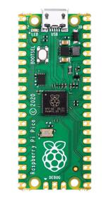

# Raspberry Pi Pico

## Overview

The Raspberry Pi Pico and Pico W are small, low-cost, versatile boards from Raspberry Pi. They are equipped with an RP2040 SoC, an on-board LED, a USB connector, and an SWD interface. The Pico W additionally contains an Infineon CYW43439 2.4 GHz Wi-Fi/Bluetooth module. Programming the device can be done in two ways.

1. When you hold the boot switch and power up the Pico, the USB bootloader is activated. The bootloader provides a mass storage interface which can be viewed on the PC. Programming only requires dragging and dropping a previously built ``.uf2`` to the storage and programming is automatically completed by the USB loader.
2. Programming can also be achieved using the SWD interface, using an external adapter like the Pico debug probe.

## Hardware

|                                                         |                                                    |
| ------------------------------------------------------- | -------------------------------------------------- |
| Dual core Arm Cortex-M0+ processor running up to 133MHz | 264KB on-chip SRAM                                 |
| 2MB on-board QSPI flash with XIP capabilities           | 26 GPIO pins                                       |
| 3 Analog inputs                                         | 2 UART peripherals                                 |
| 2 SPI controllers                                       | 2 I2C controllers                                  |
| 16 PWM channels                                         | USB 1.1 controller (host/device)                   |
| 8 Programmable I/O (PIO) for custom peripherals         | On-board LED                                       |
| 1 Watchdog timer peripheral                             | Infineon CYW43439 2.4 GHz Wi-Fi chip (Pico W only) |
|                                                         |                                                    |

|  |      |
| ------------------------------------------------------------ | ---- |

## Supported Features

The rpi_pico board configuration supports the following hardware features:

- [ ] NVIC

- [ ] GPIO

- [ ] I2C

- [ ] ADC

- [ ] SPI

- [ ] UART

- [ ] USB

- [ ] FileX

- [ ] LevelX

- [ ] Watch Dog

- [ ] PWM

  

## Pin Mapping

Pin name values 

The peripherals of the RP2040 SoC can be routed to various pins on the board. The configuration of these routes can be modified through DTS. 

There are 30 GPIO pins which can be general purpose input/output or mapped to functional blocks ( UART,PWM ...).

The PicoW reduces the number of available pins with the WiFi module using GPIO23,GPIO24,GPIO25,GPIO29. ADC channel 4 on GPIO29 is not available with the PicoW.

There is an internal numbering scheme used by the C# code to reference each pin with GPIO = 0, and GPIO29 = 30;

#### Default Peripheral Mapping:

- UART0_TX : P0
- UART0_RX : P1
- I2C0_SDA : P4
- I2C0_SCL : P5
- I2C1_SDA : P14
- I2C1_SCL : P15
- SPI0_RX : P16
- SPI0_CSN : P17
- SPI0_SCK : P18
- SPI0_TX : P19
- ADC_CH0 : P26
- ADC_CH1 : P27
- ADC_CH2 : P28
- ADC_CH3 : P29

## Programmable I/O (PIO)

The RP2040 SoC comes with two PIO peripherals. These are two simple co-processors that are designed for I/O operations. The PIO's are not used at this time and may be planned for future use.

## RP2040 Device Reference Links

| Reference                                                    |                                                              |
| ------------------------------------------------------------ | ------------------------------------------------------------ |
| [RP2040 Datasheet](https://datasheets.raspberrypi.com/rp2040/rp2040-datasheet.pdf) | [Hardware design with RP2040](https://datasheets.raspberrypi.com/rp2040/hardware-design-with-rp2040.pdf) |
| [Raspberry Pi Pico Datasheet](https://datasheets.raspberrypi.com/pico/pico-datasheet.pdf) | [Getting started with Raspberry Pi Pico](https://datasheets.raspberrypi.com/pico/getting-started-with-pico.pdf) |
| [Raspberry Pi Pico W Datasheet](https://datasheets.raspberrypi.com/picow/pico-w-datasheet.pdf) | [Connecting to the Internet with Raspberry Pi Pico W](https://datasheets.raspberrypi.com/picow/connecting-to-the-internet-with-pico-w.pdf) |
| [Connecting to the Internet with Raspberry Pi Pico W](https://datasheets.raspberrypi.com/picow/connecting-to-the-internet-with-pico-w.pdf) | [Raspberry Pi Pico C/C++ SDK](https://datasheets.raspberrypi.com/pico/raspberry-pi-pico-c-sdk.pdf) |
| **TOOLS**                                                    |                                                              |
| [Pico tool Github repository](https://github.com/raspberrypi/picotool). | [Raspberry Pi Debug Probe - Raspberry Pi Documentation](https://www.raspberrypi.com/documentation/microcontrollers/debug-probe.html#about-the-debug-probe) |
| [Latest DebugProbe firmware](https://github.com/raspberrypi/debugprobe/releases/tag/debugprobe-v2.0.1) |                                                              |
| **Libraries**                                                |                                                              |
| [raspberrypi/pico-playground (github.com)](https://github.com/raspberrypi/pico-playground) | [raspberrypi/pico-extras (github.com)](https://github.com/raspberrypi/pico-extras?tab=readme-ov-file) |

 

 C:\nftools\pico-sdk\src\rp2040\rp2040_interface_pins.json
