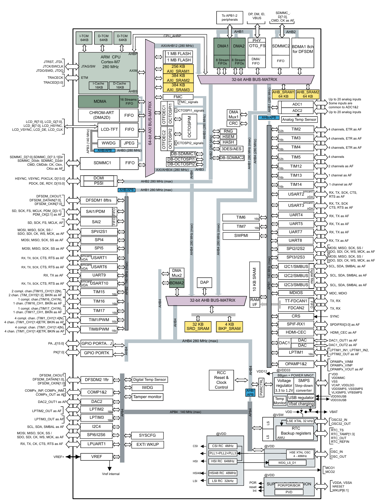

# STM32 IO

## GPIO

***GPIO*** stands for ***general purpose input/output***. It is a type of pin found on an integrated circuit that does not have a specific function. While most pins have a dedicated purpose, such as sending a signal to a certain component, the function of a GPIO pin is customizable and can be controlled by the software.

- **Pin Mode :**

   

  Each port bit of the general-purpose I/O (GPIO) ports can be individually configured by software in several modes:

  - input or output
  - analog
  - alternate function (AF).

- **Pin characteristics :**

  - ***Input*** : no pull-up and no pull-down or pull-up or pull-down
  - ***Output*** : push-pull or open-drain with pull-up or pull-down capability
  - ***Alternate function*** : push-pull or open-drain with pull-up or pull-down capability.

[

#### 1.1. GPIO (pin) output-speed configuration[↑](https://wiki.st.com/stm32mcu/wiki/Getting_started_with_GPIO#)

- Change the rising and falling edge when the pin state changes from high to low or low to high.
- A higher GPIO speed increases the EMI noise from STM32 and increases the STM32 consumption.
- It is good to adapt the GPIO speed to the peripheral speed. For example, **low** speed is optimal for toggling GPIO at 1 Hz, while using SPI at 45 MHz requires ***very high*** speed setting.

[

All GPIOs are able to drive 5 V and 3.3 V in input mode, but they are only able to generate 3.3V in output push-pull mode

# Low-power modes

By default, the microcontroller is in Run mode after a system or power reset. Several low-power modes are available to save power when the CPU does not need to be kept running, for example when waiting for an external event. The ultra-low-power STM32L476xx supports ***six*** low-power modes to achieve the best compromise between low-power consumption, short startup time, available peripherals and available wake-up sources.

- Sleep mode
- Low-power run mode
- Low-power sleep mode
- Stop 0, Stop1, Stop2 modes
- Standby mode
- Shutdown mode

### 1.1. Voltage regulators[↑](https://wiki.st.com/stm32mcu/wiki/Getting_started_with_PWR#)

Two embedded linear voltage regulators supply most of the digital circuitries: the main regulator (MR) and the low-power regulator (LPR).

- The MR is used in the Run and Sleep modes and in the Stop 0 mode.
- The LPR is used in Low-power run, Low-power sleep, Stop 1 and Stop 2 modes. It is also used to supply the 32 Kbyte SRAM2 in Standby with SRAM2 retention.
- Both regulators are in power-down in Standby and Shutdown modes: the regulator output is in high impedance, and the kernel circuitry is powered down thus inducing zero consumption.

The main regulator has two possible programmable voltage ranges:

- Range 1 with the CPU running at up to 80 MHz.
- Range 2 with a maximum CPU frequency of 26 MHz. All peripheral clocks are also limited to 26 MHz.

[

The Standby mode is used to achieve the lowest power consumption with brown-out reset. The internal regulator is switched off so that the VCORE domain is powered off. The PLL, the MSI RC, the HSI16 RC and the HSE crystal oscillators are also switched off.
RTC can remain active (Standby mode with RTC, Standby mode without RTC).
Brown-out reset (BOR) always remains active in Standby mode.
The state of each I/O during standby mode can be selected by software: I/O with internal pull-up, internal pull-down or floating.

The system can be woken up from standby mode using a SYS_WKUP pin, an [RTC](https://wiki.st.com/stm32mcu/wiki/Getting_started_with_RTC) event (alarm or timer), [IWDG](https://wiki.st.com/stm32mcu/wiki/Getting_started_with_WDOG), or an external reset in NRST pin.
After waking up from Standby mode, program execution restarts in the same way as after a Reset (boot pin sampling, option bytes loading, reset vector is fetched, etc.)

[

