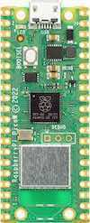
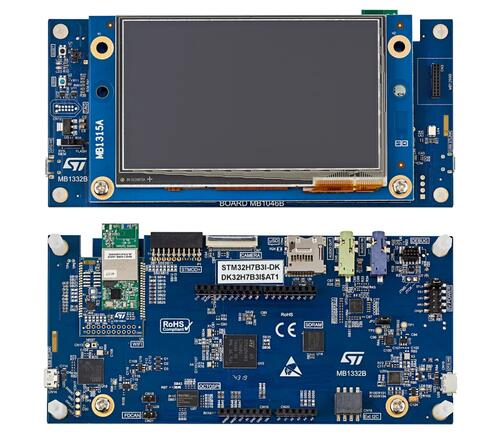
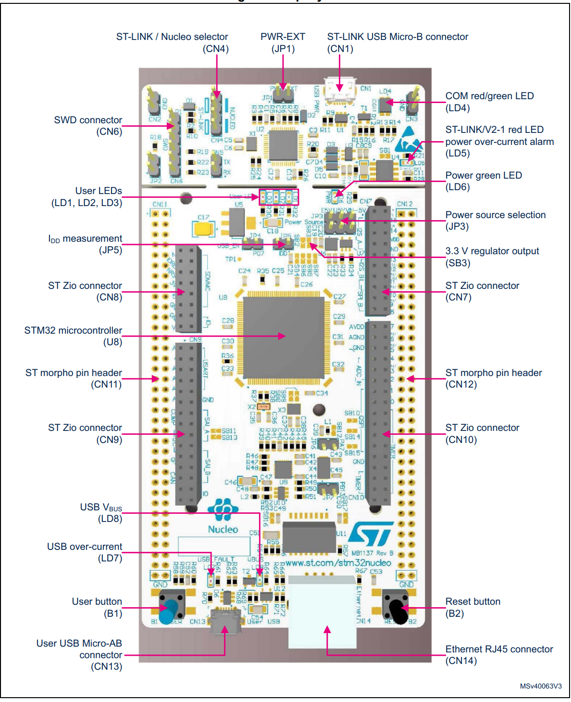
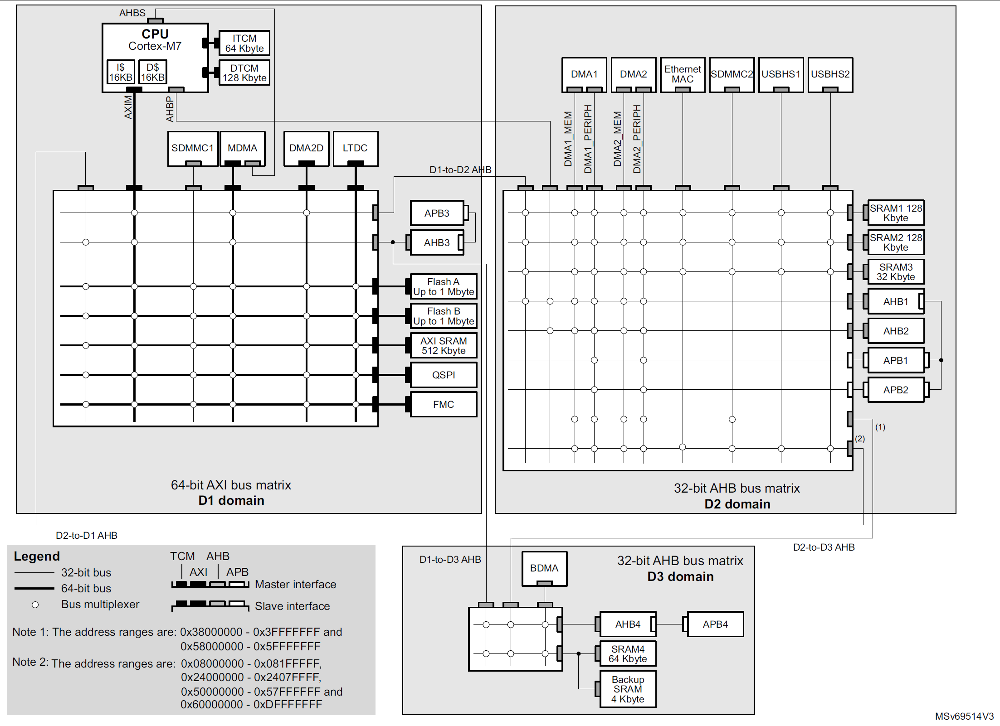
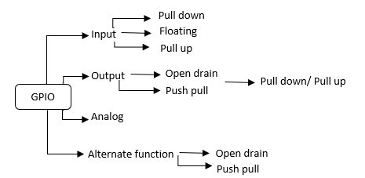
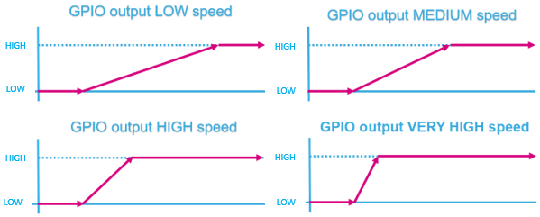
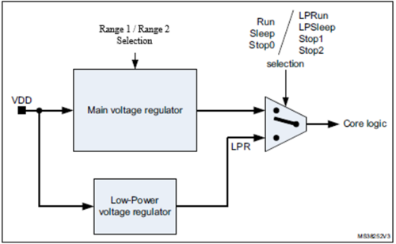
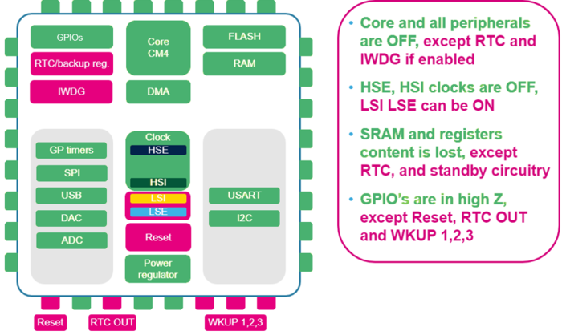
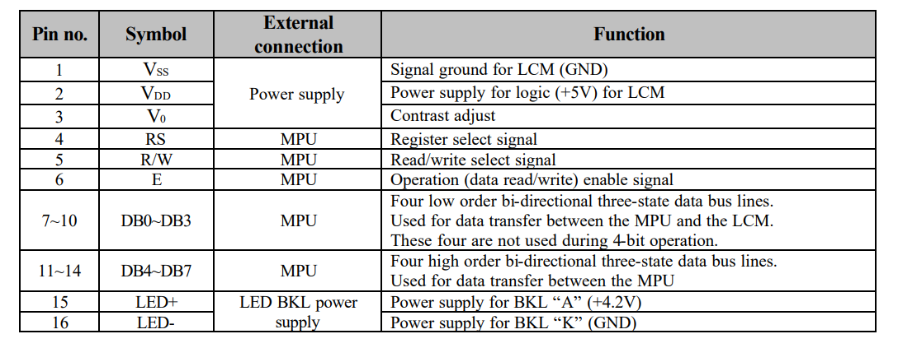
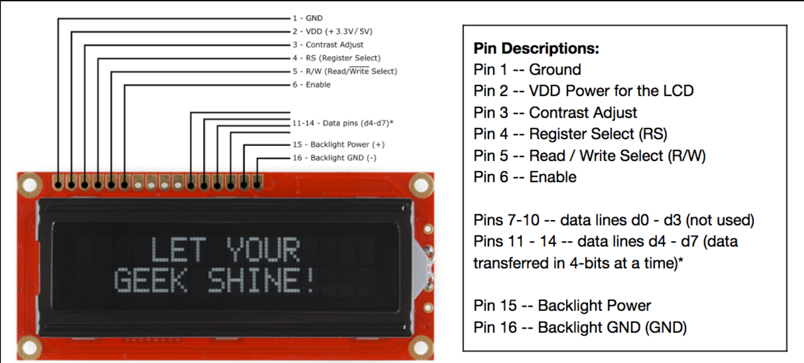

# Community contribution

Create with Mark Down ( https://www.markdownguide.org/cheat-sheet/)

These folders contain code and notes for a number of boards 

>Note: This is not an official port, you can ask questions about it on Discord .


<details><summary>Overview</summary>
<p>


### CMakeLists at the top level
The CMake build for this community edition is fully contained in the ThreadX/CMake directory

For the community target ThreadX all build options are accessed through CMakePresets.json in the ThreadX CMake directory

```C:\nf-interpreter\targets-community\ThreadX\CMake\CMakePresets.json```

The following code fragment can be found in the top level CMakeLists.txt to bypass all of the standard CMake build system

```json
########################################################
if ("${COMMUNITY_TARGET}" STREQUAL "ThreadX")
    add_subdirectory(${CMAKE_CURRENT_SOURCE_DIR}/targets-community/ThreadX/CMake)
    return()
endif()
########################################################
```
 </p>
</details>  

<details><summary>Directory layout</summary>
<p>

### Directory layout for targets-community/ThreadX

    ├── About                        # Documentation relating to maintaining and building
    ├── CMake                        # All common CMake related files other than the specific board CMake file.
    │   ├── BuildParameters          # Common build parameters for GCC compiler
    │   ├── Sources                  # Sources required by function of MCU family
    │   ├── ThreadX                  # ST Cortex M7 family
    │   CMakeLists.txt               # Main CMakeLists.txt
    │   CmakePresets.json            # Build options and parameter setup
    ├── Common                       # Any code common to ThreadX that runs on all MCU's
    ├── RaspberryPi                  # Raspberry Pi foundation
    │   ├── RP2XXX                   # ST Cortex M7 family
    │   │   ├── Common               # Code Common to the series of MCU's
    │   │   │   ├── DeviceIO         # ST Cortex M7 family
    │   │   │   ├── Utilities        # ST Cortex M7 family
    │   │   │   ├── WireProtocol     # ST Cortex M7 family
    │   │   ├── RP2040               # ST Cortex M7 family
    │   │   ├── RP2350               # ST Cortex M7 family
    ├── ST                           # ST Microelectronics
    │   ├── STM32F0                  # ST Cortex M0 family
    │   ├── STM32H7                  # ST Cortex M7 family
    │   │   ├── Common               # ST Cortex M7 family
    │   │   │   ├── DeviceIO         # ST Cortex M7 family
    │   │   │   ├── WireProtocol     # ST Cortex M7 family
    │   │   ├── NUCLEO_H743ZI2       # ST Cortex M7 family
    │   │   ├── STM32H7B3I_DK        # ST Cortex M7 family
    │   │   ├── STM32H735G_DK        # ST Cortex M7 family
    └── main.c                       # main entry point

</p>
</details>  

 <details><summary>Setup and Installation</summary>
<p>

### Build ToolChain
Download version 13.2.rel1 of GNU_Tools_ARM_Embedded from ```https://developer.arm.com/downloads/-/arm-gnu-toolchain-downloads/13-2-rel1```


### Get Repositories
| Repository      | Version | Command                                                      |
| --------------- | ------- | :----------------------------------------------------------- |
| Eclipse ThreadX |         | ```git clone https://github.com/eclipse-threadx/threadx.git``` |
| Eclipse FileX   |         | ```git clone https://github.com/eclipse-threadx/filex.git``` |
| Eclipse NetXDuo |         | ```git clone https://github.com/eclipse-threadx/netxduo.git``` |
| Eclipse UsbX    |         | ```git clone https://github.com/eclipse-threadx/usbx.git```  |
| Eclipse LevelX  |         | ```git clone https://github.com/eclipse-threadx/levelx.git``` |
| STM32CubeM0     |         | ```git clone --recurse-submodules https://github.com/STMicroelectronics/STM32CubeF0.git``` |
| STM32CubeF7     |         | ```git clone --recurse-submodules https://github.com/STMicroelectronics/STM32CubeF7.git``` |
| STM32CubeH7     |         | ```git clone --recurse-submodules https://github.com/STMicroelectronics/STM32CubeH7.git``` |
| STM32CubeU5     |         | ```git clone --recurse-submodules https://github.com/STMicroelectronics/STM32CubeU5.git``` |
| --------------- | ------- | :----------------------------------------------------------- |
</p>
</details>  

 <details><summary>Native Debug</summary>
<p>

[Cortex Debug](https://github.com/Marus/cortex-debug)

[ThreadX and components](https://github.com/eclipse-threadx/rtos-docs/tree/main)

[WIKI on ThreadX, FileX, NetXDuo, LevelX and USBx](https://wiki.st.com/stm32mcu/wiki/Category:STM32_middleware)

 ## STM32
  [Using the SDMMC interface on the STM32H7](https://www.st.com/resource/en/application_note/an5200-getting-started-with-stm32h7-mcus-sdmmc-host-controller-stmicroelectronics.pdf)

</p>
</details>  


<details><summary>Raspberry Pi Pico series</summary>
<p>

The Raspberry Pi Pico and Pico W are small, low-cost, versatile boards from Raspberry Pi. They are equipped with an RP2040 SoC, an on-board LED, a USB connector, and an SWD interface. The Pico W additionally contains an Infineon CYW43439 2.4 GHz Wi-Fi/Bluetooth module. Programming the device can be done in two ways.

1. When you hold the boot switch and power up the Pico, the USB bootloader is activated. The bootloader provides a mass storage interface which can be viewed on the PC. Programming only requires dragging and dropping a previously built ``.uf2`` to the storage and programming is automatically completed by the USB loader.
2. Programming can also be achieved using the SWD interface, using an external adapter like the Pico debug probe.

## Hardware

|                                                         |                                                    |
| ------------------------------------------------------- | -------------------------------------------------- |
| Dual core Arm Cortex-M0+ processor running up to 133MHz | 264KB on-chip SRAM                                 |
| 2MB on-board QSPI flash with XIP capabilities           | 26 GPIO pins                                       |
| 3 Analog inputs                                         | 2 UART peripherals                                 |
| 2 SPI controllers                                       | 2 I2C controllers                                  |
| 16 PWM channels                                         | USB 1.1 controller (host/device)                   |
| 8 Programmable I/O (PIO) for custom peripherals         | On-board LED                                       |
| 1 Watchdog timer peripheral                             | Infineon CYW43439 2.4 GHz Wi-Fi chip (Pico W only) |
|                                                         |                                                    |

|  |      |
| ------------------------------------------------------------ | ---- |

## Supported Features

The rpi_pico board configuration supports the following hardware features:

- [ ] NVIC

- [ ] GPIO

- [ ] I2C

- [ ] ADC

- [ ] SPI

- [ ] UART

- [ ] USB

- [ ] FileX

- [ ] LevelX

- [ ] Watch Dog

- [ ] PWM

  

## Pin Mapping

Pin name values 

The peripherals of the RP2040 SoC can be routed to various pins on the board. The configuration of these routes can be modified through DTS. 

There are 30 GPIO pins which can be general purpose input/output or mapped to functional blocks ( UART,PWM ...).

The PicoW reduces the number of available pins with the WiFi module using GPIO23,GPIO24,GPIO25,GPIO29. ADC channel 4 on GPIO29 is not available with the PicoW.

There is an internal numbering scheme used by the C# code to reference each pin with GPIO = 0, and GPIO29 = 30;

#### Default Peripheral Mapping:

- UART0_TX : P0
- UART0_RX : P1
- I2C0_SDA : P4
- I2C0_SCL : P5
- I2C1_SDA : P14
- I2C1_SCL : P15
- SPI0_RX : P16
- SPI0_CSN : P17
- SPI0_SCK : P18
- SPI0_TX : P19
- ADC_CH0 : P26
- ADC_CH1 : P27
- ADC_CH2 : P28
- ADC_CH3 : P29

## Programmable I/O (PIO)

The RP2040 SoC comes with two PIO peripherals. These are two simple co-processors that are designed for I/O operations. The PIO's are not used at this time and may be planned for future use.

## RP2040 Device Reference Links

| Reference                                                    |                                                              |
| ------------------------------------------------------------ | ------------------------------------------------------------ |
| [RP2040 Datasheet](https://datasheets.raspberrypi.com/rp2040/rp2040-datasheet.pdf) | [Hardware design with RP2040](https://datasheets.raspberrypi.com/rp2040/hardware-design-with-rp2040.pdf) |
| [Raspberry Pi Pico Datasheet](https://datasheets.raspberrypi.com/pico/pico-datasheet.pdf) | [Getting started with Raspberry Pi Pico](https://datasheets.raspberrypi.com/pico/getting-started-with-pico.pdf) |
| [Raspberry Pi Pico W Datasheet](https://datasheets.raspberrypi.com/picow/pico-w-datasheet.pdf) | [Connecting to the Internet with Raspberry Pi Pico W](https://datasheets.raspberrypi.com/picow/connecting-to-the-internet-with-pico-w.pdf) |
| [Connecting to the Internet with Raspberry Pi Pico W](https://datasheets.raspberrypi.com/picow/connecting-to-the-internet-with-pico-w.pdf) | [Raspberry Pi Pico C/C++ SDK](https://datasheets.raspberrypi.com/pico/raspberry-pi-pico-c-sdk.pdf) |
| **TOOLS**                                                    |                                                              |
| [Pico tool Github repository](https://github.com/raspberrypi/picotool). | [Raspberry Pi Debug Probe - Raspberry Pi Documentation](https://www.raspberrypi.com/documentation/microcontrollers/debug-probe.html#about-the-debug-probe) |
| [Latest DebugProbe firmware](https://github.com/raspberrypi/debugprobe/releases/tag/debugprobe-v2.0.1) |                                                              |
| **Libraries**                                                |                                                              |
| [raspberrypi/pico-playground (github.com)](https://github.com/raspberrypi/pico-playground) | [raspberrypi/pico-extras (github.com)](https://github.com/raspberrypi/pico-extras?tab=readme-ov-file) |


 


 C:\nftools\pico-sdk\src\rp2040\rp2040_interface_pins.json


  # Raspberry Pi Pico RP2040

## Overview

RP2350 security extensions are always enabled (it cannot be disabled like in STM32 MCUs).  The bootroom runs in secure mode and makes a normal jump to the user application, hence (at least initially) the user application should run in secure mode. Afterwards, the user application can configure the security if required.

Usefull reference : [metebalci/rp2350-bare-metal-build](https://github.com/metebalci/rp2350-bare-metal-build/tree/main)

 

## Exception and Interrupt dispatching

Interrupts are dispatched through a process managed by the **Nested Vectored Interrupt Controller (NVIC)**

The NVIC looks up the address of the interrupt service routine (ISR) in the vector table using the interrupt number

The ISR address is loaded into the program counter, and the ISR is executed

The **PPB_BASE** (Peripheral Protection Base) on the RP2350 MCU is a base address used for configuring memory protection and access control.

what is the VTOR_OFFSET value

The **VTOR_OFFSET** (Vector Table Offset) value is used to configure the address of the vector table, which contains the addresses of the interrupt service routines (ISRs).

Using the ARM_CPU_PREFIXED mechanism ensures that the VTOR register is accessed securely and correctly according to the ARM Cortex-M33 architecture

crt0.S sets up the vector table using

</p>
</details>  

 <details><summary>STM32H7B3I Discovery Kit</summary>
<p>

The STM32H7B3I-DK Discovery kit is a complete demonstration and development platform for STMicroelectronics Arm® Cortex®-M7 core-based STM32H7B3LIH6QU microcontroller.

</p>
</details>  

 <details><summary>STM32H7B3I-DK Discovery kit</summary>
<p>

</p>
</details>  

 <details><summary>STM32H735G-DK Discovery kit</summary>
<p>
The STM32H7B3I-DK Discovery kit is used as a reference design for user application development before porting to the final product, thus simplifying the application development.


The full range of hardware features available on the board helps users enhance their application development by an evaluation of almost all peripherals (such as USB OTG_HS, microSD, USART, FDCAN, audio DAC stereo with audio jack input and output, camera, SDRAM, Octo-SPI Flash memory and RGB interface LCD with capacitive touch panel). ARDUINO® Uno V3 connectors provide easy connection to extension shields or daughterboards for specific applications.

STLINK-V3E is integrated into the board, as an embedded in-circuit debugger and programmer for the STM32 MCU and the USB Virtual COM port bridge. The STM32H7B3I-DK board comes with the STM32CubeH7 MCU Package, which provides an STM32 comprehensive software HAL library as well as various software examples.



More information about the board can be found at the [STM32H7B3I-DK website](https://www.st.com/en/evaluation-tools/stm32h7b3i-dk.html). More information about STM32H7B3 can be found here:

- [STM32H7A3/7B3 on www.st.com](https://www.st.com/en/microcontrollers-microprocessors/stm32h7a3-7b3.html)
- [STM32H7A3/7B3/7B0 reference manual](https://www.st.com/resource/en/reference_manual/rm0455-stm32h7a37b3-and-stm32h7b0-value-line-advanced-armbased-32bit-mcus-stmicroelectronics.pdf)
- [STM32H7B3xI datasheet](https://www.st.com/resource/en/datasheet/stm32h7b3ai.pdf)
- [STM32H7B3I_DK data brief](https://www.st.com/resource/en/data_brief/stm32h7b3i-dk.pdf)

- [STM32H7B3I_DK user manual](https://www.st.com/resource/en/user_manual/um2569-discovery-kit-with-stm32h7b3li-mcu-stmicroelectronics.pdf)

# Arduino UNO V3  compatible connector


| Arduino Pin Number | STM32 Pin Reference | Analogue   |
| ------------------ | ------------------- | ---------- |
| A0                 | PA4                 | ADC1_INP18 |
| A1                 | PC4                 | ADC12_INP4 |
| A2                 | PA0_C               | ADC1_INP0  |
| A3                 | PA1_C               | ADC1_INP1  |
| A4                 | PC2_C               | ADC2_INP0  |
| A5                 | PC3_C               | ADC2_INP1  |


|      | Arduino Pin Number | STM32 Pin Reference | Digital  | Alternate                          |
| ---- | ------------------ | ------------------- | -------- | ---------------------------------- |
|      | D0                 | PH14                | GPIO     | USART4_RX                          |
|      | D1                 | PH13                | GPIO     | USART4_TX                          |
|      | D2                 | PI9                 | GPIO     |                                    |
|      | D3                 | PH9                 | GPIO     | TIM12_CH2                          |
|      | D4                 | PE2                 | GPIO     |                                    |
|      | D5                 | PH11                | GPIO     | TIM5_CH2                           |
|      | D6                 | PH10                | GPIO     | TIM5_CH1                           |
|      | D7                 | PI10                | GPIO     |                                    |
|      | D8                 | PF10                | GPIO     |                                    |
|      | D9                 | PI7                 | GPIO     | TIM8_CH3                           |
|      | D10                | PI0                 | GPIO     | SPI2_NSS                           |
|      | D11                | PB15                | GPIO     | SPI2 _MOSO                         |
|      | D12                | PB14                | GPIO     | SPI2 _MISO                         |
|      | D13                | PA12                | GPIO     | SPI2_SCK                           |
|      | D14                | PD13                | I2C4_SDA | Wired to touch and audio circuitry |
|      | D15                | PD12                | I2C4_SCL | Wired to touch and audio circuitry |


The STM32H735G-DK Discovery kit is a complete demonstration and development platform for Arm® Cortex®-M7 core-based STM32H735IGK6U microcontroller, with 1 Mbyte of Flash memory and 564 Kbytes of SRAM.

The STM32H735G-DK Discovery kit is used as a reference design for user application development before porting to the final product, thus simplifying the application development.

The full range of hardware features available on the board helps users to enhance their application development by an evaluation of all the peripherals (such as USB OTG FS, Ethernet, microSD™ card, USART, CAN FD, SAI audio DAC stereo with audio jack input and output, MEMS digital microphone, HyperRAM™, Octo-SPI Flash memory, RGB interface LCD with capacitive touch panel, and others). ARDUINO® Uno V3, Pmod™ and STMod+ connectors provide easy connection to extension shields or daughterboards for specific applications.

STLINK-V3E is integrated into the board, as the embedded in-circuit debugger and programmer for the STM32 MCU and USB Virtual COM port bridge. STM32H735G-DK board comes with the STM32CubeH7 MCU Package, which provides an STM32 comprehensive software HAL library as well as various software examples.


More information about the board can be found at the [STM32H735G-DISCO website](https://www.st.com/en/evaluation-tools/stm32h735g-dk.html). More information about STM32H735 can be found here:

- [STM32H725/735 on www.st.com](https://www.st.com/en/microcontrollers-microprocessors/stm32h725-735.html)
- [STM32H735xx reference manual](https://www.st.com/resource/en/reference_manual/dm00603761-stm32h723733-stm32h725735-and-stm32h730-value-line-advanced-armbased-32bit-mcus-stmicroelectronics.pdf)
- [STM32H735xx datasheet](https://www.st.com/resource/en/datasheet/stm32h735ag.pdf)

### Supported Features

The current STM32H735G_DK board configuration supports the following hardware features:

| Interface | Controller | Driver/Component |
| --------- | ---------- | ---------------- |
| NVIC      | on-chip    | In Development   |
| UART      | on-chip    | In Development   |
| GPIO      | on-chip    | In Development   |
| FLASH     | on-chip    | In Development   |
| ETHERNET  | on-chip    | In Development   |
| RNG       | on-chip    | In Development   |
| FMC       | on-chip    | In Development   |
| ADC       | on-chip    | In Development   |

#### Peripheral Mapping:

##### Serial Ports

##### UART_3 - (ST-Link Virtual Port Com)

TX - PD8

RX - PD9

##### UART_7 - (Arduino Serial)

TX - PF7

RX - PF6

##### LEDS

LED1 : PC3 (__HAL_RCC_GPIOC_CLK_ENABLE())

LED2 : PC2

##### Buttons

User Pin : PC13

### System Clock

The STM32H735G System Clock can be driven by an internal or external oscillator, as well as by the main PLL clock. By default, the System clock is driven by the PLL clock at 550MHz. PLL clock is feed by a 25MHz high speed external clock.

### Serial Port

The STM32H735G Discovery kit has up to 6 UARTs, UART3 which connected to the onboard ST-LINK/V3.0. Virtual COM port interface.

## Programming and Debugging

### Flashing

Flashing operation will depend on the target to be flashed and the SoC option bytes configuration. It is advised to use [STM32CubeProgrammer](https://www.st.com/en/development-tools/stm32cubeprog.html) to check and update option bytes configuration and flash the `stm32h735g_disco` target.

# STM32H736NI

The **STM32H736NI** is a high-performance microcontroller from STMicroelectronics. It is based on the **ARM Cortex-M7** core and is part of the **STM32H7** series of microcontrollers. Here are some of its features:

- **CPU**: ARM Cortex-M7 core running at up to 400 MHz

- **Memory**: 1 MB of Flash memory, 564 KB of RAM

- Peripherals

  :

  - 2 x USB OTG FS/HS
  - 2 x CAN FD
  - 3 x I2C
  - 4 x USART
  - 4 x SPI
  - 2 x SAI
  - 2 x I2S
  - 2 x SDMMC
  - 2 x DFSDM
  - 2 x ADC (16-bit)
  - 2 x DAC (12-bit)
  - 2 x RNG
  - 2 x HASH
  - 2 x CRYP
  - 2 x FMC/SDRAM
  - 1 x QSPI
  - 1 x Ethernet MAC
  - 1 x LCD-TFT controller
  - 1 x JPEG codec
  - 1 x Chrom-ART graphic accelerator

- Operating conditions

  :

  - Voltage range: 1.71 V to 3.6 V
  - Temperature range: -40°C to +125°C

- Security

  :

  - AES-256 hardware encryption
  - Secure boot and secure firmware update
  - TrustZone and STSAFE secure elements


# STM32U5x9NJH6Q

Ultra-low-power STM32U5x9NJH6Q microcontroller based on the 
Arm® Cortex®‑M33 core with Arm® TrustZone®, featuring 4 Mbytes of flash 
memory, 3 Mbytes of SRAM for STM32U5G9NJH6Q or 2.5 Mbytes for 
STM32U5A9NJH6Q, and SMPS in a TFBGA216 package
• 2.47" RGB 480 × 480 pixels TFT round LCD module with 16.7M color depth, 
with MIPI DSI® 2‑data lane interface and capacitive touch panel
• USB Type-C® with USB 2.0 HS interface, sink only
• Low‑power system designed for VDD at 1.8 V only
• MEMS sensors from STMicroelectronics
– Time‑of‑Flight and gesture-detection sensor
– Temperature sensor
• 512‑Mbit Octo‑SPI NOR flash memory
• 512‑Mbit Hexadeca‑SPI PSRAM
• 4‑Gbyte eMMC flash memory
• Two user LEDs
• User and reset push-buttons
• Board connectors:
– USB ST-LINK Micro-B
– USB Type-C®
– Two double-row 2.54 mm pitch expansion connectors for additional 
peripherals prototyping
– Audio MEMS daughterboard expansion (for STM32U5G9J-DK1)
– MIPI10
– Tag‑Connect™ 10‑pin footprint
• Flexible power-supply options: ST-LINK USB VBUS, USB connector, or external 
sources
• On-board STLINK-V3E debugger/programmer with USB re-enumeration 
capability: mass storage, Virtual COM port, and debug port
• Comprehensive free software libraries and examples available with the 
STM32CubeU5 MCU Package
• Support of a wide choice of Integrated Development Environments (IDEs) 
including IAR Embedded Workbench®, MDK-ARM, and STM32CubeIDE

**Display**

Shenzhen Jinghua Displays Electronics
www.china-lcd.com
2.47" TFT round display 480x480 resolution, 16.7 million color depth with MIPI 2-lane interface and capacitive multi-touch display

Part number J025F1CN0201W or J025F1CN0201N.


More information about the board can be found at the [STM32U5A9J-DK website](https://www.st.com/en/evaluation-tools/stm32u5a9j-dk.html). More information about STM32U5A9NJH6Q can be found here:

- [STM32U5A9NJ on www.st.com](https://www.st.com/en/microcontrollers-microprocessors/stm32u5a9nj.html)
- [STM32U5 Series reference manual](https://www.st.com/resource/en/reference_manual/rm0456-stm32u5-series-armbased-32bit-mcus-stmicroelectronics.pdf)
- [STM32U5Axxx datasheet](https://www.st.com/resource/en/datasheet/stm32u5a9nj.pdf)

### Supported Features

The current Zephyr stm32u5a9j_dk board configuration supports the following hardware features:

| Interface | Controller | Driver/Component |
| --------- | ---------- | ---------------- |
| NVIC      | on-chip    | In Development   |
| UART      | on-chip    | In Development   |
| LPUART    | on-chip    | In Development   |
| PINMUX    | on-chip    | In Development   |
| GPIO      | on-chip    | In Development   |
| RNG       | on-chip    | In Development   |
| I2C       | on-chip    | In Development   |
| SPI       | on-chip    | In Development   |
| FLASH     | on-chip    | In Development   |
| ADC       | on-chip    | In Development   |
| SDMMC     | on-chip    | In Development   |
| WATCHDOG  | on-chip    | In Development   |
| PWM       | on-chip    | In Development   |

Other hardware features have not been enabled yet for this board.

#### Peripheral Mapping:

- USART_1 TX/RX : PA9/PA10 (ST-Link Virtual Port Com)
- LD3 : PE0 - LED Green
- LD4 : PE1 - LED Red
- User Button: PC13
- USART_3 TX/RX : PB10/PB11
- LPUART_1 TX/RX : PG7/PG8
- I2C1 SCL/SDA : PG14/PG13
- I2C2 SCL/SDA : PF1/PF0
- I2C6 SCL/SDA : PD1/PD0
- SPI2 SCK/MISO/MOSI/CS : PB13/PD3/PD4/PB12
- SPI3 SCK/MISO/MOSI/CS : PG9/PG10/PG11/PG15
- ADC1 : channel5 PA0, channel14 PC5
- ADC2 : channel9 PA4
- ADC4 : channel5 PF14

### System Clock

The STM32U5A9J-DK Discovery kit relies on an HSE oscillator (16 MHz crystal) and an LSE oscillator (32.768 kHz crystal) as clock references. Using the HSE (instead of HSI) is mandatory to manage the DSI interface for the LCD module and the USB high?speed interface.

### Serial Port

The STM32U5A9J Discovery kit has up to 4 USARTs, 2 UARTs, and 1 LPUART. The Zephyr console output is assigned to USART1 which connected to the onboard ST-LINK/V3.0. Virtual COM port interface. Default communication settings are 115200 8N1.

## Programming and Debugging

STM32U5A9J Discovery kit includes an ST-LINK/V3 embedded debug tool interface. This probe allows to flash and debug the board using various tools.

# NUCLEO-H743ZI2

## Overview

The **NUCLEO-H743ZI2** is a **development board** designed by **STMicroelectronics**. 


The board features the **STM32H743ZI** microcontroller and has the following.

## Key features 

- Support for Arduino shields.
- ST Zio connector
- ST morpho headers - expansion with specialized shields.
- ST-LINK debugger/programmer.
- Power supply via ST-LINK USB V BUS, USB connector, or external sources.
- Ethernet compliant with IEEE-802.3-2002.
- USB Device only, USB OTG full speed, or SNK/UFP (full-speed or high-speed mode).
- 3 user LEDs
- 2 user and reset push-buttons
- 32.768 kHz crystal oscillator
- Board connectors:

> - USB with Micro-AB
> - SWD
> - Ethernet RJ45 (depending on STM32 support)
> - ST Zio connector including Arduino* Uno V3
> - ST morpho



## Physical memory

| Type       | Size  | Description                                                  |
| ---------- | ----- | ------------------------------------------------------------ |
| FLASH A    | 1024K | On chip flash (Bank 1)                                       |
| FLASH B    | 1024K | On chip flash (Bank 2)                                       |
| ITCM_SRAM  | 64K   | Tightly coupled instruction RAM (Can be used for critical real-times routines) |
| DTCM_SRAM  | 128K  | Tightly coupled data RAM (Can be used for critical real-time data, such as interrupt service routines or stack/heap memory) |
| AXI_RAM    | 512K  | RAM on 64-bit AXI bus (Power Domain 1)                       |
| SRAM1      | 128K  | RAM on 32-bit AHB bus (Power Domain 2)                       |
| SRAM2      | 128K  | RAM on 32-bit AHB bus (Power Domain 2)                       |
| SRAM3      | 32K   | RAM on 32-bit AHB bus (Power Domain 3)                       |
| SRAM4      | 64K   | RAM on 32-bit AHB bus (Power Domain 3)                       |
| BACKUP_RAM | 4k    | Retained in standby or backup mode                           |

## nanoFramework memory usage

| Type       | Size  | nanoFramework usage                   |
| ---------- | ----- | ------------------------------------- |
| FLASH      | 640K  | Reserved for Native Image             |
| FLASH      | 1408K | Reserved for nanoFramework deployment |
| ITCM_SRAM  | 64K   | *Future use*                          |
| DTCM_SRAM  | 128K  | Native image stack and future use     |
| AXI_RAM    | 512K  | Managed code available RAM            |
| SRAM1      | 128K  | DMA Accessible RAM                    |
| SRAM2      | 128K  | *Future use*                          |
| SRAM3      | 32K   | *Future use*                          |
| SRAM4      | 64K   | *Future use*                          |
| BACKUP_RAM | 4k    | *Future use*                          |

## nanoFramework supported features

| Interface        |                                                              |
| ---------------- | ------------------------------------------------------------ |
|                  |                                                              |
| UART             | In development                                               |
|                  |                                                              |
| GPIO             | In development                                               |
| RTC              | In development                                               |
| I2C              | In development ( PB8,PB9 )                                   |
| PWM              | In development                                               |
| ADC              | In development ( INP15 - PA3)                                |
| DAC              | In development (PA4)                                         |
| RNG              | In development                                               |
| ETHERNET         | In development ( PA1, PA2, PA7, PB13, PC1, PC4, PC5, PG11, PG13) |
| SPI              | In development (NSS/SCK/MISO/MOSI : PD14/PA5/PA6/PB5 (Arduino SPI)) |
| Backup SRAM      | In development                                               |
| WATCHDOG         | In development                                               |
| USB              | In development                                               |
| CAN/CANFD        | In development (PD0, PD1)                                    |
| LD1              | PB0                                                          |
| LD2              | PB7                                                          |
| LD3              | PB14                                                         |
| User Push Button | PC13                                                         |
| USART3- VCP      | PD8,PD9                                                      |
|                  |                                                              |
| die-temp         | In development                                               |


## STM32H743ZI bus connections

------




# STM32 Extended interrupt and event controller (EXTI)


There are two types of interrupts configurable and direct.. The *Nested Vectored Interrupt Controller*, or NVIC, supports many more than are usually implemented on the STM32 cores. They are not all freely assignable and have a specific purpose.  Some are reserved for processor, memory or data bus events and peripherals.

NOTE: There is a limitation of 16 external interrupts on the GPIO lines with one 1 interrupt per line number. E.G. You cannot have external interrupts on PA0 and PB0 at the same time.

The remaining EXTI lines are connected to peripherals like RTC, Ethernet, and USB for features like Wakeup and Alarm events.

On the STM32H7 series, the EXTI peripheral has 7 interrupts associated with it  which gives 16 lines on the EXTI peripheral which can be used with GPIO pins.

EXIT 0 ...4 have individual interrupts, while 5 through 9 and 10 through 15 need some extra work to determine the source of the interrupt.

- EXTI line 0
- EXTI line 1
- EXTI line 2
- EXTI line 3
- EXTI line 4
- EXTI line 5 through 9
- EXTI line 10 through 15

 The lines themselves are connected using muxes to GPIO pins as in the following diagram:

[](https://hackaday.com/wp-content/uploads/2021/03/stm32f4_exti_gpio_mapping-themed.png)STM32F4 EXTI to GPIO peripheral mapping. (RM0090, 12.2.5)


# STM32 IO


## GPIO


## Testing input with pullup resistor

Sure, I can help you with that. Here’s a simple way to test if a microcontroller unit (MCU) pin is working using an input pull-up resistor. This method uses a button to change the state of the pin.

Here’s a simple circuit diagram:

```
MCU Pin <-----> Button <-----> Vcc
   |
   |
Pull-up Resistor
   |
   |
  GND
```

And here’s how you can implement it:

1. **Connect a button to the MCU pin**: One end of the button should be connected to the MCU pin you want to test, and the other end should be connected to the power supply (Vcc).
2. **Connect a pull-up resistor**: Connect a pull-up resistor (typically 10kΩ) between the MCU pin and the ground (GND). This ensures that the pin reads a `HIGH` signal when the button is not pressed.
3. **Write a simple program**: Write a simple program that reads the state of the pin and outputs the result. Here’s a simple example in Arduino C:

```c
const int pin = 2; // Change this to your pin number

void setup() {
  pinMode(pin, INPUT_PULLUP);
  Serial.begin(9600);
}

void loop() {
  int buttonState = digitalRead(pin);
  Serial.println(buttonState);
  delay(1000);
}
```

This program will print `1` when the button is not pressed and `0` when the button is pressed. If you see these results, it means your MCU pin is working correctly with the input pull-up resistor.

Remember to replace `2` with the number of the pin you’re testing. Also, ensure your MCU supports internal pull-up resistors. If not, you’ll need to add an external one.

Please note that this is a simple test and might not catch all possible issues with the pin. If you suspect there’s a hardware issue with the pin, you might need to use more advanced debugging tools or techniques.

I hope this helps! Let me know if you have any other questions. 😊

​              


## GPIO

***GPIO*** stands for ***general purpose input/output***. It is a type of pin found on an integrated circuit that does not have a specific function. While most pins have a dedicated purpose, such as sending a signal to a certain component, the function of a GPIO pin is customizable and can be controlled by the software.

- **Pin Mode :**

   

  Each port bit of the general-purpose I/O (GPIO) ports can be individually configured by software in several modes:

  - input or output
  - analog
  - alternate function (AF).

- **Pin characteristics :**

  - ***Input*** : no pull-up and no pull-down or pull-up or pull-down
  - ***Output*** : push-pull or open-drain with pull-up or pull-down capability
  - ***Alternate function*** : push-pull or open-drain with pull-up or pull-down capability.

[

#### 1.1. GPIO (pin) output-speed configuration[↑](https://wiki.st.com/stm32mcu/wiki/Getting_started_with_GPIO#)

- Change the rising and falling edge when the pin state changes from high to low or low to high.
- A higher GPIO speed increases the EMI noise from STM32 and increases the STM32 consumption.
- It is good to adapt the GPIO speed to the peripheral speed. For example, **low** speed is optimal for toggling GPIO at 1 Hz, while using SPI at 45 MHz requires ***very high*** speed setting.

[


All GPIOs are able to drive 5 V and 3.3 V in input mode, but they are only able to generate 3.3V in output push-pull mode


# Low-power modes

By default, the microcontroller is in Run mode after a system or power reset. Several low-power modes are available to save power when the CPU does not need to be kept running, for example when waiting for an external event. The ultra-low-power STM32L476xx supports ***six*** low-power modes to achieve the best compromise between low-power consumption, short startup time, available peripherals and available wake-up sources.

- Sleep mode
- Low-power run mode
- Low-power sleep mode
- Stop 0, Stop1, Stop2 modes
- Standby mode
- Shutdown mode

### 1.1. Voltage regulators[↑](https://wiki.st.com/stm32mcu/wiki/Getting_started_with_PWR#)

Two embedded linear voltage regulators supply most of the digital circuitries: the main regulator (MR) and the low-power regulator (LPR).

- The MR is used in the Run and Sleep modes and in the Stop 0 mode.
- The LPR is used in Low-power run, Low-power sleep, Stop 1 and Stop 2 modes. It is also used to supply the 32 Kbyte SRAM2 in Standby with SRAM2 retention.
- Both regulators are in power-down in Standby and Shutdown modes: the regulator output is in high impedance, and the kernel circuitry is powered down thus inducing zero consumption.

The main regulator has two possible programmable voltage ranges:

- Range 1 with the CPU running at up to 80 MHz.
- Range 2 with a maximum CPU frequency of 26 MHz. All peripheral clocks are also limited to 26 MHz.

[


The Standby mode is used to achieve the lowest power consumption with brown-out reset. The internal regulator is switched off so that the VCORE domain is powered off. The PLL, the MSI RC, the HSI16 RC and the HSE crystal oscillators are also switched off.
RTC can remain active (Standby mode with RTC, Standby mode without RTC).
Brown-out reset (BOR) always remains active in Standby mode.
The state of each I/O during standby mode can be selected by software: I/O with internal pull-up, internal pull-down or floating.

The system can be woken up from standby mode using a SYS_WKUP pin, an [RTC](https://wiki.st.com/stm32mcu/wiki/Getting_started_with_RTC) event (alarm or timer), [IWDG](https://wiki.st.com/stm32mcu/wiki/Getting_started_with_WDOG), or an external reset in NRST pin.
After waking up from Standby mode, program execution restarts in the same way as after a Reset (boot pin sampling, option bytes loading, reset vector is fetched, etc.)

[


 </p>
</details>  


# APPENDIX 1 - TESTING GPIO

## Testing input with without pull up or pull down resistor

Sure, I can help you with that. Here’s a simple way to test if a microcontroller unit (MCU) pin is working without using a pull-up or pull-down resistor. This method uses a button to change the state of the pin.

Here’s a simple circuit diagram:

```
MCU Pin <-----> Button <-----> Vcc
   |
   |
  GND
```

And here’s how you can implement it:

1. **Connect a button to the MCU pin**: One end of the button should be connected to the MCU pin you want to test, and the other end should be connected to the power supply (Vcc).
2. **Connect the MCU pin to the ground (GND)**: When the button is not pressed, the MCU pin is connected to the ground (GND), so it reads a `LOW` signal.
3. **Write a simple program**: Write a simple program that reads the state of the pin and outputs the result. Here’s a simple example in Arduino C:

```c
const int pin = 2; // Change this to your pin number

void setup() {
  pinMode(pin, INPUT);
  Serial.begin(9600);
}

void loop() {
  int buttonState = digitalRead(pin);
  Serial.println(buttonState);
  delay(1000);
}
```

This program will print `0` when the button is not pressed and `1` when the button is pressed. If you see these results, it means your MCU pin is working correctly.

Remember to replace `2` with the number of the pin you’re testing.

## Testing input with pull up resistor

This method uses a button to change the state of the pin.

Circuit diagram:

```
MCU Pin <-----> Button <-----> Vcc
   |
   |
Pull-up Resistor
   |
   |
  GND
```

1. **Connect a button to the MCU pin**: One end of the button should be connected to the MCU pin you want to test, and the other end should be connected to the power supply (Vcc).
2. **Connect a pull-up resistor**: Connect a pull-up resistor (typically 10kΩ) between the MCU pin and the ground (GND). This ensures that the pin reads a `HIGH` signal when the button is not pressed.
3. **Write a simple program**: Write a simple program that reads the state of the pin and outputs the result. Here’s a simple example in Arduino C:

```c
const int pin = 2; // Change this to your pin number

void setup() {
  pinMode(pin, INPUT_PULLUP);
  Serial.begin(9600);
}

void loop() {
  int buttonState = digitalRead(pin);
  Serial.println(buttonState);
  delay(1000);
}
```

This program will print `1` when the button is not pressed and `0` when the button is pressed. If you see these results, it means your MCU pin is working correctly with the input pull-up resistor.

Remember to replace `2` with the number of the pin you’re testing. Also, ensure your MCU supports internal pull-up resistors. If not, you’ll need to add an external one.

​           

## Testing input with pull down resistor

Sure, I can help you with that. Here’s a simple way to test if a microcontroller unit (MCU) pin is working using an input pull-down resistor. This method uses a button to change the state of the pin.

Here’s a simple circuit diagram:

```
MCU Pin <-----> Button <-----> GND
   |
   |
Pull-down Resistor
   |
   |
  Vcc
```

And here’s how you can implement it:

1. **Connect a button to the MCU pin**: One end of the button should be connected to the MCU pin you want to test, and the other end should be connected to the ground (GND).
2. **Connect a pull-down resistor**: Connect a pull-down resistor (typically 10kΩ) between the MCU pin and the power supply (Vcc). This ensures that the pin reads a `LOW` signal when the button is not pressed.
3. **Write a simple program**: Write a simple program that reads the state of the pin and outputs the result. Here’s a simple example in Arduino C:

```c
const int pin = 2; // Change this to your pin number

void setup() {
  pinMode(pin, INPUT);
  digitalWrite(pin, LOW); // Enable pull-down resistor
  Serial.begin(9600);
}

void loop() {
  int buttonState = digitalRead(pin);
  Serial.println(buttonState);
  delay(1000);
}
```

This program will print `0` when the button is not pressed and `1` when the button is pressed. If you see these results, it means your MCU pin is working correctly with the input pull-down resistor.

Remember to replace `2` with the number of the pin you’re testing. Also, ensure your MCU supports internal pull-down resistors. If not, you’ll need to add an external one.


## Testing  Output with open drain

Sure, I can help you with that. Here’s a simple way to test if a microcontroller unit (MCU) pin is working using an output open-drain configuration. This method uses an LED to indicate the state of the pin.

Here’s a simple circuit diagram:

```
MCU Pin (Open-Drain) <-----> Resistor <-----> LED <-----> Vcc
```

And here’s how you can implement it:

1. **Connect an LED to the MCU pin**: One end of the LED should be connected to the MCU pin you want to test through a resistor (typically 330Ω to 1kΩ depending on the LED and Vcc), and the other end should be connected to the power supply (Vcc).
2. **Configure the MCU pin as open-drain**: In the MCU’s software, configure the pin as an output and set it to open-drain mode. This means the pin can either provide a path to ground (when it’s outputting a `LOW` signal) or be disconnected (when it’s outputting a `HIGH` signal).
3. **Write a simple program**: Write a simple program that toggles the state of the pin and observe the LED. Here’s a simple example in Arduino C:

```c
const int pin = 2; // Change this to your pin number

void setup() {
  pinMode(pin, OUTPUT);
}

void loop() {
  digitalWrite(pin, LOW); // LED on
  delay(1000);
  digitalWrite(pin, HIGH); // LED off
  delay(1000);
}
```

This program will turn the LED on and off every second. If you see the LED blinking, it means your MCU pin is working correctly in open-drain mode.

Remember to replace `2` with the number of the pin you’re testing.

Please note that this is a simple test and might not catch all possible issues with the pin. If you suspect there’s a hardware issue with the pin, you might need to use more advanced debugging tools or techniques.

I hope this helps! Let me know if you have any other questions. 😊

## Testing  Output with open drain push pull

Sure, I can help you with that. Here’s a simple way to test if a microcontroller unit (MCU) pin is working using an output push-pull configuration. This method uses an LED to indicate the state of the pin.

Here’s a simple circuit diagram:

```
MCU Pin (Push-Pull) <-----> Resistor <-----> LED <-----> GND
```

And here’s how you can implement it:

1. **Connect an LED to the MCU pin**: One end of the LED should be connected to the MCU pin you want to test through a resistor (typically 330Ω to 1kΩ depending on the LED and Vcc), and the other end should be connected to the ground (GND).
2. **Configure the MCU pin as push-pull**: In the MCU’s software, configure the pin as an output and set it to push-pull mode. This means the pin can either provide a path to Vcc (when it’s outputting a `HIGH` signal) or a path to ground (when it’s outputting a `LOW` signal).
3. **Write a simple program**: Write a simple program that toggles the state of the pin and observe the LED. Here’s a simple example in Arduino C:

```c
const int pin = 2; // Change this to your pin number

void setup() {
  pinMode(pin, OUTPUT);
}

void loop() {
  digitalWrite(pin, HIGH); // LED on
  delay(1000);
  digitalWrite(pin, LOW); // LED off
  delay(1000);
}
```

This program will turn the LED on and off every second. If you see the LED blinking, it means your MCU pin is working correctly in push-pull mode.


## Setting Up External Interrupts

The steps involved in setting up an external interrupt on a GPIO pin can be summarized as follows:

- Enable `SYSCFG` (except on F1).
- Enable `EXTI` in `RCC` (except on F1).
- Set `EXTI_IMR` register for the pin to enable the line as an interrupt.
- Set `EXTI_FTSR` & `EXTI_RTSR` registers for the pin for trigger on falling and/or rising edge.
- Set `NVIC` priority on interrupt.
- Enable interrupt in the `NVIC` register.

For example an STM32F4 family MCU, we would enable the SYSCFG (System Configuration controller) peripheral first.


The register SYSCFG_EXTICR1 shows that for a particular EXTIx, 4 bits are used and can only select 1 of the 16 ports lines

SYSCFG external interrupt configuration register 1 (SYSCFG_EXTICR1)

Bits 15:0 EXTIx[3:0]: EXTI x configuration (x = 0 to 3)
These bits are written by software to select the source input for the EXTI input for external interrupt / event detection.
0000: PA[x] pin
0001: PB[x] pin
0010: PC[x] pin
0011: PD[x] pin
0100: PE[x] pin
0101: PF[x] pin
0110: PG[x] pin
0111: PH[x] pin
1000: PI[x] pin
1001: PJ[x] pin
1010: PK[x] pin
Other configurations: reserved


| EXTI Line | Selected Port |
| --------- | ------------- |
| EXTI1     | PA0,          |
|           |               |
|           |               |


The Extended Interrupt and event controller (EXTI) manages wakeup through configurable
and direct event inputs. It provides wakeup requests to the power controller (PWR), and
generates interrupt requests to the CPU NVIC and to the SRD domain DMAMUX2, and
events to the CPU event input.
The EXTI wakeup requests allow the system to be woken up from Stop mode, and the CPU
to be woken up from CStop mode.
In addition, both the interrupt request and event request generation can be used in Run
mode.

## EXTI main features

Signals from I/O's or peripherals able to generate a pulses with the following attributes.

### Configurable event

- Selectable active trigger edge
- Interrupt pending status register bit
- Individual Interrupt and event generation mask
- Software trigger capability

### Direct events

- Fixed rising edge active trigger
- No interrupt pending status register bit in the EXTI (the interrupt pending status is
  provided by the peripheral generating the event)
- No software trigger capability

Both types of events can wakeup the SRD power Domain and can generate wakeup events when the system is in STOP mode CPU is in CSTOP mode

Different logic implementations can be used, depending on the EXTI event input type and wakeup target(s). The applicable features are controlled from register bits:

- Active trigger edge enable 
  - EXTI rising trigger selection register (EXTI_RTSR1), (EXTI_RTSR2),(EXTI_RTSR3)
  - EXTI falling trigger selection register (EXTI_FTSR1), (EXTI_FTSR2), (EXTI_FTSR3) 
- Software trigger
  - EXTI software interrupt event register (EXTI_SWIER1),  (EXTI_SWIER2),  (EXTI_SWIER3)

- CPU Interrupt enable 
  - EXTI interrupt mask register (EXTI_CPUIMR1), (EXTI_CPUIMR2), (EXTI_CPUIMR3) 
  -  CPU Event enable, (EXTI_CPUEMR1), (EXTI_CPUEMR2), (EXTI_CPUEMR3) 
- SRD domain wakeup pending, 
  - EXTI SRD pending mask register (EXTI_SRDPMR1),(EXTI_SRDPMR2),(EXTI_SRDPMR3)

## EXTI event input mapping

| EVent Input      | Souce             | EVent input TYpe    |
| ---------------- | ----------------- | ------------------- |
| *****<u>0-15</u> | <u>EXTI[15:0]</u> | <u>Configurable</u> |
| 16               | PVD               | Configurable        |
| 17-19            | RTC               | Configurable        |
| 20-21            | COMPARE           | Configurable        |
| 22-25            | I2C               | Direct              |
| 26-33            | USART             | Direct              |
| 34-35            | LPUART            | Direct              |
| 36-41            | SPI               | Direct              |
| ...              |                   |                     |
| ...              |                   |                     |

*****F**or the sixteen GPIO event inputs, the associated GPIO pin has to be selected in the SYSCFG_EXTICRn register. The same pin from each GPIO maps to the corresponding EXTI event input.All EXTI event inputs are OR-ed together and connected to the CPU event input.**

The direct event inputs are enabled in the respective peripheral that generating the event. The configurable events are enabled by enabling at least one of the trigger edges.

### EXTI CPU interrupt procedure

| Order | Description                                                  |
| ----- | ------------------------------------------------------------ |
| 1     | Unmask the event input interrupt by setting the corresponding mask bits in the EXTI_CPUIMR register. |
| 2     | Enable the event input by setting either one or both the corresponding trigger edge enable bits in EXTI_RTSR and EXTI_FTSR registers |
| 3     | Enable the associated interrupt source in the CPU NVIC or use the SEVONPEND, so that an interrupt coming from the CPU interrupt signal can be detected by the CPU after a WFI/WFE instruction |

### EXTI CPU event procedure

| Order | Description                                                  |
| ----- | ------------------------------------------------------------ |
| 1     | Unmask the event input by setting the corresponding mask bits of the EXTI_CPUEMR register |
| 2     | Enable the event input by setting either one or both the corresponding trigger edge enable bits in EXTI_RTSR and EXTI_FTSR registers |
| 3     | The CPU event signal is detected by the CPU after a WFE instruction. For configurable event inputs, there is no EXTI pending bit to clear. |

### EXTI SRD domain wakeup for Autonomous run mode procedure

| Order | Description                                                  |
| ----- | ------------------------------------------------------------ |
| 1     | Mask the event input for waking up the CPU by clearing both the corresponding mask bits in the EXTI_CPUIMR and/or EXTI_CPUEMR registers. |
| 2     | For configurable event inputs, enable the event input by setting either one or both the corresponding trigger edge enable bits in EXTI_RTSR and EXTI_FTSR registers |
| 3     | Direct events automatically generate an SRD domain wakeup    |
| 4     | Select the SRD domain wakeup mechanism in EXTI_SRDPMR.<br/>– When SRD domain wakeup without pending (EXTI_PMR = 0) is selected, the Wakeup is automatically cleared following the clearing of the event input.<br/>– When SRD domain wakeup with pending (EXTI_PMR = 1) is selected, the Wakeup needs to be cleared by a selected SRD domain pend clear source.<br/>A pending SRD domain wakeup signal can also be cleared by firmware by<br/>clearing the associated EXTI_SRDPMR register bit. |
| 5     | An SRD domain interrupt is generated after the SRD domain wakeup:<br/>– Configurable event inputs generate a pulse on SRD domain interrupt.<br/>– Direct event inputs activate the SRD domain interrupt until the event input is<br/>cleared in the peripheral. |

### EXTI software interrupt/event trigger procedure

Any of the configurable event inputs can be triggered from the software interrupt/event
register (the associated CPU interrupt and/or CPU event shall be enabled by their
respective procedure). Follow the steps below

| Order | Description                                                  |
| ----- | ------------------------------------------------------------ |
| 1     | Enable the event input by setting at least one of the corresponding edge trigger bits in the EXTI_RTSR and/or EXTI_FTSR registers. |
| 2     | Unmask the software interrupt/event trigger by setting at least one of the corresponding mask bits in the EXTI_CPUIMR and/or EXTI_CPUEMR registers. |
| 3     | Trigger the software interrupt/event by writing 1 to the corresponding bit in the EXTI_SWIER register |
| 4     | The event input can be disabled by clearing the EXTI_RTSR and EXTI_FTSR register bits.<br/> |


## S

```
RCC->APB2ENR |= (1 << RCC_APB2ENR_SYSCFGCOMPEN_Pos);
```

The `SYSCFG` peripheral manages the external interrupt lines to the `GPIO` peripherals, i.e. the mapping between a `GPIO` peripheral and the `EXTI` line. Say if we want to use PB0 and PB4 as the input pins for our encoder’s A & B signals, we would have to set the lines in question to the appropriate `GPIO` peripheral. For port B, this would be done in `SYSCFG_EXTICR1` and `SYSCFG_EXTICR2`, as each 32-bit register covers a total of four `EXTI` lines:

[](https://hackaday.com/wp-content/uploads/2021/03/stm32f4_syscfg_exticr1-themed.png)SYSCFG_EXTICR1 register for STM32F4 MCUs. (RM0090, 9.2.3)

While somewhat confusing at first glance, setting these registers is relatively straightforward. E.g. for PB0:

```
SYSCFG->EXTICR[0] |= (((``uint32_t``) 1) << 4);
```

As each line’s section in the register is four bits, we left-shift the appropriate port value to reach the required position. For PB4 we do the same thing, but in the second register, and without left shift, as that register starts with line 4.

At this point we’re almost ready to configure the EXTI & NVIC registers. First, we need to enable the GPIO peripheral we intend to use, and set the pins to input mode in pull-up configuration, as here for PB0:

```
RCC->AHB1ENR |= (1 << RCC_AHBENR_GPIOBEN_Pos);``GPIOB->MODER &= ~(0x3);``GPIOB->PUPDR &= ~(0x3);``GPIOB-&>PUPDR |= (0x1);
```

Say we want to set PB0 to trigger on a falling edge, we have to first enable Line 0, then configure the trigger registers:

```
pin = 0;``EXTI->IMR |= (1 << pin);``EXTI->RTSR &= ~(1 << pin);``EXTI->FTSR |= (1 << pin);
```

All of these registers are quite straight-forward, with each line having its own bit.

With that complete, we merely have to enable the interrupts now, and ensure our interrupt handlers are in place. First the NVIC, which is done most easily via the standard CMSIS functions, as here for PB0, with interrupt priority level 0 (the highest):

```
NVIC_SetPriority(EXTI0_IRQn, 0);``NVIC_EnableIRQ(EXTI0_IRQn);
```

# Storage, Flash, SD, Ram disks

## Flash

In both NOR and NAND Flash, the memory is organized into erase blocks. This architecture helps maintain lower cost while maintaining performance. For example, a smaller block size enables faster erase cycles. The downside of smaller blocks, however, is an increase in die area and memory cost. Because of its lower cost per bit, NAND Flash can more cost-effectively support smaller erase blocks compared to NOR Flash. The typical block size available today ranges from 8KB to 32KB for NAND Flash and 64KB to 256KB for NOR Flash.

Erase operations in NAND Flash are straightforward while in NOR Flash, each byte needs to be written with ‘0’ before it can be erased. This makes the erase operation for NOR Flash much slower than for NAND Flash. 

The NOR Flash architecture provides enough address lines to map the entire memory range. This gives the advantage of random access and short read times, which makes it ideal for code execution. Another advantage is 100% known good bits for the life of the part. Disadvantages include larger cell size resulting in a higher cost per bit and slower write and erase speeds.

NAND Flash, in contrast, has a much smaller cell size and much higher write and erase speeds compared to NOR Flash. Disadvantages include the slower read speed and an I/O mapped type or indirect interface, which is more complicated and does not allow random access. It is important to note that code execution from NAND Flash is achieved by shadowing the contents to a RAM, which is different than code execution directly from NOR Flash. Another major disadvantage is the presence of bad blocks. NAND Flash typically have 98% good bits when shipped with additional bit failure over the life of the part, thus requiring the need for error correcting code (ECC) functionality within the device.

## RAM

RAM disks are stored in volatile memory (RAM), which allows for extremely fast read and write operations compared to non-volatile storage like Flash memory.

- RAM disks are ideal for storing temporary data during program execution (e.g., intermediate results, buffers, caches).
- Since RAM is volatile, the data is lost when the system restarts, making it suitable for transient storage.

## Secure Digital (SD) Cards

SD cards, including microSD cards, use NAND flash memory. These cards rely on one or two small NAND flash memory chips, similar to those found in USB memory sticks and SSDs. Additionally, they have a tiny processor to manage data flow and instructions

There are many non-volatile flash memory card standards:

Although not the fastest, by far, the most used and available type of memory card adheres to the Secure Digital standard.

There are several formats for the SD card form factor:

- standard (original): 32.0 x 24.0 x 2.1 mm
- miniSD: 21.5 x 20.0 x 1.4 mm
- microSD: 15.0 x 11.0 x 1.0 mm

Currently, there are at least [four classes of SD cards](https://www.sdcard.org/developers/sd-standard-overview/):

```shell
+------+---------------------+-------------+
|      | Name                | Capacity    |
+------+---------------------+-------------+
| SD   | standard            | <= 2GB      |
| SDHC | [H]igh capacity     | 2GB - 32GB  |
| SDXC | e[X]tended capacity | 32GB - 2TB  |
| SDUC | [U]ltra capacity    | 2TB - 128TB |
+------+---------------------+-------------+
```

Many speed class scales exist for SD cards, new speeds are added as technology progresses.

```shell
+---------+-----------------------------------------------+
|         |                     Speed                     |
|         |                     Scale                     |
+---------+-------+-----------+-------------+-------------+
|  Speed  | Speed | UHS Speed | Video Speed | SD Express  |
|         | Class |   Class   |    Class    | Speed Class |
+---------+-------+-----------+-------------+-------------+
| 600MB/s |       |           |             | E600        |
| 450MB/s |       |           |             | E450        |
| 300MB/s |       |           |             | E300        |
| 150MB/s |       |           |             | E150        |
| 90MB/s  |       |           | V90         |             |
| 60MB/s  |       |           | V60         |             |
| 30MB/s  |       | 3         | V30         |             |
| 10MB/s  | 10    | 1         | V10         |             |
| 6MB/s   | 6     |           | V6          |             |
| 4MB/s   | 4     |           |             |             |
| 2MB/s   | 2     |           |             |             |
+---------+-------+-----------+-------------+-------------+
```

 FAT32 was the default for SD and SDHC cards until the introduction of SDXC, when [exFAT](https://www.baeldung.com/linux/filesystem-limits#exfat) became the new default:

- SD: FAT16/FAT32
- SDHC: FAT32
- SDXC: exFAT
- SDUC: exFAT


## Sparkfun -LCDS


[Basic 16x2 Character LCD - Black on Green 5V - LCD-00255 - SparkFun Electronics](https://www.sparkfun.com/products/255)


[GDM1602K.PDF (sparkfun.com)](https://www.sparkfun.com/datasheets/LCD/GDM1602K-Extended.pdf)








[A place for supporting styles.]: #

<style>
details > summary {
  padding: 4px;
  width: 500px;
  background-color: #0;
  border: none;
  font-family: verdana;
  font-size: 24px;
  cursor: pointer;
}
</style>
